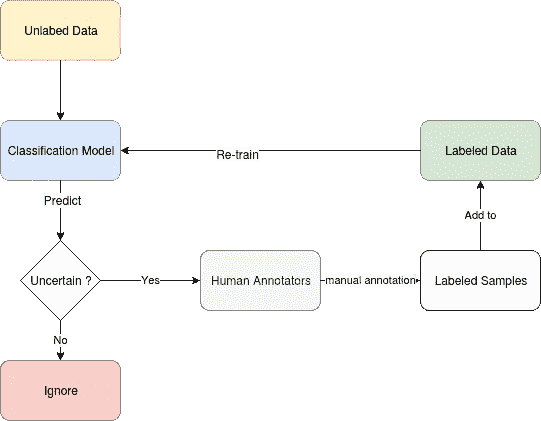
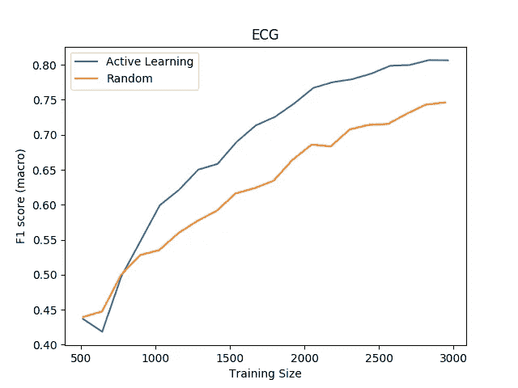
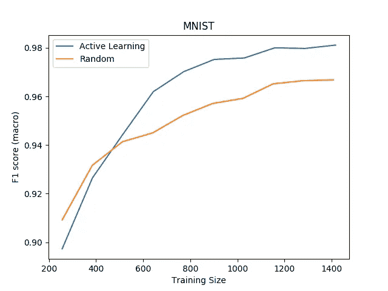

# 有效数据标注策略的主动学习

> 原文：<https://towardsdatascience.com/active-learning-for-an-efficient-data-annotation-strategy-4d007c5d7ed1?source=collection_archive---------22----------------------->

## 通过将手动干预限制在信息量最大的样本，降低数据注释成本。

Taton moise 在 [Unsplash](https://unsplash.com/s/photos/humans-factory?utm_source=unsplash&utm_medium=referral&utm_content=creditCopyText) 上拍摄的照片

我相信数据注释的质量和数量通常是机器学习应用程序成功的最决定性因素。然而，手动数据注释可能非常慢且成本高。这就是为什么有很多关于减少手动注释需求的方法的研究工作，如迁移学习或无监督预训练。

另一种降低数据标注成本的方法是使用主动学习。它是一组方法，将数据注释步骤呈现为学习算法和用户之间的交互过程，其中当用户注释那些选择的样本时，算法建议哪些示例值得注释。

在这篇文章中，我们将尝试探索应用于麻省理工学院-BIH 心律失常和 MNIST 数据集的基于不确定性的主动学习方法。
由于标注可能非常昂贵，有时需要领域专家，我们将仅**模拟**用户交互过程，从标记数据集的一个小子集开始，随后仅使用算法建议的有价值的样本标签。

# 流程描述:

基于不确定性的主动学习

## 步骤:

1 —从一小批带注释的 start_size = 512 示例开始

2 —在初始批次上训练分类模型。

3-对于 n 个步骤，do :
-使用**熵形式的不确定性选择下一批最有希望的大小为 batch_size 的样本，**其中，您将根据样本的预测熵对样本进行排序，并且仅挑选具有最高熵的顶部 batch_size 样本。
-根据目前选择的所有数据训练模型。
-在测试集上评估模型。

# 实验:

麻省理工学院-BIH 心律失常的主动学习与随机抽样

在麻省理工学院-BIH 心律失常数据集上，使用全部约 3000 个标记样本进行训练，我们得到:
-主动学习策略: **0.80** F1 分数
-随机策略: **0.74** F1 分数

为了获得 0.74 分的 F1 分，主动学习策略只需要大约 2000 个带标签的例子，或者 3000 分中的 2/3

MNIST 上的主动学习与随机抽样

在 MNIST 数据集上，使用全部约 1400 个标记样本进行训练，我们得到:
-主动学习策略: **0.98** F1 得分
-随机策略: **0.96** F1 得分

为了达到 0.96 分的分数**F1 分，主动学习策略只需要大约 700 个带标签的例子或者 1400 个例子的一半**

请注意，图中显示的性能是 10 次独立运行的平均值，以减少随机性造成的影响。

还要注意，我用 CIFAR10 而不是 MNIST 做了完全相同的实验，但效果不是很好。我仍然不明白为什么，但这是未来☺值得关注的事情。

# 结论:

在这篇文章中，我们应用了基于不确定性的主动学习的简化实现。模拟结果看起来令人鼓舞，证明了主动学习可以帮助减少实现良好测试性能所需的手动标签数量。

代码重现结果:[https://github.com/CVxTz/active_learning](https://github.com/CVxTz/active_learning)