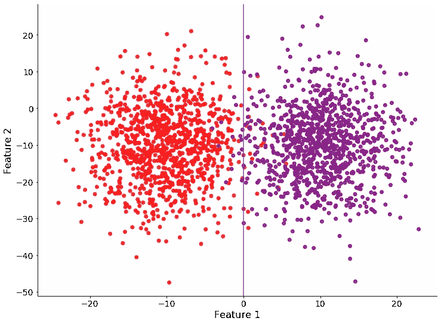
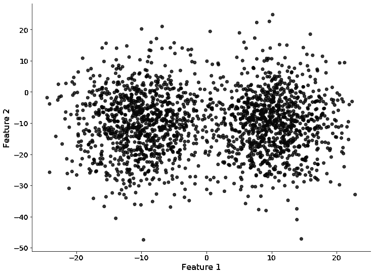
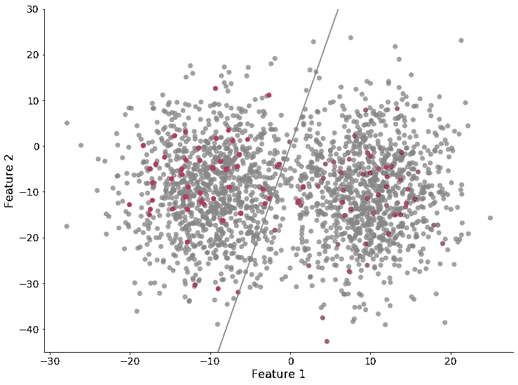
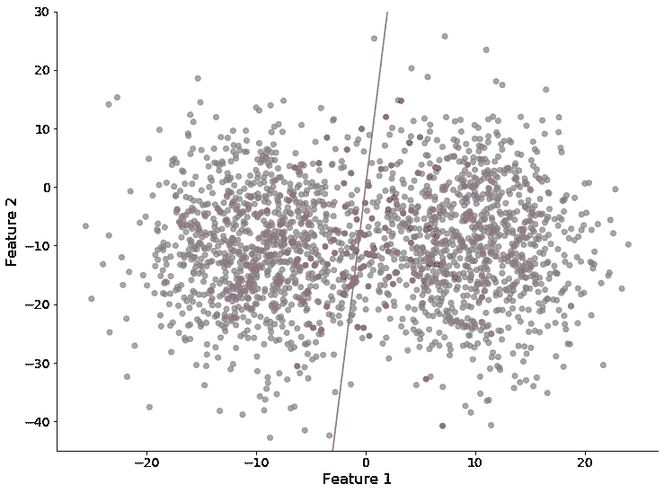
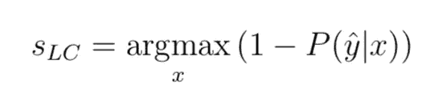
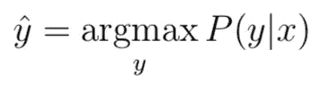
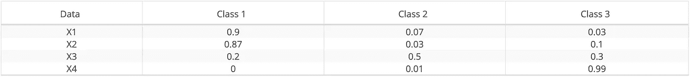
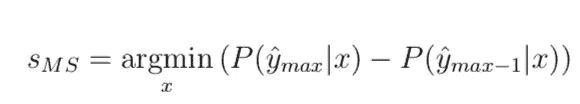
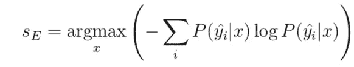

# 机器学习中的主动学习

> 原文：<https://towardsdatascience.com/active-learning-in-machine-learning-525e61be16e5?source=collection_archive---------2----------------------->

## 浅谈主动学习的实施

马库斯·斯皮斯克在 [Unsplash](https://unsplash.com?utm_source=medium&utm_medium=referral) 上的照片

大多数有监督的机器学习模型需要大量的数据才能训练出好的结果。即使这种说法听起来很天真，大多数公司都很难向他们的数据科学家提供这些数据，特别是标有的*数据。后者是训练任何监督模型的关键，并且可能成为任何数据团队的主要瓶颈。*

在大多数情况下，数据科学家会被提供一个庞大的、未标记的数据集，并被要求用它们来训练性能良好的模型。通常，数据量太大而无法手动标记，对于数据团队来说，用这些数据训练良好的监督模型变得相当具有挑战性。

# 主动学习:动机

主动学习是用于对需要被标记的数据进行优先排序的过程的名称，以便对训练监督模型具有最高的影响。主动学习可以用在数据量太大而无法标记的情况下，并且需要制定一些优先级来以智能方式标记数据。

但是，为什么我们不选择一个随机的数据子集来手动标记它们呢？

让我们看一个非常简单的例子来激发讨论。假设我们有数百万个数据点，需要根据两个特征进行分类。实际解决方案如下图所示:

如果标记了所有数据点，则进行模型预测

正如你所看到的，这两个类(红色和紫色)可以很好地被一条垂直的蓝线 0 分开。问题是这些数据点都没有被标记，所以我们得到的数据如下图所示:

未标记的数据

不幸的是，我们没有足够的时间来标记所有的数据，我们随机选择了一个数据子集来标记和训练一个二元分类模型。结果不是很好，因为模型预测偏离最佳边界相当多。

根据标记数据点的随机子集训练的模型

在这种情况下，可以使用主动学习来优化选择用于标记的数据点，并基于这些数据点训练模型。下面的图显示了在基于实施主动学习之后标记的数据点选择模型的训练之后训练二元分类模型的示例。

使用主动学习在选择要标记的数据点子集上训练模型

在标记时，明智地选择优先处理哪些数据点可以为数据科学团队节省大量时间、计算和麻烦！

# 主动学习策略

## 主动学习的步骤

文献中研究了多种方法，涉及如何在标记时区分数据点的优先级以及如何迭代该方法。然而，我们将只介绍最常见和最简单的方法。

在未标记的数据集上使用主动学习的步骤是:

1.  首先需要做的是，需要手工标记该数据的一个非常小的子样本。
2.  一旦有了少量的标记数据，就需要对模型进行训练。该模型当然不会很好，但会帮助我们了解参数空间的哪些区域需要首先标记以改进它。
3.  在训练该模型之后，该模型用于预测每个剩余的未标记数据点的类别。
4.  基于模型的预测，在每个未标记的数据点上选择分数。在下一小节中，我们将介绍一些最常用的可能得分。
5.  一旦选择了最佳方法来对标记进行优先级排序，就可以反复重复该过程:可以在新的标记数据集上训练新的模型，该数据集已经基于优先级分数进行了标记。一旦在数据子集上训练了新的模型，未标记的数据点可以在模型中运行，以更新优先排序分数，从而继续标记。这样，随着模型变得越来越好，人们可以不断优化标记策略。

## 优先级分数

有几种方法可以为每个数据点分配优先级分数。下面我们描述三个基本的。

**最不可信:**

这可能是最简单的方法。它为每个数据点的预测取最高概率，并从小到大排序。使用最小置信度进行优先级排序的实际表达式是:

让我们用一个例子来看看这是如何工作的。假设我们有以下三个可能类别的数据:

表 1:模型对四个不同数据点的三个不同类别的概率预测示例。

在这种情况下，算法将首先为每个数据点选择最大概率，因此:

*   X1: 0.9
*   X2: 0.87
*   X3:0.5
*   X4:0.99。

第二步是根据这个最大概率(从小到大)对数据进行排序，因此是 X3、X2、X1 和 X4。

**保证金取样:**

该方法考虑了最高概率和第二高概率之间的差异。从形式上看，区分优先级的表达式应该是这样的:

具有较低边缘采样分数的数据点将被标记为第一个；这些数据点是模型最不确定的，介于最可能的类和次最可能的类之间。

按照表 1 的例子，每个数据点的相应分数是:

*   x1:0.9–0.07 = 0.83
*   X2:0.87–0.1 = 0.86
*   X3:0.5–0.3 = 0.2
*   x4:0.99–0.01 = 0.98

因此，数据点将显示为标记如下:X3、X1、X2 和 X4。可以看出，这种情况下的优先级与最不自信的优先级略有不同。

**熵:**

最后，我们要展示的最后一个评分函数是熵值。熵是一个来自热力学的概念；简单地说，它可以被理解为一个系统中无序度的度量，例如一个封闭盒子中的气体。熵越高，无序越多，而如果熵低，这意味着气体可能主要在一个特定的区域，比如盒子的一个角落(可能在实验开始时，在扩展到整个盒子之前)。

这个概念可以被重用来度量模型的确定性。如果模型对于给定数据点的某个类别非常确定，那么它对于某个特定类别可能具有高确定性，而所有其他类别将具有低概率。这不就和盒子角落里有气体很像吗？在这种情况下，我们将大部分概率分配给特定的类。在高熵的情况下，这意味着模型为所有类别平均分配概率，因为根本不确定该数据点属于哪个类别，类似于使气体平均分布在盒子的所有部分。因此，将具有较高熵的数据点优先于具有较低熵的数据点是很简单的。

形式上，我们可以将熵值优先级定义如下:

如果我们将熵值应用于表 1 中的示例:

*   x1:*-0.9 * log(0.9)-0.07 * log(0.07)-0.03 * log(0.03)*= 0.386
*   X2:*-0.87 * log(0.87)-0.03 * log(0.03)-0.1 * log(0.1)*= 0.457
*   X3:*-0.2 * log(0.2)-0.5 * log(0.5)-0.3 * log(0.3)*= 1.03
*   x4:*-0 * log(0)-0.01 * log(0.01)-0.99 * log(0.99)*= 0.056

*注意，对于 X4，为了数值稳定性，应将 0 改为小ε(例如 0.00001)。*

在这种情况下，数据点应按以下顺序显示:X3、X2、X1 和 X4，这与最不自信评分法的顺序一致！