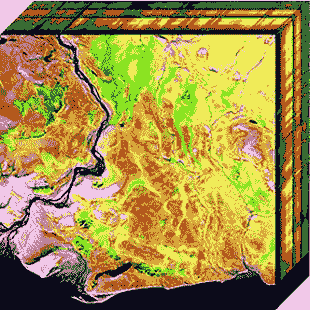

# 主动学习:机器和人一起工作

> 原文：<https://towardsdatascience.com/active-learning-machine-and-men-working-together-37a68b3853b8?source=collection_archive---------40----------------------->

## 使用较少标记数据训练 ML 模型的工具

安迪·凯利的照片

M 在过去的几十年里，机器学习(ML)已经彻底改变了世界，受益于不断增长的计算能力，以解决不久前还无法解决的问题。然而，尽管有其潜力，许多技术和实践的挑战面临着那些与 ML。

特别是，生成用于训练模型的数据的必要工作正在成为一个复杂的问题。鉴于我们目前试图解决的问题的复杂性和规模，标记必要的数据成为一项费力且昂贵的任务，因为大部分过程必须手动完成。在处理需要高度专业化的问题时，这个问题甚至更为关键。例如，为了使用深度神经网络从 MRI 扫描中检测疾病，在诊断这种图像方面经验丰富的医生必须对成千上万个样本进行分类。鉴于此，开发提高数据集标注工作流效率的方法变得至关重要。

一个有效的选择是部分或完全自动化贴标过程。然而，当考虑复杂和高维数据时，标注工作流中没有多少可以自动化(如果您有一个能够自动标注数据的系统，问题就解决了，并且无论如何都不需要训练 ML 模型)。

另一种方法包括以某种方式减小数据集的大小。尽管我们知道复杂的问题需要大量的数据集，但事实上并不是所有的例子对学习模型都有意义。因此，只选择信息量最大的例子进行标注，可以让我们在从较少的例子中学习的同时，获得一个好的模型。

主动学习是一个依赖于这种想法的框架，其中模型选择最具信息量的未标记样本，然后要求外部专家(通常称为 oracle)只标记这些样本。主动学习被一些作者归类为半监督学习框架，因为它在训练模型时使用标记和未标记的数据。与 oracle 的交互是迭代的，在每次迭代中都有新的未标记的示例提供给 oracle。

在[1]中，Burr Settles 提出了一个关于主动学习的广泛调查。他用直观的方式总结了背后的概念:

> *“关键的假设是，如果允许学习算法选择它学习的数据——如果你愿意的话，可以说是“好奇”——它将在更少的训练下表现得更好。”[1]*

接下来将展示两个有趣的主动学习应用。

# 情感分析中的主动学习

照片由 [M. B. M.](https://unsplash.com/@m_b_m?utm_source=medium&utm_medium=referral)

情感分析是自然语言处理领域的一个重要应用。它侧重于根据作者表达的态度对文本进行分类。尽管看起来像一个简单的任务，但它通常是 ML 模型很难处理的事情，因为文本中的细微变化可能会给读者带来完全不同的含义。

在[2]中，作者将主动学习应用于情感分析问题，提出了一种称为主动深度网络(ADN)的算法，这是主动学习和深度神经网络的结合。结果真的很有趣，因为这种方法不仅使用了更少的例子来学习，而且它优于当时被认为是最先进的其他知名模型。

> *“[……]ADN 可以根据现有的未标记和已标记数据，做出应该标记哪些训练数据的正确决定。通过迭代使用无监督和有监督学习，ADN 可以选择合适的训练数据进行标记，同时训练深度架构。面向情感分析的主动学习”*

# 用于高光谱图像分类的主动深度学习

高光谱图像是电磁波谱中光谱响应的表示。它由代表特定电磁波长测量值的若干空间图像组成，用于从天文学到生物医学的不同应用。由于通常表示的不同波长的范围很大，数据变得高维。例如，NASA AVIRIS(机载可见/红外成像光谱仪)捕获的单个图像可以包含高达 140MB 的原始数据[3]。

超光谱立方体的 2D 投影。Nicholas M. Short 博士，美国航天局

对于主动学习来说，这是一个很好的应用，因为对这样的图像进行分类是一项长期的任务，需要对应用程序有深入的了解。在[4]中，作者提出了一种称为 WI-DL 的主动学习算法，使用具有 4 个隐藏层的深度信念网络。该模型仅用 5000 个标记样本就达到了接近 95%的准确率，表明通过主动选择相关训练样本，可以在使用较少数据的情况下训练出准确的模型。

# 结论

对于机器学习应用来说，为复杂和高维问题产生高质量的数据集已经是一个挑战。在这里，一个称为主动学习的框架与两个相关的应用一起被提出。尽管允许减少标记示例的数量，但是主动学习并不是给定问题的最终解决方案，因为仍然需要人类来负责人工标记。同样重要的是要注意，oracle 必须包含在训练循环中，等待算法在每次新的迭代中提供新的未标记样本。取决于应用，这是一个可能不方便或难以实现的工作流程。

# 参考

[1]落定，伯尔。主动学习文献调查。威斯康星大学麦迪逊分校计算机科学系，2009 年。

[2]周，舒森，，陈，.“用于半监督情感分类的主动深度网络。”第 23 届国际计算语言学会议录:海报。计算语言学协会，2010 年。

[3] Cheung、Ngai-Man 和 Antonio Ortega。"超光谱图像的分布式压缩."分布式源代码(2009):269–292。

[4]刘，彭，，朱光耀."高光谱图像分类的主动深度学习."IEEE 应用地球观测和遥感专题期刊 10.2(2016):712–724。