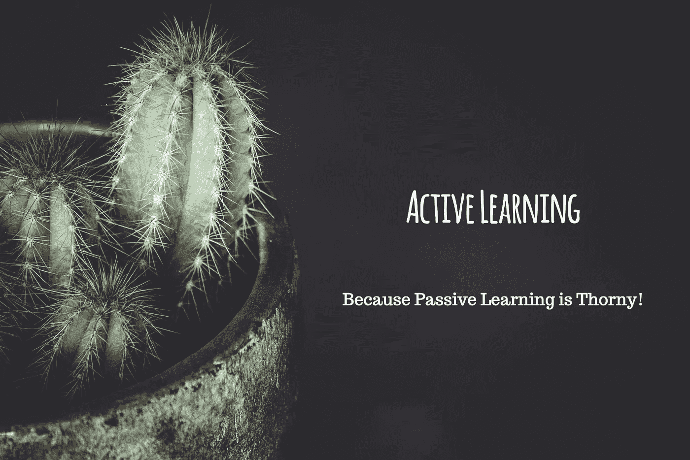
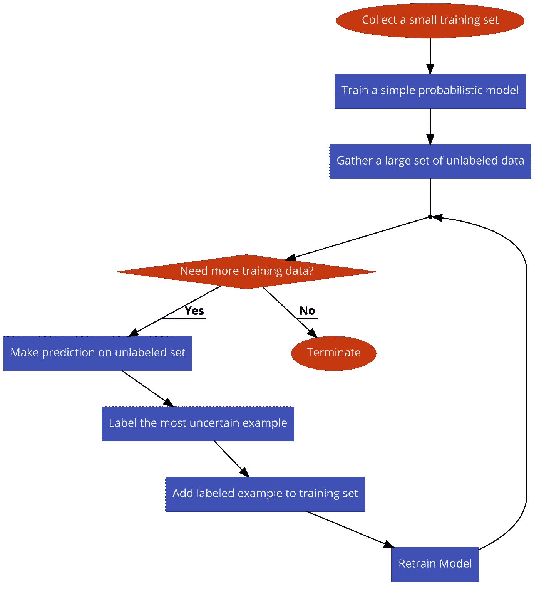
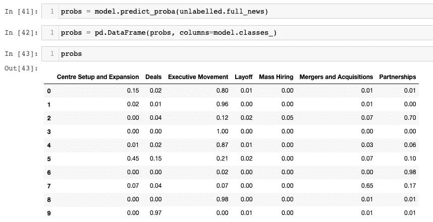
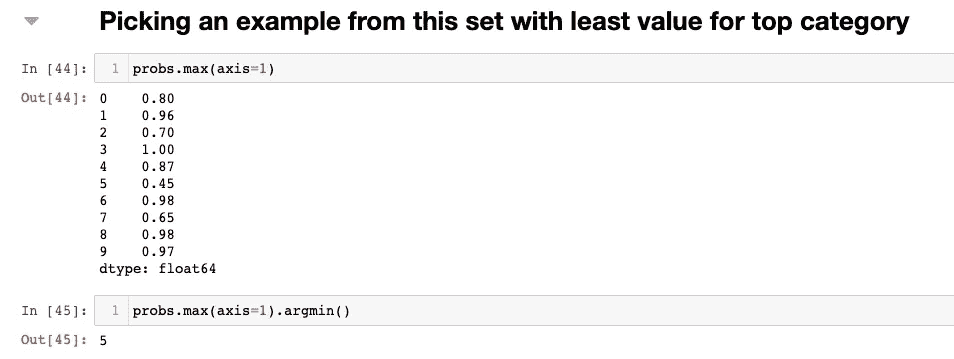
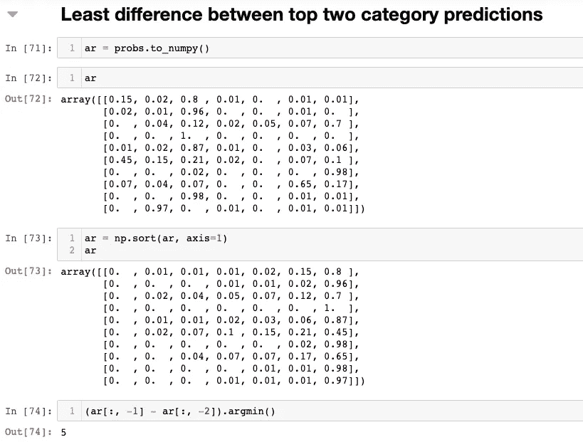
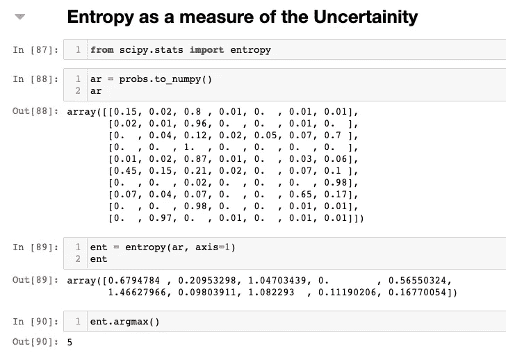
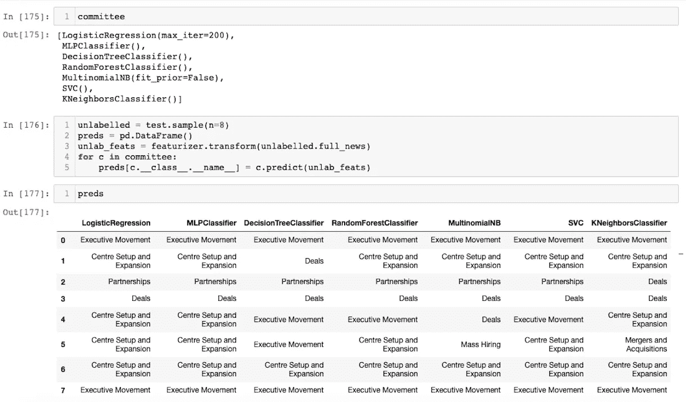
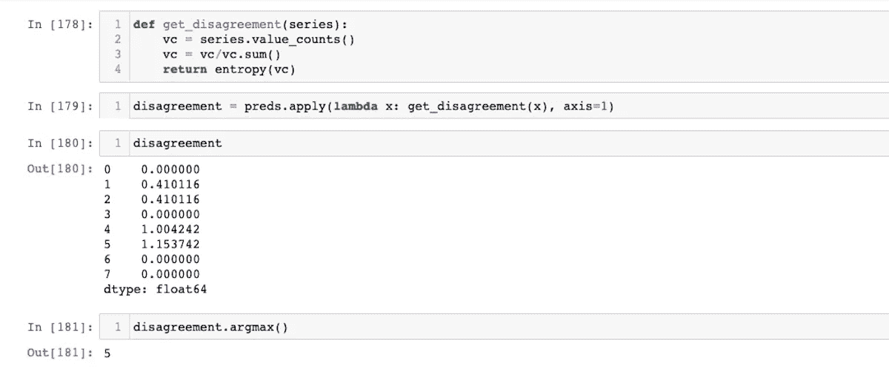

# 主动学习——说是！

> 原文：<https://towardsdatascience.com/active-learning-say-yeah-7598767806b2?source=collection_archive---------10----------------------->

安妮·斯普拉特在 [Unsplash](https://unsplash.com/s/photos/cactus?utm_source=unsplash&utm_medium=referral&utm_content=creditCopyText) 上的照片

> 机器学习这个，机器学习那个！你知道该怎么做。让我们来谈一个人们此刻只在窃窃私语的话题，**主动学习。**

主动学习是人工智能的一个子领域，它基于这样一个事实，即好奇的算法在**效率**和**表达能力方面都是更好的学习者。**核心思想是让算法挑选样本进行训练，而不是在所有可用的训练数据上训练模型。

# 主动学习场景

主动学习可能是人工智能领域最简单的想法之一。这个想法有多种变化，但都有明确的主题。

> 让模型挑选训练数据

“让模型挑选训练数据”这句话可能意味着几件事。

1.  让模型创建训练数据(创成式模型)
2.  让模型从未标记的数据流中挑选一个例子
3.  让模型从一堆未标记的数据中挑选一个例子

生成模型可能有些棘手，因为人类注释者可能很难标记数据，这违背了主动学习的目的。

一般来说，在实际设置中，模型从一个未标记的数据流/数据池中挑选例子，由人类注释者进行标记。

# 主动学习策略

这一节我们来讨论几个主动学习策略。

## 不确定抽样

这种策略通常用于概率模型。可以用一个简单的流程图来概括。

不确定性采样流程图。[使用 [code2flow](https://app.code2flow.com/) 生成]

除了“标记最不确定的例子”这一步，上面的流程图几乎是不言自明的。

让我们考虑一个将新闻分为 7 类的工作示例。我们有:-

1.  一套小型训练设备
2.  在带标签的训练集上训练的简单模型
3.  一大群没有标记的人

让我们预测 10 个未标记的样本中所有类别的概率。

10 个未标记样本的分类概率。[作者图片]

1.  **选择一个最大概率类别值最小的例子**

直觉告诉我们，如果模型对某个示例的顶部预测没有信心，那么该示例就相当困难，或者可能与模型已经看到的不同。

例 5 具有最大的不确定性。[作者图片]

在上面的示例中，我们看到模型对第 5 个示例的顶部预测最没有信心。

2.**挑选一个前两个类别之间差异最小的例子**

直觉是，如果前两个预测之间的差异较小，那么模型一定是在两个类别之间混淆了。一个好的模型应该能够尽可能地分离类别，因此，在训练数据中考虑该示例是很重要的。

前两类的区别。[作者图片]

3.**利用熵测量不确定度**

[维基百科](https://en.wikipedia.org/wiki/Entropy_(information_theory))定义的熵是 ***变量可能结果中固有的“信息”、“惊喜”或“不确定性”的平均水平。*** 如果预测概率具有高熵，则意味着模型对某个例子感到困惑。

计算预测概率的熵。[作者图片]

## 委员会的质询

就整个过程而言，按委员会查询也非常类似于不确定性抽样。唯一的区别是我们如何选择最不确定的例子。在**不确定性采样中，**我们训练单个模型，并使用其输出概率来推断不确定性并挑选示例。

在按委员会查询中，我们创建不同类型模型的委员会，并在训练集上训练它们。当选择看不见的例子时，我们从所有例子的所有模型中得到预测。这些模型在很大程度上不一致的示例是困难的示例，应该出现在训练数据中。

> 不同类型的模型(线性、树、邻居、贝叶斯)确保我们的查询策略不会受到单一类型的建模假设的影响，因此性能良好。

创建一个由 7 名分类员组成的委员会。[作者图片]

例 5 不同型号之间分歧最大。[作者图片]

# 主动学习的好处

在文章的开始，我提到了主动学习提高了模型的效率和表达能力。

> 与学术界相反，行业从业者必须处理非标准数据集和问题

因此，任何 ML 项目的很大一部分都花费在获得正确的训练数据集上。人类注释者花费他们宝贵的时间来标记数据集进行训练，这是最大的开销和低效点。 ***主动学习法保证了标注者只标注最重要、最难的例子，从而使整个过程更加高效。***

> 当一个大数据集被无意识地标记时，它会带来不想要的类别不平衡，并冒着丢失尚未标记的重要示例的风险。

通过使用主动学习，我们挑选最有趣和最多样的例子，从而提高模型的表达能力。在这里，通过表达能力，我的意思是这个过程从大量未标记的数据中引出更多种类的要标记的例子，这些数据在无意识标记的情况下会保持未标记。

> 所以如果都是金子和闪闪发光的东西，为什么我们不在这里谈论它呢？

[杰瑞米·霍华德](https://medium.com/u/34ab754f8c5e?source=post_page-----7598767806b2--------------------------------)在他出现在[莱克斯·弗里德曼](https://medium.com/u/119b8eb57f8e?source=post_page-----7598767806b2--------------------------------)的播客中非常出色地抓住了这一点。

# 结论

主动学习，在我看来，是人工智能领域最接近于一顿“**免费午餐**”的事情。这个概念非常简单，其好处远远超过创建和管理培训数据的任何其他方法。虽然这不是一个非常著名的子领域，但令人敬畏的 python 社区已经创建了一些包，将主动学习的力量带给每个人。

*   [模态](https://github.com/modAL-python/modAL)
*   [Libact](https://github.com/ntucllab/libact)
*   [Alipy](https://github.com/NUAA-AL/ALiPy)
*   [书呆子](https://github.com/Draup-Zinnov/NERD)(不要脸的塞！)

# 参考

*   [主动学习文献调查](http://burrsettles.com/pub/settles.activelearning.pdf)
*   [代码到流程图](https://app.code2flow.com/)