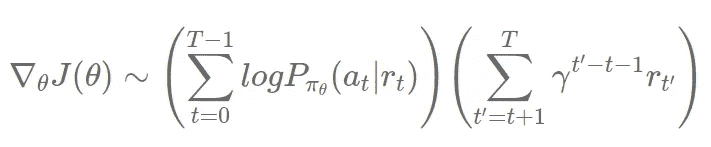
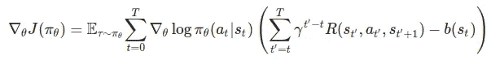
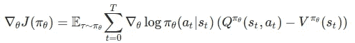

# TensorFlow 2.x 的演员兼评论家[第 1 部分，共 2 部分]

> 原文：<https://towardsdatascience.com/actor-critic-with-tensorflow-2-x-part-1-of-2-d1e26a54ce97?source=collection_archive---------12----------------------->

## 使用 Tensorflow 2.x 以不同方式实现参与者-批评家方法

戴维·维克斯列尔在 [Unsplash](https://unsplash.com/s/photos/reinforcement-learning?utm_source=unsplash&utm_medium=referral&utm_content=creditCopyText) 上的照片

在这一系列文章中，我们将试图理解演员-评论家方法，并以 3 种方式实现它，即天真的 AC，没有多个工人的 A2C，和有多个工人的 A2C。

这是系列的第一部分，我们将使用 TensorFlow 2.2 实现天真的演员评论家。我们先来了解一下演员-评论家法是什么，是如何运作的？了解加强政策梯度方法将是有益的，你可以在这里找到它[。](/reinforce-policy-gradient-with-tensorflow2-x-be1dea695f24)

## 概述:

如果你读过加强政策梯度法，你就会知道它的更新规则是

更新加固规则

在演员-评论家方法中，我们从折扣奖励中减去基线。这些方法的常用基线是状态值函数。所以我们的演员-评论家更新规则将如下所示。

演员-评论家更新规则

在演员-评论家方法中，我们有两个神经网络，即演员和评论家。actor 用于动作选择，Critic 用于计算状态值。如果您查看更新等式，您会注意到状态值被用作基线。有了基线有助于确定所采取的行动是坏的/好的，还是状态是坏的/好的。您可以在参考资料部分找到非常好的理论资源。

# 天真的演员兼评论家:

在这个实现中，我们将在每个时间戳更新我们的神经网络。这种实现不同于 A2C，在那里我们在每 n 个时间戳之后更新我们的网络。我们将在本系列的下一部分实现 A2C。

## 神经网络:

神经网络基本上可以用两种方式实现。

1.  一个网络用于演员和评论家功能，即一个网络具有两个输出层，一个用于状态值，另一个用于动作概率。
2.  独立的网络，一个是演员的，另一个是评论家的。

在这篇文章中，我们将对演员和评论家使用不同的网络，因为我发现这个可以快速学习。

## 代码:

演员和评论家网络:

1.  批评家网络输出每个状态的一个值，而行动者网络输出该状态中每个单个动作的概率。
2.  这里，演员网络中的 4 个神经元是动作的数量。
3.  注意，Actor 在外层有一个 softmax 函数，它输出每个动作的动作概率。

> 注意:隐藏层中的神经元数量对于代理学习非常重要，并且因环境而异。

代理类的初始化方法:

1.  这里，我们为我们的网络初始化优化器。**请** **注意**学习的****速度**也很重要，并且会因使用的环境和方法而异。**

**动作选择:**

1.  **这种方法利用了张量流概率库。**
2.  **首先，Actor 给出概率，然后使用 TensorFlow 概率库将概率转换成分布，然后从分布中抽取动作。**

**学习功能和损失:**

1.  **我们将利用梯度胶带技术进行定制培训。**
2.  **行动者损失是采取行动的对数概率乘以 q 学习中使用的时间差的负数。**
3.  **对于临界损失，我们采取了一种简单的方法，只计算时间差的平方。如果你愿意，你可以使用 tf2 的均方误差函数，但是你需要对时差计算做一些修改。我们将在本系列的下一部分中使用 MSE，所以不要担心。**
4.  **你可以在 TensorFlow 官网找到更多关于定制训练循环的内容。**

> **注意:请确保使用语句(上下文管理器)调用 networks inside，并且只使用张量进行网络预测，否则您将得到一个关于没有提供梯度的错误。**

**Trining 循环:**

1.  **代理在环境中采取行动，然后 bot 网络更新。**
2.  **对于月球着陆器环境，这种实现表现良好。**

> **注意:在实现这些方法时，我注意到学习速率和隐藏层中的神经元对学习有很大的影响。**

**你可以在这里找到这篇文章的完整代码。请继续关注即将发布的文章，我们将在有多个工人和没有多个工人的情况下实施 A2C。**

**这个系列的第二部分可以在这里访问[。](/actor-critic-with-tensorflow-2-x-part-2of-2-b8ceb7e059db)**

**所以，本文到此结束。谢谢你的阅读，希望你喜欢并且能够理解我想要解释的东西。希望你阅读我即将发表的文章。哈里奥姆…🙏**

# **参考资料:**

** [## 强化学习，第二版

### 显着扩大和更新的广泛使用的文本强化学习的新版本，最…

mitpress.mit.edu](https://mitpress.mit.edu/books/reinforcement-learning-second-edition)  [## 直觉 RL:优势介绍-演员-评论家(A2C)

### 强化学习(RL)实践者已经产生了许多优秀的教程。然而，大多数描述 RL 在…

hackernoon.com](https://hackernoon.com/intuitive-rl-intro-to-advantage-actor-critic-a2c-4ff545978752)  [## 优势演员评论方法介绍:让我们玩刺猬索尼克！

### 托马斯西蒙尼尼介绍优势演员评论家的方法:让我们玩刺猬索尼克！从…开始

www.freecodecamp.org](https://www.freecodecamp.org/news/an-intro-to-advantage-actor-critic-methods-lets-play-sonic-the-hedgehog-86d6240171d/)  [## 菲尔的机器学习

### 你好。在 Neuralnet.ai，我们涵盖了各种主题的人工智能教程，从强化…

www.youtube.com](https://www.youtube.com/channel/UC58v9cLitc8VaCjrcKyAbrw)**