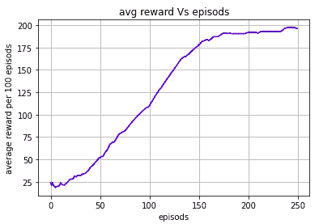

# TensorFlow 2.x 的演员兼评论家[第 2 部分，共 2 部分]

> 原文：<https://towardsdatascience.com/actor-critic-with-tensorflow-2-x-part-2of-2-b8ceb7e059db?source=collection_archive---------21----------------------->

## 使用 TensorFlow 2.x 实施有/无多个工作人员的 A2C

Josue Isai Ramos Figueroa 在 [Unsplash](https://unsplash.com/s/photos/multiple-workers?utm_source=unsplash&utm_medium=referral&utm_content=creditCopyText) 上的照片

本文是使用 TensorFlow 2.x 的演员-评论家系列的第二部分。在上一篇文章中，我们使用 TensorFlow 2.x 实现了朴素的演员-评论家方法，而在本文中，我们将实现有/无多个工作者的优势演员-评论家(A2C)方法。你可以参考我之前在这个系列的文章[这里](/actor-critic-with-tensorflow-2-x-part-1-of-2-d1e26a54ce97)。

# 最佳演员兼评论家(A2C):

让我们先来概述一下 A2C 算法，然后我们再来尝试理解代码。该算法的步骤如下。

没有多个工人:

1.  代理玩 n 个时间步，并存储 n 个时间步的状态、动作、奖励
2.  使用折现回报等式计算一个州的预期回报，即每个州的(R = r + Gamma*R)。
3.  计算演员损失和评论家损失(我们将在代码部分考虑这一点)
4.  每 n 步更新一次网络。**请** **注意**在本文中，为了简单起见，我们将在每集之后更新，n 取决于您使用的环境。
5.  重复上述过程，直到收敛。

有多个工人:

1.  多个工作人员与他们自己的独立环境进行交互，并存储他们的经验。
2.  在每一集之后(或每 n 个时间步之后)，像以前一样计算预期回报，然后将这些工人的经验叠加在一起，然后在每一集之后用这种叠加的经验训练网络。
3.  重复这个过程，直到收敛。

## 代码(没有多个工人):

神经网络:

1.  我们的网络与前一篇文章相似，但这次层数和神经元数不同，因为我使用的是 cart pole 环境。
2.  你必须试验层数和神经元数以及学习率(在优化器中使用)。

代理初始化和操作选择:

1.  这两个函数也是相同的，但这次学习率不同。
2.  简而言之，我们使用 TensorFlow 概率库将概率转化为动作采样的分布。

现在让我们先来看看与环境的相互作用，以便更好地理解。

主训练循环:

1.  代理与环境交互，并将状态、动作、奖励存储在它们的受关注列表中。
2.  当这一集结束时，调用函数 preprocess1，它将上述列表作为状态、动作和每个状态的预期回报的输入和输出 NumPy 数组(类似于蒙特卡罗计算每个状态的预期回报)。
3.  然后，代理的网络使用这些 NumPy 数组进行更新。

学习功能和损失:

所以，这有点不一样。让我们一步一步来理解。

1.  Learn 函数将状态、动作和来自状态的期望回报(这里写为 discnt_rewards)的 NumPy 数组作为输入。
2.  演员预测每个状态下每个动作的概率。批评家预测每个州的价值。
3.  时间上的差异被计算为来自状态的预期收益和由评论家预测的值之间的差异。
4.  批评家损失以 MSE 计算，预期收益作为目标，预测值作为预测值。
5.  演员损失一开始实现起来有些复杂，因为许多在线教程使用 TensorFlow 内置的`SparseCategoricalCrossentropy`，我发现它很抽象。这是一个简单的实现。
6.  行动者损失是两种损失的组合，即政策损失和熵损失。保单损失是在该州采取行动的对数概率乘以该州的时间差的负数。熵损失是采取行动的概率乘以在该状态下采取行动的对数概率的负值。
7.  损失的实现可能看起来很可怕，但这种实现的目的是网络预测的张量不能转换为 NumPy 数组，如果您转换 NumPy 数组中的值，您将得到一个错误，说明没有提供梯度。
8.  因此，行动者损失函数将行动者、行动和时间差预测的行动概率张量作为输入。
9.  第一个“for 循环”将每个预测转化为分布，因此我们可以获得在每个状态下采取行动的概率和对数概率。之所以需要“For 循环”,是因为我们可以在不将概率转换成数字数组的情况下，获得一个动作的概率。
10.  然后我们计算损失。

训练图:

以下是最近 100 集 vs 集的剧情 b/w 平均奖励。

## 代码(有多个工人):

正如我们前面所讨论的，唯一不同的是多个工作人员与他们自己的环境副本进行交互。

要实现多员工 A2C，唯一需要的修改是在主培训循环中。

1.  我们正在分别为状态、动作和预期奖励创建 3 个共享队列。并使用 python 多重处理库创建了 Barrier 实例和 lock 实例。
2.  接下来，我们启动执行 runner 函数的 10 个进程。使用 join()我们可以确保每个进程都终止。

主训练循环:

1.  Runer 函数与环境交互，并像我们之前看到的那样将转换存储在列表中。
2.  当一段情节为一个工作者完成时，它调用 preprocess1 函数，该函数执行与之前相同的任务，但这次它将状态、动作和预期回报放入它们各自的队列中(通过首先获取一个锁，以便没有其他工作者将其经验放入其他工作者的经验之间，然后在将他们的经验放入队列后释放该锁)。
3.  我们只允许一个工人通过使用 Barrier 实例来提取经验和训练网络。
4.  函数 preprocess2 从队列中检索这些体验，并将它们连接成一个用于状态的 NumPy 数组，一个用于操作，一个用于预期奖励。
5.  然后网络被更新。最后一行 Barrier.wait()确保所有其他工作线程等待，直到所有工作线程都到达该点。

这就是关于编码的全部内容。现在让我们看看您的代理没有学习的原因和一些技巧。

## 实施时需要注意的事项:

在编写 RL 代码时，要记住以下几点。

1.  神经元数量、隐藏层数、学习速率对学习有巨大的影响。
2.  张量和 NumPy 数组的形状应该是正确的。很多时候，实现是正确的，代码也是有效的，但是代理没有学到任何东西，只是因为张量的形状不正确，并且当对这些张量进行运算时，会给出错误的结果。

你可以在这里找到这篇文章的完整代码和[这里](https://github.com/abhisheksuran/Atari_DQN/blob/master/Multi_Worker_Actor_Critic.ipynb)。敬请关注我们将在 TensorFlow 2 中实现 PPO 的后续文章。

所以，本文到此结束。谢谢你的阅读，希望你喜欢并且能够理解我想要解释的东西。希望你阅读我即将发表的文章。哈里奥姆…🙏

# 参考资料:

 [## 直觉 RL:优势介绍-演员-评论家(A2C)

### 强化学习(RL)实践者已经产生了许多优秀的教程。然而，大多数描述 RL 在…

hackernoon.com](https://hackernoon.com/intuitive-rl-intro-to-advantage-actor-critic-a2c-4ff545978752)  [## 谷歌联合实验室

### 编辑描述

colab.research.google.com](https://colab.research.google.com/github/yfletberliac/rlss-2019/blob/master/labs/solutions/DRL.01.REINFORCE%2BA2C_solution.ipynb)  [## 优势演员-评论家方法介绍:让我们玩刺猬索尼克！

### 托马斯西蒙尼尼介绍优势演员-评论家方法:让我们玩刺猬索尼克！从…开始

www.freecodecamp.org](https://www.freecodecamp.org/news/an-intro-to-advantage-actor-critic-methods-lets-play-sonic-the-hedgehog-86d6240171d/)