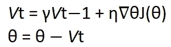
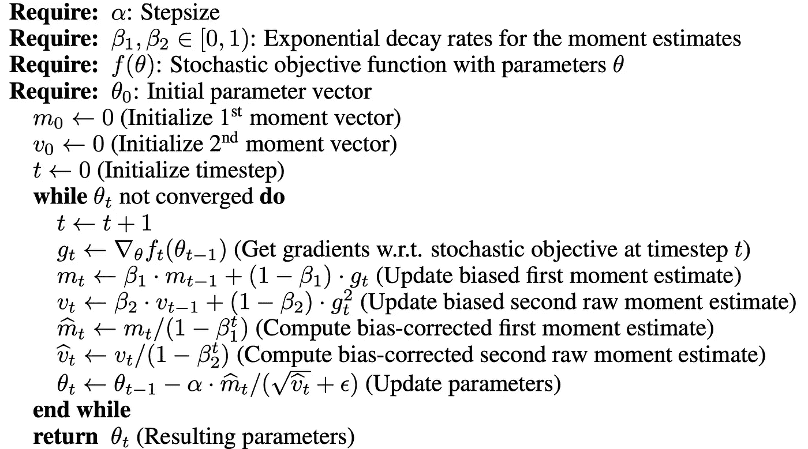

# 亚当优化算法

> 原文：<https://towardsdatascience.com/adam-optimization-algorithm-1cdc9b12724a?source=collection_archive---------11----------------------->

## 一种有效优化算法综述

图 1:[Dmitry Ratushny](https://unsplash.com/@ratushny?utm_source=medium&utm_medium=referral)在 [Unsplash](https://unsplash.com?utm_source=medium&utm_medium=referral) 上拍摄的照片

根据牛津词典的定义，优化是对一种情况或资源进行最佳或最有效利用的行为，或者简单地说，就是尽最大努力。通常，如果某样东西可以用数学建模，那么它很可能可以被优化。这在深度学习领域(老实说，可能是整个人工智能)发挥着至关重要的作用，因为你选择的优化算法可能会在几分钟、几小时或几天内，在某些情况下，几周、几个月或一年内获得高质量的结果。

在这篇文章中，你将学到:

*   什么是亚当优化？
*   在你的深度学习模型中使用 Adam 进行优化有什么好处？
*   亚当是如何工作的？

## 亚当是什么？

Adam 优化是对随机梯度下降的扩展，可以用来代替经典的随机梯度下降来更有效地更新网络权重。

请注意，Adam 这个名字并不是一个缩写词，事实上，OpenAI 的 Diederik P. Kingma 和多伦多大学的吉米·巴雷在论文中指出，这个名字来源于*自适应矩估计，该论文最初是在 2015 年 [ICLR](https://iclr.cc/) 的一篇会议论文中提出的，题为 [Adam:一种随机优化的方法](https://arxiv.org/pdf/1412.6980.pdf)。*

作者们立即列举了将 Adam 应用于非凸优化问题的许多迷人的好处，我将继续分享如下:

*   实现简单(我们将在本文后面实现 Adam，您将直接看到，利用强大的深度学习框架如何用更少的代码行使实现变得更加简单。)
*   计算效率高
*   几乎没有内存需求
*   梯度的对角缩放不变(这意味着 Adam 对于梯度乘以仅具有正因子的对角矩阵是不变的——为了更好地理解这一点[阅读该堆栈交换](https://stats.stackexchange.com/questions/360322/what-does-diagonal-rescaling-of-the-gradients-mean-in-adam-paper#:~:text=invariant%20to%20diagonal%20rescaling%20of%20the%20gradients%2C%20%5B...%5D&text=Second%2C%20while%20the%20magnitudes%20of,with%20the%20magnitudes%20of%20parameters.)
*   非常适合在数据和/或参数方面很大的问题
*   适用于非静止目标
*   适用于非常嘈杂和/或稀疏梯度的问题
*   超参数有直观的解释，通常需要很少的调整(我们将在配置部分详细介绍)

## 嗯……它是如何工作的？

简单来说，Adam 利用动量和自适应学习率来更快地收敛。

**动量**

在解释动量时，研究人员和实践者都喜欢使用球滚下山坡的类比，球滚向局部最小值的速度更快，但本质上我们必须知道的是，动量算法加速了相关方向的随机梯度下降，并抑制了振荡。

为了将动量引入我们的神经网络，我们将时间元素添加到当前更新向量的过去时间步长的更新向量中。这使得球的动量增加了一些。这可以用数学方法表示，如图 2 所示。

图 2:动量更新方法，其中θ是网络的参数，即权重、偏差或激活度，η是学习率，J 是我们试图优化的目标函数，γ是常数项，也称为动量。Vt-1(注意 t-1 是下标)是过去的时间步，Vt(注意 t 是下标)是当前的时间步。

动量项γ通常被初始化为 0.9 或 Sebastian Ruder 论文[中提到的某个类似项【梯度下降优化算法概述](https://arxiv.org/pdf/1609.04747.pdf)。

**自适应学习率**

自适应学习率可以被认为是通过将学习率降低到预定义的时间表来调整训练阶段的学习率，我们在 AdaGrad、RMSprop、Adam 和 AdaDelta 中可以看到这种时间表——这也称为学习率时间表，关于这个主题的更多细节[淑熙·刘](https://medium.com/u/3e95520ee2b9?source=post_page-----1cdc9b12724a--------------------------------)写了一篇关于这个主题的非常翔实的博客文章，名为[深度学习的学习率时间表和自适应学习率方法](/learning-rate-schedules-and-adaptive-learning-rate-methods-for-deep-learning-2c8f433990d1)。

> 在不深入 AdaGrad 优化算法的情况下，我将解释 RMSprop 以及它如何改进 AdaGrad，以及它如何随着时间的推移改变学习速率。

RMSprop，即均方根传播，由 Geoff Hinton 开发，如梯度下降优化算法概述中所述，其目的是解决 AdaGrad 的学习率急剧下降的问题。简而言之，RMSprop 改变学习速率的速度比 AdaGrad 慢，但 AdaGrad 的好处(更快的收敛)仍然可以从 RMSprop 中获得，数学表达式见图 3。

图 3:E[g]t 的第一个方程是梯度平方的指数衰减平均值。Geoff Hinton 建议将γ设置为 0.9，而学习率η的默认值为 0.001。

这使得学习率能够随着时间的推移而适应，理解这一点很重要，因为这种现象在 Adam 中也存在。当我们将两者(Momentum 和 RMSprop)放在一起时，我们得到 Adam——图 4 显示了详细的算法。

图 4:随机优化的 Adam 算法；来源于 Kingma，D 和 Ba，J . (2015) Adam:一种随机优化方法。可在:【https://arxiv.org/pdf/1412.6980.pdf (访问时间:2020 年 5 月 31 日)。

感谢您阅读到这里，下面将链接更多阅读材料，如果您想与我联系，您可以在 LinkedIn 上找到我，我的名字是 [Kurtis Pykes](https://www.linkedin.com/in/kurtispykes/) (点击我的名字可直接访问)。

**进一步阅读:**

*   金玛，D 和巴，J . (2015) *亚当:一种随机优化的方法*。可在:[https://arxiv.org/pdf/1412.6980.pdf](https://arxiv.org/pdf/1412.6980.pdf)
*   Ruder，S. (2017) *梯度下降优化算法概述*。可在:[https://arxiv.org/pdf/1609.04747.pdf](https://arxiv.org/pdf/1609.04747.pdf)
*   用于在线学习和随机优化的自适应次梯度方法。可在:[http://www.jmlr.org/papers/volume12/duchi11a/duchi11a.pdf](http://www.jmlr.org/papers/volume12/duchi11a/duchi11a.pdf)

**有用视频:**