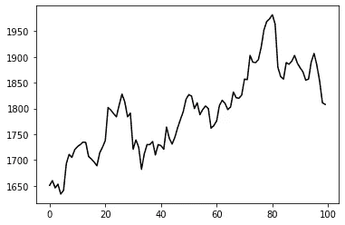
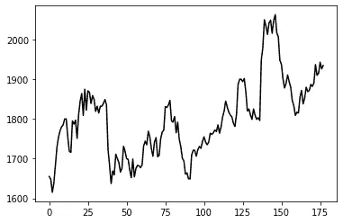
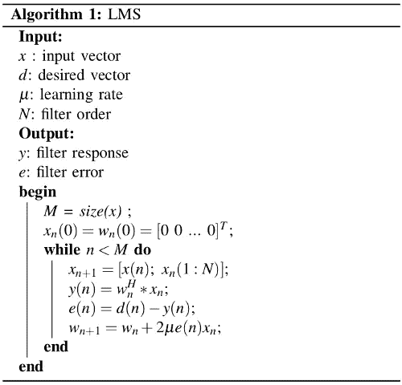
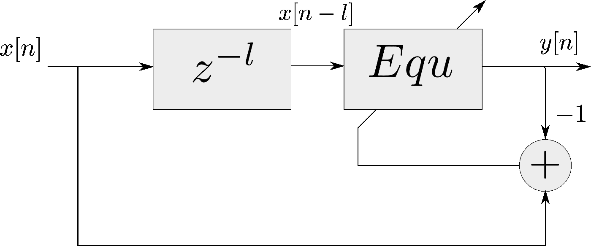
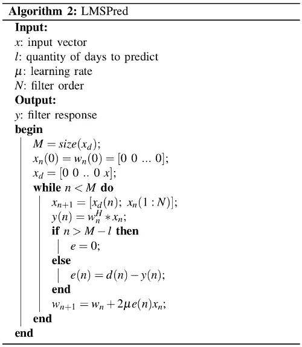
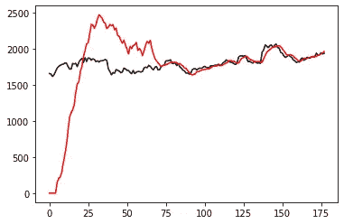

# 股票市场预测中的自适应滤波:一种不同的方法

> 原文：<https://towardsdatascience.com/adaptive-filtering-in-stock-market-prediction-2db9ad7ae7f9?source=collection_archive---------26----------------------->

## 用 LMS 线性自适应滤波器预测股票市场价格


莎伦·麦卡琴在 [Unsplash](https://unsplash.com/s/photos/dollar) 上的照片

P 很可能你在网上看到了很多关于股市预测的内容，但每一条似乎都是空话连篇，或者是看起来不可思议的事情。

预测股票市场价格是数据科学中一个主要领域的一部分，称为**时间序列分析**，在这里我们将看到我们如何用一种非常漂亮、简单且效果不错的非常规方法来处理这个问题:**自适应滤波**。

## 时间序列

> [***时间序列***](https://en.wikipedia.org/wiki/Time_series) 是一系列按时间顺序索引(或列出或绘制)的数据点。

对计量经济学、统计学和气象学等领域非常重要的是，时间序列的研究是**挑战性问题**之一，激发了信号处理、机器学习和数据分析领域的大量研究，因为它可以用于**聚类**、**分类**，以及在这种情况下的**预测。**



股票价格分析是一个时间序列问题！

为了有更实际的情况，我们将使用 2019 年 178 天期间的 **ABEV3 (ON)** 股票价格。如果你认为这种数据很难获得，那么你就错了。这个数据是我在 [b3 网站](http://www.b3.com.br/pt_br/)、**巴西官方股市**得到的，而且是免费的:)



ABEV3(上)2019 年 180 天股价

很好，一旦我们掌握了数据，我们就来讨论算法

## LMS 滤波器

[LMS 滤波器](https://en.wikipedia.org/wiki/Least_mean_squares_filter)是一种自适应滤波器，用于解决线性问题。滤波器的思想是通过最小化误差信号的最小均方来模拟系统(找到滤波器系数)。



LMS 滤波器伪代码

*总的来说*，我们不知道用线性方法是否能很好地解决问题，所以我们通常测试一个**线性**和一个**非线性**算法。由于互联网总是显示非线性方法，我们将使用 LMS 来证明股票市场预测**可以用具有**良好精度**的线性算法**来完成。

但是这个滤波器**模仿了**一个系统，也就是说，如果我们在我们的数据中应用这个滤波器，我们将训练**滤波器系数**，当我们输入一个新的向量时，我们的滤波器系数将输出原始系统会输出的响应(在最好的情况下)。因此，我们只需做一个*巧妙的*修改，就可以使用这个过滤器来预测数据。

## 该系统

首先，我们将我们的输入向量延迟 *l* 个位置，其中 *l* 将是我们想要预测的天数，这个 *l* 新位置将由**个零**填充。



系统的模式

当我们应用 LMS 滤波器时，我们将针对前 178 个数据训练滤波器。之后我们会将误差设置为零，那么系统会开始输出答案作为原系统到最后的 *l* 值。我们将*棘手的*修改称为 **LMSPred 算法**。



LMSPred 伪代码

## 最后，我们来编码吧！

首先我们必须导入我们将在这段代码中使用的**库**:

```
**import** numpy **as** np
**import** matplotlib.pyplot **as** plt
```

下一步是 LMSPred 的**实现**，你可以边看伪代码边自己尝试，这里是我的实现:

```
**def** **lmsPred**(x,l,u,N):
    xd= np.**block**([np.zeros((1,l)), x]).T
    y=np.**zeros**((len(xd),1))
    xn=np.**zeros**((N+1,1))
    xn = np.**matrix**(xn)
    wn=np.**random**.**rand**(N+1,1)/10
    M=**len**(xd)
    **for** n **in** range(0,M):
        xn = np.**block**([[xd[n]], [xn[0:N]]]);
        y[n]= np.**matmul**(wn.T, xn);
        **if**(n>M-l-1):
            e =0;
        **else**:
            e=**int**(x[n]-y[n]);
        wn = wn + 2*u*e*xn;

    **return** y,wn;
```

现在，我们将**定义**我们的向量 x，它具有 ABEV3 (ON)的 178 个值:

```
x = np.**array**([1655, 1648, 1615, 1638, 1685, 1729, 1754, 1770, 1780, 1785, 1800, 1800, 1754, 1718, 1716, 1795, 1787, 1797, 1751, 1811, 1845, 1864, 1809, 1875, 1822, 1871, 1867, 1839, 1859, 1849, 1819, 1832, 1815, 1832, 1832, 1839, 1849, 1836, 1723, 1683, 1637, 1669, 1659, 1711, 1700, 1690, 1666, 1676, 1731, 1719, 1700, 1698, 1672, 1652, 1699, 1654, 1675, 1683, 1682, 1677, 1684, 1732, 1744, 1735, 1769, 1755, 1725, 1706, 1742, 1753, 1705, 1708, 1750, 1767, 1772, 1831, 1829, 1835, 1847, 1795, 1792, 1806, 1765, 1792, 1749, 1730, 1701, 1694, 1661, 1664, 1649, 1649, 1709, 1721, 1721, 1706, 1722, 1731, 1726, 1743, 1755, 1742, 1735, 1741, 1764, 1761, 1765, 1772, 1768, 1785, 1764, 1780, 1805, 1820, 1845, 1830, 1817, 1810, 1805, 1789, 1781, 1813, 1887, 1900, 1900, 1894, 1902, 1869, 1820, 1825, 1810, 1799, 1825, 1809, 1799, 1803, 1796, 1949, 1980, 2050, 2034, 2013, 2042, 2049, 2016, 2048, 2063, 2017, 2007, 1948, 1938, 1901, 1878, 1890, 1911, 1894, 1880, 1847, 1833, 1809, 1817, 1815, 1855, 1872, 1838, 1852, 1880, 1869, 1872, 1887, 1882, 1891, 1937, 1910, 1915, 1943, 1926, 1935]);
```

为了训练该系统，我们将采用前 173 个值，学习率为 2^(-30)，过滤顺序 N=60，l=5 天的预测。

```
x_train = x[0:173]
u = 2**(-30);
l=5;
N=60;
y,wn = **lmsPred**(x_train,l,u,N)
```

为了**可视化**输入数据和学习曲线，我们将绘制如下:

```
plt.**plot**(x, **color** = 'black')
plt.**plot**(y, **color** = 'red')
plt.**show**()
```

并评估我们预测的百分误差:

```
pred = y[-l:]
realvalues = x[-l]
error = 100*(pred.T-realvalues)/realvalues
**print**(**abs**(error))
```

所以，**的完整代码为**:

```
**import** numpy **as** np
**import** matplotlib.pyplot **as** plt**def** **lmsPred**(x,l,u,N):
    xd= np.**block**([np.zeros((1,l)), x]).T
    y=np.**zeros**((len(xd),1))
    xn=np.**zeros**((N+1,1))
    xn = np.**matrix**(xn)
    wn=np.**random**.**rand**(N+1,1)/10
    M=**len**(xd)
    **for** n **in** range(0,M):
        xn = np.**block**([[xd[n]], [xn[0:N]]]);
        y[n]= np.**matmul**(wn.T, xn);
        **if**(n>M-l-1):
            e =0;
        **else**:
            e=**int**(x[n]-y[n]);
        wn = wn + 2*u*e*xn;

    **return** y,wn;x = np.**array**([1655, 1648, 1615, 1638, 1685, 1729, 1754, 1770, 1780, 1785, 1800, 1800, 1754, 1718, 1716, 1795, 1787, 1797, 1751, 1811, 1845, 1864, 1809, 1875, 1822, 1871, 1867, 1839, 1859, 1849, 1819, 1832, 1815, 1832, 1832, 1839, 1849, 1836, 1723, 1683, 1637, 1669, 1659, 1711, 1700, 1690, 1666, 1676, 1731, 1719, 1700, 1698, 1672, 1652, 1699, 1654, 1675, 1683, 1682, 1677, 1684, 1732, 1744, 1735, 1769, 1755, 1725, 1706, 1742, 1753, 1705, 1708, 1750, 1767, 1772, 1831, 1829, 1835, 1847, 1795, 1792, 1806, 1765, 1792, 1749, 1730, 1701, 1694, 1661, 1664, 1649, 1649, 1709, 1721, 1721, 1706, 1722, 1731, 1726, 1743, 1755, 1742, 1735, 1741, 1764, 1761, 1765, 1772, 1768, 1785, 1764, 1780, 1805, 1820, 1845, 1830, 1817, 1810, 1805, 1789, 1781, 1813, 1887, 1900, 1900, 1894, 1902, 1869, 1820, 1825, 1810, 1799, 1825, 1809, 1799, 1803, 1796, 1949, 1980, 2050, 2034, 2013, 2042, 2049, 2016, 2048, 2063, 2017, 2007, 1948, 1938, 1901, 1878, 1890, 1911, 1894, 1880, 1847, 1833, 1809, 1817, 1815, 1855, 1872, 1838, 1852, 1880, 1869, 1872, 1887, 1882, 1891, 1937, 1910, 1915, 1943, 1926, 1935]);x_train = x[0:173]
u = 2**(-30);
l=5;
N=60;
y,wn = **lmsPred**(x_train,l,u,N)plt.**plot**(x, **color** = 'black')
plt.**plot**(y, **color** = 'red')
plt.**show**()pred = y[-l:]
realvalues = x[-l]
error = 100*(pred.T-realvalues)/realvalues
**print**(**abs**(error))
```

## 结果



股市预测结果一例

我们选择了**的黑色**作为**的真实数据**，而**的红色**作为我们的**预测**，正如你所看到的，最初它们有很大的差异，但是更接近于对应于**滤波器阶数**的值(在这种情况下，60)两条曲线非常接近。

在这种情况下，每天的百分比输出精度为:

```
[[0.79837693 1.12168626 1.24557245 2.24050302 3.16604697]]
```

因此，第 5 天有 **3.16%** 的误差，这是一个相当不错的值，因为我们使用的是一个非常简单的方法。

需要强调的是，对于高值的 *l* ，股票市场预测**不太好**，因为我们要在*稳定状态*期间分析股票市场，也就是说，不考虑未来可能的**危机**、**政治问题**等。因此，对 *l.* 的**小值**使用股市预测更安全

如果您有任何问题，可以在我的 LinkedIn 个人资料中关注我！