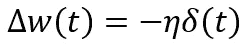
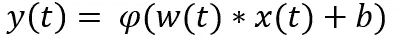
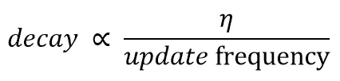
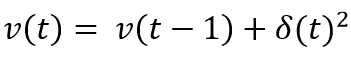
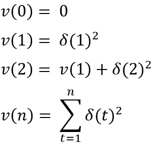
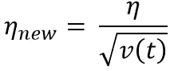
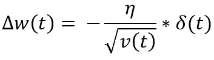
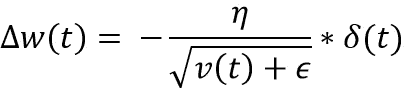
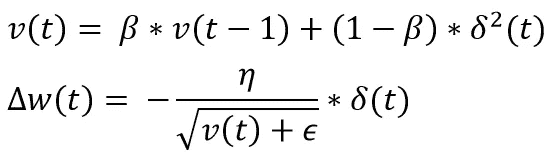
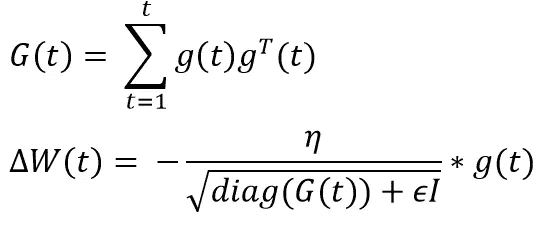

# 适应性学习率:AdaGrad 和 RMSprop

> 原文：<https://towardsdatascience.com/adaptive-learning-rate-adagrad-and-rmsprop-46a7d547d244?source=collection_archive---------29----------------------->

在我之前的文章[中，我们看到了学习率(η)如何影响收敛。将学习率设置得太高会导致最小值附近的振荡，而设置得太低会减慢收敛速度。梯度下降中的学习速率(η)及其变化(如动量)是一个超参数，需要针对所有特征手动调整。](https://medium.com/swlh/gradient-descent-with-momentum-59420f626c8f)

*作者图片*

当我们使用上述等式来更新神经网络中的权重时

1.  所有功能的学习速度都是一样的
2.  学习率在成本空间的所有地方都是一样的

# **恒定学习率对收敛的影响**

假设，我们试图预测一部电影的成功/评级。我们假设有成千上万个特征，其中一个是“is_director_nolan”。我们的输入空间中的特征“is_director_nolan”将主要为 0，因为 nolan 导演了很少的电影，但是他的出现显著影响了电影的成功/评级。从本质上来说，这个特征是稀疏的，但是由于高信息量，我们不能忽略它。

在神经网络的正向传递过程中，如果迭代(t)时的输入(x)为 0，则使用下面的等式，输出变为 bias(b)的激活(φ **)** 。

*作者图片*

因此，在反推 w.r.t 期间计算的局部梯度该恒定偏差将为 1，并且对于该特征，权重更新将非常小(参见第一个等式)

对于像“is_director_nolan”这样的稀疏输入特征，只有当输入从 0 变为 1 或相反时，才会发生大的权重更新。而密集特征将接收更多更新。因此，对所有特征使用恒定和相同的学习速率不是一个好主意。

# **解决方案**

从上面我们可以推断出，特征的学习率应该衰减，使得它与该特征的权重更新频率成反比。对于频繁特征，新的学习率应该低，而对于稀疏特征，新的学习率应该高。

*作者图片*

权重的更新频率的代表是在过去的更新中获得的梯度的总和。我们应该取梯度的平方，而不是梯度的绝对值，这样梯度的符号(方向)就无关紧要了。我们只关心梯度频率。这可以使用下面的等式来捕捉。

*作者图片*

密集要素的该代理值较高，而稀疏要素的该代理值很低。

假设𝓥 **(0) = 0**

*作者图片*

新的学习率变为

*作者图片*

**注意**:我们取𝓥 **(t)** 的平方根，以便保持我们的权重更新方程的维数

新的权重更新公式变为

*作者图片*

如果𝓥 **(t)** 为零(在稀疏特征的情况下)会发生什么？为了避免分母变成零，我们应该在分母中加一个小值ε(一般是 1e -07)。

*作者图片*

上面的等式是用于 **AdaGrad** (自适应梯度)的权重更新等式。

每次迭代后， **AdaGrad** 的新学习率以过去梯度的平方和的因子衰减。虽然它解决了我们更新稀疏特征的问题，但同时也引入了一个新的问题。对于密集特征，过去的梯度将是非零的，并且在一些迭代之后，学习率由于分母中所有过去的平方梯度的累积而收缩得太快。

为了解决这个问题，我们可以借鉴基于动量的梯度下降法。不是以相等的比例使用所有过去的梯度，我们将使用过去平方梯度的指数移动平均，以基本上将累积梯度的窗口限制为仅几个最近的梯度。

因此，更新频率𝓥的新代理 **(t)** 变为。

*作者图片*

上面的等式是 **RMSprop 的权重更新等式。**

# **额外说明**:

在一些文本中，包括 AdaGrad 的[原始研究论文](https://www.jmlr.org/papers/volume12/duchi11a/duchi11a.pdf)中，你会发现在分母中没有使用整个梯度矩阵，而是使用了累积梯度的对角矩阵。

**AdaGrad** 的权重更新规则的矩阵表示。

*作者图片*

梯度矩阵 **G(t)** 的平方根和逆矩阵是一个昂贵的运算，对于大的输入空间，这可能变得非常难以计算。 **G(t)** 的对角矩阵是最佳近似，因为它忽略了梯度相互作用。 **diag(G(t))** 的平方根和逆可以用 O(n)时间复杂度计算。因此，AdaGrad 和 RMSprop 的大多数实现仅使用梯度矩阵 **G(t)** 的对角元素。

# **结论**

学习率是一个重要的超参数，必须针对输入空间中的每个特征进行优化调整，以实现更好的收敛。通过采用自适应学习速率方法，如 **AdaGrad** 和 **RMSprop，**，我们让这些优化器通过学习底层数据的特征来调整学习速率。这些优化器给频繁出现的特征以低学习率，给不频繁出现的特征以高学习率，从而收敛得更快。