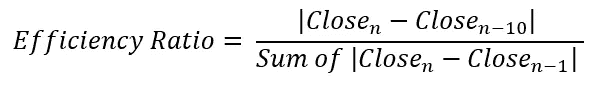

# Python 中的自适应移动平均。

> 原文：<https://towardsdatascience.com/adaptive-moving-average-in-python-56c98a4de7fd?source=collection_archive---------13----------------------->

## 呈现一个强有力的趋势指示器。

***注来自《走向数据科学》的编辑:*** *虽然我们允许独立作者根据我们的* [*规则和指导方针*](/questions-96667b06af5) *发表文章，但我们不认可每个作者的贡献。你不应该在没有寻求专业建议的情况下依赖一个作者的作品。详见我们的* [*读者术语*](/readers-terms-b5d780a700a4) *。*

均线是检测趋势变化的最简单也是最有效的工具之一。它们也被用来建立基于交叉的交易策略。几乎每个交易者都使用它们，并把它们纳入自己的决策过程。在本文中，我们将浏览基本的已知移动平均线，然后介绍稍微复杂一点的 **Kaufman Adapative 移动平均线——KAMA。**

我刚刚出版了一本新书《成功后的 ***新技术指标》中的 Python*** 。它对复杂的交易策略进行了更完整的描述和补充，Github 页面致力于不断更新代码。如果你对此感兴趣，请随时访问下面的链接，或者如果你喜欢购买 PDF 版本，你可以在 Linkedin 上联系我。

[](https://www.amazon.com/gp/product/B09919GQ22/ref=as_li_tl?ie=UTF8&camp=1789&creative=9325&creativeASIN=B09919GQ22&linkCode=as2&tag=sofien-20&linkId=bc5df3f6ab0f3af2df79641c56b949ba) [## 交易策略之书

### 亚马逊网站:交易策略之书:9798532885707: Kaabar，Sofien:书籍

www.amazon.com](https://www.amazon.com/gp/product/B09919GQ22/ref=as_li_tl?ie=UTF8&camp=1789&creative=9325&creativeASIN=B09919GQ22&linkCode=as2&tag=sofien-20&linkId=bc5df3f6ab0f3af2df79641c56b949ba) 

# 普通移动平均线

三种最常见的移动平均线是:

*   ***简单移动平均线。***
*   ***指数移动平均线。***
*   ***平滑移动平均线。***

在我们进入 KAMA 之前，我们将仔细检查每一个，定义它，编码它，并绘制它的图表。


具有 200 周期简单移动平均线(橙色)、200 周期均线(蓝色)和 200 周期平滑移动平均线(绿色)的 USDCAD。(图片由作者提供)

*   **简单移动平均线**

顾名思义，这是一个简单的平均数，在统计学和我们生活中的任何地方都会用到。它就是观察值的总和除以观察次数。从数学上来说，它可以写成:


在 python 中，我们可以定义一个计算移动平均值的函数，如下所示:

```
def ma(Data, period, onwhat, where):

    for i in range(len(Data)):
            try:
                Data[i, where] = (Data[i - period:i + 1, onwhat].mean())

            except IndexError:
                pass
    return Data
```

该函数采用由**数据**变量、移动平均周期(20、60、200 等)表示的数据结构。)由**周期**变量表示，您希望将它应用于什么(在 OHLC 数据结构上，选择 3 表示收盘价，因为 python 索引从零开始)由 **onwhat** 变量表示，而 **where** 变量是您希望移动平均线列出现的位置。请注意，您必须有一个超过 4 列的数组才能工作，因为它不会自动创建一个新列，而是简单地填充它。


欧元兑美元每日时间跨度，200 天简单移动平均线。(图片由作者提供)

*   **指数移动平均**

与简单的移动平均线给所有的观察值相同的权重相反，指数移动平均线给最近的观察值更多的权重。它比简单的移动平均线对最近的变动反应更大。从数学上来说，它可以写成:


平滑因子通常为 2。请注意，如果我们增加平滑因子(也称为 alpha ),那么最近的观测值将具有更大的权重。在 python 语言中，我们可以定义一个函数来计算 EMA，如下所示:

```
def ema(Data, alpha, window, what, whereSMA, whereEMA):

    # alpha is the smoothing factor
    # window is the lookback period
    # what is the column that needs to have its average calculated
    # where is where to put the exponential moving average

    alpha = alpha / (window + 1.0)
    beta  = 1 - alpha

    # First value is a simple SMA
    Data[window - 1, whereSMA] = np.mean(Data[:window - 1, what])

    # Calculating first EMA
    Data[window, whereEMA] = (Data[window, what] * alpha) + (Data[window - 1, whereSMA] * beta)# Calculating the rest of EMA
    for i in range(window + 1, len(Data)):
            try:
                Data[i, whereEMA] = (Data[i, what] * alpha) + (Data[i - 1, whereEMA] * beta)

            except IndexError:
                pass
    return Data
```

该函数是不言自明的，因为它只是复制了上面介绍的 EMA 函数。

如果你也对更多的技术指标和使用 Python 创建策略感兴趣，那么我关于技术指标的畅销书可能会让你感兴趣:

[](https://www.amazon.com/gp/product/B08WZL1PNL/ref=as_li_tl?ie=UTF8&camp=1789&creative=9325&creativeASIN=B08WZL1PNL&linkCode=as2&tag=sofien-20&linkId=e3cb9716bb6a07cf6c8b9fb585412b07) [## Python 中的新技术指标

### 亚马逊网站:Python 中的新技术指标:9798711128861: Kaabar，Sofien 先生:书籍

www.amazon.com](https://www.amazon.com/gp/product/B08WZL1PNL/ref=as_li_tl?ie=UTF8&camp=1789&creative=9325&creativeASIN=B08WZL1PNL&linkCode=as2&tag=sofien-20&linkId=e3cb9716bb6a07cf6c8b9fb585412b07) 

欧元兑美元每日时间跨度，200 天指数移动平均线。(图片由作者提供)

*   **平滑移动平均线**

该移动平均线考虑了总体情况，受近期走势的影响较小。这是我最喜欢的趋势跟踪指标。从数学上来说，简单地将 EMA 函数中的 Days 变量乘以 2 再减去 1 就可以得到。这意味着，要将指数移动平均线转换为平滑移动平均线，我们需要遵循 python 语言中的等式，即将指数移动平均线转换为平滑移动平均线:

```
smoothed = (exponential * 2) - 1 # From exponential to smoothed
```


200 天平滑移动平均线的欧元兑美元每日时间范围。(图片由作者提供)

# 考夫曼适应性移动平均线

创建 KAMA 是为了减少噪音和锯齿效应。它的工作原理和其他均线一样，遵循同样的直觉。错误交易信号的产生是均线的问题之一，这是由于短期的突然波动使计算产生偏差。KAMA 的主要目标是尽可能降低噪音。

我们应该衡量的第一个概念是效率比率，它是当前收盘价相对于过去 10 个周期的绝对变化除以以特殊方式计算的一种波动率。我们可以说效率比是变化除以波动。



图片作者。

然后，我们根据以下公式计算平滑常数:


图片作者。

最后，为了计算 KAMA，我们使用以下公式:


图片作者。

计算可能看起来很复杂，但它很容易自动化，你不必想太多。让我们看看如何用 Python 对其进行编码，然后继续看一些例子。

```
def kama(Data, what, where, change):

    # Change from previous period
    for i in range(len(Data)):
        Data[i, where] = abs(Data[i, what] - Data[i - 1, what])

    Data[0, where] = 0

    # Sum of changes
    for i in range(len(Data)):
        Data[i, where + 1] = (Data[i - change + 1:i + 1, where].sum())   

    # Volatility    
    for i in range(len(Data)):
        Data[i, where + 2] = abs(Data[i, 3] - Data[i - 10, 3])

    Data = Data[11:, ]

    # Efficiency Ratio
    Data[:, where + 3] = Data[:, where + 2] / Data[:, where + 1]

    for i in range(len(Data)):
        Data[i, where + 4] = np.square(Data[i, where + 3] * 0.6666666666666666667)

    for i in range(len(Data)):
        Data[i, where + 5] = Data[i - 1, where + 5] + (Data[i, where + 4] * (Data[i, 3] - Data[i - 1, where + 5]))
        Data[11, where + 5] = 0
```

下面的图表说明了上述函数能给我们带来什么。注意相对于其他移动平均线，KAMA 有更稳定的趋势。这是对拉锯和假断裂的改进。


欧元兑美元 M15 时间跨度，10 期自适应移动平均线。(图片由作者提供)


USDCHF M15 时间范围，10 期自适应移动平均线。(图片由作者提供)

KAMA 也可以用来检测新趋势的开始。例如，我们可以绘制一个长期的 KAMA 和一个短期的 KAMA，在它们的交叉点上交易。如果默认设置是 10 期，我们可以试试 30 期的 KAMA，看看它能给我们什么。

```
plt.plot(Asset1[-500:, 3], color = 'black', label = 'EURUSD')
plt.plot(Asset1[-500:, 4], color = 'blue', label = '10-period KAMA')
plt.plot(Asset1[-500:, 5], color = 'purple', label = '30-period KAMA')
plt.grid()
plt.legend()
```


欧元兑美元 M15 时间跨度，10 期和 30 期自适应移动平均线。(图片由作者提供)

使用上面的图表，我们可以说，当两个 KAMA 持平时，市场在波动，当趋势开始时，我们应该跟随它们各自的交叉，例如当 30 期 KAMA 高于 10 期 KAMA 时，熊市趋势正在进行，直到交叉发生。这反过来对我们可能是一个有价值的信号。如果你对趋势跟踪策略感兴趣，你可以看看下面的文章:

[](https://medium.com/swlh/the-supertrend-indicator-in-python-coding-and-back-testing-its-strategy-e37d631c33f) [## Python 中的超级趋势指示器——编码和回溯测试其策略

### 如何编码，回测，并在外汇交易中进行评估。

medium.com](https://medium.com/swlh/the-supertrend-indicator-in-python-coding-and-back-testing-its-strategy-e37d631c33f) 

现在，让我们画一个简单的移动平均线，并与同期的 KAMA 进行比较。显然，后者对正在发生的事情提供了更好、更准确的描述，这是因为它考虑到了波动性。现在我不是说你应该用 KAMA 代替简单的移动平均线，但是把它包含在框架中似乎是个好主意。


欧元兑美元 M15 时间范围，10 期自适应移动平均线和简单移动平均线。(图片由作者提供)


USDCHF M15 时间范围，10 期自适应移动平均线和简单移动平均线。(图片由作者提供)

# 结论

作为自适应和指数移动平均线的粉丝，我鼓励你尝试这种技术。卡马提供了有价值的支撑和阻力位，可以用来补充你的交易系统。它不是用来作为产生交易信号的唯一因素，但它在确认交易信号方面是有价值的。


尼古拉斯·卡佩罗在 [Unsplash](https://unsplash.com/s/photos/trading?utm_source=unsplash&utm_medium=referral&utm_content=creditCopyText) 上拍摄的照片