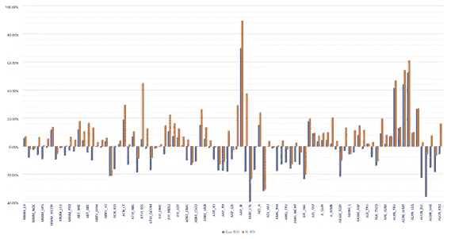

# COVID 下的自适应配对交易——一种强化学习方法

> 原文：<https://towardsdatascience.com/adaptive-pair-trading-under-covid-19-a-reinforcement-learning-approach-ff17e6a8f0d6?source=collection_archive---------34----------------------->

## 人工智能资本管理研究系列文章

[M. B. M.](https://unsplash.com/@m_b_m?utm_source=medium&utm_medium=referral) 在 [Unsplash](https://unsplash.com?utm_source=medium&utm_medium=referral) 上拍摄的照片

**摘要**

这是 A.I. Capital Management 的研究系列文章之一，介绍文章[在这里](/applied-deep-reinforcement-learning-in-quantitative-trading-both-momentum-and-market-neutral-c0eef522ea11)。这一个是关于在市场中性策略上应用 RL，特别是优化一个简单的配对交易策略，RL 代理是每个交易基础上的资本分配器，同时保持进/出信号不变。目标是优化现有信号的连续交易规模分配，同时让代理根据市场制度/条件调整其行为。

**作者:** Marshall Chang 是 A.I. Capital Management 的创始人兼首席信息官，这是一家量化交易公司，建立在深度强化学习对动量和市场中性交易策略的端到端应用之上。该公司主要以中高频交易外汇市场。

**概述**

成对交易是市场中性策略的基础，这是最受欢迎的量化交易策略之一，因为它不从市场方向获利，而是从一对资产之间的相对回报获利，避免了系统风险和随机游走的复杂性。市场中性策略的盈利能力存在于假设的资产对之间的潜在关系中，然而，当这种关系不再保留时，通常在动荡的体制转换时期，如今年的新冠肺炎，这种策略的回报通常会减少。事实上，根据 HFR(对冲基金研究公司)的数据，截至 2020 年 7 月底，HFRX 股票对冲指数的年初至今回报率为-9.74%[【1】](#_ftn1)；其近亲，HFRX 相对价值套利指数，年初至今回报率为-0.85%。众所周知，对于市场中立的量化分析师，或者任何量化分析师**，挑战不仅仅是发现盈利信号，更多的是如何在体制转换时期快速发现和适应复杂的交易信号。**

在市场中性交易领域，大多数研究一直专注于揭示相关性和提炼信号，通常使用以高成本购买的专有替代数据来寻找优势。然而，**交易规模和投资组合层面的资本配置优化往往被忽视**。我们发现很多配对交易信号虽然复杂，但仍然使用固定的进场门槛和线性分配。随着深度强化学习(RL)等复杂模型和学习算法的发展，这类算法渴望非线性优化的创新。

**方法——alpha spread RL 解决方案**

为了通过状态转换时间来解决配对交易策略的检测和适应，我们的独特方法是使用基于顺序代理的解决方案来解决交易分配优化，该解决方案直接在现有信号一般化过程之上训练，具有清晰的跟踪改进和有限的部署开销。

该项目内部命名为 **AlphaSpread** ，展示了在美国& P 500 股票的 1 对价差交易中，RL 顺序交易规模分配相对于标准线性交易规模分配的 ROI(投资回报)改善。我们以现有的每笔交易标准分配的配对交易策略为基线，在我们定制的价差交易健身房环境中训练由深度神经网络模型表示的 RL 分配器，然后在样本外数据上进行测试，旨在超越基线的最终 ROI。

具体来说，我们选择协整对的基础上，他们的平稳传播我们的统计模型。协整对通常在同一个行业，但我们也包括横截面对显示强协整。交易信号是通过达到由统计模型使用每日收盘价预测的残差的 z 分数的预定义阈值而生成的。本例的基线将整个投资组合的固定 50%分配给每个交易信号，而 RL 分配器根据 z 分数回看所代表的当前市场条件，依次为每个交易信号输出 0–100%的分配。

*alpha spread——在视频中，红色的 NAV 是信号在 COVID 月份中的表现，绿色的是我们 RL 分配器的相同策略。我们了解到，我们的 RL 代理可以在早期发现制度变化，并相应地进行分配，以避免巨大的低迷。*

**结果汇总**

我们总结了我们的 RL 方法对 107 个交易的美国股票对的交易 ROI 与基线线性分配。投资回报率是根据测试期结束时每对组合 100，000 美元的初始资本来计算的。该结果来自 2018 年至 2020 年 4 月(包括新冠肺炎月)期间对样本外数据的回溯测试。利用 2006 年和 2017 年之间的数据来训练 RL 分配器。在这两种情况下，测试中不考虑费用。与基线方法相比，我们平均每对投资回报率提高了 9.82%，最高为 55.62%，最低为 0.08%。

换句话说，通过有限的模型调整，这种方法能够通过早期检测体制转换和 RL 分配器代理相应的资本分配适应来导致 ROI 的普遍改善。

*配对交易策略 ROI 快照，比较基础分配和 RL 分配*

**一般化的讨论**

这个项目的目标是展示一个非常简单的一对一交易信号的潜在改进的样本外概括，因此**为将这种方法应用于大规模复杂的市场中性策略提供指导**。下面是我们在这个实验中设定的 3 个目标的讨论。

**可重复性** —该 RL 框架由定制的 pairs trading RL 环境组成，用于准确培训和测试 RL 代理，RL 培训算法包括 DQN、DDPG 和异步演员评论，RL 自动培训推出机制集成了内存优先重放、动态模型调整、探索/开发等。，通过最少的定制和手动调整实现大型数据集的可重复性。运行 RL 相对于其他机器学习算法的优势在于，它是一个从训练数据泛化、奖励函数设计、模型和学习算法选择到输出一个序列策略的端到端系统。**一个经过良好调整的系统需要最少的维护，并且模型的再培训/重新适应新数据是在相同的环境中完成的。**

**可持续性** —在一对交易的例子中，使用 2006 年和 2017 年的数据进行了配对协整测试和 RL 训练，然后训练有素的代理从 2018 年到 2020 年初进行测试。训练和测试数据的比例大致为 80:20。随着 RL 自动培训的展开，我们可以在超过 2 年的时间里，在数百对样本中总结出基线回报的可持续改善。**RL 代理学习根据代表两者的协整路径以及波动性的 z 分数的回看来分配，并接受探索/开发训练，以找到最大化最终 ROI 的策略。**与具有静态输入-输出的传统监督和非监督学习相比，RL 算法具有内置的泛化鲁棒性，因为它直接学习具有反映实现的损益的奖励函数的状态-策略值。RL 训练目标总是非静态的，因为随着代理与环境交互并改善其策略，训练体验会得到改善，从而强化良好行为，反之亦然。

**可扩展性** —训练和部署大规模端到端深度 RL 交易算法在 quant trading 中仍处于起步阶段，但我们相信它是我们领域 alpha 的未来，因为 **RL 已经在游戏领域(AlphaGo、Dota 等)展示了对传统 ML 的巨大改进。).**这个 RL 框架非常适用于市场中性基金部署的不同配对交易策略。凭借在多个量化交易渠道中运行 RL 系统的经验，我们可以定制环境、训练算法和奖励函数，以有效地解决投资组合优化中的独特任务，这是由传统的监督和非监督学习模型无法实现的基于 RL 的代理的顺序学习提供动力的。

**钥匙拿走**

如果信号赚钱，就是用线性分配赚钱(总是交易 x 单位)。但当它没有，显然我们想重做信号，让它适应新的市场条件。然而，有时这并不容易做到，一个快速的解决方案可能是在现有信号处理之上的 RL 代理/层。在我们的例子中，我们让代理观察一个代表价差波动的数据集，并根据过去的交易和损益决定相关的分配。

**背景及更多详情**

**信号一般化过程** —我们首先对两种资产的过去回顾价格历史(2006 年至 2017 年每日价格)进行线性回归，然后我们进行 OLS 检验以获得残差，利用残差我们进行单位根检验(增广的 Dickey-Fuller 检验)以检查协整的存在。在本例中，我们将 P 值阈值设置为 0.5%，以拒绝单位根假设，这导致 2794 个 S & P 500 对通过测试。下一个短语是我们如何设置触发条件。首先，我们将残差归一化，得到一个遵循假设的标准正态分布的向量。大多数测试使用两个西格玛水平达到 95%,这是相对难以触发。为了给每一对产生足够的交易，我们把阈值设置为 sigma。归一化后，我们得到一个白噪声遵循 N(0，1)，并设置+/- 1 作为阈值。总的来说，信号产生过程非常简单。如果标准化残差高于或低于阈值，我们就做多看跌的，做空看多的，反之亦然。我们只需要生成一个资产的交易信号，另一个应该是相反的方向

**深度强化学习**—RL 训练制度从运行探索到利用线性退火策略开始，通过运行训练环境来生成训练数据，在这种情况下，运行与协整相同的 2006-2017 年历史数据。存储器存储在以下组中

*状态、动作、奖励、下一个状态、下一个动作(SARSA)*

这里我们使用 DQN 和政策梯度学习目标的混合，因为我们的行动输出是连续的(0-100%)，但样本效率低(由于每日频率，每对交易在数百笔以内)。我们的训练模型会随着

*Q(状态)=奖励+ Q-max(下一个状态，下一个动作)*

本质上，RL 代理正在学习连续 DQN 的 Q 值，但是在每个策略的改进上用策略梯度来训练，因此避免了样本低效(Q 学习保证收敛到训练全局最优)和过快地陷入局部最小值的趋势(避免 PG 的所有 0 或 1 输出)。一旦存储了预热记忆，当代理继续与环境交互并推出旧记忆时，我们就用记忆数据来训练模型(在这种情况下是输出单个动作的 3 层密集网络)。

***注来自《走向数据科学》的编辑:*** *虽然我们允许独立作者根据我们的* [*规则和指导方针*](/questions-96667b06af5) *发表文章，但我们不认可每个作者的贡献。你不应该在没有寻求专业建议的情况下依赖一个作者的作品。详见我们的* [*读者术语*](/readers-terms-b5d780a700a4) *。*

**参考**

巴尔托萨顿有限公司。强化学习:导论。麻省理工学院出版社；2018.

*HFRX 指数性能表。(未注明)。检索到 2020 年 8 月 03 日，转自*[*https://www.hedgefundresearch.com/family-indices/hfrx*](https://www.hedgefundresearch.com/family-indices/hfrx)