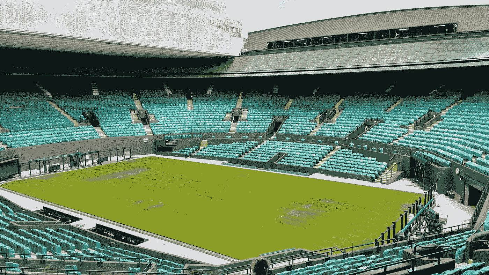
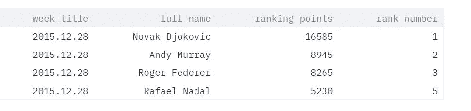
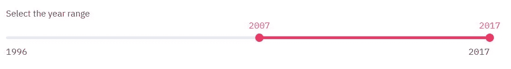

# 使用 Streamlit-Python 向您的仪表盘添加动画图表

> 原文：<https://towardsdatascience.com/add-animated-charts-to-your-dashboards-with-streamlit-python-f41863f1ef7c?source=collection_archive---------17----------------------->

## 利用 ATP 网球排名数据对比网球四大

# 介绍

有段时间一直想试用[](https://www.streamlit.io/)*。所以上周末，我花了一些时间修补它。如果您以前从未听说过这个工具，它提供了一种非常友好的方式来使用 Python 为您的数据科学和机器学习项目创建自定义的交互式数据 web 应用程序。您可以与用户交互以获得输入并显示动态图表、表格、地图等。他们的 [*官方画廊*](https://www.streamlit.io/gallery) 可能是一个好的开始。它将让您了解使用 Streamlit 可以实现什么。您还会发现一长串来自 Streamlit 社区的推文，它们以自己独特的方式利用该工具进行创作。一定要看看它们，寻找一些灵感。可以使用 pip install 命令( *pip install Streamlit* )下载 streamlit。*

*在本文中，我分享了一个使用 Streamlit 构建的动画条形图示例。虽然，实现这一点的一些信息是零零碎碎的，但我无法在一个地方找到太多关于动画图表的信息。我希望这将有助于那些希望在他们的 Streamlit 仪表板中添加动画图表的人。*

# *数据集*

**

*由 [Carlo Bazzo](https://unsplash.com/@carlo_bazzo?utm_source=medium&utm_medium=referral) 在 [Unsplash](https://unsplash.com?utm_source=medium&utm_medium=referral) 上拍摄*

*稍微说一下数据吧。网球是我最喜欢的运动，我决定围绕它做点什么(也因为我真的真的很想念温布尔登💔).总之，在网上搜索了一段时间后，我偶然发现了一些我认为可以使用的东西。直到 2017 年，费德勒、纳达尔、诺瓦克·德约科维奇和安迪·穆雷都被亲切地称为四巨头。在他们之间，他们从 2004 年到 2017 年统治了这项运动。*

*数据集包含每周 ATP 排名数据，其中包含球员姓名、排名点数、球员排名和排名日期等信息。在 streamlit 中，您还可以以表格形式查看数据帧。在一些基本的格式化之后，我最终的数据框架如下所示。*

**

*处理过的数据帧:由[阿林多姆·巴塔查尔吉](https://medium.com/u/c5b77fc1811c?source=post_page-----f41863f1ef7c--------------------------------)*

# *图表会显示什么？*

*我想制作一个动画条形图，展示近 20 年来四大银行之间的排名。为了制作动画，我在循环的*中经过一定的时间延迟后，不断替换图表中的每周数据。这给了它一个生动的外观和感觉。**

*出于可视化的目的，最初我从优秀的旧 M [atplotlib](https://matplotlib.org/) 库开始，但我遇到了一些问题，决定继续使用 [***Altair***](https://altair-viz.github.io/getting_started/overview.html) ，这是另一个可以与 python 一起使用的可视化库。根据我的经验，我发现在我的数据应用程序中使用它比 Matplotlib 有更好的外观和感觉。Streamlit 支持这两个库以及其他一些库。*

# *用户界面*

*对于 UI，我决定让用户能够自己选择年的范围，并在他们选择的时间段运行动画。选择时间范围后，一旦他们按下按钮'*提示图表*，动画就会开始。我使用了' ***范围滑块***'&'**'*按钮*** '功能来执行此操作。*

***范围滑块**:范围滑块的作用是选择一系列数字。它可以用这一行代码创建。该函数返回一个包含用户选择的值的元组。*

```
*x = st.slider('Select the year range',1996, 2017, (1996, 2017))# 'Select the year range' -> Text to display
# 1996 -> The lower bound
# 2017 -> The higher bound
# (1996, 2017) -> Default selected range*
```

**

*由 Arindom Bhattacharjee 制作的滑块图像*

***按钮**:我加了一个按钮，因为我不想让动画在用户选择时间范围后自行启动。可以创建如下所示的按钮。我运行这个' *if* '语句中的动画代码。当用户执行一个点击事件时，函数返回一个布尔值 true。*

```
*if(st.button('Cue Chart')):
    #run the animation. Value is 'True' when user clicks on it.*
```

**

*按钮图像作者: [Arindom Bhattacharjee](https://medium.com/u/c5b77fc1811c?source=post_page-----f41863f1ef7c--------------------------------)*

# *图表动画*

*我使用 Altair python 库来创建条形图。我创建了一个函数(*plot _ bar _ animated _ Altair*)，它接受两个输入——四大玩家的周数据和周名称。然后它会绘制一个条形图。我最终格式化的数据框架如下所示，将用于绘制图表。streamlit 函数***ST . dataframe(df)***以如下方式显示 data frame 对象。*

**

*示例数据:Arindom Bhattacharjee*

```
*import streamlit as st
import pandas as pd
import time
import altair as alt
from altair import Chart, X, Y, Axis, SortField, OpacityValue#---------------------------------------------------------------#
# Creating an empty chart in the beginning when the page loads
#---------------------------------------------------------------#
bars = alt.Chart(data).mark_bar().encode(
    x=X('1:Q',axis=Axis(title='ATP Ranking Points'),
    y=Y('0:Q',axis=Axis(title='The Big Four'))
    ).properties(
        width=650, 
        height=400
    )# This global variable 'bar_plot' will be used later on
**bar_plot** = st.altair_chart(bars) def **plot_bar_animated_altair**(df,week):
    bars = alt.Chart(df, title="Ranking as of week :"+week).encode(
        x=X('ranking_points:Q',axis=Axis(title='ATP Ranking    
            Points'), 
        y=Y('full_name:N',axis=Axis(title='The Big Four'), sort='-x'),
    color=alt.Color('full_name:N'), 
    .properties(
                 width=650, 
                 height=400
     )if st.button('Cue Chart'):
    for week in week_list: # ***weekly_df*** **->** this dataframe (sample shown above) contains
        # data for a particular week which is passed to
        # the 'plot_bar_animated_altair' function. # **week** -> Current week title, eg:-  2016-06-10

        bars = **plot_bar_animated_altair**(weekly_df,week)
        time.sleep(0.01) 

        **bar_plot**.altair_chart(bars)

    st.balloons()  # Displays some celebratory balloons for glamour!*
```

# *演示*

*在下面的演示中，我选择了从 1996 年到 2017 年的整个范围，开始时，你会注意到这里只有一个小节(针对罗杰·费德勒)，因为其他三个小节尚未转为职业。随着时间的推移，你可以看到 ATP 的总排名发生了变化，其他球员在随后的几年里也加入了进来。他们当前的排名显示为条形的标签。条形被排序，因此排名较高的玩家总是出现在顶部。*

*演示者:[阿林多姆·巴塔查尔吉](https://medium.com/u/c5b77fc1811c?source=post_page-----f41863f1ef7c--------------------------------)*

# *结论*

*总之，在这个兼职项目结束时，我对 *Streamlit* 的简单性印象深刻。使用任何其他工具来实现这一点肯定会花费我更多的时间。如果你想创建一个动画图表，我希望这篇文章能帮你节省一些时间。*

*鉴于它最近得到越来越多的支持，我相信他们会增加很多其他有用的功能。感谢您的阅读，并祝您未来一周过得愉快！*

*[](/generate-qrcode-with-python-in-5-lines-42eda283f325) [## 用 Python 生成 5 行二维码

### 也许在你的简历中使用它来链接到你的网站或 LinkedIn 个人资料

towardsdatascience.com](/generate-qrcode-with-python-in-5-lines-42eda283f325) [](/face-detection-in-10-lines-for-beginners-1787aa1d9127) [## 面向初学者的 10 行人脸检测

### 使用 Python OpenCV 在图像和视频中检测人脸的介绍。

towardsdatascience.com](/face-detection-in-10-lines-for-beginners-1787aa1d9127)*