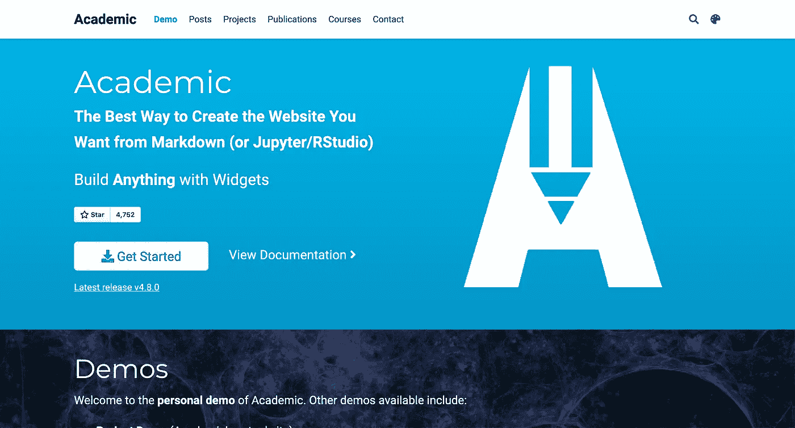
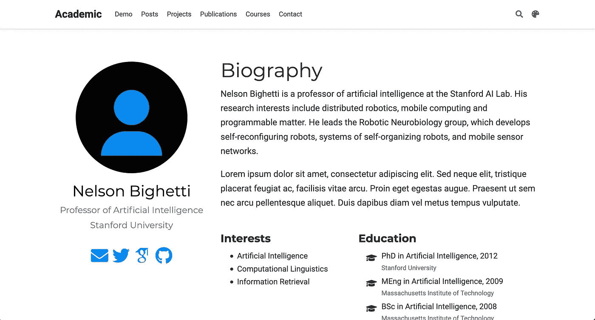
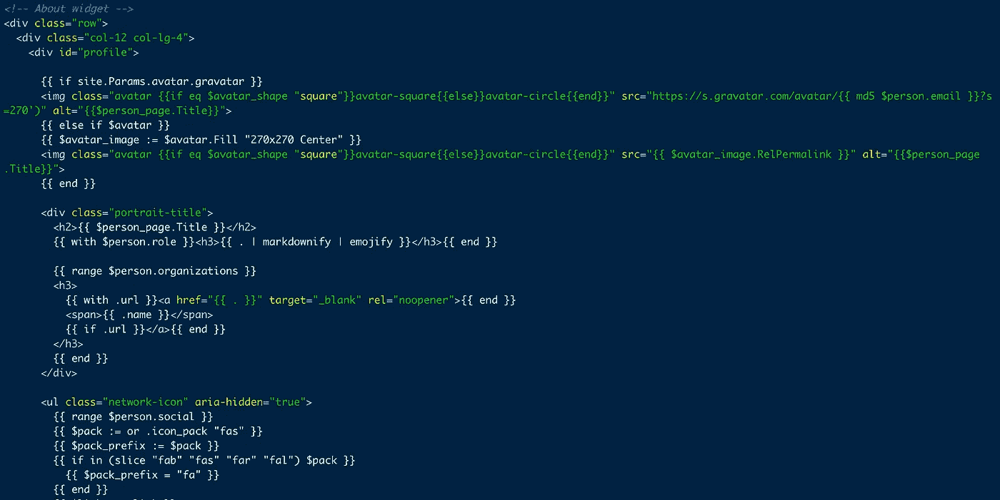
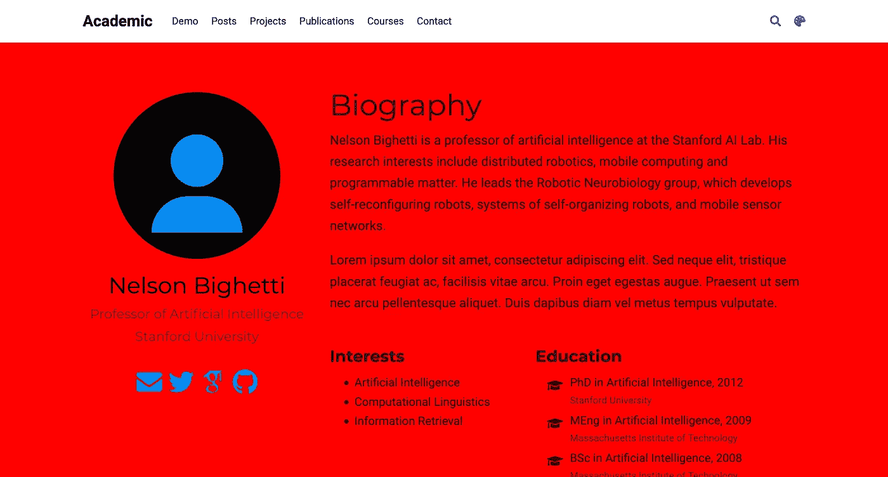
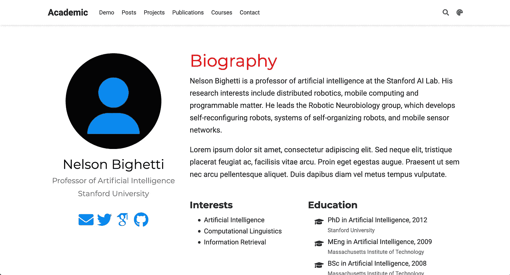
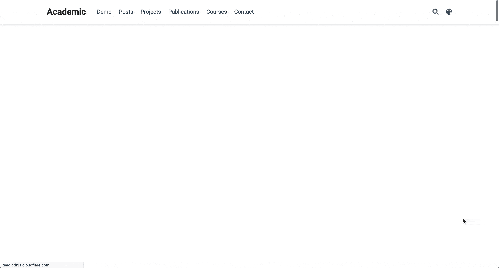
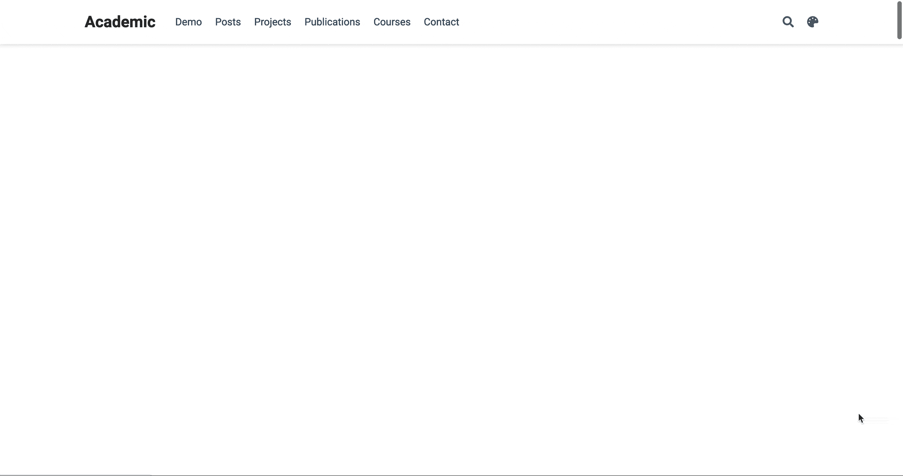
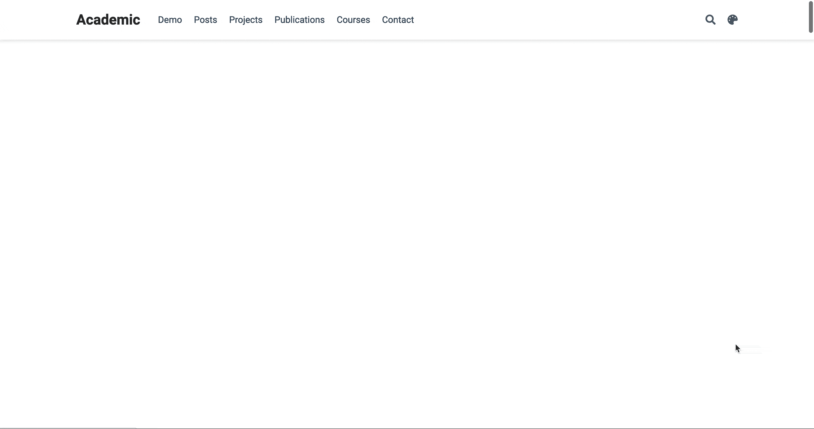
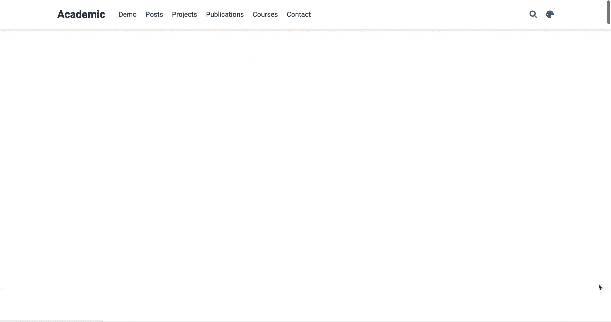
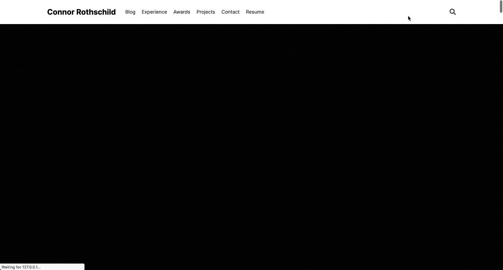

# 轻松地将动画添加到您的 Hugo 学术网站

> 原文：<https://towardsdatascience.com/add-animations-to-your-hugo-academic-site-easily-6aae61b52bd7?source=collection_archive---------43----------------------->

## 使用 blogdown 和 CSS，三个简单的步骤就可以给你的学术主页带来令人印象深刻的动画。

R 包`blogdown`是一个非常强大的工具——它允许不熟悉 web 开发的 R 用户使用他们已经熟悉的语言来构建一个功能齐全、面向内容、漂亮的网站。它建立在 [Hugo](https://gohugo.io/) 之上，Hugo【】自称是世界上“最快的网站建设框架”，它有[多种主题](https://themes.gohugo.io/)适合各种不同的用途。

在 R 社区中，也许最受欢迎的主题之一是[雨果学术](https://themes.gohugo.io/academic/)。顾名思义，这个主题是面向学术界工作人员的——更一般地说，它为那些对在极简网站上展示博客帖子、项目和其他媒体感兴趣的人提供了一个很好的入门工具包。

鉴于其受欢迎程度，Hugo 学术登陆页面实在是太熟悉了。虽然不是没有吸引力，但没有人对标准的学术主页特别惊讶或感兴趣。

给 Hugo Academic 增添趣味的一个方法是在我们的主页上使用动画。在这篇文章中，我概述了三个简单的步骤和几行代码来创建一个功能齐全、动画精美的登录页面。通过利用 Hugo 框架的灵活性，并引入一点 HTML 和 CSS，我们可以将 Hugo 学术主页从零带到英雄(至少在动画方面！).

> 本教程假设你正在从零开始创建一个 Hugo 学术网站。如果你已经有了一个 Hugo 学术网站并正在运行，你应该能够 [*跳过第 0 步*](https://gist.github.com/connorrothschild/bbf0e7530729091592df39166122d135#step-1-create-abouthtml) *并稍微修改剩下的步骤。*
> 
> *它还假设你对 HTML 和 CSS 知之甚少甚至一无所知(这很好！).如果不是这样，你可以直接跳到* [*步骤 3*](https://gist.github.com/connorrothschild/bbf0e7530729091592df39166122d135#step-3-add-css) *。*
> 
> *如果你想跳过本教程，只创建一个 Hugo 学术网站的动画版，请随意使用*[*fork my repository*](https://github.com/connorrothschild/animate-hugo-academic)*，其中包含了制作动画主页所需的所有代码。这个回购包括我的* `[*about.html*](https://github.com/connorrothschild/animate-hugo-academic/blob/master/layouts/partials/widgets/about.html)` [*页面*](https://github.com/connorrothschild/animate-hugo-academic/blob/master/layouts/partials/widgets/about.html) *和一个* [*自定义的 SCSS 文件*](https://github.com/connorrothschild/animate-hugo-academic/blob/master/assets/scss/custom.scss) *！*

# 第 0 步)把你的“关于”页面变成你真正的主页

默认情况下，雨果学术主题的第一部分是一个浮夸的自我介绍(我猜主题的创作者确实值得这样的荣誉)。在我们加入任何动画之前，让我们先把“关于”页面变成用户访问我们网站时首先看到的登陆页面。这要求我们找到文件`hero.md`和`demo.md`，并在每个文件中，设置`active`等于`false`。这是我们的主页:



对此:



(随着您的进步，您可能需要做一些额外的小改动，例如从导航栏菜单中删除“演示”。)

# 步骤 1)创建 about.html

我们流程中真正的第一步是修改 about 页面的默认布局。更具体地说，我们的动画将依赖 CSS 选择器，而我们的 about 页面目前还没有。为了激活某些元素，我们需要唯一的标识符，比如 CSS 类和 id。

为了玩弄我们的 about 页面，我们利用了 Hugo 对结构变化的灵活性。正如他们在网站上所说的:

> *Hugo 允许你用* ***补充或覆盖*** *任何主题模板或静态文件，用你工作目录中的文件。*

为了覆盖 Hugo Academic 的 about 页面，我们需要将他们现有的结构复制到我们自己的文件夹中，并在那里进行修改。为此，导航至`themes/hugo-academic/layouts/partials/widgets/`并复制名为`about.html`的文件。

现在，在名为`layouts/partials/widgets/`的根目录下创建一个新的文件路径。在这里复制你的`about.html`文件。(看着眼熟？我们所做的只是在我们项目的个人版本中重现 T2，从而覆盖了 Hugo Academic 提供的 T3。)

> *或者，你可以复制我在这个项目中使用的 about.html 文件，并将其粘贴到* `*layouts/partials/widgets/*` *。* [*你可以在这里找到我的文件*](https://github.com/connorrothschild/animate-hugo-academic/blob/master/layouts/partials/widgets/about.html) *。这也可以让你跳过第 2 步，进入第 3 步* *！*

# 步骤 2)定制您的文件

随着新创建的`about.html`驻留在`layouts/partials/widgets/`中，你可能会注意到你的主页看起来完全一样。这是正确的！在这一步中，我们将自定义 html 文件，以便它可以被动画化。

在`about.html`中，你会注意到页面的所有元素都是按外观顺序排列的，尽管有很多额外的字符没有多大意义。它应该是这样的:



在整个步骤 3 中，我们将使用每个元素的“类”来定位动画。在上面的截图里(还有在你的`about.html`页面里！)，你会看到分散在各处的班级。尽管学习关于 CSS 和 CSS 选择器的一切已经超出了本教程的范围，我还是推荐阅读一本关于 CSS 中的类和选择器的简单入门，可以在[这里](https://www.w3schools.com/cssref/sel_class.asp)找到。

在这一步中，我们将向想要制作动画的元素添加类。(同样，如果这看起来让人不知所措，请随意复制我的 HTML 文件。具体来说，我们将进行三项更改。

首先，我们将向 h1 (header 1)元素添加一个`biography-title`类。在这里，我们会改变

```
<h1>{{ $page.Title | markdownify | emojify }}</h1>{{ end }}
```

到

```
<h1 class='biography-title'>
{{ $page.Title | markdownify | emojify }}
</h1>{{ end }}
```

接下来，我们需要包装主要内容，也就是页面中间的大文本块，放在它们自己的类中。在这里，我们采取

```
{{ $person_page.Content }}
```

然后用一个`div`包起来，所以看起来是这样的:

```
<div class='main-content'>
  {{ $person_page.Content }}
</div>
```

最后，我们将在兴趣和教育模块中添加一个类。我们可以把这一行:

```
<div class="row">{{ with $person.interests }}
  <div class="col-md-5">
    <h3>{{ i18n "interests" | markdownify }}</h3>
    <ul class="ul-interests">
      {{ range . }}
      <li>{{ . | markdownify | emojify }}</li>
      {{ end }}
    </ul>
  </div>
  {{ end }}{{ with $person.education }}
  <div class="col-md-7">
    <h3>{{ i18n "education" | markdownify }}</h3>
    <ul class="ul-edu fa-ul">
      {{ range .courses }}
      <li>
        <i class="fa-li fas fa-graduation-cap"></i>
        <div class="description">
          <p class="course">{{ .course }}{{ with .year }}, {{ . }}{{ end }}</p>
          <p class="institution">{{ .institution }}</p>
        </div>
      </li>
      {{ end }}
    </ul>
  </div>
  {{ end }}</div>
```

用这个替换它:

```
<div class="row">{{ with $person.interests }}
  <div class="interests-div col-md-5">
    <h3>{{ i18n "interests" | markdownify }}</h3>
    <ul class="ul-interests">
      {{ range . }}
      <li>{{ . | markdownify | emojify }}</li>
      {{ end }}
    </ul>
  </div>
  {{ end }}{{ with $person.education }}
  <div class="education-div col-md-7">
    <h3>{{ i18n "education" | markdownify }}</h3>
    <ul class="ul-edu fa-ul">
      {{ range .courses }}
      <li>
        <i class="fa-li fas fa-graduation-cap"></i>
        <div class="description">
          <p class="course">{{ .course }}{{ with .year }}, {{ . }}{{ end }}</p>
          <p class="institution">{{ .institution }}</p>
        </div>
      </li>
      {{ end }}
    </ul>
  </div>
  {{ end }}</div>
```

> *识别单个元素的类和 id 的快速技巧是使用浏览器的* ***检查元素*** *工具。为此，右键单击您感兴趣的元素，然后单击 inspect element 你会看到一个高亮显示的框，告诉你这个对象的类和/或 ID。有关 inspect 元素和浏览器的更多信息，请参见本页的*[](https://blog.devmountain.com/how-to-use-inspect-element-jump-into-what-makes-a-web-page-tick/)**。**

*现在，我们可以在步骤 3 的漂亮动画中引用现有的 CSS 类和新的 CSS 类了！*

# *步骤 3)添加 CSS*

*现在我们已经创建了我们的类，我们可以在一个 CSS 文件中定位它们，并准确地告诉它们如何制作动画。*

*但是首先，您需要直接在根目录下创建一个定制的 CSS 文件。在你的`assets/`文件夹中，创建一个名为`scss/`的*新*文件夹，并在这个文件夹中，创建一个名为`custom.scss`的*新*文件。*

> **SCSS 文件本质上是一个 CSS 文件，但使用 Sass 进行了扩展，它将* [*本身*](https://sass-lang.com/) *描述为“具有超能力的 CSS”要了解 Sass 的复杂性，比如嵌套选择器，请访问他们的指南*[](https://sass-lang.com/guide)**。***

**在`custom.scss`中，我们将针对我们的“关于”部分中的所有内容*。为了做到这一点，我们创建了一个选择器，它针对的是`about`ID 内的所有内容。***

```
**#about {
  /* Some CSS will go here soon! */
  /* This is a comment, by the way. */
}**
```

**为了确保我们瞄准了正确的部分，我们可以继续将属性`background-color: red`添加到该元素中。顾名思义，这将使✨部分红色。✨**

```
**#about {
  background-color: red
}**
```

**正如我们所料，我们的部分背景现在是(难以置信的难看的阴影)红色。**

****

**(现在立即删除该属性！这不是我们想要的对来访者的欢迎。)我们也可以通过在`#about`中嵌套新的选择器来定位部分中的*元素。例如，如果我们想改变“传记”标题文本的颜色，我们可以用下面的代码来实现。(这是因为我们在步骤 1 中创建了一个名为`biography-title`的类):***

```
**#about {

  .biography-title {
    color: red;
  }

}**
```

****

> ***你可能会注意到* `*about*` *是用磅(#)定位的，* `*biography-title*` *是用句点(.).这就是 CSS IDs 和类的区别。如果你对其中的区别感到好奇，这里有一个* [*有用的指南*](https://www.htmldog.com/guides/css/intermediate/classid/) *。***

**现在我们知道了如何在我们的`about`部分中定位特定的对象，我们可以为我们的第一个元素制作动画了！**

# **步骤 3A)你的第一个动画！**

**创建您的第一个动画就像几行代码一样简单。举例来说，我们将测试一个动画，它将我们的文本从红色不可见变为黑色可见。在代码中，我们必须做两件事:**

**1)用`@keyframes`创建一个动画**

```
**[@keyframes](http://twitter.com/keyframes) yourfirstanimation {
  from {opacity: 0; color: red;}
  to {opacity: 1; color: black;}
}**
```

**2)将动画绑定到元素**

```
**.biography-title {
  animation: yourfirstanimation 5s forwards;
}**
```

**为了分解上面的代码，我们创建一个动画，它有一个*起点* ( `0%`)和一个*终点* ( `100%`)。在这两点上，我们定义 CSS 属性，比如颜色和不透明度，如上所示。当我们将动画绑定到一个元素时，就像`animation: <animation_name> <duration> <fill_mode>`一样简单，CSS 处理所有的中间部分，并自动创建一个平滑的过渡！(填充模式是这三个属性中最复杂的，但是出于我们的目的，我们将一直使用`forwards`。更多信息，请访问[本页](https://developer.mozilla.org/en-US/docs/Web/CSS/animation-fill-mode)。)**

**总之，这段代码创建了以下输出:**

```
**#about {

  [@keyframes](http://twitter.com/keyframes) yourfirstanimation {
    0% {opacity: 0; color: red;}
    100% {opacity: 1; color: black;}
  }.biography-title {
    animation: yourfirstanimation 5s forwards;
  }

}**
```

****

**当然，我们不想要一个 5 秒钟的动画，也不希望我们的文本以红色开始。一个干净的动画可能会利用 CSS 的力量来修改元素的位置。在我们的例子中，我们希望一个元素从屏幕的右侧滑入，所以我们对上面的代码做了一些调整。让我们制作一个名为`slide-from-right`的新动画，它开始于(关键帧 0%)原始位置右侧 150%的元素(因此不在屏幕上)，结束于(关键帧 100%)原始位置。这就涉及到`translateX`的使用，这里你可以读到关于[的内容。](https://developer.mozilla.org/en-US/docs/Web/CSS/transform-function/translateX)**

```
**[@keyframes](http://twitter.com/keyframes) slide-from-right {
  0% {transform: translateX(150%)}
  100% { transform: translateX(0%); }
}.biography-title {
  animation: slide-from-right 1s forwards;
}**
```

****

**我们可以对上面的转换做一点小小的改进。具体来说，我们可以在动画上调用一个*缓动函数*。[缓动功能](https://developer.mozilla.org/en-US/docs/Web/CSS/easing-function)给转场的流程一种更自然的感觉——我们可以通过在转场的不同点指定速度来添加一些个性，而不是让我们的对象以完美的线性速度飞入。要找到一个缓和函数，请访问[easings.net](https://easings.net/en)，它允许你可视化所有不同的方法来修改你的过渡的缓和。(对于本教程，我选择了一个看起来很干净的“ *easeInOutQuint* ”函数，看起来是这样的:`cubic-bezier(0.83, 0, 0.17, 1)`。)**

# **3B)不要等到延误了才行动**

**我们希望我们的主页有不止一个标题动画。我们可能还希望**用我们之前定义的“从右滑动”转场动画制作它下面的段落**。这样做的时候，我们可以向元素添加一个属性，使整个转换看起来更加流畅:`animation-delay`。顾名思义，这个属性定义了浏览器在*开始*你指定的转换之前应该等待多长时间。制作我们的`main-content` div 动画就像复制上面的代码并添加 100 毫秒的动画延迟一样简单。**

```
**.main-content {
  animation: slide-from-right 1s cubic-bezier(0.87, 0, 0.13, 1) forwards;
  animation-delay: 100ms;
}**
```

**结合以上内容，这将创建一个如下所示的过渡:**

****

**不错！看起来很干净。看起来这两个文本块正在竞相迎接你的新网站访问者:)**

# **3C)向左一步！**

**让我们继续在网页左侧复制我们个人资料的“滑入”过渡。您可能已经猜到了，这就像复制上面的代码并将`translateX`中的值从 150%更改为-150%一样简单(从我们网页的右侧之外[到左侧！](https://www.youtube.com/watch?v=2EwViQxSJJQ&feature=youtu.be&t=25))。如上所述，我们将在一个`@keyframes`规则中定义这个转换，然后将它应用到我们的 CSS 转换中。**

```
**[@keyframes](http://twitter.com/keyframes) slide-from-left {
  0% {transform: translateX(-150%)}
  100% { transform: translateX(0%); }
}#profile {
  animation: slide-from-left 1s cubic-bezier(0.87, 0, 0.13, 1) forwards;
}**
```

****

# **步骤 3D)最后，淡化**

**我们页面上唯一没有动画的是“兴趣”和“教育”内容块。当然，你可能不希望这些出现在你的主页上(我的教育之旅还没有强大到足以保证在我的主页上有它自己的部分！).但是为了动画化主页*的默认配置*，让我们继续，一旦滑动过渡完成，让这些内容块淡入*。***

**如果你一直在关注前面的`@keyframes`规则，你可能已经猜到代码会是这样的:**

```
**[@keyframes](http://twitter.com/keyframes) fade-in {
  0% {opacity: 0}
  100% {opacity: 1}
}**
```

**…你是对的！**

**现在，我们将这个`fade-in`规则应用于我们在步骤 1 中创建的`interests-div`和`education-div`。但值得注意的是，我们希望等到我们的内容从网页的任何一边滑入之后，才淡入这些 div。因此，我们将再次使用`animation-delay`属性。因为我们的滑入动画需要一秒钟才能完成，所以我们可以在一秒钟的延迟后开始淡入动画。为了使过渡在视觉上更吸引人，我们也可以错开它们，这样`education-div`在 `interests-div`后半秒*就淡入淡出。***

```
**.interests-div {
  opacity: 0;
  animation: fade-in 1s forwards;
  animation-delay: 1s;
}.education-div {
  opacity: 0;
  animation: fade-in 1s forwards;
  animation-delay: 1.5s;
}**
```

**现在，我们有了一个最终的主页，看起来像这样:**

****

**为了使我们的 SCSS 文件在不同的浏览器中更加健壮，我们可以把我们完成的文件放到 [CSS Autoprefixer](https://autoprefixer.github.io/) 中。这为我们的 CSS 文件添加了额外的代码行，这样所有浏览器在页面加载时都会呈现相同的动画。你完成的 SCSS 文件应该看起来像这样。**

# **扩展动画**

**本教程旨在教你如何制作你的主页动画的要点(对于任何 Hugo 网站，不仅仅是学术网站)。具体来说，你应该能够 1)通过它们的类和 id 创建和识别 CSS 元素，2)使用 CSS 定位它们，以及 3)使用`@keyframes`规则动画化它们。虽然说起来容易做起来难，但是应用这三条规则将会使你的主页对新访问者更有吸引力。**

**CSS 动画的全部力量在本教程中没有涉及。动画的进一步应用不仅仅是制作一个物体位置的动画。我把那留给你！**

**对于那些感兴趣的人来说，我的主页充满了 CSS 属性，这使得它与众不同；有些访问者听说我的网站是雨果学院的网站时感到很惊讶！**

****

**对于那些感兴趣的人来说，我的个人网站的代码(和这个一样，有一个`about.html`和一个`custom.scss`文件来加载)可以在[这里](https://github.com/connorrothschild/connorrothschild.com)找到。我期待看到你的动画主页！**

***感谢阅读。在*[](http://www.connorrothschild.com)**了解更多关于我的信息，或者在 Twitter 上关注*[*@ CL _ Rothschild*](https://twitter.com/CL_Rothschild)*。****