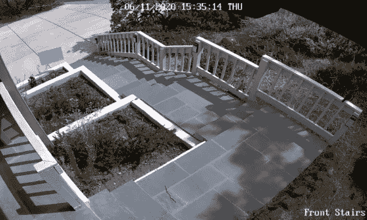
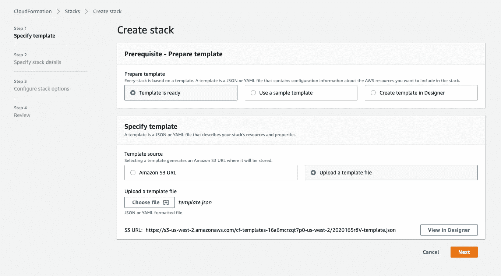
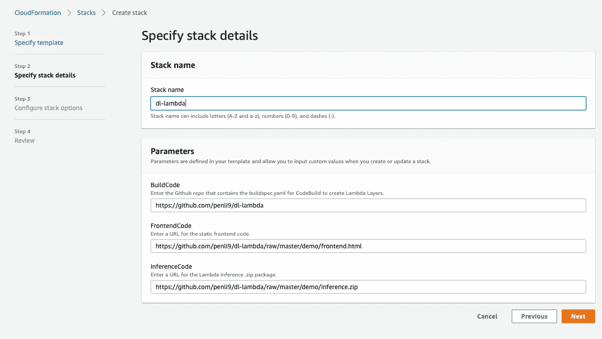
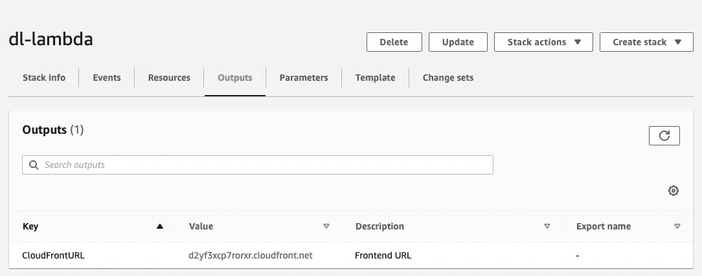
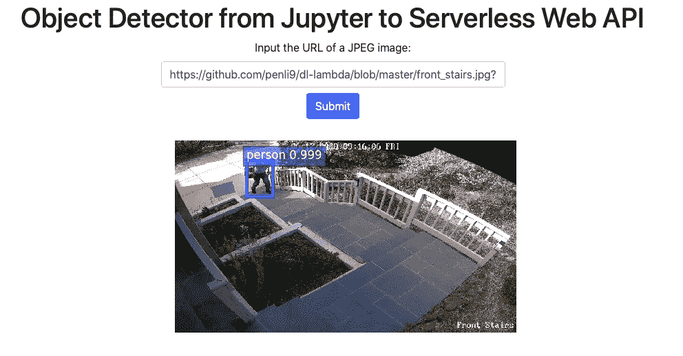
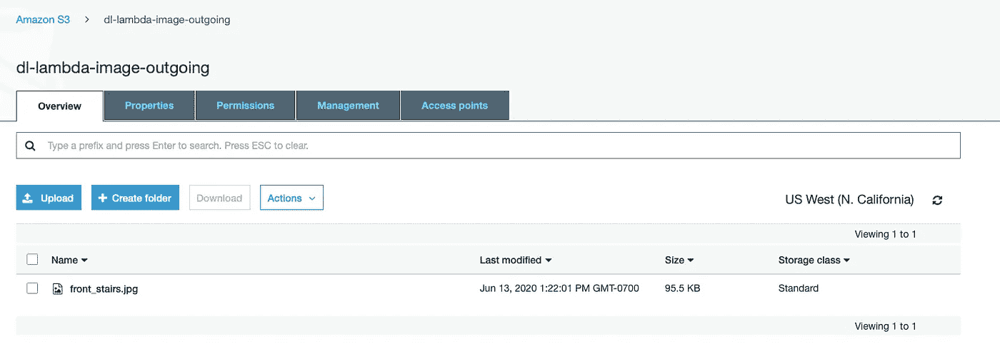

# 为家庭监控摄像机系统添加基于云的深度学习对象检测功能

> 原文：<https://towardsdatascience.com/adding-cloud-based-deep-learning-object-detection-capability-to-home-surveillance-camera-systems-df797a0dd6f?source=collection_archive---------41----------------------->

## 从 Jupyter 到无服务器 Web 应用的实用深度学习

我最近在我的房子周围安装了一个配备了四个摄像头和一个网络录像机(NVR)的监控系统。不幸的是，几乎所有的假警报都是由移动的植物或树影或松鼠触发的。这些警报都不能被系统自带的传统图像处理功能过滤掉。

像大多数深度学习实践者一样，我知道对象检测程序可以过滤掉这些错误警报。但它们要么需要一份昂贵的商业合同，要么需要一台连接我家庭网络的电脑。因为我想保持低成本，拥有一台电脑似乎是正确的选择。然而，这仍然是一笔相当大的初始资本投资，外加经常性的 24/7 电力成本。计算机还需要安装、维护和货架空间。它的风扇噪音或壁橱散热是另一个我不喜欢在家里处理的废话。

大多数假警报只是由移动的树荫和植物触发的。使用传统的图像处理技术，例如调整对比度阈值或设置活动区域，无法滤除这些错误警报

经过进一步研究，我发现使用无服务器 web APIs 是最好的解决方案。它不仅反应迅速，而且根据使用情况收取很少的费用。我还想自己优化深度学习算法，或者为高级深度学习应用重新配置实现。因此，我选择了运行在 AWS 上的 MXNet。这种结合允许使用 Jupyter 进行简单的深度学习代码开发，优化的库性能，丰富的预训练模型，以及强大的开放云基础设施。

以下是我的实现方式。明确地说，我的目标是保持低成本，同时能够使用我首选的对象检测算法。例如，我选择不上传整个视频，然后使用视频识别算法。它会在网络带宽、内存、CPU 和云中存储方面花费更多。

1.  使用系统自带的传统图像处理技术，尽可能减少误报警事件。例如，我屏蔽了花园中的动作，因此只有楼梯上的动作才能触发事件。
2.  一旦事件被触发，就会生成一个视频并存储在 NVR 中。对于我的应用程序来说，大多数视频都在 5 到 20 秒之间。然后视频在本地被处理以生成一些照片，比如说每 10 秒一张照片。
3.  这些照片然后被发送到 AWS 进行物体检测。可以对异议检测的结果进行编程，以触发通知事件，例如向我的手机发送文本消息或简单地将其写入日志。

因为每个安全系统都是不同的，所以在本文中，我只关注如何在 AWS 中设置它。为了演示本文中的功能，我在 CloudFront 中使用了一个 web 接口来从互联网上检索任何图像。一旦接收到图像，它就触发 Lambda 函数调用对象检测代码来处理照片。然后，带有边界框的结果图像被存储在 S3。有关更多信息，请参见[1]和[2]。在 Lambda 上调试几乎是不可能的，所以在移植到 Lambda 之前，我先在 Jupyter 上编写我的对象检测代码。

所有的脚本和代码都可以在 Github 上获得。阅读完本文后，您可以选择通过重用云堆栈来优化您的对象检测代码。或者，您可以根据自己的需求调整云堆栈，从而重用对象检测代码。

你首先需要一个 AWS 账户。要实现本文中的应用程序，它完全属于免费层。登录 AWS 后，进入 CloudFormation 并使用 [template.json](https://github.com/penli9/dl-lambda/blob/master/template.json) 创建一个栈。

在下一个屏幕中，给栈起一个名字(我用的是“dl-lambda”)。CloudFormation 将自动构建云基础架构。

成功创建堆栈后，转到 Outputs，其中的值(在本例中是 d2yf3xcp7rorxr.cloudfront.net 的)是访问 Lambda 函数的 URL。

点击那个，你会来到一个由存储在你的 S3 桶中的 frontend.html 指定的网站 dl-lambda-推论 app-*****。在这张图片中，我的友好的邮递员携带着一个包裹在我的 NVR 上引发了一个事件。因此，我的 NVR 1)存储视频，2)生成照片，然后 3)将照片发送到这个 Web API。

邮差周围具有边界框的照片然后被存储在 S3 桶 D1-λ-图像-输出中。

在我开始之前，我已经用 Jupyter 编写了我的物体检测代码 [dl-lambda.ipynb](https://github.com/penli9/dl-lambda/blob/master/demo/dl-lambda.ipynb) 。为了在本文中保持简单，我使用了来自 Model Zoo 的基于 ResNet 的预先训练好的单镜头多框检测器。然后，我将 Python 代码从 Jupyter 复制并粘贴到 [inference.py](https://github.com/penli9/dl-lambda/blob/master/demo/inference.py) 中，它运行 Lambda 处理函数。请注意，为了便于移植，我已经清楚地标记了代码部分。

dl-λ. ipynb

推论. py

在运行代码几周后，我的 4 摄像头系统甚至在严重优化前每月花费约 2 美元。如果您的成本太高，请使用机器上的图像处理功能来减少误报警事件的数量。增加每张照片的视频时长也有助于减少 Lambda 事件的数量。请注意，您不需要大于 512x512 的图像，因为大多数算法不会使用超过 512 x512 的数据。

以下是下一步的一些想法:

1.  预先训练的模型可以识别数百个物体。对于家庭安全，只有人和车是特别感兴趣的。神经网络的复杂性可以显著降低，从而只关注这两个类别，以节省处理成本并缩短执行等待时间。
2.  显然可以上传视频进行复杂的深度学习视频识别。
3.  分析结果可以存储在数据库中以保存记录。
4.  如果检测到人或车，发送短信。

通过几个简单的步骤，您可以将现成的监控摄像机系统升级到尖端的深度学习功能，同时保持低成本。

参考资料:

[1] Anders Christiansen，将机器学习模型部署为无服务器 API，[将机器学习模型部署为无服务器 API](https://aws.amazon.com/blogs/machine-learning/)(2020)，AWS 机器学习博客

[2] Boris Ivanovic 和 Zoran Ivanovic，[如何用 AWS Lambda 和 Tensorflow 部署深度学习模型](https://aws.amazon.com/blogs/machine-learning/how-to-deploy-deep-learning-models-with-aws-lambda-and-tensorflow/) (2017)，AWS 机器学习博客