# 为 Julia 向我的图形库添加颜色和特性(第 5 部分)

> 原文：<https://towardsdatascience.com/adding-color-and-features-to-my-graphing-library-for-julia-part-5-15426b00dcaf?source=collection_archive---------68----------------------->

## 向我的图形库添加一些非常棒的新功能！

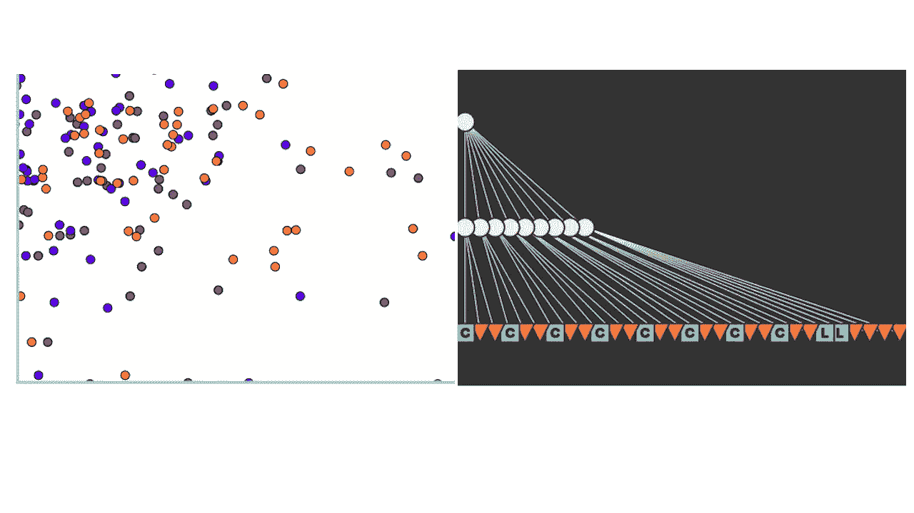

> 第 4 部分(其他部分的链接请点击此处！)
> 
> [笔记本](https://github.com/emmettgb/Emmetts-DS-NoteBooks/blob/master/Julia/Adding%20more%20features%20and%20fixing%20Contexts%20in%20Hone.ipynb)

在我的上一篇文章中，我给我的代码留下了几个明显的问题，最明显的是无法独立地改变组合中任何特定对象的颜色。这是一个很大的缺陷，因为这意味着我因缺乏区分不同数据的颜色而受到阻碍，这也意味着被解析的形状与两个轴的笔画相同，这当然不是最佳的。然而，我确实设法用同一个用户命令让 Julia 的调度程序同时为数据帧和数组工作。

修复这个中风问题是我一直有点担心的事情，因为这将是一项相当不错的工作，但每当最佳改善即将出现时，任何工作都不为过！

# 解决我们的问题

正如我之前可能解释过的，这个问题是由于我们所有的对象都是在相同的上下文中绘制的，并且将通过在组合中创建一个新的上下文来解决。下面是一个包含两个上下文的合成示例:

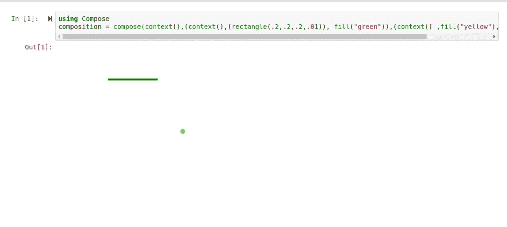

这就是 introspect()方法派上用场的地方。如果我们内省这个组成部分，我们可以清楚地看到我们的两个背景:

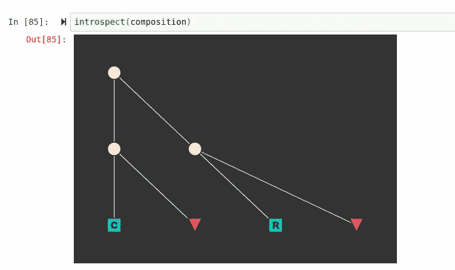

棕褐色的点是上下文点，后面是它们各自的形状，R 和 C 是蓝色的正方形，红色的三角形表示应用于特定上下文中的对象的属性，在本例中，红色的三角形表示 fill()方法。让我们简单地从在原始的 arrayscatter()函数中获取轴和点之间的不同颜色开始。我要做的第一件事是为轴线的新上下文添加字符串代码:

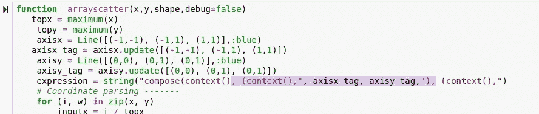

该行之后的第二个上下文用于输入数据。为了完成这个函数，我需要在表达式的末尾添加第二组括号来关闭上下文和 compose 方法。我还擅自将这两个单行 for 循环移到了另一个循环中，这是我一直在拖延的事情，没有什么特别的原因。

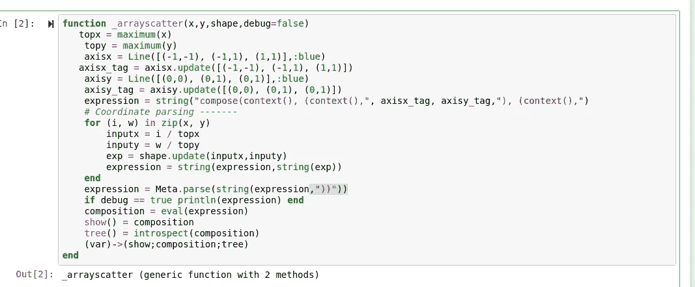

> 现在为 _dfscatter()函数！

这个函数不会像 array scatter 函数那样简单，因为这次我们需要在解析 zip 循环中迭代地添加多个上下文。

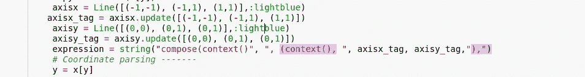

我们要做的第一件不同的事情是，在第一行中，我们不会为新出现的形状创建上下文，因为我们必须遍历不同的数组和形状。相反，我们将只添加一个逗号。

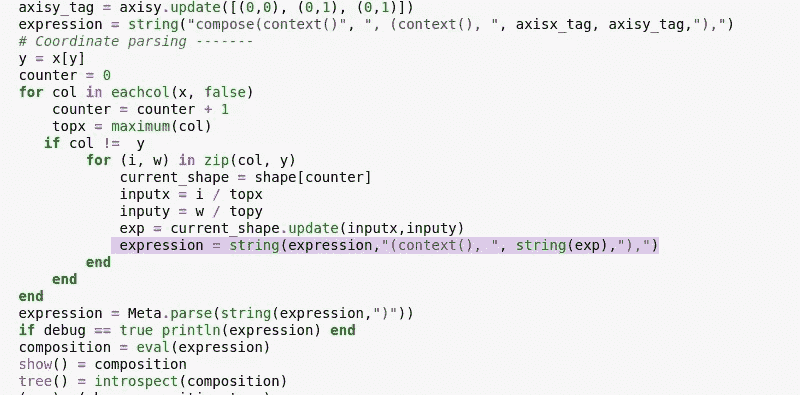

在 zip 循环内部，只需要在表达式之前有一个上下文，在表达式之后有一个括号和逗号，为新的形状添加。接下来，我们需要为正在解析的形状添加一个笔画，以便进行更多的定制。在未来，我可能还会添加笔画宽度。这与最初添加填充的方式完全相同。

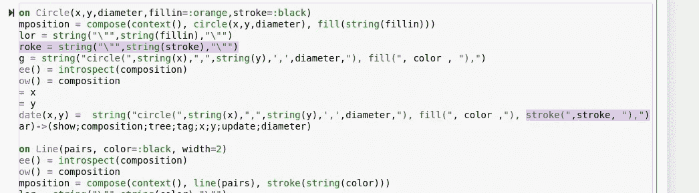

我还为这个参数添加了一个缺省值，这样我们就可以在没有 stroke 请求的情况下得到一个 stroke，这非常简洁。现在把它画出来:

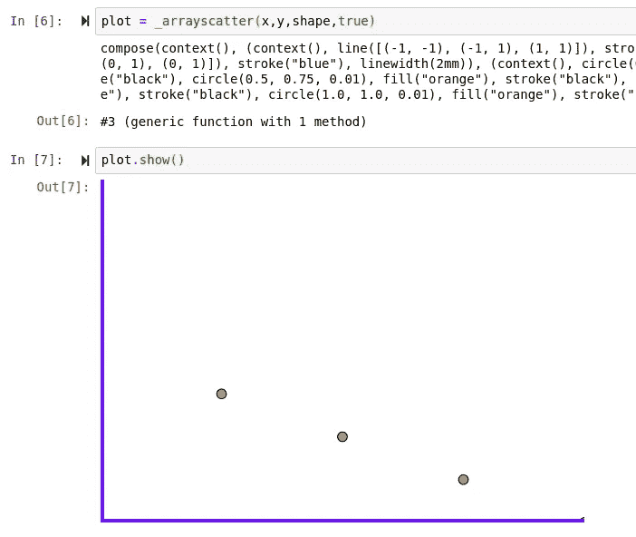

> 有用！

现在让我们测试另一个函数 _dfscatter()。首先，我要用一堆不同的数组制作一个超大的数据帧。

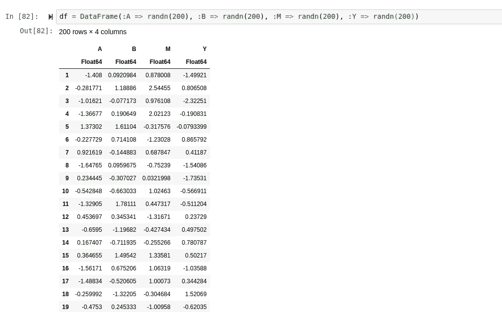

然后，我将创建一个新数组，其中包含函数要接受的形状:

```
shapes = [Circle(.5,.5,.01,:orange),Circle(.5,.5,.01,:blue),Circle(.5,.5,.01,:purple)]
```

插入我们的价值观:

```
plot = Scatter(df,:Y,shapes, false)
```

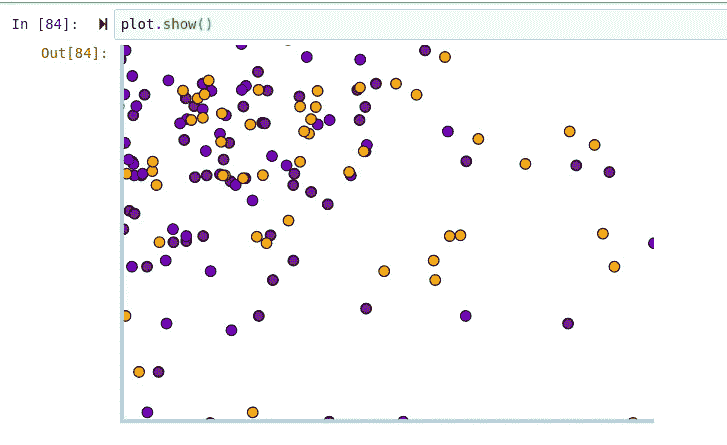

> 看起来棒极了！

只是为了好玩，让我们看看这一个的树！

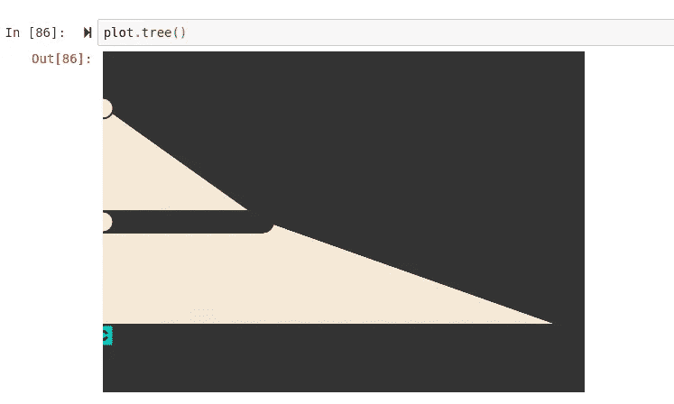

这一定有很多原因，因为很明显自省出了问题！

# 新对象

在上一篇文章中，我添加了一个新的形状，矩形对象，但是在这一篇文章中，我想用网格把它提升一个档次。我对定制网格的有趣方式有一些不同的想法，但我突然想到，我计划实现的一些其他东西将使我的许多想法成为可能，而不需要定制网格。所以我决定让用户加入一定数量的分区。我们能做的是处理除法的数目，简单地用一除以这个数，例如，如果 4 是我们的数，那么我们将得到 0 . 25 这个数。下面是如何翻译成朱莉娅:

```
function Grid(divisions,colorx=:lightblue,colory=:lightblue,thickness=.02)
    division_amount = 1 / divisions
```

接下来，我们需要一个总额为即将到来的循环，我们可以用来创建我们的线。当然，现在这将是零。我们还需要像往常一样创建一个上下文。

```
total = 0
Xexpression = "(context(), "
```

如您所料，接下来我们需要的是一个循环来填充网格中的所有行。为此，我选择了 while 循环。我们可以做的是，为总和小于 1 的情况创建一个 while 循环，并在每次循环时将除法的百分数加到这个数上。我们可以用这个数字来定位，也可以在一定范围内结束循环。这是我想到的:

```
while total < 1
        total = total + division_amount
        linedraw = Line([(0,total),(1,total)],:lightblue,thickness)
        exp = linedraw.update(:This_symbol_means_nothing)
        Xexpression = string(Xexpression,exp)
    end
```

请注意，X 线的位置实际上是在 Y 轴上改变的，但是是在 X 轴上投射的，因此 X 坐标是 0%和 100%。在我们的四个例子中，我之前提到过，我们的除法大小是 25 %,或者说是 0 . 25 的浮点数，我们将把除法的总数加上 0 . 25，然后在 Y 轴的这个位置画一条线到 X 轴的 100%。之后，将添加表达式，循环将再次开始，现在我们的总数增加到. 5，依此类推，直到循环被大于或等于画布 100%的线条打断。

接下来，我们将对 y 重复同样的操作。之后，我们将把它们加在一起，就像我们对最终产品的所有其他函数所做的那样，最终产品看起来像这样:

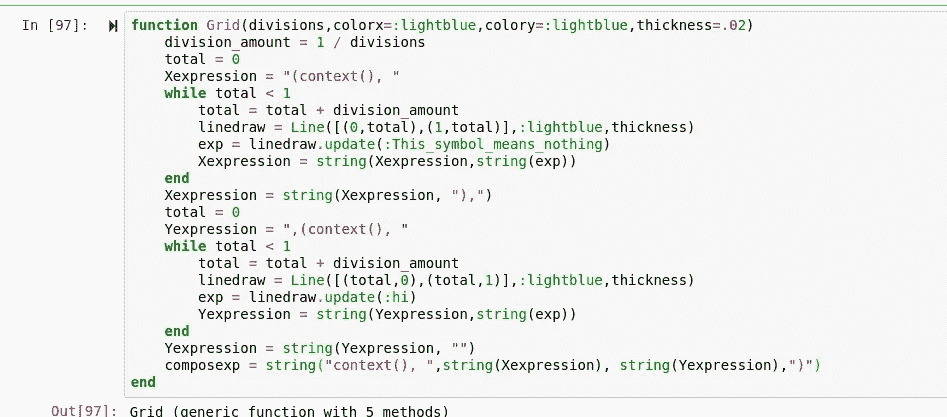

还有一件事要做，就是在底部添加我们的类型 return，以及我们的 update 方法来返回一个标签。

```
update() = string(composeexp)
(var)->(update;composexp)
```

为了测试它，我们只需将标签添加到数组散布函数的开头。

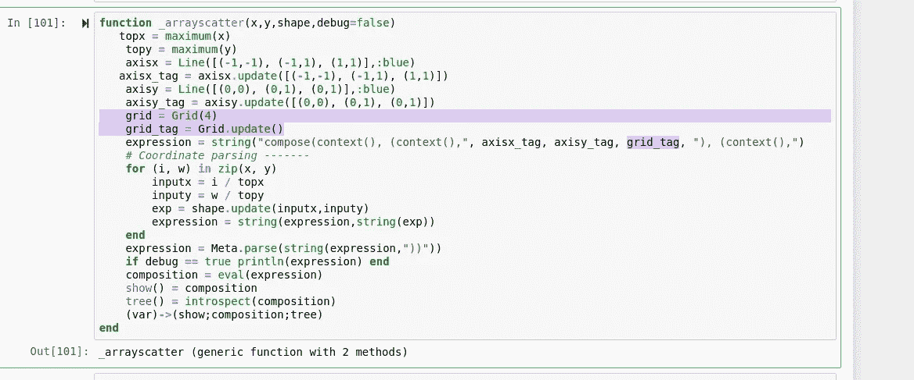

现在测试一下:

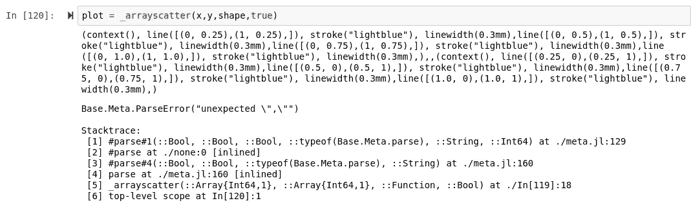

> 没用。

奇怪的是，这返回了一个解析错误，因为在 Line 对象中使用了正则表达式…这很奇怪，因为 _arrayscatter()函数在使用相同的精确对象和相同的精确表达式时工作得很好，所以这让我有点困惑。正如你所看到的，我也打印出了表达式，表达式看起来很完美，所以我真的不确定问题可能是什么。虽然这可能是一个相当严重的问题，但我确信我们可以在下一篇文章中解决它，但是现在让我们继续

# 自定义标签支持

这是我一直想补充的有趣的东西。这将为 Hone 使用自定义元信息执行命令的扩展打开大门。虽然这听起来非常不安全，但重要的是要记住语法必须符合上下文及其语法的范围，因为 Julia 仍然需要解析代码。此外，我不认为任何人应该担心绘图模块中的漏洞，它可能主要用于笔记本电脑内部。这很容易添加，只需修改分散函数的参数，在坐标解析之前将其包含在表达式中:

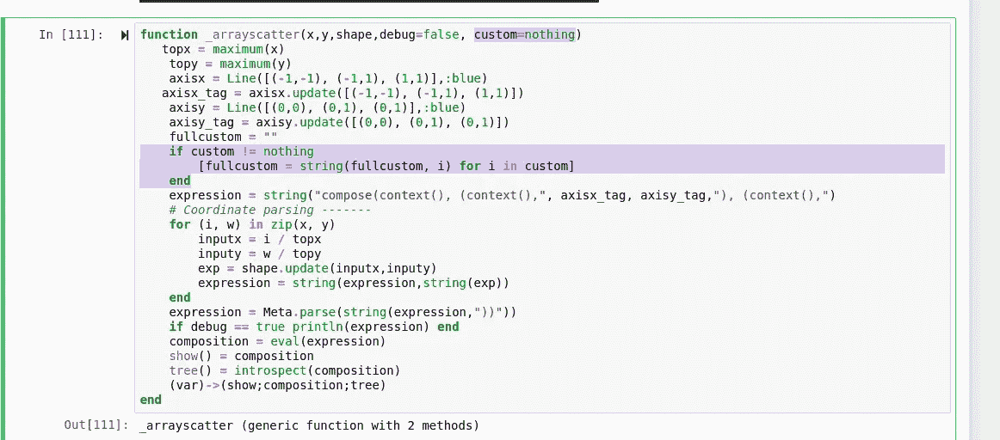

> 轻松点。

# 结论

好消息是坐标解析器和调度都工作得很好，实际上性能甚至更好。坏消息是，由于这个奇怪的正则表达式问题，我无法创建网格。我谈到的最后一件事实际上是我真正感到兴奋的事情。自定义标记将允许用户自定义他们自己的扩展并共享它们，它是一个绘图软件，相当于在视频游戏中包含一个地图编辑器。我肯定会在未来对此进行演示！