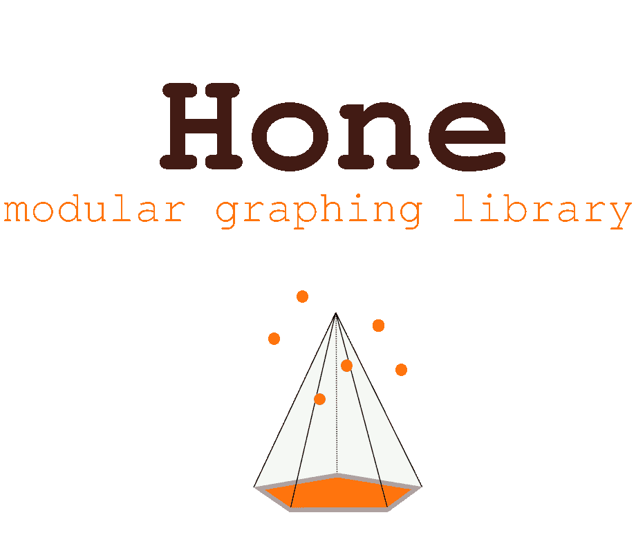
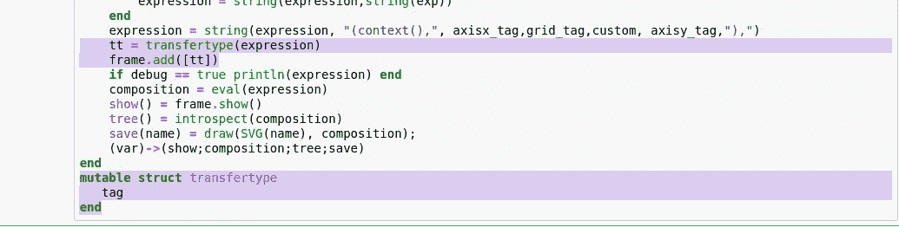

# 向我的模块化图形库添加控件

> 原文：<https://towardsdatascience.com/adding-control-to-my-modular-graphing-library-2c5424a8d3b7?source=collection_archive---------61----------------------->

## Hone.jl

用控件表单扩展 Hone.jl 的可用性。



> [上一部分](https://medium.com/me/stats/post/15426b00dcaf)
> 
> [笔记本](https://github.com/emmettgb/Emmetts-DS-NoteBooks/blob/master/Julia/Hone%20Grid.ipynb)

如果您一直在关注 Hone.jl 的开发，这是一个模块化的、面向对象的图形库，可以有效地在静态类型语言中隐藏类型，那么您可能还记得我上次离开时留下的问题…每当解析新网格对象的连接表达式时，都会返回意外的\ "，\ "错误。最初，我认为这可能是我用来在表达式中生成字符串的正则表达式的问题。


这实际上非常令人沮丧，花了整整半个小时才解决，但这不一定是我的错——嗯，是我的错——我实际上错过的是错误中间的`,`。我对正则表达式字符串分隔符的使用无疑使错误变得有点混乱。幸运的是，缺少逗号是一个非常

> 解析字符串时经常出错。

现在创建我们的网格对象:

```
h = Grid(4)
```

并调用 Grid.show()方法:


> 太棒了。

现在我们只需要把它加到我们的散射函数中。这就像创建网格并将其标签添加到散布函数中的表达式一样简单。下面是当一个数组被传递时分派路线的功能:


我认为将网格作为一个对象而不是一个细分量添加到参数中是最优雅的，这样可以使模型的其他部分与方法论保持一致。现在我们创建一些无意义的数据:


> 嘣！
> 
> 我们有网格了！

我想实现的下一件事是保存渲染的矢量图形的能力。为此，我在 Hone 的所有对象函数中添加了一个新的方法定义:

```
save(name) = draw(SVG(name), composition);
```

然后将其添加到我们类型的导出数据和方法的长列表中:


现在，无论何时用字符串调用 save()方法，都会保存一个本地 SVG 文件，

> 酷！

## 速度恶魔

我的长期读者可能知道，我喜欢速度。我决定(再次)测试 Plots.jl 的速度。


> 5 秒 4.11 M 分配！

这还不算太坏——所有必需品都考虑在内。但是 Plots.jl 如何与之抗衡呢？


> 一些观察结果:

*   Hone 需要更多的内存来渲染图像。这可能部分是由于元表达式，部分是由于矢量和光栅化图像渲染之间的差异。
*   Plots.jl 的加载时间与地块本身的加载时间大致相同，总共约为 15 秒。
*   剧情。JL 平均要慢 2 秒左右
*   他们的情节比我的更漂亮，因为我还没有添加一些突出的特征，比如传说。

# 控制

对于在 Hone 中实现控件表单，我有一些有趣的想法。这将允许更多的图形绘制，以及增加边距和改变个别上下文的分辨率。这是我开始使用的函数:

```
function Frame(width,height,m_left,m_right,m_top,m_bottom)
    tag = string("context(UnitBox(0,0," ,width,",", height, ",",m_left, "", m_right,
    ",",m_top, ",", m_bottom,"))")
    add(obj) = tag = string(tag,obj)
    show() = exp = Meta.parse(string("draw(SVG('c'),",tag, "))"));eval(exp)
    save() = draw(SVG(name), eval(tag))
    (var)->(add;show;tag)
end
```

然而，这个函数有几个基本问题。最重要的是，不涉及任何组合，这意味着在向表单中添加对象后查看表单是不可能的。另一个问题；add 函数只能在整个函数处理完之后调用，如果我们要添加 compose 方法，设置标记的第一行如果没有括号就无法解析。这有点自相矛盾，因为您需要创建对象来添加它，但是如果没有来自对象标签的右括号，您就不能创建对象。考虑到这一点，我重新编写了函数:

```
function Frame(width, height, lm, rm, tm, bm)
    base = string("compose(context(units=UnitBox(0,0,",
    width, ",",
    height, ",",
    lm, ",", rm,",",
    tm, ",", bm,
        ")),")
    objects = []
    composition = nothing
    add(objects) = composition,objects,tag = _frameup(base,objects)
    show() = composition
    tree() = introspect(composition)
    save(name) = draw(SVG(name), composition)
    (var)->(add;show;tag;base;objects;composition;save;tree;width;height)
end
```

这一次我决定创建一个名为“objects”的 iterable，它将把我们所有的 Julia 类型存储在一个我们可以循环访问的数组中。我所做的一个重大改变是添加了 compose 方法和 _frameup()方法，这将为我们返回解析后的组合、对象和元标记。


这个函数本身相当简单，尽管它的返回列表很长。首先，我们在一个迭代循环中添加每个对象的标签。这个循环肯定不是我喜欢的方式，可以缩短为

```
tag = [string(tag,object.tag) for object in objects]
```

无论如何，之后，我们为 compose()方法添加括号，然后解析标签并在最终返回之前创建一个组合。

现在我们有了 add()函数和一个操作框架，接下来要做的是修改我们的散布函数，使其适合框架，而不是停留在没有参数的上下文中。我首先用默认框架向我的函数添加了一个参数:


现在我们可以在 Frame 上使用 add 方法——哦，等等，我们不能。在我们可以渲染我们的框架之前，还有一个重要的问题。_frameup 函数调用要传递的对象的标记，但是我们的对象在技术上确实具有属性“tag”，但是我们无法在创建对象的同时传递带有子“tag”的对象。为了解决这个问题，我简单地添加了一个名为“TransferType”的随机结构来保存子标签。我们可以快速构造这个类型，并把它放入函数中，就像它是我们的散射对象一样。



现在我们将再次填充我们的函数:

```
plot = _arrayscatter(x,y,shape)
```

当我们调用 show()方法时:


如果你仔细看左上方，

> 那是我们的散点图！

所以很明显，伸缩将会是一个痛苦的问题，我将不得不尽快处理，并且我可能会对库增加更多的控制。很多事情进行得特别顺利，但也有很多事情进行得相当糟糕——但总的来说，我认为这个项目进行得很好。关于 Hone.jl 的伟大之处在于，一旦我完成了基本方法，渲染任何东西都会变得非常容易。好消息是:这些更新已经被推送到 Github 上的 0.0.2 分支:

[](http://github.com/emmettgb/Hone.jl) [## emmettgb/Hone.jl

### 模块化的形状，网格和线条容易预制快速绘图简单和轻型车床集成(即将推出)…

github.com](http://github.com/emmettgb/Hone.jl) 

更好的消息是，我刚刚向 master 推送了车床 0.1.0 版本！0.1.0 中有很多很酷的特性，比如幂逻辑、实验性的基于网格的卷积神经网络，当然还有一些更棒的东西！车床很快就要和 Hone 交织在一起了，所以这肯定是令人兴奋的。Hone 和车床的一个显著优点是我可以使用 Hone.jl 而不用接触它的代码库。

 [## 车床

### 车床使用更快的方法和简单的方法。使得包装快速、简单且轻便。许多工具和模型…

车床. ai](http://lathe.ai) 

如果您还记得，我添加了一个参数，用于将自定义元标签插入到 Hone 对象中，因此将它与机器学习的元素结合起来肯定会很有趣。一个很好的例子就是置信区间，我不需要把它们编程到 Hone 中，我可以用这种方式为使用车床的 Hone 编程一个扩展。