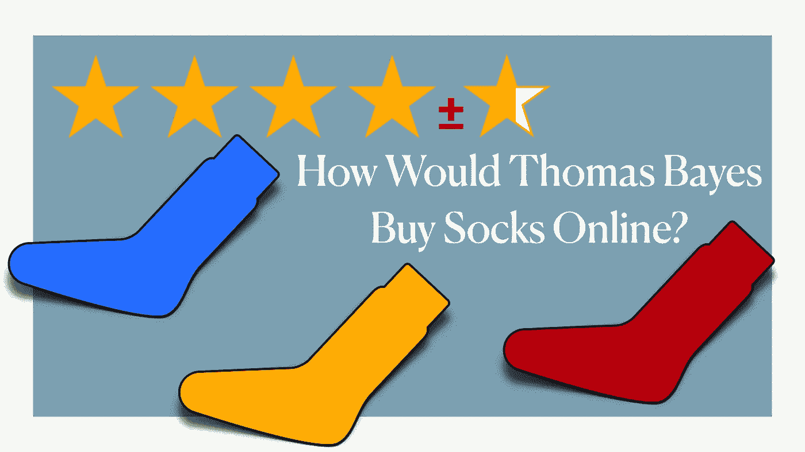
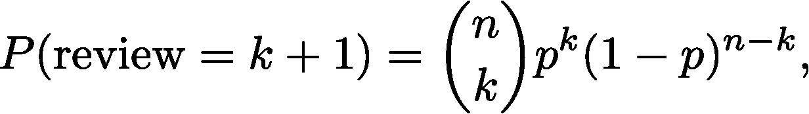
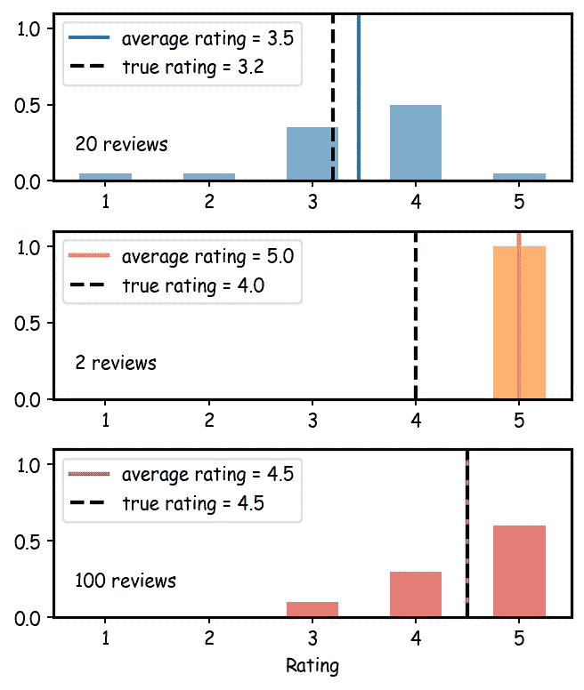
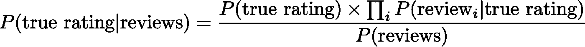
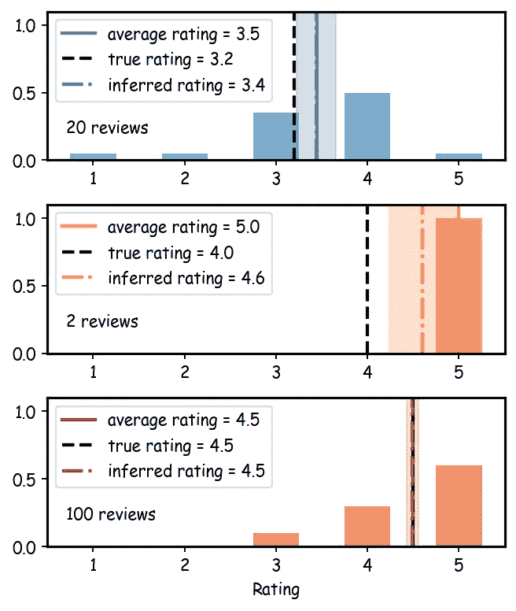
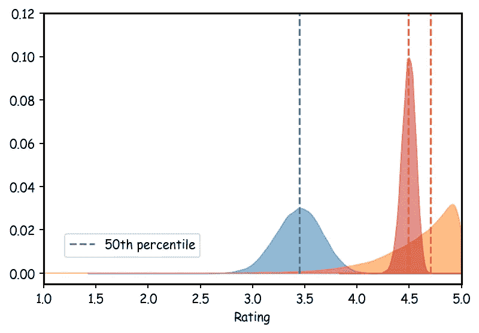
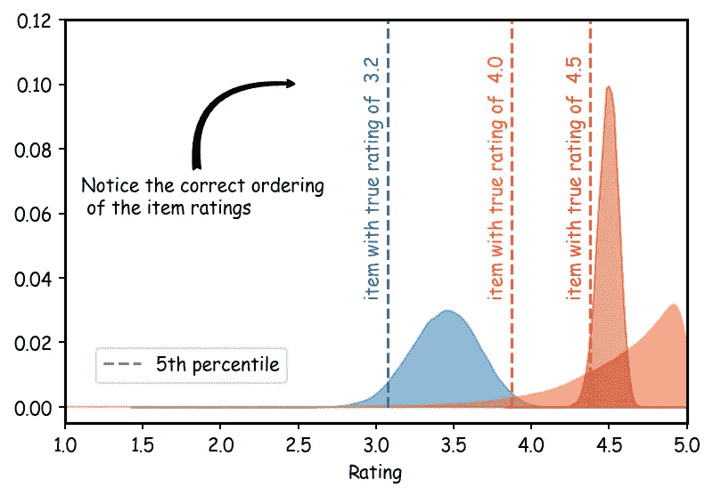

# 给五星评论添加误差线:贝叶斯方法

> 原文：<https://towardsdatascience.com/adding-error-bars-to-5-star-reviews-a-bayesian-approach-d6fef78b3382?source=collection_archive---------56----------------------->

*使用 PyMC3 为🧦挑选合适颜色的袜子*

当你在网上购买一双新袜子时，你自然会寻找评论分数最高的那双。在你的搜索查询中，你经常会看到⭐⭐⭐⭐⭐对️️️️show 的 5 星级评价。但是你有多愿意买一双只有两个用户 5 星评价的袜子呢？你会从 100 个评论中平均 4.5 星的一双中挑选吗？也许不是，但为什么呢？虽然你知道 5 肯定是大于 4.5 的，但是只有两个评价就有些让你犹豫了。

当评论数量很少时，你完全有理由怀疑评级的有效性。这些评级只是一个没有任何统计不确定性的数字(平均值)。如果我告诉你我的两个堂兄弟的平均身高是 3 英尺 5 英寸(约 100 厘米)，这并不能告诉你太多。是两个身高一样的学龄前儿童，还是一个篮球冠军，一个学步？少量观察值的平均值通常没有那么多信息，因为它们可能带有巨大的不确定性。

这种情况有点类似于两个 5 星评论，但有一种方法可以补救。除了平均值 5，我们还知道分布情况(想想评论的直方图)。这篇文章的目标是展示如何使用 [**贝叶斯统计**](http://www.scholarpedia.org/article/Bayesian_statistics) 我们可以翻译评论的数量，或者更准确地说它们的分布，来推断真实评级的不确定性。你是否需要买一双新袜子，不知道两个 5 星评价的物品你能信任多少？在这里，我们将了解如何将错误栏附加到这些评论上，并使用它们来对搜索查询中的各种评论进行排名。

*注意:此分析范围有限，应被视为贝叶斯推理中的一个完全理论性的练习。分析中的一个主要假设——所有的评论都是诚实的——在大多数现实生活中显然是不成立的。*

用于产生结果的所有代码都可以在这个[笔记本](https://github.com/syasini/5star-reviews/blob/master/5star_reviews.ipynb)中找到。

# 模型

我将把每篇评论建模为一系列抛硬币的过程——毕竟这是一篇关于统计的文章！

为了清楚起见，我将使用单词 *review* 来表示产品的个人评分，使用单词 *rating* 来表示所有用户评论的平均值；个人评估分数可以是 1 到 5 之间的整数(例如 3 或 4)，但评级可以是同一范围内的实数(例如 3.8)。根据[大数定律](https://en.wikipedia.org/wiki/Law_of_large_numbers)，观察到的评分应该收敛到产品的*真实评分*。显然，这里我做了一些隐含的假设，即(1)项目有一个真实的客观评级(基于质量，价格的公平性等。)和(2)所有用户评论都是诚实的；后一种假设显然不适用于大多数现实生活中的评论，这些评论可能包含付费评论或虚假评论。

回到模型:让我们假设每个顾客用四次投掷有偏向的硬币来决定袜子的评价分数。每次硬币正面着地，就会增加一颗星，如果硬币反面着地，就不会增加一颗星。产品越好，硬币 *p* (人头概率)的偏差越高。

为什么是四次而不是五次？这些商品的最低评级是一星(我们没有 0 星评论)，所以我们只有四次抛硬币的机会。观察到的人头数加 1(第一枚硬币)的总和给出了袜子的最终审核分数。例如，序列 H，T，H，H 相当于一个 4 星评论，而 T，H，T，T 的结果是 2 星。在此模型中，每次审核本质上都是二项式过程的结果，其中结果的概率可以用[二项式分布](https://en.wikipedia.org/wiki/Binomial_distribution)表示为

情商。一

其中 *p* 为硬币的偏向， *n* 为总翻转数(此处为 4)，而 *k* 为观察头数。添加 k +1 中的 1 是为了固定从 1 开始而不是从 0 开始的评定等级。该模型中的关键假设是硬币的偏差 *p* 与产品的真实评级相关，因此 *p=0* 总是导致硬币落在尾部，或者等同于 1 星评级(糟糕的产品)，而 *p=1* 总是导致正面，这意味着 5 星评级(令人敬畏的产品)。同时， *p=0.5* 导致平均每次投掷两个人头，对应于 3 星评级(平均产品)。为了从数学上安慰自己，你可以使用二项分布 *np* 的平均值，对于 *p = [0，0.5，1]* 分别产生 1、3 和 5 个评级(我在这里添加了额外的 1)。让我们使用一些 python 代码来证实这一点:

太好了！现在我们可以使用这个模型生成一些模拟数据来玩。在我们继续之前，我将定义一个 scaler 对象，它将等级转换成概率，反之亦然。我们的可观察值是范围在 1 到 5 之间的评级(评论的平均值)，但是我们最终会对范围在 0 到 1 之间的概率 *p* 进行推断。因此，有一种简单的方法在这两者之间来回转换是很有用的。

# 数据生成:模拟袜子评论

既然我们有了评级的生成模型，我们可以用它来生成模拟数据。为了模拟每个产品的评论，我们需要的是评论的数量和项目的真实评级，这决定了硬币的真实偏差 *p* 。每次回顾都是四次(有偏向的)掷硬币所观察到的正面之和，所以我们需要做的就是从带有参数 *n=4* 和 *p=scaler.r2p(真实评级)*的二项分布中抽取随机数。

让我们按照这些步骤来生成一些模拟袜子评论！为了简单起见，我将创建一个 Sock 数据类，它有三个主要属性: *n_reviews、true_rating* 和 *color* 。

酷！现在，假设菜单上有三种不同类型的袜子:蓝色、橙色和红色。

我对这些项目的真实评分为 3.2、4.0 和 4.5，即蓝色的袜子很好，橙色的很好，红色的很棒！作为一个买袜子的人，我们的目标是买到我们能找到的最好的袜子，但问题是这些商品的真实评级是不可见的。我们唯一能观察到的是真实评级的统计估计，也就是平均客户评级。如果我们有很多评论，平均评级是真实评级的一个很好的估计，但如果我们没有呢？

在本例中，我们假设橙色袜子(4.0 颗星)客观上不如红色袜子(4.5 颗星)，但想象一下，出于某种原因购买橙色袜子的仅有的两名顾客对他们的购买超级兴奋，并决定给它 5 颗星(这意味着他们所有的硬币随机落在头上)。在这种情况下，平均评分 5(我们看到的)将大于真实评分 4.0(我们看不到)。因此，仅通过比较平均评级，我们会得出橙色对优于红色对的错误结论。

为了模拟这一点，我将作弊并选择随机数生成器的种子，以便橙色袜子的两个评论最终都是 5 星(这已经在 Sock 数据类中实现)。让我们快速浏览一下所有评论的归一化直方图。

虚线是潜在的真实评级，实线是所有评论的平均值。请记住，不受随机性影响的真实评级是*不可观察的*。这里的目标是挑选一双真实评分最高的袜子。从图中可以看出，如果我们按照最高的平均评分选择橙色对，那我们就犯了一个错误，但是我们如何调整我们的指标来选择正确的颜色呢？

# 贝叶斯推理

也许并不奇怪，我将使用贝叶斯定理来推断袜子的真实评级，使用观察数据作为证据。我们希望在给定所有用户评论的情况下，找到每个产品的真实评级:

情商。2

右侧分子中的第一项是先验(我们对真实评级分布的初始信念)，第二项是可能性。为了保守起见，我们可以使用一个平坦的先验评级，也就是说，我们假设*在看到任何评论*之前，袜子有 1 到 5 颗星之间的任何评级的可能性是相同的。每个单独审查的可能性是一个二项分布，如等式所示。1，因此为了构建完全可能性，我们只需要用观察到的评论分数替换每个 *k* ，并将所有内容相乘。请记住，硬币的偏差 *p* 之间存在一对一的映射关系(参见等式 1。)和真实评级(等式。2)我会交替使用它们。

为了找到每个项目真实评分的概率分布，我将使用 PyMC3 对它们的后验概率进行采样。下面的函数接受 Sock 对象的一个实例，并从等式的后半部分返回 MCMC 样本。2.查看 PyMC3 如何工作的细节超出了本文的范围，但是如果有任何困惑，请在评论部分提问或在 [Github Repo](https://github.com/syasini/5star-reviews) 上发布问题。

*注意:在上述函数的先验部分，我使用了一个* [*Beta 函数*](https://en.wikipedia.org/wiki/Beta_distribution) *符号来描述 p 的平坦先验，因为 Beta 是二项分布的* [*共轭先验*](https://en.wikipedia.org/wiki/Conjugate_prior) *。这在技术上是不必要的，因为我们没有用分析的方法解决这个问题，但我还是做了，所以我可以写下这个小纸条！*

现在让我们对所有袜子的后验样本进行抽样，并找出概率分布的平均值和标准差。

现在除了平均值，我们还有一个标准差！我们可以将其作为误差线添加到原始直方图中(这里我有点粗心，只是在平均值周围添加了标准误差，严格来说，这对于非正态数据是不正确的)。它看起来是这样的:

正如所料，评论数量较多的袜子误差较小。非常有趣，但可能不如我们希望的那样信息量大。只有 2 个评论的橙色袜子的推断评级仍然大于有 100 个评论的红色袜子的推断评级。那我们怎么挑选正确的一对呢？

让我们检查一下后验概率的 KDE，看看分布的实际形状。该图显示了每一对真实评级的后验概率，即:我们对评级可能是什么的初始信念(在这种情况下，所有评级的均匀概率),基于用户评论观察的可能性(等式 1 的二项式可能性)进行更新。1).

这里我们来做几点观察。提醒一下，真实评分为(3.2，4.0，4.5)的(蓝色，橙色，红色)袜子各有(20，2，100)条评论。首先，我们看到后验 pdf 的宽度与每个项目的评论数量成反比:我们的评论越多，我们对真实评级的最终估计就越不确定。第二，蓝色和红色 pdf 的峰值非常接近真实的评级，但是对于橙色的一对就不那么接近了。这是有意义的，因为对于橙色袜子，我们只有 2 个观察值，这不是很有限制。橙色的长尾理论承认了一个事实，那就是它对最终结果非常不确定。但是，它仍然给我们提供了我们在分析中寻找的信息。

如果不使用后验平均值(第 50 个百分位数)来对袜子进行排序——正如我们在第二个图中所做的那样——我们使用第 5 个百分位数会怎么样？通过这种方式，我们可以 95%确定真实评级高于这个数字。根据这种排名策略，如果袜子的评级较低，或者评论数量较少——这意味着分布中的尾部较宽——它们将在列表中排名靠后。对我们的后验 pdf 使用第 5 百分位导致以下排序:

瞧啊。

就是这样…现在我们已经在袜子评论中添加了误差栏，我们可以放心地购买最好的一双了。这肯定是托马斯·贝叶斯牧师会做的！

***重要提示*** *:不要试图在现实生活中实现这种分析。仅仅根据这一分析结果购买的袜子或其他类型的内衣可能与你衣服的其他部分不相配。*