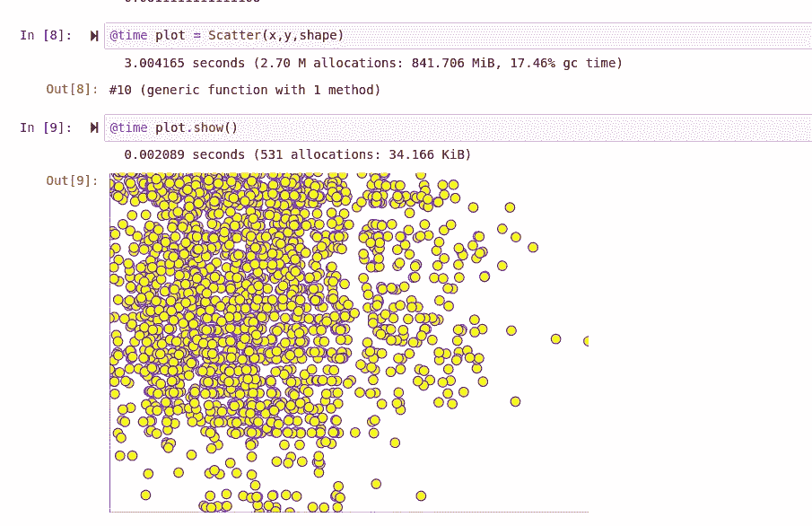
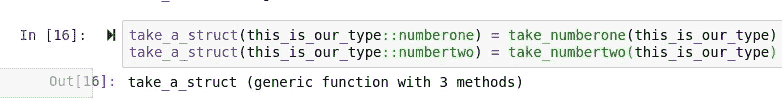

# 将 Julia 的多态分派添加到我的绘图库中(第 4 部分)

> 原文：<https://towardsdatascience.com/adding-julias-polymorphic-dispatch-to-my-plotting-library-part-4-1446e924774f?source=collection_archive---------62----------------------->

## 方法论之争！

> 第一部分
> 
> [第二部](/metaprogramming-a-graph-class-in-julia-90a90e8ab45b)
> 
> [第三部](/introducing-hone-a-modular-object-oriented-graphing-library-for-julia-823b028b462a)

> [笔记本](https://github.com/emmettgb/Emmetts-DS-NoteBooks/blob/master/Julia/Adding%20polymorphism%20to%20Hone.ipynb)

在之前的文章中，我创建了一个坐标解析器和一个功能上面向对象的(我意识到这听起来有多疯狂)系统，用于将元数据从对象传输到最终的对象，看起来有点像这样:



从那时起，我只改变了模块整体的一个方面。该模块现在导出函数，而不是包含来自其他模块的函数。因此，现在使用模块的方式与在笔记本中使用代码的方式相同，例如:


相对于:


但做完这些出口后，一个想法闪过我的脑海。显然我们可以画出一个 X 和一个 Y，但是对比数据呢？毕竟，大多数情况下，您需要散点图来比较多个 X 的一些数据，而不仅仅是可视化单个 X 的位置。为了改变这一点，我计划利用 DataFrames，因为 Lathe 已经作为一个依赖项添加到 Project.toml 而且 Lathe 有 DataFrames.jl 作为依赖项，这意味着任何使用 Hone 的人很可能已经在他们的计算机上安装了 DataFrames。

有两种主要的方法可以解决这个问题。一种方法对最终用户来说不是最佳的，但却容易得多。然而，另一种方法会更困难一点，但从长远来看会使方案更好。我决定选择第一种。

> 我开玩笑的…

通常，在类似的编程语言(如 R 或 Python)中，我们必须用条件来检查进入函数的类型，例如:


这没什么大不了的，这让我想起了主循环事件编程，在那里你必须不断地检查标志的条件来执行任何事情，否则，它将在处理器的每个时钟周期执行，这有点滑稽。幸运的是，既然我们是用 Julia 编程，我们可以做得更好。我们可以通过使用 Julia 的多重分派来做到这一点，我们可以从编写两个需要处理两种不同类型的函数开始。


现在我们只添加这两行简单的代码，将这些方法作为结构的属性来应用:



现在我们用两种类型来称呼它:


> 这些函数根据类型相应地运行。

我们可以将这个想法应用到 Hone 中，制作一个新的分散函数来处理数据帧而不是数组。我把我们旧的 Scatter 函数重命名为 _arrayscatter，我们的新函数将是 _dfscatter。出于个人偏好，我使用这种带有下划线的命名方案，因为它有助于区分最终用户功能和用户永远看不到的后端功能，尽管这不是必需的，但我认为保持一致很重要。


现在我们只需添加我们的调度行:


注意，我必须首先将 DataFrames.jl 加载到会话中，才能使用 DataFrame 类型。另一件要注意的事情是，Y 的类型断言是 Symbol，而不是您可能期望的 Array，这是因为我们假设我们要用作 Y 的数组在数据帧内部，所以我们可以这样调用它:

```
x[y]
```

> 奇怪的是。

现在我们可以构建一个数据框架来证明一切都在正常运行:

```
df = DataFrame(:one => [1,5,2,3], :two => [8,4,5,3], :y => [5,6,2,3])
```

当我们通过函数传递它时:


因此调度是有效的，但是我们仍然需要为数据框函数的绘制添加逻辑。为此，我将首先从常规的 scatter 函数中提取代码，然后复制坐标解析器，以便它分别解析两个 X。我们要寻找的结果应该是散点图上的另外四个点，总共八个点。因此，首先我将向您展示结果，然后深入分析我必须进行的重构:


对于解释，我将逐行进行，因为这里有很多。首先，在获得最大值和最小值的分散函数中；我不得不将 X 的最大值的计算转移到迭代循环中，因为这一次我们循环通过具有不同最大值的不同数组。然而，我确实保留了 Y 的原始位置:

```
function _dfscatter(x,y,shape,debug=false)
    topy = maximum(x[y])
```

接下来，需要移动的循环将原始函数中的所有坐标转换为百分比，并将其放入循环中(应该如此。)


除此之外，实际的解析被移到遍历列的循环内部。一个很明显的缺陷是，没有办法在坐标平面上区分两个 X，

> 所以让我们改变这一点。

这个过程的第一步是将我们的“shape”参数作为多态分派的类型断言中的一个数组，如下所示:


现在，我们将简单地在循环中添加一个计数器，从零开始，直到循环完成。这将有助于确定我们在数据框架中的位置，尽管我将来可能会更改这一点，以使用列的索引来代替。


现在你可能会认为，如果我们试图对单个形状使用我们的函数，它将不再工作，但这根本不是真的，它仍然可以正常工作——Julia 会假装它是一个单个的 dim 数组，这让我感到惊讶。这揭示了一个新的问题，然而，这是我甚至没有想到的上下文的问题，因为填充颜色只能在每个上下文中声明一次，但我肯定会在下一篇文章中详细阐述这一点，因为在这篇文章中我还想得到一些其他的东西！

> 添加新形状。

幸运的是，我为未来的自己做了非常简单的事情，我们可以通过简单地撕掉我们的圆形函数开始创建我们的新形状，我将把它重命名为矩形。


正如我假设的那样，我是正确的，所有这一切都需要为矩形添加参数并重命名函数，没有任何复杂的事情。最棒的是现在我们可以吃饱了

> 圆形。

明白了吗？不管怎样，我们可以用形状而不是颜色来区分这两列。


> 往好的方面想，至少那不是很多文字什么的。

现在让我们通过 _dfscatter 函数传递这些形状！


我会让海绵宝宝解释这种感觉:


(海绵宝宝是 Nickelodeon 的财产，我不拥有海绵宝宝)

# 结论

到目前为止，关于 Hone 的令人兴奋的事情是，在它完成后，基础将是多么容易建造，就像我们在正方形中看到的那样。很容易添加形状，甚至自定义形状到等式中，这肯定会使事情变得有趣。在未来，你还将有能力阅读图像，并相应地绘制它们，我认为这非常棒。

至于数据框标绘，当然还有一些事情要做，一般来说还有一些事情要做。不管怎样，我觉得我们已经非常接近于让 Hone 成为一个相当不错的绘图库了！如果你想了解 Hone，请访问 Github:

[](https://github.com/emmettgb/Hone.jl) [## emmettgb/Hone.jl

### 模块化的形状，网格和线条容易预制快速绘图简单和轻型车床集成(即将推出)…

github.com](https://github.com/emmettgb/Hone.jl) 

> 感谢阅读！