# 向我的图形库添加线图

> 原文：<https://towardsdatascience.com/adding-line-graphs-to-my-graphing-library-eb6447a0c726?source=collection_archive---------60----------------------->

## Hone.jl

## 继续构建 Hone.jl 中实现的特性，并调试出现的问题。

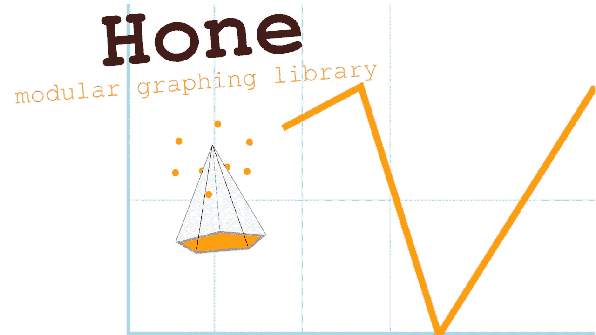

one.jl 自诞生以来已经走过了漫长的道路，每一次升级都变得更加有用。上次我在 Hone 上做了一些工作，我留下了一个叫做“框架”的新控件表单，我们可以将对象放入其中并相应地缩放。然而，随着这一进步，也出现了缩放所有绘制点的新问题，以及我们的绘图所需的其他元素。为此，我们可以简单地用坐标解析器中相应的框架宽度或高度乘以最初从 X 顶部获得的百分比。

> [笔记本](https://github.com/emmettgb/Emmetts-DS-NoteBooks/blob/master/Julia/HonePt7.ipynb)

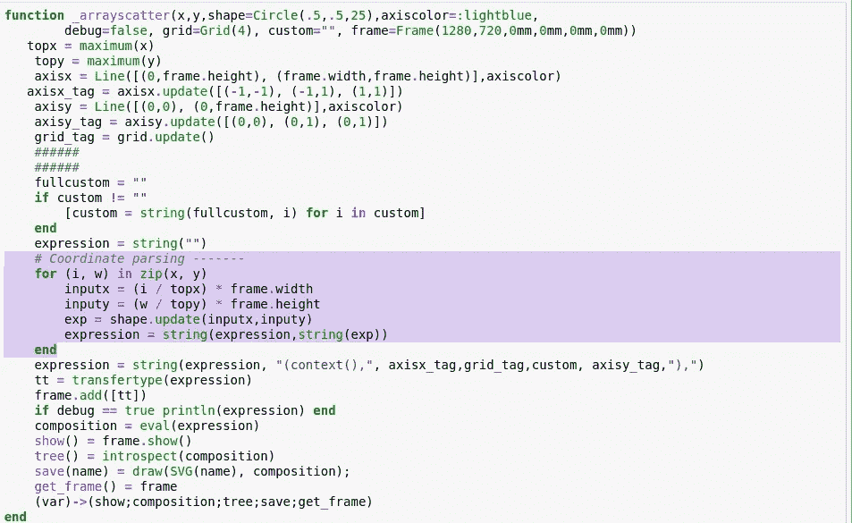

例如，我们在 X 平面上有两个点，8 和 4。因为 8 是最大的数字，所以它将被分配给这里的“topx”变量:


当坐标被解析时，我们的四将变成。5，因为它是八的百分之五十。然后我们把结果乘以宽度，我们会说是 1920 年。. 5 和 1920 的乘积是 960，结果我们得到了画在 x 轴中间的点。

> 很酷，对吧？

当然很酷，但是除此之外，X 轴和 Y 轴都需要改变。这相当简单，因为我们只需要将线条的点设置为我们的宽度和高度。


现在测试修改后的函数，我们现在可以得到我们的第一个高清 Hone 图:

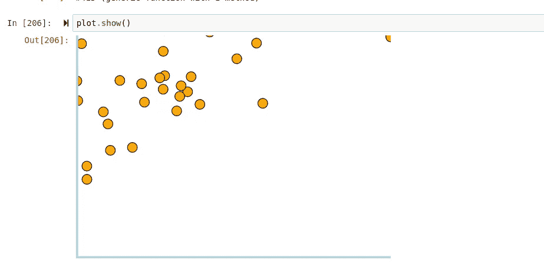

最后一个仍然需要修复的是网格。网格是一个表面上看起来很有挑战性的问题，但结果却很简单。首先，我们需要将 X 和 Y 的顶部改变为框架大小的适当顶部。然后，我们只需要用相应轴的长度替换线对象坐标中的所有值。


> 还有…


现在我们甚至可以从我们的图中使用 get_frame()函数，并看到我们的图实际上包含在一个框架中。


# 新功能

为了增加新的功能，今天我想做一些不同的事情。通常，我会在模块中我认为最需要的部分随机添加特性，但是，今天我将分别在 HDraw 和 HPlot 中添加一个特性。

## 线条

从 HPlot 开始；散点图很酷，但 Hone 显然需要做得更好，才能成为一个真正伟大的图形库。另一种最重要的连续图类型是线图，创建起来应该相对简单。第一步，我们将从创建 _arrayline()函数开始。以下是我的原稿:

```
function _arrayline(x,y,axiscolor=:lightblue,
    grid=Grid(3), custom="", frame=Frame(1280,720,0mm,0mm,0mm,0mm))
    pairs = []
    for (i,w) in zip(x,y)
        append!(pairs,[i,w])
    end
    println(pairs)
    lin = Line(pairs)
    expression = string(",(context(),",lin.update(),",")
    expression = string(expression, "(context(),", axisx_tag,grid_tag,custom, axisy_tag,"),")
    tt = transfertype(expression)
    frame.add(tt)
    show() = frame.show()
    tree() = introspect(composition)
    save(name) = draw(SVG(name), composition);
    get_frame() = frame
    (var)->(show;composition;tree;save;get_frame)
end
```

因此，我在这个函数中遇到的第一个错误是，对的添加只是添加两个数字，而不是两个数字对的总和。老实说，我其实并不完全确定如何改变这一点，但我的第一个倾向是，也许我可以使用推力！函数，而不是 append！功能。基于这个想法，我设置了一个小测试，将两个独立的线对放入一个线对数组中，如下所示:

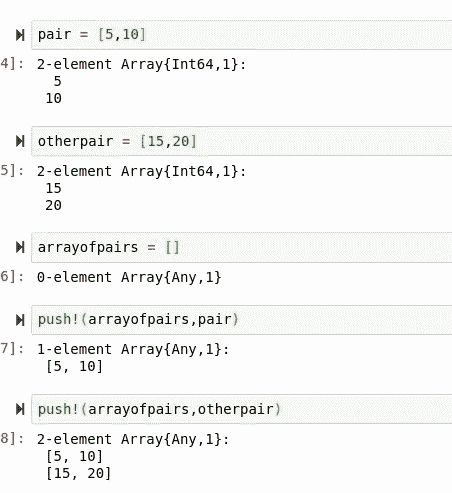

> 而且测试成功了！

然而，每当我在函数上尝试这样做时，我仍然得到边界错误。


这个问题看起来很熟悉，我相信我实际上在创建 line 函数时遇到了同样的问题。有趣的是，这也可能是该行的更新功能不起作用的原因。幸运的是，在搜索 [Julia 数据结构文档](https://docs.julialang.org/en/v1/base/collections/)时，我发现了一个大提示！


在这里，我们可以看到，实际上是字典数据类型用于创建 pair 数据类型。这有点令人困惑，因为我不认为我能够对 pair 进行类型断言，事实上，我认为该类型被称为其他类型，但有趣的是，每当字典语法与一个键和一个相应的值一起使用时，它就会自动变成一个 Pair。我们也可以通过打印来查看。

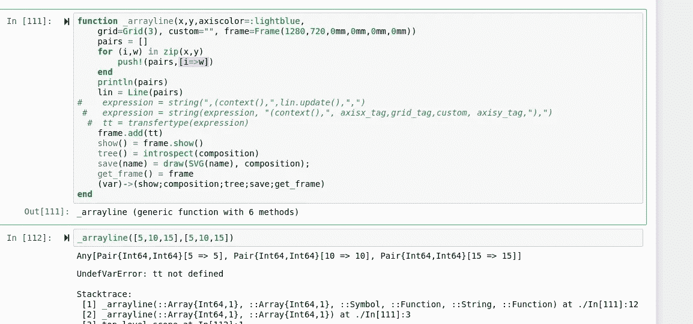

现在，在 frame.add()方法中取消注释并使传输类型成为 iterable 之后，我们遇到了以下错误:


幸运的是，我上次创建元表达式时遇到了这个问题，这是针对网格对象的。这意味着我们多了一个逗号。去掉这些，以及我还没有添加的“绒毛”，比如轴线和网格，结果是这样的:


现在这个函数完全可以工作了，但是如果我们运行它，我们当然不会得到任何东西:

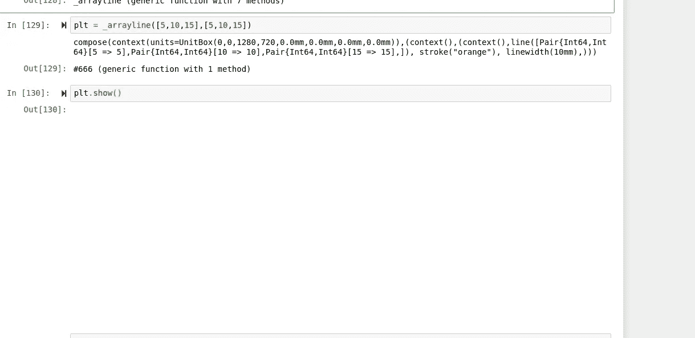

你可能想知道:

> 这是为什么呢？

这里可能有一些事情在起作用。首先，我们使用的线可能不一定是弯曲的，这没关系，因为我们可以很容易地向 HDraw.jl 添加一条新的曲线。其次，缩放也很重要，并且将继续成为我们绘制的任何图的一个问题…所以让我们解决这个问题。

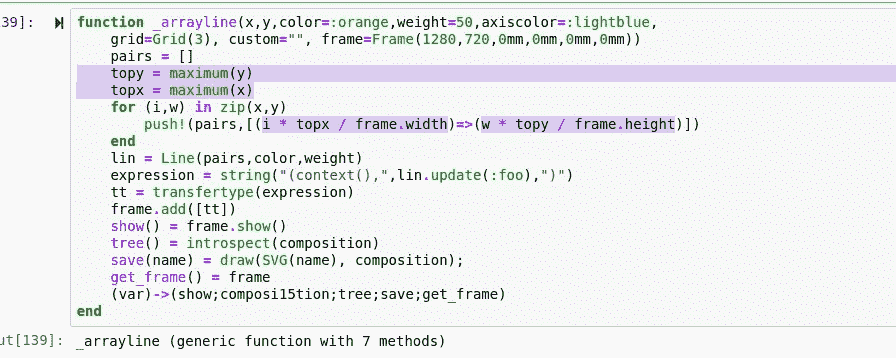

我决定下一步做的是使每行最多只包含两对。为此，我翻转了表达式，只在满足条件时添加标签。该条件将确定自上次向表达式添加一行以来迭代了多少对。


但那也没用…

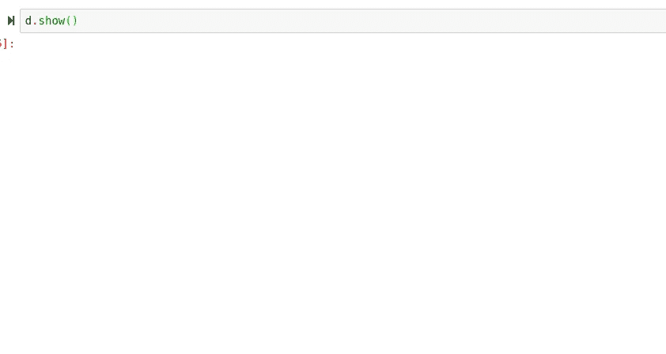

所以在这一点上，我唯一的理论是，也许 pair 类型不是 Line 函数的正确类型。为了测试这一点，我创建了一个新行，并通过它传递 pairs 类型:

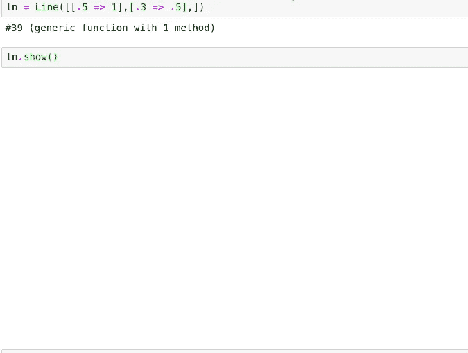

为了证实这种怀疑是正确的，我对原始语法做了同样的处理:

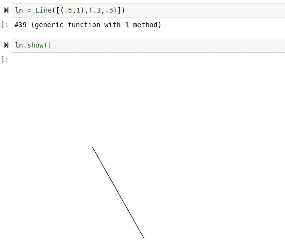

> 好吧，我是对的。

所以现在我需要弄清楚这种类型叫什么:


现在让我们试着把这种类型声明给一对坐标。


> 成功了！

现在我们只需要把这个应用到我们的配对上！

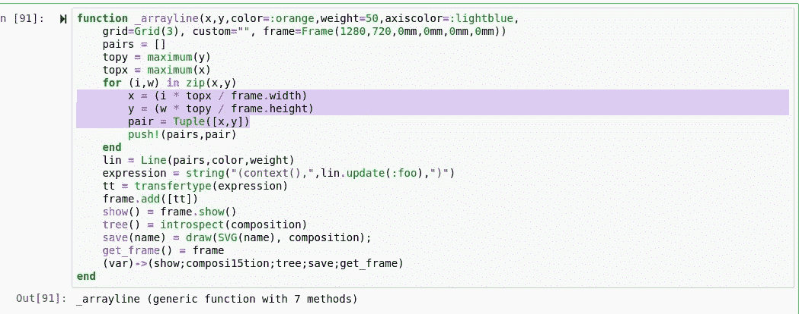

但是当我们试着运行这个:


看来这个问题是来自于推！()方法。为了测试这个理论，我决定尝试正常推送一个元组。

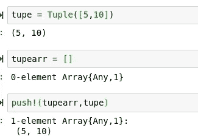

看起来我实际上是错的。因此，每当解析数组时，很可能会抛出这个界限错误。为了测试这一点，我只是在填充 pairs 的循环之后添加了一个 println()。这将让我们知道，在抛出边界错误之前，函数是否进行到这一步。它还会让我们看到正在传递的线对。

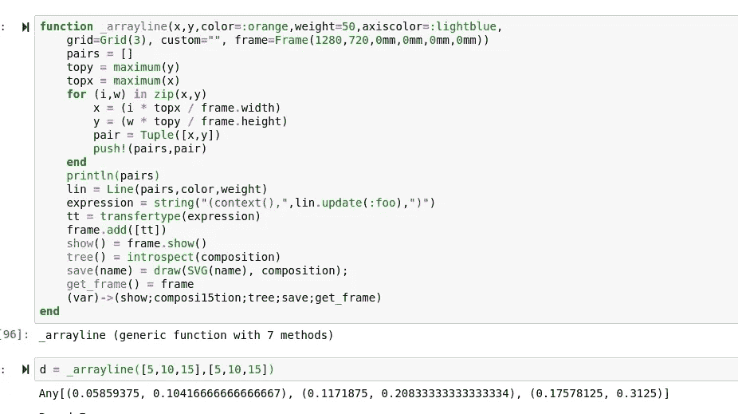

果然，这一对成功地打印出来了。这就提出了一个问题，错误到底来自哪里？也许是 Line()函数的问题？


> 找到了。

为了调试这个问题，我决定尝试解析一个包含相同语法的表达式，看看为什么这不起作用:

```
tupearr = []
tupe = Tuple([5,10])
push!(tupearr,tupe)
lin = Line(tupearr)
```

但这确实:

```
lin = line([5,10])
```

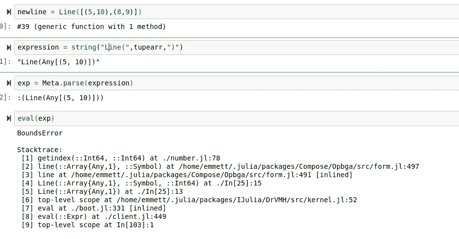

我看到的潜在问题是，我们的数组是一个

```
Array{Any}
```

该是时候了

```
Array{Tuple}
```

然而，每当我们试图推动！()或追加！()转换为数组{Tuple}类型，我们得到:


依我看，这个问题有两个解决办法。

*   我为 append 创建了一个新的调度函数！()方法，可以处理元组数组。
*   我发现了一种不同的类型，它可以保存元组，并且在 base 中已经有了它的调度。
*   在追加数据后，我可以将数组的类型转换为元组数组。

第三个似乎是最简单的选择，所以我选择了这个。为此，我首先将数据推送到{Any}类型的数组中:

```
tupearr = []
tupe = Tuple([5,10])
push!(tupearr,tupe)
```

然后试图将我们的数组{Tuple}类型声明为该类型。


> 成功了！

现在，让我们尝试将它插入到我们的 Line 函数中:


> 太棒了。

现在我们只需要将这个概念重新整合到我们的函数中。

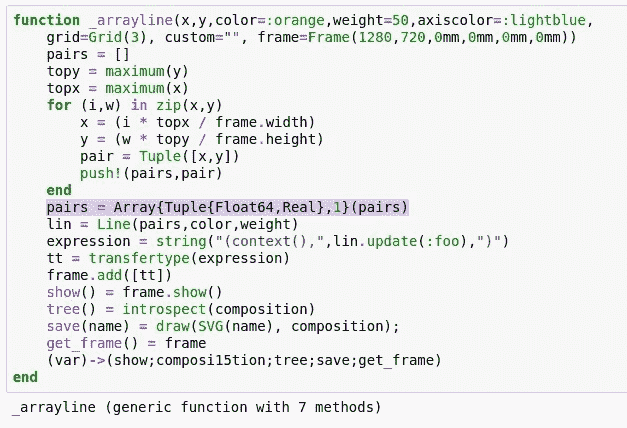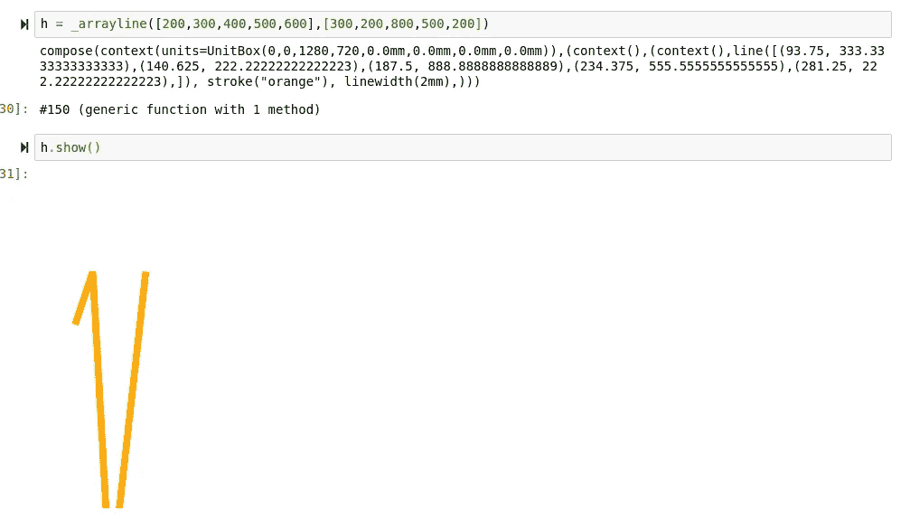

> 终于成功了！
> 
> 哇，那是一个 doozee。

比例被打乱了，但那只是因为我无意中似乎改变了我的数学。而不是:

```
x = (i * topx /frame.width)
y = (w * topy / frame.height)
```

应该是:

```
x = (i / topx * frame.width)
y = (w / topy * frame.height)
```


那看起来好多了！为了添加最后的润色，我们只需添加网格对象的标签和轴的标签。

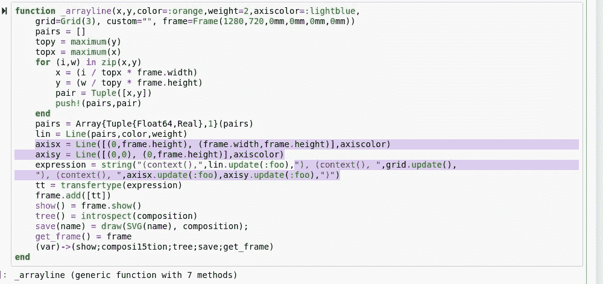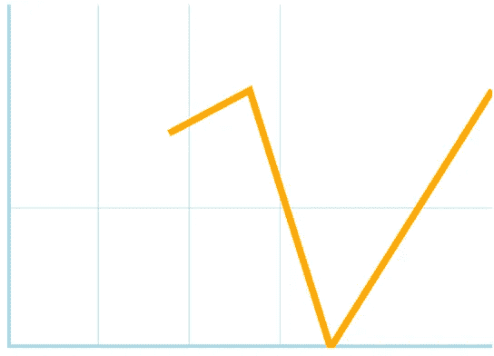

## 文本

hone 绝对缺少的一个定义特性是绘制文本的能力，更具体地说:

> 标签。

这应该是相对简单和容易做到的，下面是我想到的:

```
function Text(label,x,y,stroke,size)
    color = string("\"",string(stroke),"\"")
    label = string("\"",string(label),"\"")
    tag = string("text(",x, ",", y, ",", label, ",hcenter, vcenter),",
        "stroke(", color,
        "), fontsize(", size, "),")
    expression = string("compose(context(), ",tag,")")
    exp = Meta.parse(expression)
    show() = eval(exp)
    update() = tag
    (var)->(show;expression;tag;exp)
end
```

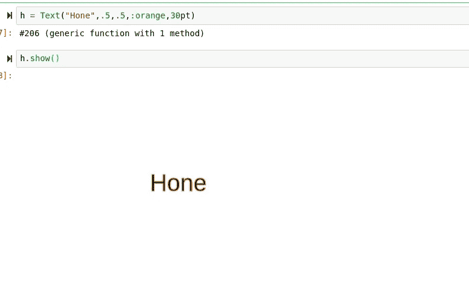

# 结论

虽然我并不期望这篇文章展示了一个如何在编程的同时进行调试的很好的例子，但我觉得事实确实如此。虽然那条线的问题很有挑战性，但完成后肯定是值得的。文本对象也是一个重要的进步，并且肯定会在 Hone 的其他功能中实现。