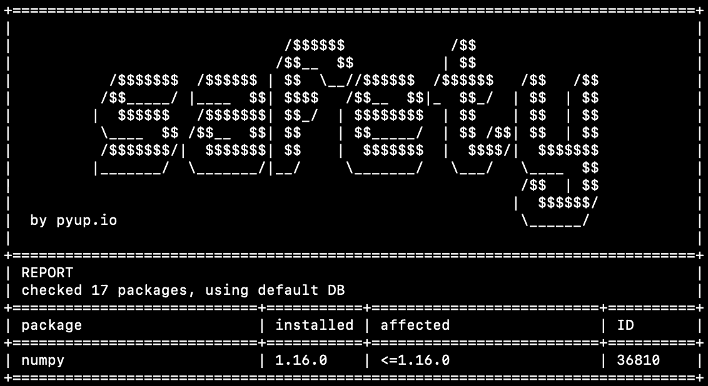

# 为您的代码添加安全性

> 原文：<https://towardsdatascience.com/adding-security-to-your-code-1378ff123240?source=collection_archive---------21----------------------->

## 这比你想象的要简单

我经常听到的一句话是“安全是每个人的责任”，但我注意到数据科学家经常过于关注他们需要知道的大量技能，以至于忽略了安全。除了有许多职责之外，我认为安全性似乎令人生畏，并且似乎需要大量的软件工程技能。实际上，在你的软件中实现最低级别的安全性是相当容易的。我建议遵循 Charles Nwatu(网飞公司的安全主管，以前是 StitchFix)的原则“做得更少更好”对我来说，这意味着成功地实现低级别的安全性比未能实现高级别的安全性要好。本文面向数据科学家(或 python 用户)，并且只假设您对命令行有一些基本的了解。

# 安全工具的类型

有两大类安全工具，静态和动态。动态安全工具针对运行中的软件运行以发现威胁，而静态工具针对源代码文件运行以发现问题。在本文中，我们将添加两个静态安全工具。第一个工具将检查以确保您没有向存储库添加密钥、秘密或密码，从而防止您暴露这些私人信息。第二个工具将帮助您检查软件依赖项是否存在安全威胁。

# Git 秘密

Git Secrets 是我们用来监控我们不想公开的信息的工具。在这里查阅它的报告[，可以很容易地为你的操作系统安装它。一旦你安装了它，你可以用下面的命令添加我们想要寻找的东西:`git secrets --add 'your-regular-expression'`阻止模式或者`git secrets --add --literal 'your-literal-string'`阻止特定的字符串。作为一个例子，我将运行`git secrets --add 'password ?=+ ?[A-Za-z0-9]+`,它将阻止如下内容:](https://github.com/awslabs/git-secrets)

*   password = anyLengthPassword
*   password = passwordWithNoSpacesNextToEqualSign
*   password = = doubleEqualsBlockedToo

但不会阻止这些:

*   密码= " "
*   密码=

这很好，因为它不会警告我们不要推送已经正确删除密码的代码。现在我运行`git secrets --scan -r`来扫描所有文档中我添加的模式。它找到了我放在自述文件第一行的一个密码。以下是 Git Secrets 向我报告的内容:

```
README.md:1:password = password12345

[ERROR] Matched one or more prohibited patterns

Possible mitigations:
- Mark false positives as allowed using: git config --add secrets.allowed ...
- Mark false positives as allowed by adding regular expressions to .gitallowed at repository's root directory
- List your configured patterns: git config --get-all secrets.patterns
- List your configured allowed patterns: git config --get-all secrets.allowed
- List your configured allowed patterns in .gitallowed at repository's root directory
- Use --no-verify if this is a one-time false positive
```

我为这个特定的存储库设置了这些 Git 秘密配置，但是您可以设置一些全局配置来防止您在任何 repo 中推送任何秘密。用`git secrets --add --global 'pattern or string here'`做这个。

# 虚拟环境

在之前的一篇文章中，我认为创建一个虚拟环境应该是你做任何项目的第一步。虚拟环境允许你为不同的项目隔离软件，所以如果你在一个项目上需要 pandas 版本 0.25.3，而在另一个项目上需要 pandas 版本 1.1.2，这不会有问题。

如果你确实在使用 python，你很可能会使用 conda 或 virtualenv。用 conda run `conda create --name 'env-name' python='python-version'`创建虚拟环境，用 virtualenv 创建虚拟环境，使用`virtualenv 'env-name'`。您可以将您的所有 python 包存储到一个通常称为 requirements.txt 的文件中，如果您希望在相同的环境中协作处理相同的代码，那么这个文件对于与他人共享非常有用。这是我所有的 requirements.txt 文件:

```
numpy==1.16.0
```

要安装 requirements.txt 文件中的所有包，运行`pip install -r requirements.txt`并生成 requirements.txt 文件，运行`pip freeze > requirements.txt`。

# 月初（beginning of month 的缩写）

根据 2020 年 DevSecOps 社区调查，28%的受访者表示他们至少有一次与开源工具相关的安全漏洞。那么，如何在这些安全威胁变成问题之前发现它们呢？通过使用物料清单(BOM ),它将描述您的项目使用的所有软件依赖项和库。然后，可以将该 BOM 与已发现的安全威胁的公共记录进行比较，这将引起您的注意。如果您已经在使用虚拟环境，那么 requirements.txt 文件可以作为 python 项目的 BOM。现在让我们安装[安全](https://pyup.io/safety/)，它将扫描您的活动虚拟环境或 requirements.txt 文件，并将其与已知漏洞数据库的数据库进行比较。为此跑`pip install safety`。作为一个警告，这个数据库每月只更新一次，要获得最新的安全威胁，你必须支付 PyUp，安全背后的公司。但是请记住，“做得更少，更好。”

现在您已经安装了它，您可以在活动环境中运行`safety check`或者运行`safety check -r requirements.txt`来检查 requirements.txt 文件。我这样做是针对我的需求文件，其中只有 numpy 版本 1.16.0。以下是输出结果:



安全检测器

我现在被警告 numpy 版本 1.16.0 中有安全威胁，我现在知道要升级到不同的版本。

# 在一个脚本中运行这些工具

我们可以将这两个命令放在一个 shell 脚本中，您可以随时执行该脚本。我用`nano security.sh`打开了一个新的文本文档来放入这些内容。在这个文件中，我写道:

```
#!/bin/bash
# This script runs a security check
git secrets --scan -r
safety check -r requirements.txt
```

第一行告诉我们 bash 的位置(您的可能不同)。有很多解释器，我希望 bash(这是比较常见的一种)来执行这个脚本。第二行是一个常规的注释，告诉我们脚本做了什么。随着您对新工具的了解，您可以将它们添加到这个脚本中，这将使执行安全检查更加简单。

# 连续累计

比偶尔运行这个脚本更好的是开始采用持续集成管道。持续集成是一次处理一小批代码，并频繁地将您的代码与一个主要分支集成的过程。当您整合您的代码时，您可以自动运行代码质量测试以及这些安全性检查。如果你这样做了，你会更快地了解问题，从而更快地减轻它们。

为了利用持续集成，您可能希望从为您的团队选择一个工具开始，比如 CircleCI、TravisCI 或 Jenkins。这些工具可以在 GitHub、Bitbucket 或 GitLab 中连接到您的 repo 中，并在那里发生变化时开始执行。下面是一个 Jenkinsfile 的示例，您可以使用它来自动执行上述操作以及您可能在 tests.py 文件中编写的任何 python 测试。这将在你或你的任何队友推你的仓库时执行。

```
pipeline {
    agent any
    stages {
        stage('SecTest') {
            steps {
                sh 'git secrets --scan -r'
                sh 'safety check -r requirements.txt'
            }
        }
        stage('AppTest') {
            steps {
                sh 'python.exe tests.py'
            }
        }
    }
}
```

您甚至可以添加额外的步骤，将您创建的任何机器学习模型或函数部署到该管道中。在我看来，一旦你采用了 CI 管道，高安全性和高质量的代码就更容易开发。希望这能让你开始提高代码的安全性！