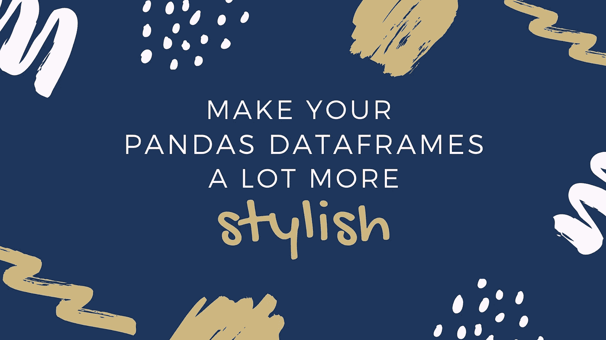
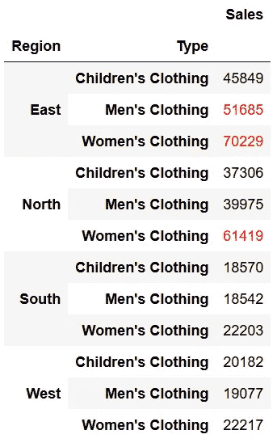
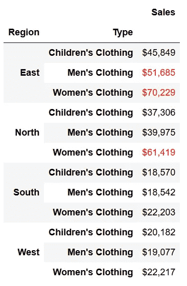
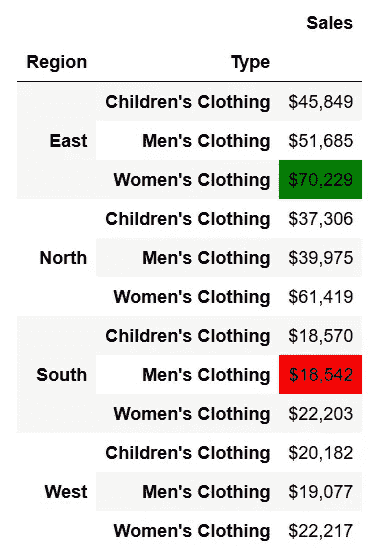
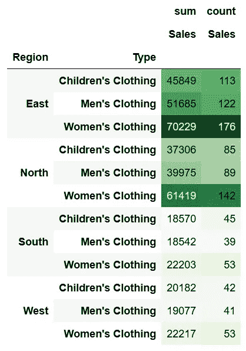
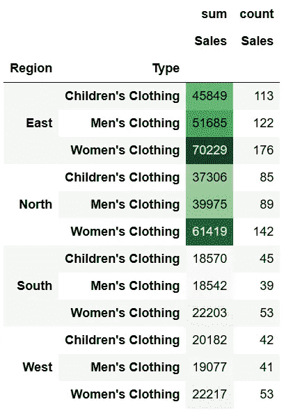
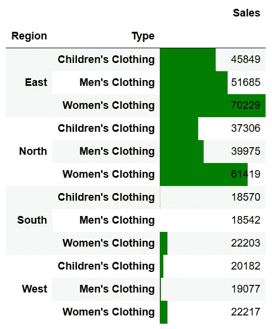

# 给熊猫添加样式(只用了几行代码！)

> 原文：<https://towardsdatascience.com/adding-style-to-pandas-in-just-a-few-lines-of-code-be942f65b3a5?source=collection_archive---------14----------------------->

## 制作你的数据框架(很多！！)更漂亮



让我们给我们的熊猫数据框添加一些风格吧！资料来源:Nik Piepenbreier

Pandas 是 Python 中数据分析的典型工具，但让数据看起来像样并不总是最容易的。为此，许多分析师在与我们更广泛的受众分享数据之前，仍然求助于 Excel 来添加数据样式(如货币)或条件格式。在这篇文章中，我们将探索如何利用 Excel 中常见的这些特性，并演示如何使用熊猫风格的 API 来利用这些特性！

# **我们为什么要设计数据的样式？**

我们的最终目标应该是让读者更容易理解数据，同时保持数据框架中底层数据的可用性。例如，10%可能比值 0.10 更容易理解，但保持 0.10 的比例对于进一步分析更有用。

# 什么是熊猫风格 API？

熊猫在 2019 年开发了造型 API，自那以来一直在积极开发。API 返回一个新的 **Styler** 对象，它有一些有用的方法来对数据帧应用格式和样式。最终的样式是用 CSS 完成的，通过样式函数，通过*属性:值*对应用于标量、序列或整个数据帧。

**Styler** 对象有两个关键方法:

1.  **Styler.applymap** —将样式应用于元素
2.  **Styler.apply** —应用列/行/数据帧样式

让我们首先从加载数据开始。

我们将使用在我的数据透视表教程中可用的相同数据集，并且我们将使用我们在那里概述的一些步骤。如果你不熟悉熊猫的数据透视表，我们推荐[看看我的教程](https://datagy.io/python-pivot-tables/)。

导入我们的数据报。资料来源:Nik Piepenbreier

```
Out:
  Date 	        Region 	Type 	                Units 	Sales
0 2020-07-11 	East 	Children's Clothing 	18 	306
1 2020-09-23 	North 	Children's Clothing 	14 	448
2 2020-04-02 	South 	Women's Clothing 	17 	425
3 2020-02-28 	East 	Children's Clothing 	26 	832
4 2020-03-19 	West 	Women's Clothing 	3 	33
```

我们可以看到，我们有一些销售，提供了有关地区、类型、售出单位数量和总销售成本的信息。

让我们创建一个数据透视表，按照我之前的教程:

```
Output:
                            Sales
Region Type                      
East   Children's Clothing  45849
       Men's Clothing       51685
       Women's Clothing     70229
North  Children's Clothing  37306
       Men's Clothing       39975
       Women's Clothing     61419
South  Children's Clothing  18570
       Men's Clothing       18542
       Women's Clothing     22203
West   Children's Clothing  20182
       Men's Clothing       19077
       Women's Clothing     22217
```

现在我们已经将数据加载并存储在名为 ***pivot、*** 的数据框架中，我们可以开始在 Pandas 中对数据进行样式化。

# 熊猫的数据类型标签

在我们的 data frame***pivot***中，列 **Sales** 代表以美元表示的销售总数。然而，读者并不清楚这一点，因为没有美元符号，千位值也没有用逗号分隔。让我们来探索如何做到这一点:

```
Output:
                            Sales
Region Type                      
East   Children's Clothing  $45,849
       Men's Clothing       $51,685
       Women's Clothing     $70,229
North  Children's Clothing  $37,306
       Men's Clothing       $39,975
       Women's Clothing     $61,419
South  Children's Clothing  $18,570
       Men's Clothing       $18,542
       Women's Clothing     $22,203
West   Children's Clothing  $20,182
       Men's Clothing       $19,077
       Women's Clothing     $22,217
```

我们可以看到，数据立即更容易理解！

字符串格式可以以不同的方式应用。其他一些例子包括:

*   带两位小数的浮点数:{:.2f}
*   用零填充数字:{:0>2d}
*   带两位小数的百分比:{:.2%}

如果我们想为多列传递格式，定义一个可以传递给样式函数的字典可能更容易。例如，我们可以编写一本字典，如下所示:

然后可以传递到如下所示的对象上:

# 添加条件格式

在 Excel 中，条件格式是一个非常有用的工具。它使我们能够根据内容轻松识别价值。这对熊猫来说同样简单，但是隐藏了一点。我们将展示在 Pandas 中实现条件格式是多么容易。

例如，如果我们想突出显示任何超过 50，000 美元的销售额(比如说，在这之后他们有资格获得奖金)。我们可以使用 applymap 方法做到这一点。在开始之前，我们将定义一个可以传递给 applymap 方法的函数。

我们现在可以将这个函数传递给 applymap 方法:

这将返回以下数据帧:



突出显示超过 50，000 的值。资料来源:Nik Piepenbreier

我们还可以将数据样式与条件格式联系起来:



突出显示值和添加货币标签。资料来源:Nik Piepenbreier

# 让链接的方法更容易阅读

链接方法在 Python 中是一个非常有用的特性，但它并不总是最容易阅读的。我们可以使用\字符将链拆分成多行，如下所示:

现在，假设我们想要突出显示最大值和最小值，我们可以用另一个 Styler 对象来实现。虽然我们可以使用函数和 applymap 方法来实现这一点，但是 Pandas 有内置的方法来直接突出显示最大值和最小值。在下面的例子中，我们提供了命名颜色，但是你也可以提供更具体的十六进制值。



轻松突出显示最大值和最小值。资料来源:Nik Piepenbreier

# 给熊猫添加色阶

有时，我们会希望标识一列中彼此相关的值。这就是色阶发挥作用的地方。我们可以使用 background_gradient 方法作为样式方法很容易地实现这一点。让我们试一试:

这将返回如下所示的数据帧:


添加色阶。资料来源:Nik Piepenbreier

您也可以使用不同的 cmaps。要了解更多关于 cmaps 的信息，请查看 Matplotlib 指南。

# 限制格式化的列

现在让我们生成一个包含多列值的数据透视表:

这将创建一个如下所示的数据透视表:

```
 sum 	count
		                Sales 	Sales
Region 	Type 		
East 	Children's Clothing 	45849 	113
        Men's   Clothing 	51685 	122
        Women's Clothing 	70229 	176
North 	Children's Clothing 	37306 	85
        Men's   Clothing 	39975 	89
        Women's Clothing 	61419 	142
South 	Children's Clothing 	18570 	45
        Men's   Clothing 	18542 	39
        Women's Clothing 	22203 	53
West 	Children's Clothing 	20182 	42
        Men's   Clothing 	19077 	41
        Women's Clothing 	22217 	53
```

现在，让我们应用背景 _ 渐变方法:

这将返回以下数据帧:



向多列添加色标。资料来源:Nik Piepenbreier

如果我们想将此限制为只有一列，我们可以使用 subset 参数，如下所示:



仅向一列添加色标。资料来源:Nik Piepenbreier

# 给熊猫添加颜色条

向列中值的大小添加上下文的另一种说明性方法是添加颜色条。这是一种非常简单的方式来提供视觉效果，也很容易打印出来。通过使用下面的代码，我们可以使用 Python 来实现这一点:

这将返回以下数据帧:



给我们的数据框架添加颜色条。资料来源:Nik Piepenbreier

颜色条让我们更容易看到规模。我们还可以使用 *align* =center 参数，如果值为负，则在左边显示条形，如果值为正，则在右边显示条形。

# 如何在熊猫中重用样式

在你花了一些时间创建了一个你真正喜欢的样式后，你可能想重用它。令人欣慰的是，Pandas 使它变得简单，无需重复您精心创建的代码。你用。对另一个数据报的样式对象使用方法。例如，如果我们有两个数据帧，style1 和 style 2，我们可以通过使用以下内容重用 style1 的样式:

# 隐藏索引或列

既然我们讨论的是为显示做好数据准备，那就让我们来谈谈 Excel 使之变得非常简单的另一部分:隐藏列。我们也可以使用 styler 对象在熊猫身上实现这一点。如果我们想隐藏索引，我们可以写:

```
Date 	    Region Type 	        Units 	        Sales
2020-07-11  East   Children's Clothing 	18.000000 	306
2020-09-23  North  Children's Clothing 	14.000000 	448
2020-04-02  South  Women's Clothing 	17.000000 	425
2020-02-28  East   Children's Clothing 	26.000000 	832
2020-03-19  West   Women's Clothing 	3.000000 	33
```

类似地，如果我们想隐藏一列，我们可以写:

```
 Date 	                Region 	Type 	               Sales
0 	2020-07-11 00:00:00 	East 	Children's Clothing    306
1 	2020-09-23 00:00:00 	North 	Children's Clothing    448
2 	2020-04-02 00:00:00 	South 	Women's Clothing       425
3 	2020-02-28 00:00:00 	East 	Children's Clothing    832
4 	2020-03-19 00:00:00 	West 	Women's Clothing       33
```

# 将样式化的数据框架导出到 Excel

我在文章的前面提到过，风格 API 是熊猫仍然是实验性的。我们目前不能导出所有这些方法，但是目前可以导出*背景色*和*颜色*。例如，如果我们想要导出以下数据帧:

我们可以用。to_excel 方法将我们的样式化数据帧提取到 excel 工作簿:


如果都不行，就用 Excel 吧！资料来源:Nik Piepenbreier

# 也许用 Excel 就好了？

最后，也许在某些情况下，将数据导入 Excel 会更有效率？在这种情况下，您可以使用 df.to_clipboard()方法将整个数据帧复制到剪贴板！

这没什么不对的…

# 非常感谢你的阅读！

在这篇文章中，我们学习了如何使用熊猫样式 API 来设计熊猫数据帧的样式。我们学习了如何添加数据类型样式、条件格式、色标和色带。与 Excel 中的样式类似，Pandas 使对数据帧应用样式变得很容易。这使我们能够更好地表示数据，并直观地发现数据中的趋势。

*原载于 2020 年 4 月 20 日*[*https://datagy . io*](https://datagy.io/pandas-style/)*。*