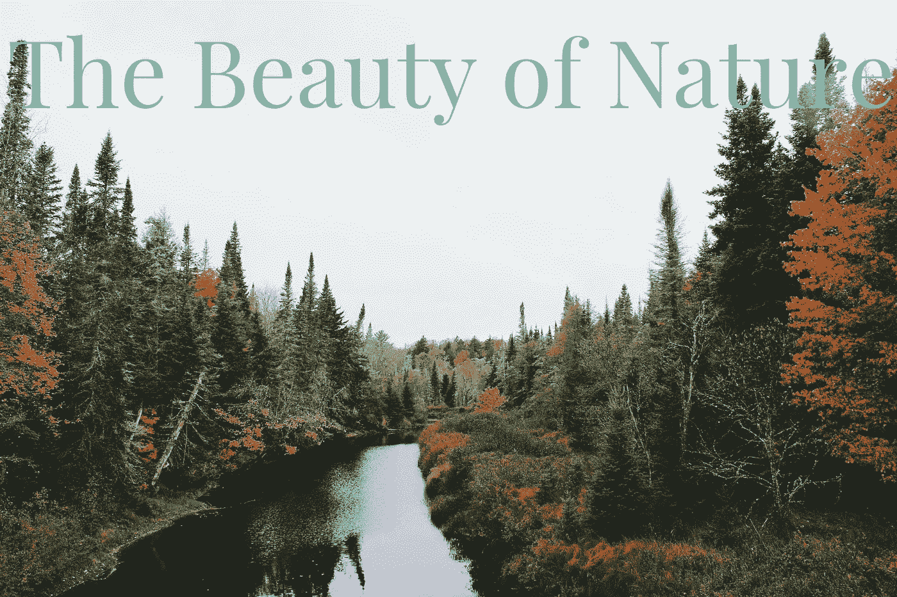

# 使用 Python 在图像上添加文本

> 原文：<https://towardsdatascience.com/adding-text-on-image-using-python-2f5bf61bf448?source=collection_archive---------5----------------------->

## 使用枕头库的简单机器学习项目


伊戈尔·米斯克在 [Unsplash](https://unsplash.com/s/photos/computer?utm_source=unsplash&utm_medium=referral&utm_content=creditCopyText) 上的照片

在这篇文章中，我将向你展示如何使用 Python 给你的图片添加文本。这将是一个非常简单的项目，我们将使用编程来做一些设计。在这篇文章之后，你将能够使用一些 python 技巧来设计你的下一张传单或名片。听起来是不是很酷？也许这不是设计的最佳方式，但这是可能的:)

作为一个喜欢设计和编程的人，我认为这将是一个伟大的项目，我可以结合我的两个兴趣。这实际上是编程的一大部分，你总能找到不同的领域来练习你的技能。在我之前的文章中，我展示了如何给你的视频添加文本，今天我们将在一张图片上做这件事。我们开始吧！

## 目录

*   ***导入枕头库***
*   ***选择一幅图像***
*   ***字体选择***
*   ***渲染正文***
*   ***导出结果***
*   ***视频演示***

[](/rendering-text-on-video-using-python-1c006519c0aa) [## 使用 Python 渲染视频文本

### 使用 moviePy 库的动手机器学习项目

towardsdatascience.com](/rendering-text-on-video-using-python-1c006519c0aa) 

# 步骤 1-导入枕头库

首先，让我们安装这个项目需要的库。安装完成后，我们可以导入库以在项目中使用它。安装这个库的最好方法是使用 PIP，它是一个 python 包管理器工具。与大多数 Python 库完美配合。

```
pip install pillow
```

很好，现在我们可以将它导入到我们的代码中了。使用大型库时，与其导入整个库，不如练习导入将要使用的特定函数。这将在运行程序时节省存储空间和时间。对于我们的简单项目，我们只需要三个函数:Image、ImageFont 和 ImageDraw。

我们可以在一行代码中导入这三个元素，如下所示:

```
from PIL import Image, ImageFont, ImageDraw 
```

# 步骤 2 —选择一幅图像

在这一步中，我们将选择并导入一个要添加文本的图像。我推荐使用 [Unsplash](https://unsplash.com/) ，这是一个很棒的股票图片网站，可以找到质量很好的图片。以下是我下载的图片，也与秋季相匹配:


诺亚·西利曼在 [Unsplash](https://unsplash.com/s/photos/fall?utm_source=unsplash&utm_medium=referral&utm_content=creditCopyText) 上的照片

下载图像后，确保将它复制到代码所在的目录中。这将帮助您将其导入到程序中。让我们定义一个新的变量，并使用 *open* 方法分配图像。

```
my_image = Image.open("nature.jpg")
```

# 步骤 3 —字体选择

这个项目的好处是，你可以选择你的字体风格。定制字体会让我们在设计时更加灵活。

首先，我们将下载我们想要选择的字体的 TTF(TrueType 字体)文件。将文件放在同一个目录中后，我们可以使用 ImageFont 函数将其导入到我们的程序中。这是我将使用的字体。

```
title_font = ImageFont.truetype('playfair/playfair-font.ttf', 200)
```

现在，我们可以进入下一步，在这里我们将添加文本。

# 步骤 4 —呈现文本

这一步就是奇迹发生的地方。选好图片和字体后，就该决定写什么了。首先，我们将定义一个文本变量，并给它分配一个字符串。

```
title_text = "The Beauty of Nature"
```

其次，我们将使用 ImageDraw 函数将图像转换成可编辑的格式。多亏了枕头库，我们可以一行搞定。

```
image_editable = ImageDraw.Draw(my_image)
```

第三，我们将做渲染。我们将向渲染函数传递四个参数。我将在代码下面与一些有用的资源分享每个参数的描述。

```
image_editable.text((15,15), title_text, (237, 230, 211), font=title_font)
```

*   **起始坐标:**枕头库采用笛卡尔像素坐标系，左上角为(0，0)。
*   **文本:**单引号或双引号之间的字符串
*   **RGB 格式的文本颜色:** Google Picker 是寻找最佳颜色的绝佳资源。在谷歌上搜索“拾色器”，它就会出现。
*   **字体风格:** [Google Fonts](https://fonts.google.com/) 是挑选你的字体风格的绝佳资源，你也可以下载字体家族的 TTF(TrueType Font)文件。

[](/building-a-color-recognizer-in-python-4783dfc72456) [## 用 Python 构建颜色识别器

### 使用 OpenCV 的简单实用的机器学习应用程序

towardsdatascience.com](/building-a-color-recognizer-in-python-4783dfc72456) 

# 步骤 5 —导出结果

干得好！我们差不多完成了。这将是最短的步骤，只导出编辑过的图像。下面是使用*保存*方法导出的代码。

```
my_image.save("result.jpg")
```



result.jpg

# 视频演示

[](https://lifexplorer.medium.com/subscribe) [## 每当贝希克居文出版时收到电子邮件。

### 每当贝希克居文出版时收到电子邮件。注册后，如果您还没有，您将创建一个中型帐户…

lifexplorer.medium.com](https://lifexplorer.medium.com/subscribe) 

恭喜你。！您已经创建了一个使用 Python 在图像上呈现自定义文本的程序。这不是设计图像的最佳方式，但是通过编程来实现它的可能性是很酷的。希望你喜欢阅读这篇文章并参与这个项目。如果你今天学到了新东西，我会很高兴。从事像这样的动手编程项目是提高编码技能的最好方式。

如果您在执行代码时有任何问题，请随时[联系我](https://sonsuzdesign.blog/)。

> 关注我的[博客](https://medium.com/@lifexplorer)和 [youtube](https://www.youtube.com/channel/UCmo4tnTcj92DlzES5hvlWwQ) 频道，保持灵感。谢谢你，