# 附加边际软最大损失(AM-Softmax)

> 原文：<https://towardsdatascience.com/additive-margin-softmax-loss-am-softmax-912e11ce1c6b?source=collection_archive---------8----------------------->

## 了解 L-Softmax、A-Softmax 和 AM-Softmax

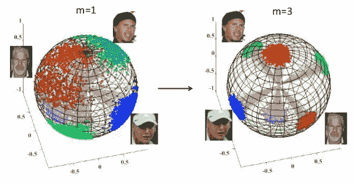

[来源:SphereFace:深度超球面嵌入人脸识别](https://arxiv.org/pdf/1704.08063.pdf)

在本文中，我将记录我在阅读[用于人脸验证的附加保证金 Softmax](https://arxiv.org/abs/1801.05599)论文时，对附加保证金 soft max 损失或 AM-Softmax 损失的理解历程。在分类中，将创建一个决策边界来分隔类别。然而，当输出位于判定边界附近时，这可能是一个问题。AM-Softmax 旨在通过向决策边界添加余量来解决这一问题，以增加类的可分性，并使相同类之间的距离更紧密。

软最大 VS AM-软最大[【来源】](https://arxiv.org/abs/1801.05599)

除了 AM-Softmax，我还将讨论早期的作品，这些作品也将余量引入 Softmax 损耗，以不同的方式实现，如 L-Softmax 和 Angular Softmax，以便更好地理解 AM-Softmax。

# 目录

1.  先决条件
2.  软最大损失
3.  L-Softmax(大余量 Softmax)
4.  α-最大柔度(角度最大柔度)
5.  AM-Softmax(附加余量 Softmax)

# **先决条件**

1.  深度学习和神经网络基础
2.  卷积神经网络

我假设你有深度学习和神经网络的基础知识，特别是 CNN，因为这可能是理解 AM-Softmax 所需要的。

# **Softmax 损失**

在深入到 AM-Softmax 之前，我们先多退一步，刷新一下对 Softmax 损耗的认识。当我第一次听说最大损失的时候，我很困惑我所知道的，最大损失是一个激活函数，而不是损失函数。

简而言之，Softmax 损失实际上只是一个 Softmax 激活加上一个交叉熵损失。Softmax 是一个激活函数，它输出每个类的概率，这些概率的总和为 1。交叉熵损失就是概率的负对数之和。它们通常在分类中一起使用。您可以在下面看到 Softmax 和交叉熵的公式，其中 *f* 是 Softmax 函数， *CE* 是交叉熵损失。因此，Softmax 损失只是这两个相加。

Softmax 损失。来源:[劳尔·戈麦斯](https://gombru.github.io/2018/05/23/cross_entropy_loss/)

为了更好地理解 Softmax 损失，我建议阅读 Raúl Gómez 的一篇文章，因为他在 [*中清楚地解释了这一点，理解分类交叉熵损失、二元交叉熵损失、Softmax 损失、逻辑损失、焦点损失以及所有那些令人困惑的名称*。](https://gombru.github.io/2018/05/23/cross_entropy_loss/)

# 大幅度软最大(左软最大)

L-Softmax 是在原始 Softmax 损失的基础上引入余量的第一批论文之一。这里的容限具有与三元组损失函数中的容限相似的概念，在三元组损失函数中，容限将增加类别之间的可分性或距离，并进而最小化相同类别之间的距离。这种类内紧密性和类间可分性将显著提高各种视觉分类和验证任务的性能。

在论文中需要注意的一件重要事情是，当我们使用术语 Softmax 损失而不仅仅是 Softmax 激活和交叉熵损失时，我们还包括分类器或全连接层。

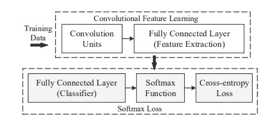

根据上面的图像，我们可以将 Softmax 损失定义如下，其中 *f* 作为最后一个完全连接的层或分类器的输出。

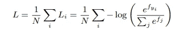

软最大损失

全连接层的输出只是权重和前一层输出加上偏差的乘积。所以 f 也可以写成 **W** * **x** 如下。( **b** 或 bias 为简单起见被省略，但如果加上它仍然可以工作)

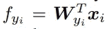

由于 *f* 是 **W** 和 **x** 之间的内积，因此也可表示为

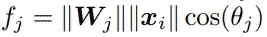

其中θ是矢量 **W** 和 **x** 之间的角度。因此，Softmax 损耗也可以通过代入 f 定义如下。

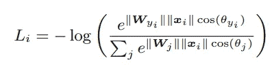

修改的 Softmax

为了理解 L-Softmax 背后的直觉，我们将使用一个二元分类的例子。假设我们有一个来自类 1 的样本 ***x*** 。最初的 Softmax 需要**W1*****x**>**W2*****x**才能将 **x** 正确分类为 1。

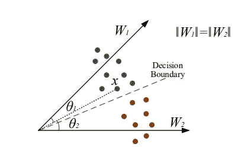

二元分类

但是，**W1*****x**>**W2*****x**也可以写成如下。

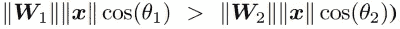

接下来，我们希望分类更严格，并扩大决策范围。因此，我们需要下面的条件，其中我们将θ1 乘以一个正整数， **m，**和(0 ≤ θ1 ≤ π/m)。

这将为我们提供如下所示的决策余量。

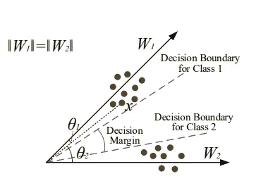

L-Softmax 几何解释

因此，按照前面的要求。L-Softmax 损耗可定义为

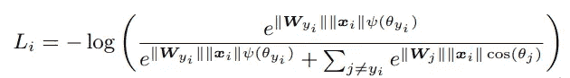

L-Softmax 损失公式

我们要求ψ在哪里，

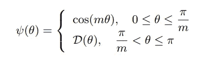

其中 m 是正整数，其中 m 越大，分类余量越大。然后，要求 D(θ)是单调递减函数，D( π/m)应等于 cos( π/m)。这是因为，我们希望 *cos* 函数在π之前只有一个递减的值，因此，如果 theta < π/m 和 D(θ)应该是递减函数，我们才使用 cos 函数。

为了满足上述要求并简化前向和后向传播，本文构造了一个特定的ψ，如下所示，其中 k ∈ [0，m1]，k 为整数。

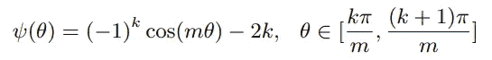

总之，L-Softmax 引入了一个可调的裕度，它鼓励学习特征的类内紧密性和类间可分性，这可以显著提高各种视觉分类和验证任务的性能。可以使用参数 *m* 来控制裕量，其中较大的 *m* 导致较大的决策裕量。L-Softmax 还在几个基准数据集上进行了测试，与当时的其他方法相比，它表现出了更好的性能和更低的错误率。

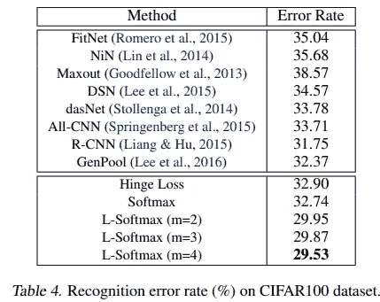

[来源:卷积神经网络的大幅度软最大损失](https://arxiv.org/pdf/1612.02295.pdf)

# 角度软最大值

2018 年在论文中介绍了 Angular Softmax， [SphereFace:用于人脸识别的深度超球面嵌入](https://arxiv.org/pdf/1704.08063.pdf)。Angular Softmax 非常类似于 L-Softmax，因为它旨在实现比最小类间距离更小的最大类内距离。然而，它与 L-Softmax 的不同之处在于将分类器权重 **W、**归一化为 1。这导致了在开集人脸识别数据集中性能的提高，在开集人脸识别数据集中会有在训练期间不存在的人脸。

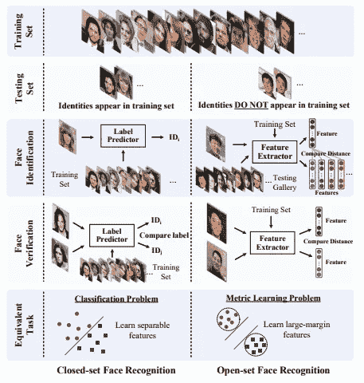

闭集 VS 开集[【来源】](https://arxiv.org/pdf/1704.08063.pdf)

如前所述，A-Softmax 与 L-Softmax 非常相似，只是分类器权重 **W** 被归一化为 1，偏差被设置为 0。因此，之前修改的 Softmax 公式

修改的 Softmax

将更改为

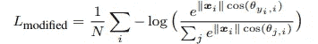

具有归一化权重的修改的 Softmax

因此，如果我们使用相同的二进制分类示例。将样品 x 正确分类为 1 类的要求将从

到

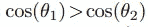

因为|W1| = |W2|，因此|W1||x| = |W2||x|我们可以从等式中抵消 W 和 x。

然后，引入保证金，它将

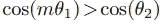

m 越大，决策界限越宽。决策边界方程的比较如下表所示。

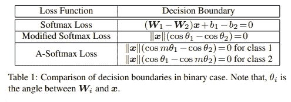

[【来源】](https://arxiv.org/pdf/1704.08063.pdf)

因此，A-Softmax 损失最终可定义为

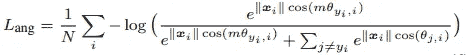

最大损失

在哪里

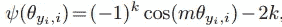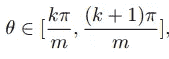

A-Softmax 的一个优点是它在超球解释中也能很好地渲染。

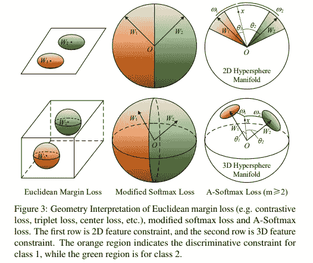

[【来源】](https://arxiv.org/pdf/1704.08063.pdf)

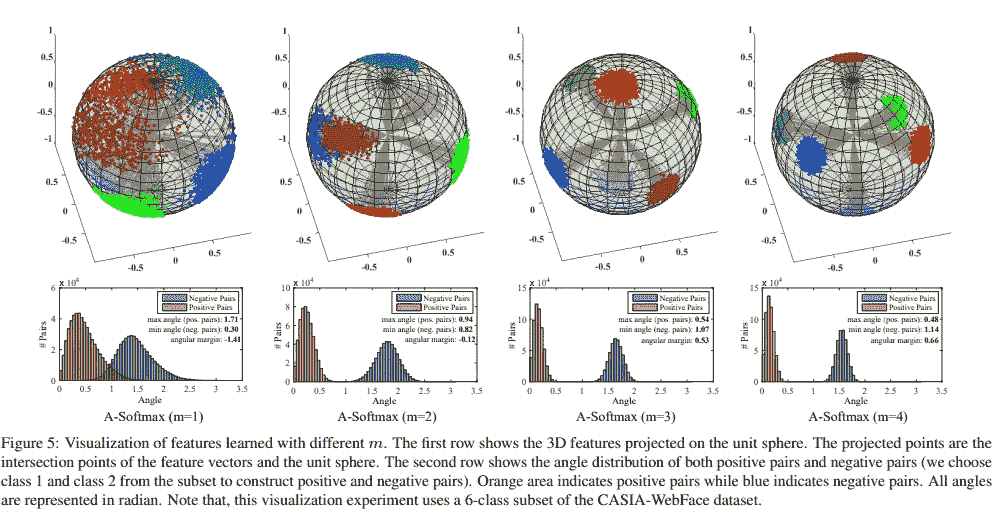

超球解释用不同的*[*【来源】*](https://arxiv.org/pdf/1704.08063.pdf)*

*总之，A-Softmax 对分类权重进行了归一化处理，使偏差为零，并引入了可通过参数 *m* 进行控制的角裕量，以学习具有区别性的特征，并具有清晰的几何解释，这将在开集数据集中表现得更好，如下所示。*

*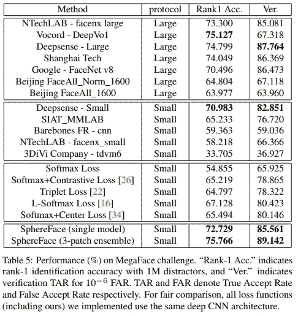*

*[【来源】](https://arxiv.org/pdf/1704.08063.pdf)*

# *最大附加余量(AM-Softmax)*

*AM-Softmax 随后在[用于人脸验证的附加余量 soft max](https://arxiv.org/pdf/1801.05599.pdf)论文中提出。它采用了不同的方法来增加 softmax 损失的利润。它不是像 L-Softmax 和 A-Softmax 那样将 *m* 乘以 *θ* ，而是通过将 *ψ(θ)* 改为*

*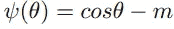*

*与 L-Softmax 和 A-Softmax *ψ(θ)* 相比，这要简单得多，AM-Softmax 的性能也更好。此外，与 A-Softmax 类似，AM-Softmax 也对权重和偏差进行归一化处理，但引入了一个新的超参数 *s* 来缩放余弦值。最后，AM-Softmax 损耗可以定义如下。*

*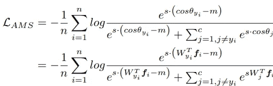*

*因此，决策边界将形成于*

*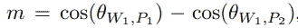*

*AM-Softmax 判决边界*

*其中，在二元分类示例中，P1 是类别 1 的特征，p2 是类别 2 的特征。*

**

*AM-Softmax 在二进制分类中的直观解释[【来源】](https://arxiv.org/abs/1801.05599)*

*为了更好地可视化 AM-Softmax 损失的影响，使用具有时尚 MNIST 数据集的 7 层 CNN 模型将其与其他损失进行比较。CNN 模型的 3 维特征输出被归一化并绘制在如下所示的超球体(球)中。从可视化中，您可以看到 AM-Softmax 在对输出进行聚类时的性能与 SphereFace (A-Softmax)相似，并且随着裕度的增加，m 越大，性能越好。*

*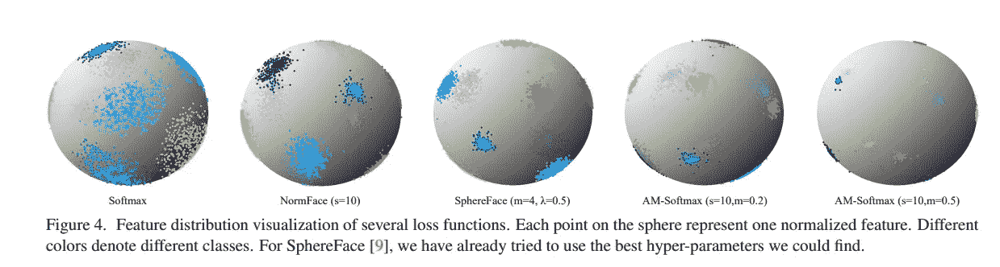*

*超球面几何解释[【来源】](https://arxiv.org/abs/1801.05599)*

*此外，AM-Softmax 和其他损失也在开放集数据集上进行测试，使用 Casia-WebFace 进行训练，使用 LFW 和 MegaFace 进行测试，并移除重叠身份。我们可以看到 AM-Softmax 优于其他损失，特别是在 MegaFace 数据集上。*

*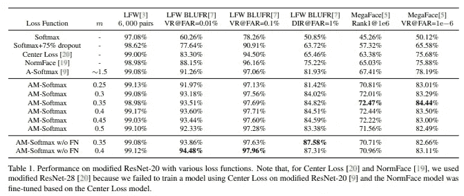*

*[【Source】:用于人脸验证的附加边距 Softmax】](https://arxiv.org/pdf/1801.05599.pdf)*

# *摘要*

*总之，L-Softmax、A-Softmax 和 AM-Softmax 损失都试图通过引入 Softmax 损失的余量来结合分类和度量学习，并旨在最大化类之间的距离和增加相同类之间的紧密性。在这三个模型中，AM-Softmax 被证明在模型性能方面提供了最好的提高，特别是在用于人脸验证的 LFW 和 MegaFace 数据集上。*

*最后，我要衷心感谢我团队中的所有同事，尤其是阿克毛、易卜拉欣和英·康咪咪，他们回答了我所有的问题，并帮助我理解了这些概念。*

*附言:看看我的另一篇关于圈损的文章。我实际上读到了 AM-Softmax，因为它被圈损论文引用了。它引入了一个有趣的统一公式，可以根据输入退化为 AM-Softmax 或三重态损耗。*

* [## 暹罗网，三重损失，圆损失解释。

### 理解“圈损失:对相似性优化的统一观点”

medium.com](https://medium.com/vitrox-publication/understanding-circle-loss-bdaa576312f7) 

# 参考

[【1】](https://arxiv.org/pdf/1612.02295.pdf)刘文伟，温，于，杨。卷积神经网络的大幅度软最大损失。国际机器学习会议，第 507–516 页，2016 年

[【2】](https://arxiv.org/pdf/1704.08063.pdf)刘文伟，温，俞正声，李，拉杰，宋。用于人脸识别的深度超球面嵌入。2017 年 IEEE 计算机视觉和模式识别会议论文集。

[【3】](https://arxiv.org/pdf/1801.05599.pdf)王凤芳，郑俊杰，刘文伟，刘浩辉。用于人脸验证的附加余量 softmax。IEEE 信号处理快报，25(7):926–930，2018。*