# 使用 Pytorch 第 2 部分轻松解决班级失衡问题

> 原文：<https://towardsdatascience.com/address-class-imbalance-easily-with-pytorch-bb540497d2a6?source=collection_archive---------23----------------------->

使用 Pytorch 对同一棵向日葵进行过采样？图片来源于[杰弗里·约翰逊](https://www.flickr.com/photos/jerseyjj/21039413358/)。

了解 Pytorch 的*称重随机取样器*

在之前的[文章](/address-class-imbalance-easily-with-pytorch-e2d4fa208627?source=your_stories_page---------------------------)中，我们看到了如何通过*加权随机采样器*进行过采样来解决类不平衡问题。实际上，这降低了过度拟合的风险。在本文中，**我们将展示 *WeightedRandomSampler* 是如何实现的，并给用户一些直觉。**我们首先给出一个应用简单统计的例子，然后我们从数学上处理一个更一般的场景。我们的目标是理解我们如何从每个类中得到相同数量的观察结果，即使它们是不平衡的。

没有比不明白我们用什么更糟糕的了，对吗？🤗

> **注**。如果你喜欢这篇文章，一定要关注我。很多人喜欢我的文章，请关注我以示支持，这真的很有帮助！🤗

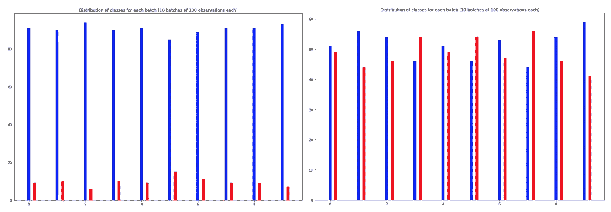

我们数据集的 10 个批次中的类分布。红色表示辅修课，蓝色表示主修课。我们使用 WeightedRandomSampler 从左边不平衡的数据集到右边更平衡的数据集。

现在让我们看看 Pytorch 中实现的 *WeightedRandomSampler* 的源代码。我们将学习一些理论来理解代码，然后看一个简单的例子来很好地理解实现。

Pytorch 的[源代码](https://pytorch.org/docs/stable/_modules/torch/utils/data/sampler.html#WeightedRandomSampler)中，关键函数如下:

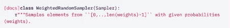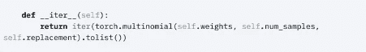

在 WeightedRandomSampler 类中，关键函数是 call **__iter__** 。

> **一个关键思路:**从有控制参数的多项式分布中提取。

Pytorch 使用具有给定参数的多项式分布，即**权重**、样本数量 s 的**以及我们是否使用**替换**进行采样。**

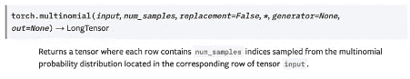

Pytorch 引入的关键思想是从点集的多项式分布中提取。每个点被赋予一个给定的采样概率。这种概率由其具有给定权重参数的类来定义。

## 一个简单的例子:

让我们假设我们的数据点按如下方式排序:

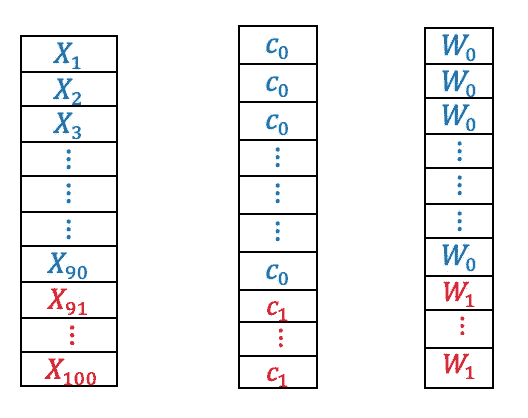

左边是 100 个观察值，中间是它们的类别分布，右边是 WeightedRandomSampler 分配的权重参数。蓝色代表大类，红色代表小类。

我们可以控制权重，以便给予次要类别更多权重:

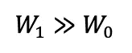

然后，我们绘制一个带有受控参数的多项式分布。每个参数定义了一个给定观察值的绘制概率。事实上，我们是从一组观察值的多项式分布中得出的。

这里，我们将权重参数设置如下:

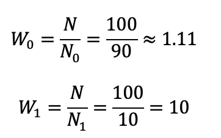

将 WeightedRandomSampler 中的权重设置为每个类别分布的经验先验的倒数。

概率可以通过使用类似于 **softmax** 函数的简单标准化权重向量来找到。例如，可以执行以下操作:

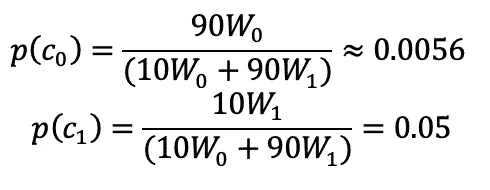

> **重要提示**:我们需要对 N 个观测值进行归一化处理。目标是得到一个元素之和等于 1 的向量。这不是通过权重向量实现的，因此标准化是必要的。

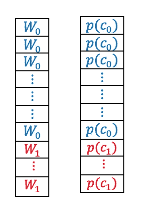

从权重向量(左边)到概率向量(右边)。蓝色代表大类，红色代表小类。

现在，我们能否从数学上展示，在抽取 100 个随机样本后，我们如何从 c0 中抽取 50 个观察值，从 c1 中抽取 50 个观察值？

设一个随机变量描述 c1 中采样 m 个点后的观测数，这里设为 100。

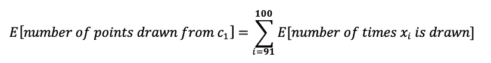

因此，

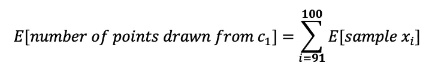

利用期望的线性度，我们可以在小类 c1 的点集上得到一个线性方程。

现在，我们知道，从一个多项分布中，**在采样 m 次**后，我们可以将期望值表示如下:

采样一个点 xi 有一个由多项式分布**多项式**(【x1，...，x90，x91，..，x100]，[p0，…，p0，p1，..p1])。

对于位置[91，100]中的所有观察值，我们说它们属于 c1 类:

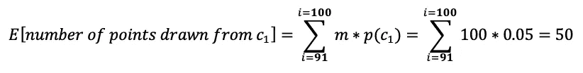

结果，从辅修课 c1 中抽取的**期望点数(最初包含 10 个点)现在是 50 个**。类似地，主要类别 c0 的预期观测值数量如下:

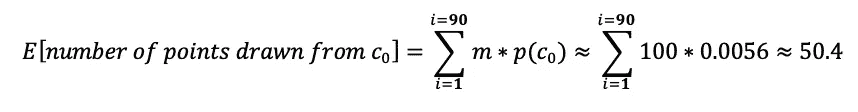

从类别 c1 中提取的**预期观察值数量也在 50 左右。**

## **更严谨，更通用:**

在这一节中，我们试图更加概括。然而，为了简单起见，我们假设我们处理的二元问题只有两个类 c0 和 c1。

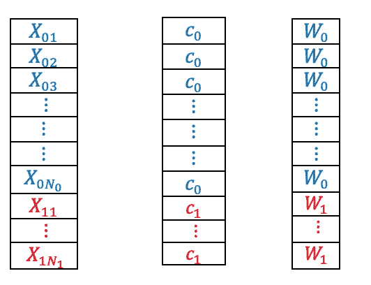

蓝色代表大类，红色代表小类。

我们现在有 N 个观察值，使得:

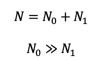

我们需要像前面的例子一样建立概率。这次，我们有:

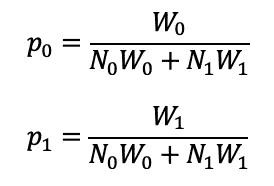

现在我们要**生成从整组点 X 上的多项式分布中采样的 m 个点**:**多项式** (X，[p0...，p0，p1，..p1])。

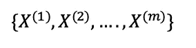

我们从数据 x 中生成 m 个样本。

我们定义一个随机变量来描述一个点是否来自类 c0:

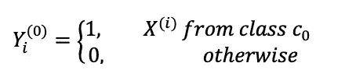

描述抽样观测值是否属于 C0 类的随机变量。

因此，我们可以很容易地表达这样的随机变量的期望值:

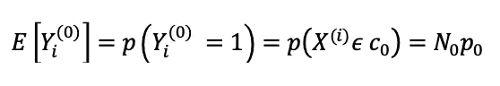

现在让我们描述随机变量，它给出了从 c0 类中采样的点的总数:

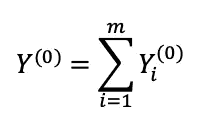

因此，我们可以计算 m 次后从类 c0 采样的元素的预期数量:

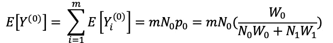

我们之前已经了解了如何在*加权随机采样器*中设置权重:

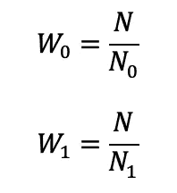

将 WeightedRandomSampler 中的权重设置为每个类别分布的经验先验的倒数。

现在我们可以有一个更简单的表达式来表示在 m 次之后从类 c0 **中采样的元素的预期数量:**

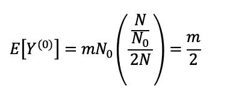

这意味着我们期望正好一半的采样观察值来自 minor 类。我们从数学上解决了类别不平衡问题，证明了我们可以从次要类别中采样与主要类别完全相同数量的观察值。

## 贝叶斯理论的进一步发展:

给每个类增加权重相当于[贝叶斯](https://en.wikipedia.org/wiki/Bayes%27_theorem)方法。我们调整了优先等级，给了次要等级更多的权重。这种等价性通过以下关系式得到强调:

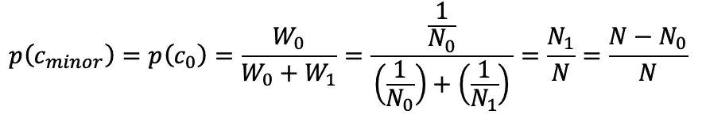

事实上，我们可以将我们的抽样方法建立在贝叶斯理论的基础上，我们引入了一个叫做先验的新元素。该过程是顺序采样:

*   **第一步**:抛一枚概率为 p(c0)的非公平硬币，得到小类 c0，概率为 p(c1)得到大类 c1。
*   **第 2 步:**从上一步中抽取的类中，对一个观察值进行统一采样:

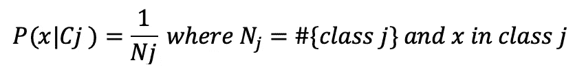

顺序抽样的第二步，我们从第一步确定的固定先验类别中抽取一个点。

## 结论

总之，通过使用带有多项式分布的*加权随机抽样器*,我们期望从每一类中得到相同数量的观察值。

关键思想在于在一组观察值上构建多项式分布，其中每个观察值表现为其自己的类，具有受控的被抽取概率。

## 贡献者:

[索海尔](https://www.linkedin.com/in/souhail-asmi-2a24b6118/)。洛桑联邦理工学院应用数学专业硕士研究生。

[马斯塔法](https://www.linkedin.com/in/mastafa-foufa-666a1a109/)。之前是微软的数据科学家实习生和瑞典皇家理工学院的机器学习学生。