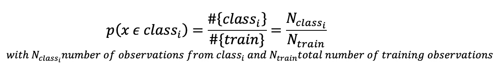
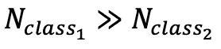
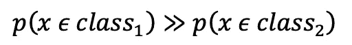
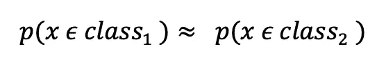
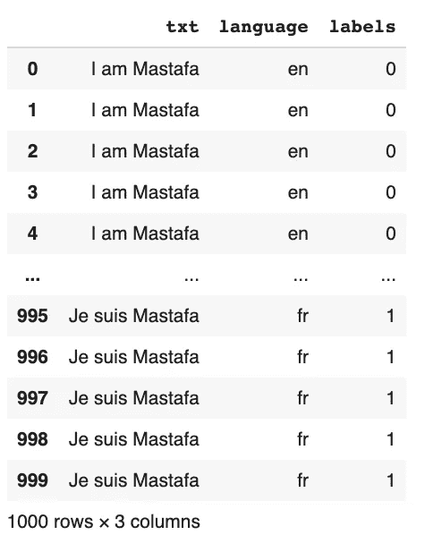
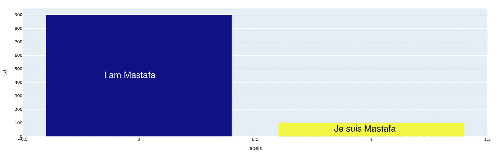
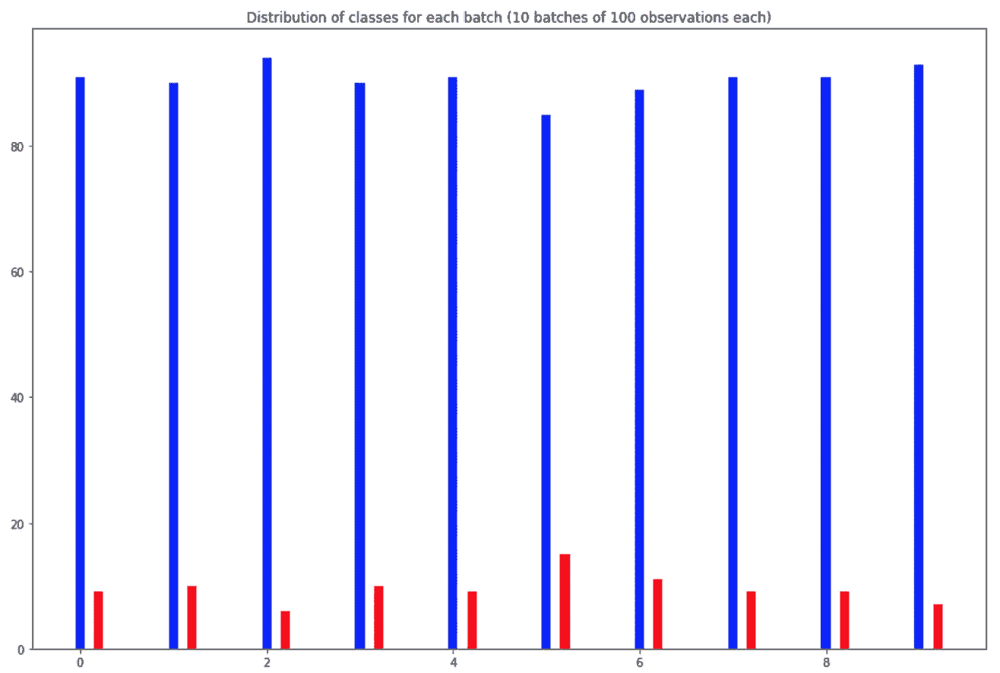
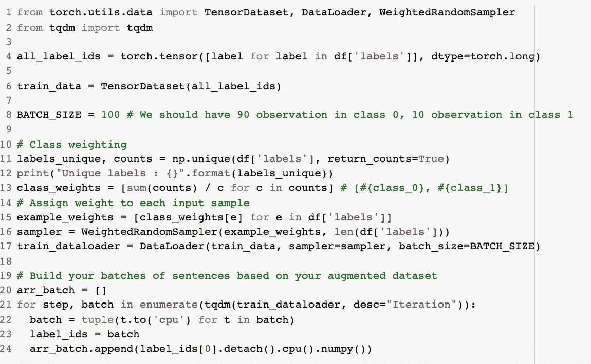
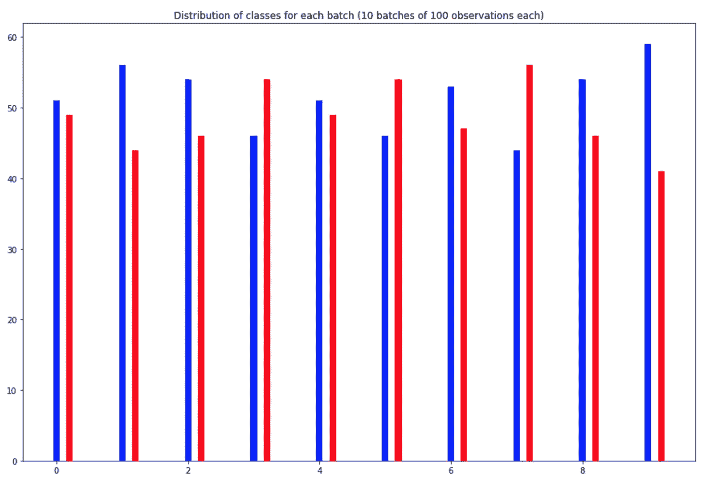

# 使用 Pytorch 轻松解决班级失衡问题

> 原文：<https://towardsdatascience.com/address-class-imbalance-easily-with-pytorch-e2d4fa208627?source=collection_archive---------21----------------------->

计算机视觉中的数据增强。图片的制作者名单为 [fastai](https://mc.ai/data-augmentation-by-fastai-v1/) 。

## 当你的模型过度拟合你的数据时，你能做什么？

> **重要提示:**如果你能看到这个故事的结尾，请考虑**在灵媒上跟我学更多的**。我将非常感谢你的支持。

这个问题经常发生在我们处理不平衡数据集的时候。如果您的数据集代表几个类，其中一个比其他的少得多，那么就很难了解代表这样一个小类的真正的底层分布。

正如这篇必读的[论文](https://arxiv.org/abs/1710.05381)、**中所解释的，解决几乎在所有分析场景中都占主导地位的类不平衡的方法是过采样。**过采样应应用于完全消除不平衡的水平，而最佳欠采样率取决于不平衡的程度。与一些经典的机器学习模型相反，过采样不会导致 CNN 的过拟合。

在实践中，当训练机器学习模型时，人们将遵循一些关键步骤:

1.  将数据分成一个训练/测试集(80%，20%)。
2.  通过对训练数据进行拟合来训练机器学习模型。
3.  在测试集上评估性能。

当使用深度学习架构时，通常会将训练数据分成几批，我们在训练期间将这些数据馈送给我们的神经网络。为了构建这样的批次，我们通常按照观察值集的均匀分布从训练集中随机抽样。

现在需要一些简单的统计数据。假设我们有一个包含两个类 *class_1* 和 *class_2* 的数据集。**从 *class_1* 中随机抽取一个点的概率是多少？**

遵循点集合上的均匀分布，这样的概率很容易表达:

实际上，在二元问题中，当我们从一个类中得到的观察值比另一个类中得到的多得多时，就会出现类不平衡:

因此，我们有:

二元问题中的类别不平衡由从给定类别中得出观察值的不平衡可能性来描述。

换句话说，从 *class_1* 比从 *class_2* 更有可能得出一个点。因为模型看到的 *class_2* 要少得多，所以它不能从这样的类中学习有用的特征也就不足为奇了…

现在，在深入编码之前，我们需要理解人工扩充数据时的一个关键思想。我们想要的是确保通过人为增加辅修班，我们有:

在扩充了我们的数据之后，我们的目标是使从每个类中抽取样本的可能性尽可能接近。

是时候了！让我们用 Pytorch 的[*weighted random sampler*](https://pytorch.org/docs/stable/_modules/torch/utils/data/sampler.html#WeightedRandomSampler)来编码解决这个问题。

**数据集**:我们用来自 *class_major* 的标记为 0 的 900 个观察值和来自 *class_minor* 的标记为 1 的 100 个观察值构建数据集。(90%, 10%)

我们数据集的样本。标签 1 对应于法语句子，标签 0 对应于英语句子。

具有文本数据和两类值 0 和 1 的不平衡数据集的类分布。我们有 900 个 0 类句子和 100 个 1 类句子。

假设我们构建了 10 批，每批 100 个句子，我们最终将得到平均 10 个第 1 类句子和 90 个第 0 类句子。

每班分配 10 批，每批 100 句。红色代表小类，蓝色代表大类。我们可以清楚地看到每一批训练数据中的不平衡。0 类的估计比例现在是 90.5，1 类的估计比例是 9.5。

**如何轻松重新平衡以上内容？**让我们用 Pytorch 库写几行代码。

24 行 python 魔术构建平衡批次。

从上面我们可以看到 *WeightedRandomSampler* 使用数组 *example_weights* 对应于赋予每个类的权重。目标是给次要类分配更高的权重。这将通过从均匀分布移动到具有受控参数的多项式分布来影响从每个类中提取点的可能性。

现在我们可以详细看看 *arr_batch 中包含的批次，*每个批次实际应该有 100 个句子。出于形象化的目的，我们只关注这里的标签。

0 类的估计比例现在是 51.4，1 类的估计比例是 48.6。

正如我们从上图中看到的，我们现在有了平衡的数据批次。因此，在训练期间，我们的模型不会看到一个类别比另一个类别多很多，因此降低了过度拟合的风险。

总之，我们看到:

1.  过采样是解决类不平衡的关键策略，因此降低了过度拟合的风险。
2.  当数据集中存在类别不平衡时，从数据集中随机取样是个坏主意。
3.  使用 [*加权随机抽样加权随机抽样器*](https://pytorch.org/docs/stable/_modules/torch/utils/data/sampler.html#WeightedRandomSampler) 通过对次要类进行过抽样来重新平衡我们的训练数据类。

> **重要的**:如果你到目前为止，**一定要在 Medium** 上关注我，以示支持。🤗

在下一篇文章中，我们将深入研究 *WeightedRandomSampler* 到**的实现，更好地理解加权方案**。我们还将在一个简单的机器学习场景中应用过采样，并分析其对整体性能的影响。

感谢阅读，如有任何反馈，请在下方留下评论！🤗