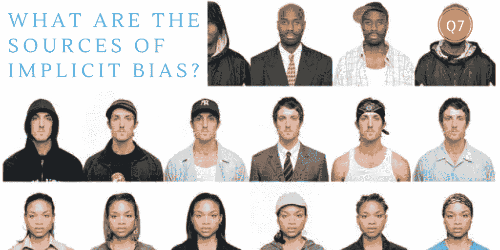

# 解决人工智能的隐藏议程

> 原文：<https://towardsdatascience.com/addressing-ais-hidden-agenda-e67d353769ff?source=collection_archive---------34----------------------->

## 人工智能中内隐偏见的来源和显著例子有哪些？在建立可接受的数据实践中，怎样做才能最小化它们的后果？

图片来源:巴伊特·罗斯·史密斯

当我们唤起人工智能的隐性偏见时，我们正在认识到机器学习反映了在重复和例外情况下影响管理理解、行动和决策的不合理态度和刻板印象。尽管这种偏见可能是有利的，也可能是不利的，但这些隐含的评估或信念可能会严重限制组织客观利用数据科学的能力。人工智能中存在四种潜在的隐性偏见来源:数据、算法、我们自己的逻辑以及我们对道德行为的定义。让我们依次探索每一个。

机器学习涉及指定用于训练(测试)算法的数据集，该算法随后将用于现实世界条件。虽然作为一个规则，一个组织收集的训练模型的数据越多，结果就越好，但在实践中，隐含偏差的几个来源显著地损害了模型的相关性。当用于训练模型的数据不能准确表示模型将在其中运行的环境或问题空间时，就会出现样本偏差。当训练数据内容受到来自人群的刻板印象或偏见的影响时，就会出现偏见。最后，测量偏差来自错误的测量，其结果系统地污染了数据。

Twitter 流为消费者意见的情感分析提供了一个公共资源，也是样本偏差的一个生动例子。当运行 SVM 和朴素贝叶斯等算法时，Twitter 是文本挖掘的合理选择，因为产生的数据集易于访问，具有成本效益，并且包括各种各样的消费者资料。然而，这种选择提供了一组特定技术用户的意见，而不是一般人群的代表性样本。它将错过那些无法使用智能手机(也无法使用电脑)的人，更不用说那些对这一社交媒体渠道过敏的人了。测试数据可能包括来自大量涌入该媒体的自动用户账户的几条消息，以及这些机器人的转发，这些机器人被编程为在每个问题上提供两极分化的立场。

处于机器学习核心的算法永远不会比用于测试它们的数据更好。

隐含偏差的第二个来源是构造算法来解释或预测现实世界现象的方式。对于数据科学家来说，偏差和方差一起描述了影响预测性能的算法属性。由于偏差和方差是相互依赖的，数据科学家被迫在两者之间寻求平衡。具有高方差的模型往往更适合训练数据，但可能不能很好地推广到训练数据集之外的数据。对于一个给定的用例，在两者之间找到适当的平衡是任意的，并且对于依赖这些算法的组织决策者来说通常是不透明的。

Equivant 的 COMPAS 软件在许多刑事司法系统中广泛用于保释和判刑。这种专有软件依靠一种算法来预测重复犯罪的可能性。这也是算法偏差的一个证据充分的例子。2016 年初，新闻机构 ProPublica 发表了一项研究，证明了该算法的种族偏见:它系统地高估了黑人被告的犯罪意图，同时低估了白人被告的累犯率。尽管由于软件的专有地位，COMPAS 的算法不向公众开放，但该算法显然有两倍的可能将黑人被告错误分类，白人惯犯有 63.2%的时间被错误分类。

偏见的第三个来源可以在人类从他们看到的数据中归纳和推断逻辑结论的方式中找到。认知偏差是在判断中偏离规范或理性的系统模式。一些认知偏差可能是适应性的。认知偏差可能会影响对相似性、判断、记忆和行动的感知。尽管认知偏差可能会在每种情况下导致更有效的行动，但它们通常会导致对个人和业务挑战的误导性表述。某些认知偏差是人类处理局限性的“副产品”，要么是由于缺乏适当的心理机制，要么是由于管理者处理信息的带宽有限。

这种认知偏差导致团队刚刚实现盈利的经理们将可用数据视为市场正在增长的证据，而苦苦挣扎的经理们则倾向于将相同的数据解读为相反的证据。可用性偏差涉及到一种认知机制，在这种机制中，管理者在鉴定新信息时会优先考虑容易想到的数据。如果他们正在进行风险评估，他们倾向于通过最近发生的或提供强烈情感依恋的类似事件来衡量新数据。管理判断的准确性受到经验的影响，他们更有可能低估或高估事件发生的可能性。这回避了一个问题，即人类理性是否不可避免地背负着认知偏见，或者管理决策的内在价值是否是管理者有选择地解释人工智能结果的能力？。

偏见的最后一个来源来自人类对伦理的看法。伦理可以理解为一套指导个人和组织行为的一般原则。道德反映了我们对什么是对什么是错的看法，我们对公司及其市场性质的信念，以及我们对商业实践中可接受的行为的看法。根据文化相对主义的支持者，伦理行为并不存在唯一的真理:我们对可接受限度的解释受到现有社会规范、文化习俗和宗教影响的制约。道德考量通常与我们对自身利益的认知相冲突，因此，许多经理可能会越界，而没有意识到他们正在做任何不道德的事情。

以斯坦福大学以人为中心的人工智能研究所为例。该大学去年成立了该研究所，其愿景是“人工智能的设计师必须广泛代表人类”。然而，当该研究所透露 120 名教师和技术领导者参与该计划时，超过 80%的人是白人，几乎同样多的人是男性。这个群体到底代表了什么？他们代表了不同的种族、文化和当今行业的知识潮流，还是代表了大众？大多数人在专门的商业和工程学校接受教育，他们能够应对当地的道德挑战吗？*如果它们确实代表了当今的挑战，那么这种代表是否应该被修改以代表更理想的多样性？*

可以做些什么来最小化人工智能隐含偏见的后果？一个策略可以是提高管理层对整个组织使用的数据、算法和应用程序中隐含偏差来源的认识。一个补充的策略将包括定期评估用例以及数据驱动的决策，以寻找不良偏差的证据。识别经常困扰管理决策的风险、不确定性和模糊性的来源，可以帮助确保将机器智能用在最有效的地方。高级管理层可以更进一步，确定并有意识地承认可接受的数据实践和期望的道德立场。最后，但同样重要的是，组织和专业协会可以建立反馈机制，以鼓励围绕数字伦理的讨论和辩论。

这篇文章是我们对 Jay Liebowitz 即将出版的“数据分析和人工智能”一书的贡献的一部分。关于数字伦理的进一步想法可以在我们关于[数字伦理](https://www.baieurope.com/ebook-ethics)的电子书中找到，也可以在我们在[商业分析研究所](http://baieurope.com/)举办的管理会议、课程和暑期学校中找到。

Lee Schlenker 是商业分析和社区管理教授，也是 BAI 的校长。他的 LinkedIn 个人资料可以在[www.linkedin.com/in/leeschlenker.](http://www.linkedin.com/in/leeschlenker.)查看，你可以在[https://twitter.com/DSign4Analytics](https://twitter.com/DSign4Analytics)的 Twitter 上关注白