# 通过数据解决对新冠肺炎报道的批评

> 原文：<https://towardsdatascience.com/addressing-criticisms-to-covid-19-reporting-through-data-de0a4c0eea8?source=collection_archive---------39----------------------->

## 调整世界末日数字的轻触式尝试

在过去几个月的谨慎“回归正常”时期之后，英国首次实施封锁措施的 6 个月纪念日即将到来，随之而来的是再次收紧限制的承诺。我们大多数人都预料到，在经历了夏季的相对轻浮之后，会出现某种形式的第二次封锁，因此，对于鲍里斯·约翰逊宣布重新引入某些限制以遏制病毒传播，很少有人会感到惊讶。看着报告的阳性病例以惊人的速度增加，这似乎也是一个显而易见的决定:

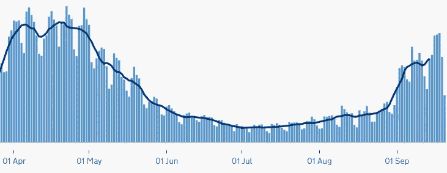

**图 1** 英国总病例数— [来源](https://coronavirus.data.gov.uk/)

随之而来的是公众对报道的数字越来越怀疑。包括英国广播公司在内的一些媒体对这些数字的可靠性提出了质疑，原因是观察到住院人数和与 COVID 相关的死亡率都没有接近报告的阳性病例率:

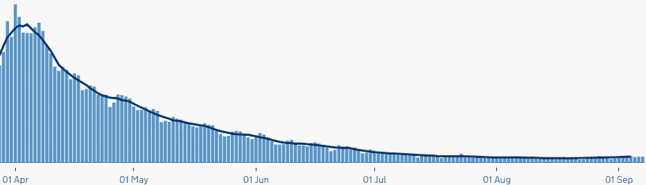

**图 2** 英国住院总人数— [来源](https://coronavirus.data.gov.uk/)

**图 3** 英国总死亡人数— [来源](https://coronavirus.data.gov.uk/)

虽然这些渠道提出的所有挑战可能都不成立，但它们确实凸显了这些数字的报告方式存在的一些突出问题，更重要的是，公众以及政府对这些数据的解读方式也存在问题。在接下来的几分钟里，我试图强调其中的几个，并提供从不同角度看待这些数字的方法。

## 放弃

开始之前，我想强调我不是医生、流行病学家、医学生物学家、卫生部长、政策顾问、经济学家和功利主义哲学家。这些计算应该有最大限度的保留，当然不能用来支持任何议程。然而，我确实相信，如果政策决定是基于数据做出的，那么数据应该尽可能地被仔细检查。

# 英国 COVID 报告的问题

我将探讨关于阳性病例报告的三个关注领域，但在我们深入探讨之前，有必要提供一点关于英国如何进行检测的背景。

测试目前以 4 种方式进行(支柱)。这些是:

*   **支柱 1: NHS 和 PHE 检测** —在英国公共卫生(PHE)实验室和 NHS 医院为有临床需求的人以及卫生保健工作者进行 PCR 拭子检测
*   **支柱 2:商业伙伴检测**——政府指导中规定的针对更广泛人群的 PCR 拭子检测
*   **支柱 3:抗体检测**——抗体血清学检测，以显示人们是否有 6 月 1 日以来报告的新冠肺炎病毒抗体
*   **支柱 4:监测检测**——在 PHE、国家统计局、生物银行、大学和其他合作伙伴的支持下，为国家监测进行抗体血清学和 PCR 拭子检测，以更多地了解病毒的流行和传播情况，并用于其他检测研究目的，例如家庭检测的准确性和易用性

支柱 1、2 和 4 都是在不同情况下进行的 PCR 拭子试验；支柱 3 是与众不同的，它是一项血清抗体测试。支柱 2 测试通过商业承包商、在移动测试点或通过送到人们家中的工具包进行。顺便说一句，支柱 2 测试在最近几个月有显著增加，因为政府正在加强其测试计划(理应如此)。这就引出了第一个问题。

## 案例没有根据测试数据进行调整

敏锐的观察者会点击 gov.uk 上的每日病例计数，并漫步到显示 pillar 进行的测试数量的图表上:

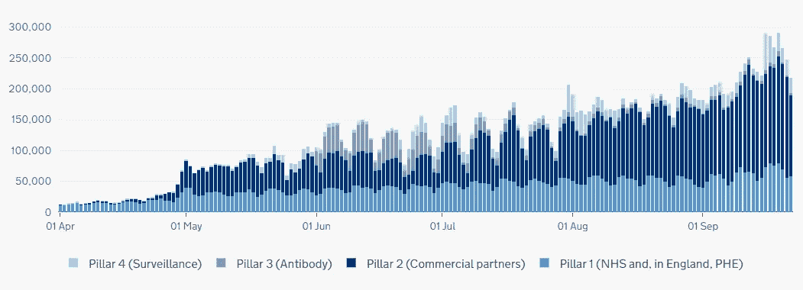

**图 4** 支柱在英国进行的测试— [来源](https://coronavirus.data.gov.uk/)

虽然大多数支柱保持相当一致，但支柱 2 测试(深蓝色)的活动自 8 月份以来显著增加，尤其是在 9 月份。

这个问题应该是显而易见的:你测试得越多，你就会发现越多的情况。这背后的科学非常直观；至少一些阳性病例的增加可以用这样一个简单的事实来解释，即更多的家庭药盒被提供和使用。

## 测试被认为是完美的

这些数字的一个更微妙的复杂因素不是来自有多少人接受了测试，而是我们能在多大程度上信任这些测试。医学测试并不完美，你对自己的诊断有多少把握很大程度上取决于它们的预测能力。与分类算法非常相似，医学中的诊断工具具有敏感性和特异性。为了在 COVID 的上下文中理解它们，首先孤立地看它们是有用的。

敏感性给了我们明确患有冠状病毒的个体被诊断为冠状病毒的概率。如果我们以 60%的灵敏度测试 10 个肯定携带病毒的人，结果(平均)将返回 6 个阳性病例和 4 个阴性病例:

**图 5** 作者图，图标 [bqlqn](https://www.flaticon.com/authors/bqlqn) 制作

另一方面，特异性是健康人被正确识别为阴性诊断的概率。如果用具有 60%特异性的试剂盒测试 10 个健康人，结果将平均返回 6 个阴性和 4 个阳性:

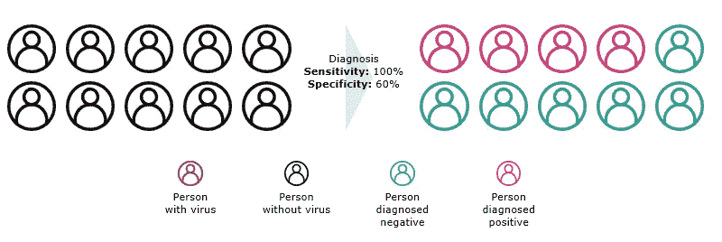

**图 6** 作者图， [bqlqn](https://www.flaticon.com/authors/bqlqn) 图标

我们可以用略高的数字来说明在大规模测试中特异性的影响。假设我们有 100 个人，其中 10 个肯定有病毒，90 个没有。在这种情况下，100%灵敏度、90%特异性测试会给出什么结果？

**图 7** 作者图，图标 [bqlqn](https://www.flaticon.com/authors/bqlqn) 制作

该测试具有 100%的灵敏度，因此它能直接正确地识别所有 10 名真正受感染的人。然而，90%的灵敏度意味着剩余的 90 个阴性中只有 90%被正确诊断，剩余的 9 个人在他们实际上没有携带病毒时检测为阳性。

这是怀疑论者书中的另一个关键章节；如果特异性(或者更确切地说是 1-特异性)明显高于病毒的实际流行率，更多的检测只会把水搅浑，并必然增加阳性检测病例的数量。RT-PCR 检测的实际灵敏度和特异性分别在 60-85%和 94-99%之间，这取决于你咨询的是哪项(小样本)研究。

不管怎样，特异性和敏感性应该(而且确实)在真实患病率的估计中发挥作用，我们将在下一节探讨。

## 测试支柱一视同仁

但首先，我想指出一些更微妙的东西；测试进行的环境对于我们能在多大程度上依赖其结果非常重要。当然，由医院专业人员进行的检测(例如，在医院可以进行重复检测以减少不确定性)应该比带回家的试剂盒更有意义，在医院人们自己进行擦拭，污染的风险要高得多。

有趣的是，尽管这些因素表明以医院为基础的支柱 1 测试的阳性率更高，但实际情况恰恰相反:

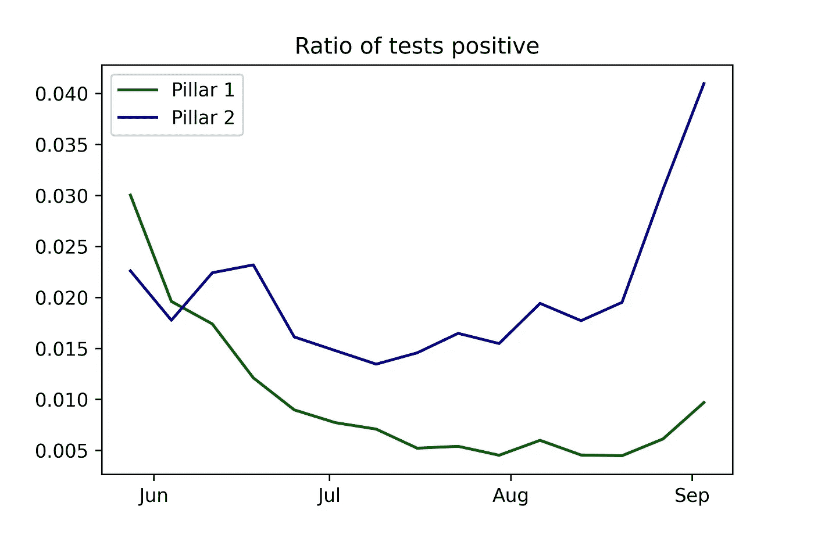

**图 8** 支柱 1 的比率& 2 在英国检测返回阳性— [数据来源](https://www.gov.uk/guidance/coronavirus-covid-19-statistics-and-analysis)

自 6 月份以来，在医院检测出阳性的机会已经减少，并且对于带回家的试剂盒来说保持相对稳定，直到两者在 9 月份再次开始增加，到那时，你在家里检测出阳性的可能性是在医院的 4-5 倍。

对此可能有多种解释，但我只能猜测(不是专家，记得吗？)——例如，这可能是污染和人口统计学差异的结合。支柱 2 测试在护理院中使用很多，这些护理院因局部大规模感染而闻名，但它们也在普通公众中使用，大概是在旅行或工作之前。另一方面，支柱 1 测试用于病人和有医疗需求的人。另一个关键区别是，支柱 2 测试由商业承包商处理，因此涉及的方法可能有所不同。

无论如何，这种系统性的差异应该被强调，尤其是当这些阳性病例被一起报告时。

# 我们能做得更好吗？

在本文的最后一部分，我将演示一些方法来解决我上面概述的问题。为了简洁起见，我不会分享内嵌的代码片段，但我会让任何人都可以阅读我的笔记本。

## 数据

我将在 5 月 28 日至 9 月 9 日期间使用英国 15 周的支柱 1 和 2 测试结果，这些结果发布在 [gov.uk](https://www.gov.uk/guidance/coronavirus-covid-19-statistics-and-analysis) 上。该数据提供了按支柱分列的每周测试总数和阳性测试案例。快速浏览一下阳性病例总数，我们会看到熟悉的上升曲线:

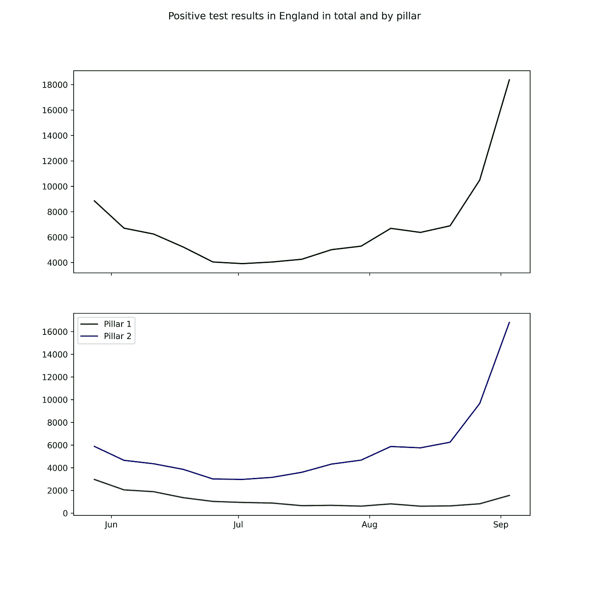

**图 9** 周正支柱 1 & 2 测试案例— [来源](https://www.gov.uk/guidance/coronavirus-covid-19-statistics-and-analysis)

我在这里的工作是:

1.  在给定 PCR 检测的特异性和敏感性估计值的情况下，估计测试人群中活动性感染的真实流行率
2.  对支柱 1 和 2 分别执行此操作
3.  针对每周样本量的差异进行调整

## 估计真实流行率

你的医学测试不是 100%准确的想法并不新鲜。因此，已经推导出一个非常简单的公式，如[Lewis&Torgerson(2012)](https://www.ncbi.nlm.nih.gov/pmc/articles/PMC3558341/)所示:

其中 *P_t* 是该疾病在人群中的真实患病率， *P_a* 是表观患病率， *S_e* 和 *S_p* 分别是诊断测试的灵敏度和特异性。注意，这里我们有 3 个未知数，数据只提供给我们表面的患病率。鉴于 *P_a* 是获得阳性测试结果的概率，我们的观察值(测试结果)将遵循二项分布:

*P_a* 由三个未知数参数化， *P_t* ， *S_e* ， *S_p —* 这些我们都不确定。为了解决这个问题，我将使用贝叶斯推理和马尔可夫链蒙特卡罗(MCMC)抽样来绘制给定先验分布的参数的随机值，将结果与上面由二项式 PDF 给出的概率进行比较。给定测试结果，我的 P_t 的后验概率应该在真实患病率附近收敛。

## 灵敏度和特异性先验

我们简要讨论了 PCR 拭子试验的敏感性和特异性；这些研究的结果有很大的不同，取决于许多因素，如人口统计、地理、疾病阶段和研究时间。[张&杜(2020)](https://papers.ssrn.com/sol3/papers.cfm?abstract_id=3569885) 将这些结果汇总在一起，给出了敏感性和特异性的估计概率分布，我从中获得了构建β先验的灵感:

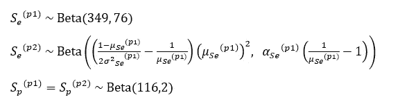

其中支柱 1 和支柱 2 拭子测试的灵敏度和特异性的平均值分别为 0.821 和 0.983，但是支柱 2 灵敏度的方差加倍，表示家用试剂盒正确检测病毒的能力的不确定性更高。

## 真实患病率先验

这就是事情变得更加困难的地方。COVID 是一种疫情，因此它的流行率会随着社区、人群和人群的变化而变化，所以在这里使用海外的研究不会很有效。理想的数据集将来自支柱 4 测试，它正是为此目的而设立的。可悲的是，英国政府并没有公布结果(最近[拒绝了信息自由的要求](https://www.whatdotheyknow.com/request/daily_pillar_4_covid_19_test_res)这样做)。

由于缺乏好的数据，我的最佳选择是最初相信结果告诉我的东西，并用与那一周的明显患病率相对应的方法构建我的β先验(对我的参数进行一定程度的任意缩放，以表示我对结果的信心):

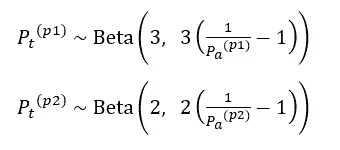

我可以画出从 9 月 3 日开始的一周内的真实流行率:

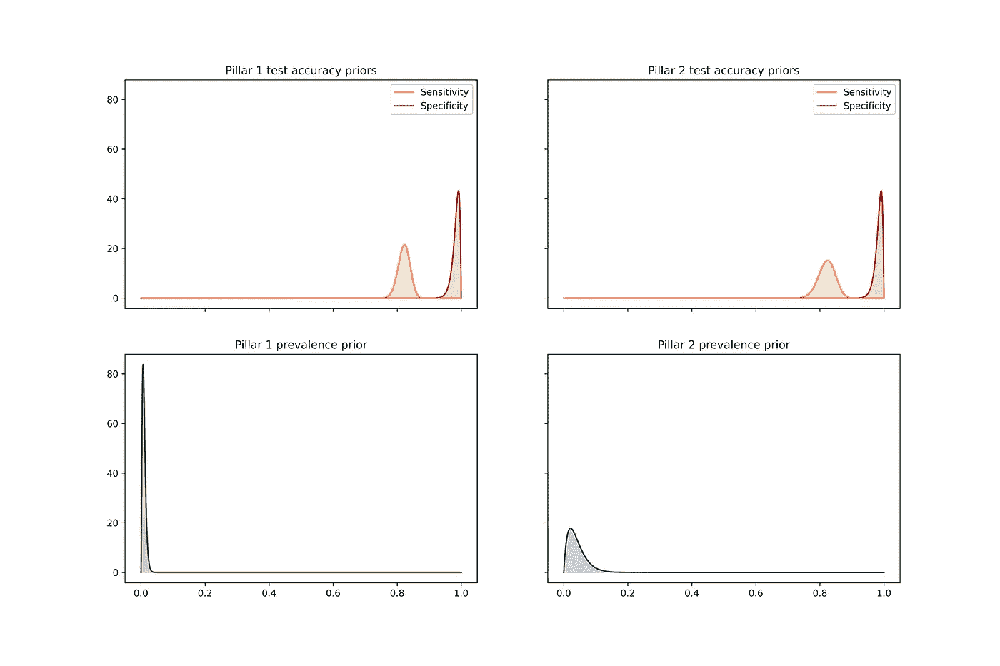

**图 10** 敏感性、特异性和患病率的β先验

## 蒙特卡罗马尔可夫链抽样

我们可以从之前的 3 个分布中随机抽取样本(支柱 1 和支柱 2 ),根据之前的公式估计我们的表观患病率。然后，我们可以将其与我们观察到的数据进行比较，评估这些样本出现的可能性，给出我们表观患病率的二项式分布，并构建后验分布。

抽取 10，000 个样本后，支柱 1 的后验概率如下所示:

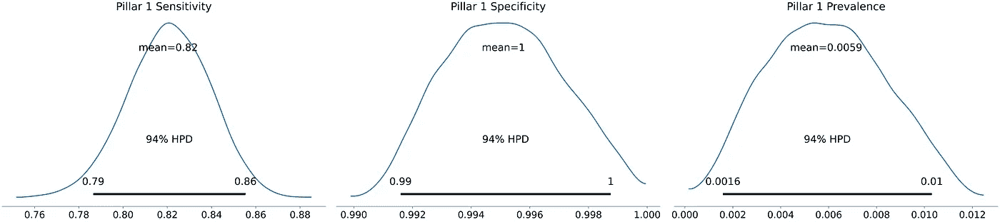

**图 11** 支柱 1 后视图

敏感性和特异性大致保持不变，我们对支柱 1 测试真实流行率的估计集中在一个较低的平均值附近(从 0.010 下降到 0.006)。

支柱 2 也是如此:

**图 12** 支柱 2 的后视图

同样，测试准确性指标保持相对一致，而流行率从 0.040 下降到 0.031。

## 每周估计

我们可以为我们的个人每周观察重复上述过程，根据我们的数据重新创建先前的构建练习。这使我们能够将估计的流行率与报告的流行率进行对比；我将 94%的最高后验密度值作为伪置信区间包含在图上:

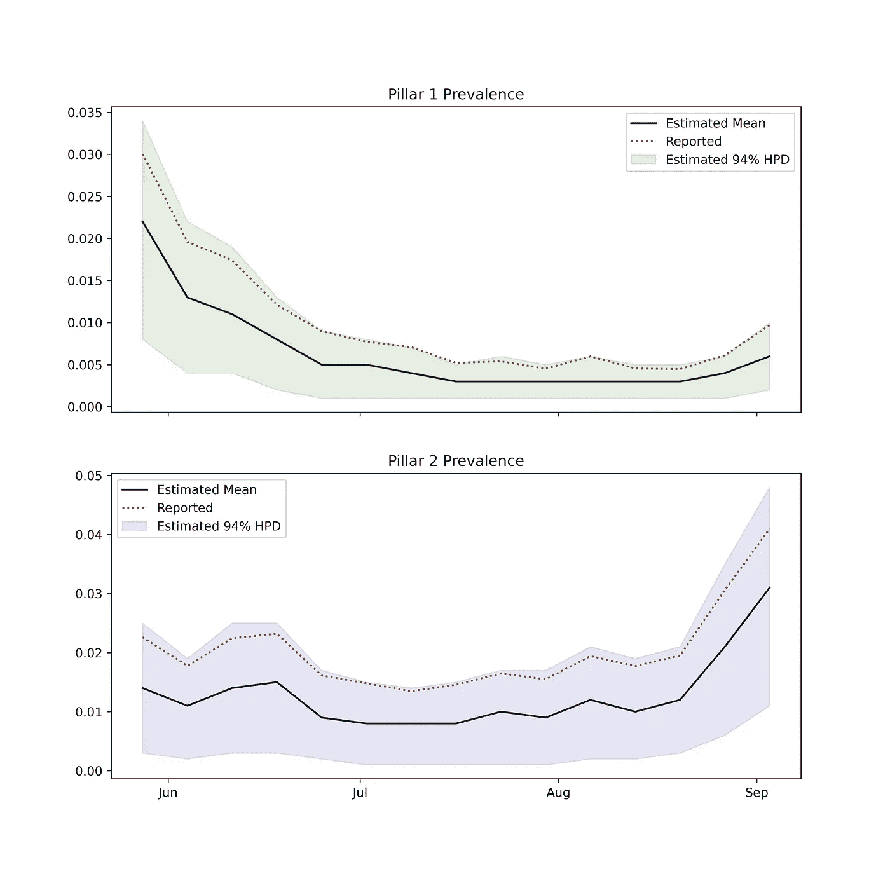

**图 13** 支柱 1 & 2 的估计流行率

我们观察到，两个支柱的估计平均患病率始终低于报告的患病率，然而，报告的患病率确实在 94% HPD 范围内。

我们还可以按支柱构建总病例的估计值，方法是通过已进行的总检测按比例放大患病率估计值，从本质上给出我们认为受检测者中有多少人真正被感染:

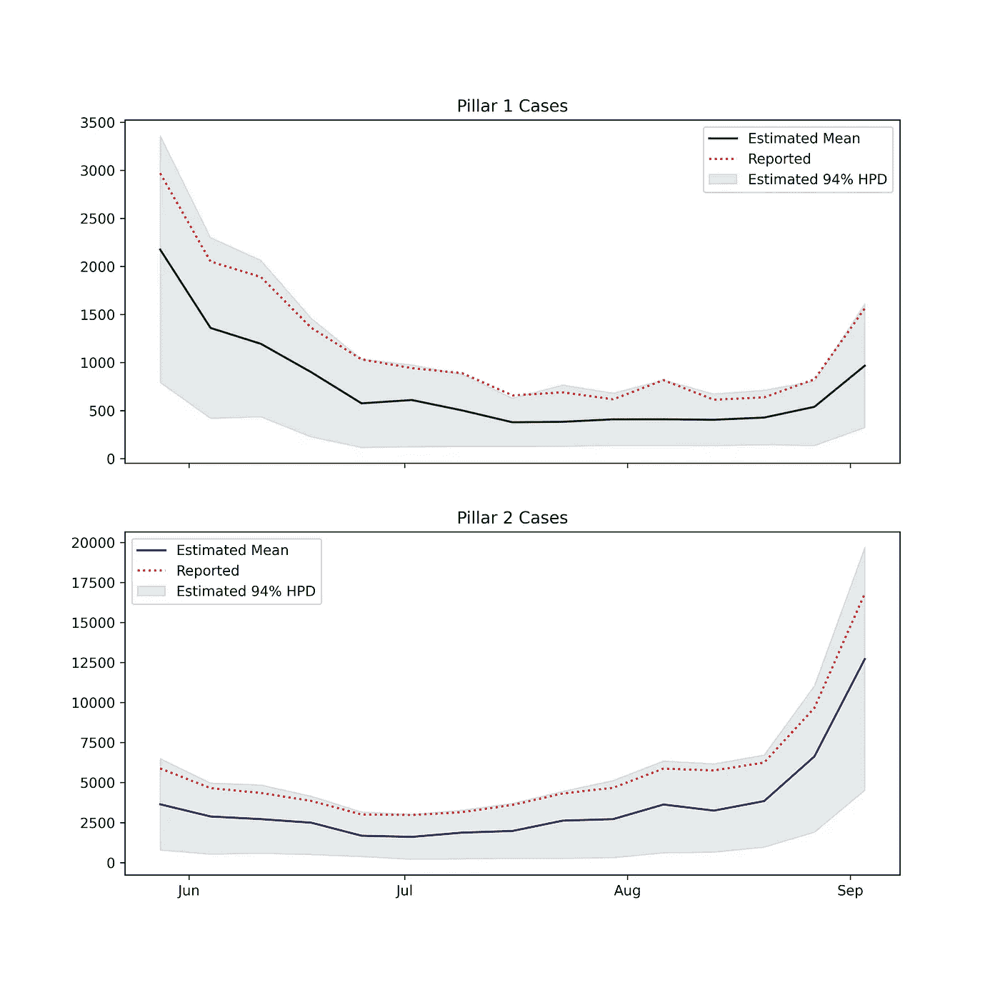

**图 14** 支柱 1 & 2 的预估案例

最后，我们可以结合支柱 1 和 2 案例的估计值，将其与报告的案例总数进行比较:

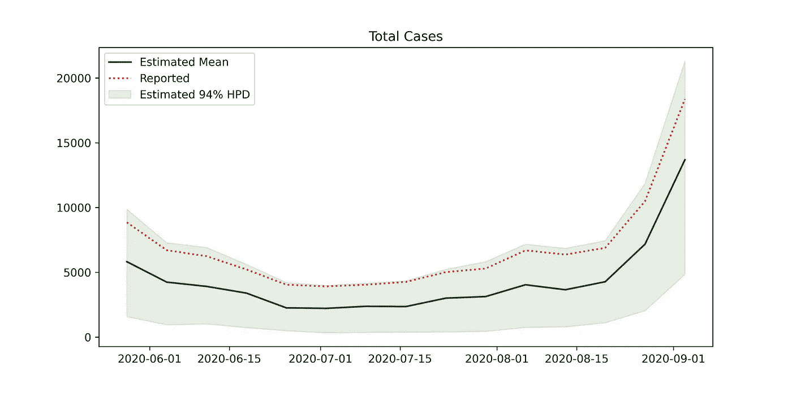

**图 15** 两大支柱的估计案例总数

# 我们从中学到了什么？

我概述了英国新冠肺炎报告面临的一些挑战，并提供了一些解决这些挑战的方法，展示了它们对公开数据的影响，特别说明了 PCR 检测的估计特异性和敏感性，着眼于估计患病率而不是总病例数(不考虑检测量)，并分别处理了两个支柱。这告诉了我们什么？

## 阳性结果可能比报道的要少…

也就是说，在被测试的人群中。*假设*我们对聚合酶链式反应测试准确性的了解是正确的，并且我们的先验具有相当的代表性，那么实际的阳性案例可能低于支柱 1 & 2 中报告的案例。话虽如此，如果我们扩大到英国的人口，即使减少的估计流行率也意味着全国范围内更高的实际阳性病例数*，所以可能没有理由放松。*

## *…但病例可能仍在增加*

*在理想情况下，我们可以通过支柱 4 测试结果更好地估计真实流行率，但是估计(和报告)的流行率表明，即使我们对进行的测试数量进行调整，我们仍然观察到从 9 月开始阳性病例相对急剧上升。虽然特定支柱数据的可用性仅允许我们对截至 9 月 9 日的数据进行建模，但从报告的案例总数来看，有理由假设这一趋势将在此后继续。*

## *那现在怎么办？*

*我们已经能够解决怀疑论者提出的一些挑战，并为他们提供数据驱动的解决方案。虽然我们的分析显示，真正被发现的病例数量总体较低，但我们不能否认患病率突然上升。相对于阳性病例，住院率可能仍然较低，但在我们的新世界中保持谨慎可能是明智的，以免我们发现自己处于一种因缺乏能力而无法治疗疾病的境地。*

# *事后思考*

*我做错什么了吗？我能做得更好吗？我做得好吗？*

*请随时在 [LinkedIn](https://www.linkedin.com/in/marcell-ferencz-9892a3a6) 上联系我；如果你对我的工作感兴趣，我总是很乐意接受挑战或者只是聊聊天。*

*如果你想自己玩代码，请点击我的 Google Colab 笔记本的链接:*

* [## 谷歌联合实验室

### 编辑描述

colab.research.google.com](https://colab.research.google.com/drive/1l3l-ZQ2fJQozHh_vn03WwIr-oWGX7JQm?usp=sharing)*