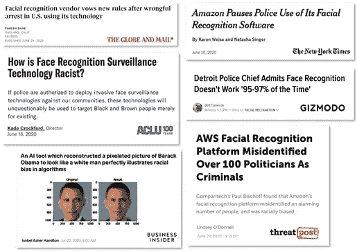

# 解决人工智能中的种族偏见:好奇者指南

> 原文：<https://towardsdatascience.com/addressing-racial-bias-in-ai-a-guide-for-curious-minds-ebdf403696e3?source=collection_archive---------29----------------------->

## 想学习算法公平，但不知道从哪里开始？这是一份精选的阅读材料、播客和视频列表。

由法希姆·哈桑和海伦·格扎亨合著

照片由[在](https://unsplash.com/@thisisengineering?utm_source=medium&utm_medium=referral) [Unsplash](https://unsplash.com?utm_source=medium&utm_medium=referral) 上拍摄

众所周知，人类容易犯错，容易受到偏见的影响，这些偏见会影响算法以歧视的方式表现也不是什么秘密。然而，很难了解这些偏见在我们日常生活中使用的技术中有多普遍。在当今技术驱动的世界，我们需要批判性地思考人工智能对社会的影响，以及它如何与性别、阶级和种族相交。

说到种族——想象一下由于算法中的种族偏见而被错误逮捕。这正是发生在罗伯特·朱利安·博查克·威廉姆斯身上的事情——他是密歇根州的一名非裔美国人，在妻子和年幼的孩子面前被从家中逮捕。他没有犯任何罪，但警方使用的面部识别软件怀疑他在商店行窃。他被错误关押的经历是执法部门手中有缺陷的技术如何放大对黑人社区的歧视的缩影。

面部识别技术的偏见现在已经成为媒体的趋势。最近，许多科技公司(包括亚马逊、IBM、微软等巨头。)发布[公告](https://www.vox.com/recode/2020/6/10/21287194/amazon-microsoft-ibm-facial-recognition-moratorium-police)停止面部识别服务或产品的设计和开发，并停止向州和地方警察部门和执法机构销售。一些研究人员指出了这些技术的局限性和不准确性，并对这些技术如何能够延续歧视和种族貌相表示关切。小罗伯特的案例清楚地表明，虽然科技巨头的这些决定可以被认为是朝着正确方向迈出的一小步，但这些显然不会解决科学历史上根深蒂固的种族主义问题。

白居松的拼贴插图(经许可使用)

当我们意识到应用有偏见的人工智能技术的危险后果时，我们也意识到我们需要忘记我们都被教导的种族主义。这就提出了一个问题— *我们如何确保我们创造的技术也能忘记它？*

要回答这个问题，我们需要了解技术是如何强化压迫和延续种族偏见的。

关于这个话题的一本很好的入门书是《压迫的算法》一书**，作者是加州大学洛杉矶分校信息研究副教授[萨菲娅·乌莫哈·诺布尔](https://safiyaunoble.com/)(1)。萨菲亚用通俗易懂的语言解释了自动化决策背后的数学基础，以及人类偏见是如何嵌入到“大数据”、“搜索引擎”和“算法”等关键概念中的。通过使用广泛的例子，她表明，即使算法决策似乎是一个公平和客观的过程，但在现实中，它反映了人类的偏见和种族偏见。这本书鼓励读者关注他们用来查找信息的搜索引擎和其他信息门户，并提出关键问题*“这是正确的信息吗？给谁的？”***

**关于同一主题的另一本好书是凯茜·奥尼尔的《数学毁灭的武器》，凯茜·奥尼尔毕业于哈佛大学，是一名数据科学家，因她的博客 mathbabe.org 而闻名。像 Safiya 一样，Cathy 也使用几个案例研究来提高对使用影响政策决策和放大不平等和偏见的算法的社会风险的认识。这些案例基于她自己在华尔街的职业生涯和她广泛的调查研究。例如，在现代工作场所雇用和解雇人员的算法，提供获得信贷的途径等等。作为算法公平的倡导者，她通过讲座和演示分享了她的经验(查看她的 [TED 演讲](https://www.youtube.com/watch?v=_2u_eHHzRto&t=96s)、[这个短视频动画](https://www.youtube.com/watch?v=heQzqX35c9A)或她在谷歌的[讲座](https://www.youtube.com/watch?v=TQHs8SA1qpk))。**

**那么，我们能做些什么来解决算法中的这些偏差呢？**

**首先，我们必须理解这些有偏见的、普遍存在的技术的设计过程，这正是 T2·鲁哈·本杰明所著的《追逐技术:废除新吉姆法典的工具》一书的重点(3)。作为普林斯顿大学非洲裔美国人研究的副教授，Ruha 研究并教授种族、技术和正义之间的关系。她形容自己的工作是*“创造一个环境，让他们(学生)可以超越他们可能无意中为智力发展设定的限制。”这一理念也被灌输到她的书籍和演讲中。除了她的学术文章之外，她还不厌其烦地谈论这场战斗需要的集体努力和公民参与。一种快速简单的方法来更好地了解她的工作是在哈佛大学伯克曼克莱恩互联网中心举办的视频演示会，她在会上讨论了更多关于社会的细节:“一系列编码不平等的歧视性设计:通过明确放大种族等级，通过忽视但复制社会分裂，或通过旨在解决种族偏见但最终做了相反的事情。”***

**其次，我们可以合作克服这些有缺陷的设计方法。将我们凝聚在一起的共同主线是同理心，这是世界经济论坛 [Joy Buolamwini](https://en.wikipedia.org/wiki/Joy_Buolamwini) 的口语表演“ [*通过计算产生同情:对抗算法偏见*](https://www.youtube.com/watch?v=_sgji-Bladk) *”的核心。麻省理工学院媒体实验室的计算机科学家 Joy 是算法公平的拥护者。她创建了[算法正义联盟](https://www.ajlunited.org/)(ASJ)——一个由跨学科研究人员组成的组织，致力于设计更具包容性的技术，并减轻人工智能对社会的有害影响。在乔治城法学院隐私技术中心的合作下，ASJ 开发了安全脸承诺，帮助组织公开承诺算法的公平性。***

**如果你对流媒体更感兴趣，你可以看看 Joy Buolamwini 的 ted 演讲“[我如何对抗算法中的偏见](https://www.youtube.com/watch?v=UG_X_7g63rY)”。有几个播客值得偷听；比如— [*与米兰达·莫布雷*](https://www.machine-ethics.net/podcast/25-miranda-mowbray/)*[*如何设计一个道德算法与德里克·莱本*](https://www.machine-ethics.net/podcast/23-derek-leben/) 以及牛津大学关于 AI 伦理与法律规制的[讨论](https://podcasts.ox.ac.uk/discussion-ethical-challenges-posed-ai-involving-experts-fields-across-oxford-seminar-1)。***

***现在，如果你已经在这个列表上走了这么远，并渴望了解更多，请查看以下内容-***

***● [亲爱的算法偏见](https://www.youtube.com/watch?v=MMqfOGA6TaQ)，在谷歌与洛根·布朗宁的讨论(没错！她是来自网飞的[*亲爱的白人*](https://en.wikipedia.org/wiki/Dear_White_People_(TV_series)) *！)*和 [Avriel Epps-Darling](https://www.avriele.com/#overview) (哈佛大学博士生，研究音乐、科技、有色人种青年及其性别身份之间的交集)。***

***●一个相关的谈话是“[算法能减少不平等吗？](https://www.youtube.com/watch?v=Xk3XGcvRNeA)由[重新确定 Abebe](https://www.cs.cornell.edu/~red/) 。Rediet 是加州大学伯克利分校的计算机科学研究员和助理教授。她还在 2019 年组织了关于 [AI for Social Good](https://nips.cc/Conferences/2018/Schedule?showEvent=10904#:~:text=The%20AI%20for%20Social%20Good,of%20solutions%20for%20social%20good.) 的研讨会，并与 [Timnit Gebru](https://ai.stanford.edu/~tgebru/) 共同创立了 [Black in AI](https://blackinai.github.io/) 。谷歌的计算机科学家蒂姆尼特是算法偏差领域的另一个鼓舞人心的人物。***

***●另一位面部识别技术的激烈批评者是黛博拉·拉杰，她是多伦多大学的工程系学生，目前在人工智能研究所担任技术研究员。要快速阅读，请查阅《纽约时报》报道她学术工作的文章。***

***●敬请关注纪录片“[编码偏差](https://www.hrwfilmfestivalstream.org/film/coded-bias/)”。这部电影受到*乔伊·波伦维尼*作品的启发，探索了两个关键问题:*“人工智能在管理我们的自由方面日益增长的作用会产生什么影响？那些因为种族、肤色和性别而被锁定的人会有什么后果？”对于幕后故事，你也可以和电影制作人 Shalini Kantayya* *以及上面提到的其他有影响力的研究人员——萨菲娅·诺布尔、黛博拉·拉吉和乔伊·波伦维尼(Joy Buolamwini)一起观看* [*Q & A。*](https://www.facebook.com/watch/live/?v=739250666844809&ref=watch_permalink)***

# ***呼吁采取集体行动***

***阅读这些主题可以帮助我们更好地了解我们的世界——一个正在被技术的快速创新所塑造的世界。这些问题影响着我们的整个社会，所以我们需要在学术圈之外，在我们的朋友和家人之间进行讨论(让我们为餐桌上的谈话增添趣味，好吗？).如果是对我们来说，我们人类需要处于设计过程的中心——就这么简单。为了让这样的参与式设计成为现实，让我们更加关注新技术和现有技术的设计。每当我们看到媒体大肆宣传*技术拯救世界*，我们就来谈谈它是如何设计的。为了谁？做什么？当我们交谈时，让我们把自己的生活经历与我们正在读的书、正在听的播客和正在看的视频联系起来(或者希望狂看！).***

# ***作者***

***法希姆·哈桑和海伦·格扎亨是加拿大阿尔伯塔大学的 BIPOC 学生。法希姆是公共卫生专业的博士生，对机器学习感兴趣。他也是阿尔伯塔省健康服务的顾问委员会成员。海伦正在学习计算机科学；她还是一个名为 Ada's Team 的学生团体的主席，该团体致力于促进 STEM 的多样性，特别关注阿尔伯塔大学的技术。***

# ***放弃***

***作者对自己的观点负责。观点不反映雇主或大学的观点。***

# ***确认***

***感谢 JuSong Baek 的插图和 Susie Moloney 深思熟虑的评论和反馈。我们也感谢加拿大阿尔伯塔大学黑人研究生协会成员和 Ada 团队的鼓励。***

*****参考文献*****

***①贵族苏。压迫的算法:搜索引擎如何强化种族主义？纽约:纽约大学出版社；2018.***

***(2)奥尼尔 c .数学毁灭的武器:大数据如何增加不平等并威胁民主。第一版。纽约:皇冠；2016.***

***(3) Benjamin R.《技术之后的竞赛:新吉姆法典的废奴主义工具》。英国剑桥；马萨诸塞州梅德福德:政治出版社；2019.***