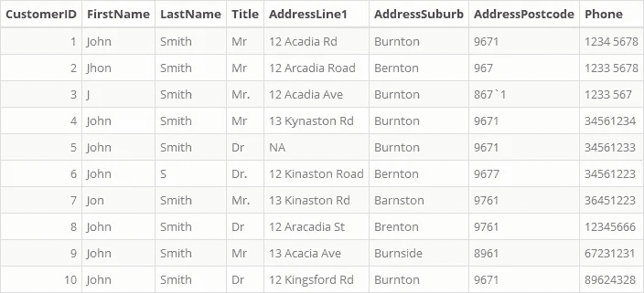
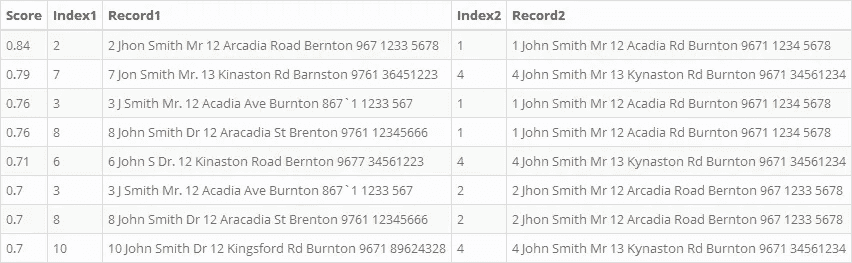
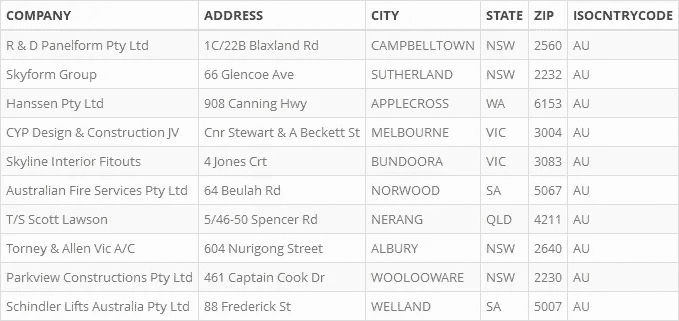

# 解决约翰·史密斯问题

> 原文：<https://towardsdatascience.com/addressingthejohnsmithproblem-1533da4f7db8?source=collection_archive---------39----------------------->

## 使用模糊逻辑识别不匹配的副本

特别感谢[凯拉什·阿瓦提](https://eight2late.wordpress.com/2019/10/09/tackling-the-john-smith-problem-deduplicating-data-via-fuzzy-matching-in-r/)。


图片由作者重现，灵感来自[自由词典](https://www.liberaldictionary.com/wp-content/uploads/2019/01/deduplicate-1518.jpg)

# 1.介绍

许多数据库都有重复的数据。尤其是在需要手动输入数据的情况下。为了清理数据和解决不必要的重复，有必要识别和纠正杂乱的数据。然而，许多重复是不匹配的；这意味着可能存在包含例如拼写错误的重复数据。使用`SQL`数据库语言完美地识别这些重复项是具有挑战性的，因为这依赖于*精确的*匹配(由于关系数据库理论的原则)。因此，有必要寻找其他方法来识别不匹配的副本，这就是模糊匹配能够被使用的地方。

模糊匹配摆脱了[编辑距离](https://en.wikipedia.org/wiki/Edit_distance)的概念，实质上是将一个字符串转换成另一个所需的*最小操作数。最常用的编辑距离度量之一是 [Levenshtein distance](https://en.wikipedia.org/wiki/Levenshtein_distance) ，它本质上是，“*将一个单词变为另一个单词所需的单个字符编辑(插入、删除或替换)的最小数量。*”。其他度量包括[汉明距离](https://en.wikipedia.org/wiki/Hamming_distance)、 [Jaccard 距离](https://en.wikipedia.org/wiki/Jaccard_index)、 [Jaro-Winkler 距离](https://en.wikipedia.org/wiki/Jaro%E2%80%93Winkler_distance)、最长公共子串距离[或](https://en.wikipedia.org/wiki/Longest_common_substring_problem)[余弦距离](https://en.wikipedia.org/wiki/Cosine_similarity)。出于本文的目的，使用[光学字符串对准距离](https://en.wikipedia.org/wiki/Damerau%E2%80%93Levenshtein_distance#Optimal_string_alignment_distance) (OSA)(它是 [Damerau-Levenshtein 距离](https://en.wikipedia.org/wiki/Damerau%E2%80%93Levenshtein_distance#Optimal_string_alignment_distance)的变体)。*

为了说明 OSA，给出下面的例子:

```
bear -> bear    = 0 steps (0 characters changed)
bear -> beat    = 1 step  (1 characters changed)
bear -> meat    = 2 steps (3 characters changed)
bear -> tearing = 4 steps (1 character changed, 3 characters added)
bear -> ear     = 1 step  (1 character removed)
```

正如所见，将一个字符串转换为另一个字符串所需的更改次数就是所采取的步骤数。该逻辑将用于匹配给定数据库中的记录。

# 2.建立

## 2.1.加载包

第一步是加载必要的包。

```
# Load required packages
library(tidyverse)  #Various tools
library(readxl)     #Read in Excel's
library(readr)      #Read in data
library(magrittr)   #Great piping tools
library(kableExtra) #Pretty tables
library(stringdist) #For Edit Distance algorithms
library(DBI)        #Testing SQL
library(RSQLite)    #Testing SQL
library(tictoc)     #Check code run-time
```

## 2.2.加载数据

下一步是加载数据。`JohnSmiths`数据是“虚拟数据”，用于说明模糊匹配的例子。原始数据可在[八 2Late](https://eight2late.files.wordpress.com/2019/10/many_john_smiths.xlsx) 上找到。

```
# Load files from Excel
dat_JohnSmiths <- find_rstudio_root_file() %>% 
   paste0("/Data/", "many_john_smiths.xlsx") %>% 
   read_excel() %>% 
   data.frame()
```

## 2.3.检查数据

加载完电子表格后，`JohnSmiths`数据如下所示:



查看数据帧后，详细信息如下所示:

```
>  Name: dat_JohnSmiths
>  Type: data.frame
>  Dims: 10 x 8
>  Size: 4.9 Kb
>  Field Counts:
>    field           distinct count distinct%
>  1 CustomerID      10       10    1.0      
>  2 FirstName        4       10    0.4      
>  3 LastName         2       10    0.2      
>  4 Title            4       10    0.4      
>  5 AddressLine1    10       10    1.0      
>  6 AddressSuburb    5       10    0.5      
>  7 AddressPostcode  6       10    0.6      
>  8 Phone           10       10    1.0
```

# 3.使用 SQL

当使用`SQL`检查数据时，使用了以下脚本。注意到它加入了`FirstName`、`LastName`、`AddressPostcode`和`CustomerID`字段。查询结果返回所有数据。这意味着它无法确定任何重复。因此，SQL 不能用于此目的。

```
/* Check for duplicates between the two tables. */
SELECT *
FROM JohnSmiths t1
WHERE EXISTS (
    SELECT 'x'
    FROM JohnSmiths t2
    WHERE t1.FirstName=t2.FirstName
        AND t1.LastName=t2.LastName
        AND t1.AddressPostcode=t2.AddressPostcode
        AND t1.CustomerID=t2.CustomerID
    )
```


# 4.使用 R

## 4.1.概观

要通过模糊匹配查找重复项，请遵循以下步骤:

1.  将中的关键字段连接成每行的单个文本字符串
2.  计算每条记录的字符串长度。
3.  创建字符串距离矩阵(使用`[stringdist](https://www.rdocumentation.org/packages/stringdist/versions/0.9.5.5)`包中的`[stringdistmatrix()](https://www.rdocumentation.org/packages/stringdist/versions/0.9.5.5/topics/stringdist)`函数)。
4.  将字符串距离矩阵归一化为 0 到 1 之间的值:
    4.1。创建一个最大长度的成对向量。
    4.2。将距离长度除以较长字符串的长度。
5.  创建相似性矩阵
6.  识别高于相似性阈值的每对记录。
7.  显示结果记录。

## 4.2 演练

第一步是将字符串连接在一起。这是使用`paste()`功能完成的。产生的向量如下所示(为了方便起见，每个元素都放在一个新行上)。

```
# Create concatenated vector
vec_Strings <- dat_JohnSmiths %>% 
    mutate(strings=paste0(FirstName
                         ,LastName
                         ,AddressLine1
                         ,AddressPostcode
                         ,AddressSuburb
                         ,Phone
                         )) %>% 
    select(strings) %>% 
    pull()# Review
vec_Strings %>% cat(sep="\n")>  JohnSmith12 Acadia Rd9671Burnton1234 5678
>  JhonSmith12 Arcadia Road967Bernton1233 5678
>  JSmith12 Acadia Ave867`1Burnton1233 567
>  JohnSmith13 Kynaston Rd9671Burnton34561234
>  JohnSmithNA9671Burnton34561233
>  JohnS12 Kinaston Road9677Bernton34561223
>  JonSmith13 Kinaston Rd9761Barnston36451223
>  JohnSmith12 Aracadia St9761Brenton12345666
>  JohnSmith13 Acacia Ave8961Burnside67231231
>  JohnSmith12 Kingsford Rd9671Burnton89624328
```

接下来，必须使用`[stringr](https://www.rdocumentation.org/packages/stringr/versions/1.4.0)`包中的`[str_length()](https://www.rdocumentation.org/packages/stringr/versions/1.4.0/topics/str_length)`函数计算每条记录的字符串长度。

```
# Create vector of lengths
vec_Lengths <- str_length(vec_Strings)# Review the vector
vec_Lengths %>% print()>   [1] 41 43 39 42 30 40 42 42 42 43
```

接下来，使用`[stringdist](https://www.rdocumentation.org/packages/stringdist/versions/0.9.5.5)`包中的`[stringdistmatrix()](https://www.rdocumentation.org/packages/stringdist/versions/0.9.5.5/topics/stringdist)`函数计算字符串距离矩阵。注意通过使用超参数`method="osa"`使用最佳字符串对齐算法。这个函数将值保存在一个一维数组中，但是在打印时，它会显示距离矩阵的下三角。

```
# Create distance matrix
vec_Distances <- stringdistmatrix(vec_Strings, method=”osa”)# Review
vec_Distances %>% print()>      1  2  3  4  5  6  7  8  9
>  2   7                        
>  3  10 13                     
>  4  15 21 24                  
>  5  18 25 25 15               
>  6  22 21 28 12 17            
>  7  20 23 26  9 21 14         
>  8  10 13 17 20 22 25 22      
>  9  19 22 19 21 23 29 23 22   
>  10 17 22 25 13 22 19 16 22 24
```

接下来，需要计算每对记录的最大长度。这可以通过`[utils](https://www.rdocumentation.org/packages/utils/versions/3.6.2)`包中的`[combn()](https://www.rdocumentation.org/packages/utils/versions/3.6.2/topics/combn)`函数来实现。该函数采用以下参数:

1.  要迭代的长度向量。
2.  要选择的元素数量的数值。值`2`表示它将匹配记录对。
3.  将应用于每对的函数。在这种情况下，选择`max()`功能。
4.  一个逻辑值，表示是将结果简化为一个向量还是返回一个列表。

产生的向量如下所示。

```
# Create Pairwise Vector
vec_PairwiseMax <- combn(vec_Lengths, 2, FUN=max, simplify=TRUE)# Review
vec_PairwiseMax>   [1] 43 41 42 41 41 42 42 42 43 43 43 43 43 43 43 43 43 42 39 40 42 42 42
>  [24] 43 42 42 42 42 42 43 40 42 42 42 43 42 42 42 43 42 42 43 42 43 43
```

接下来，计算归一化的距离矩阵。

```
# Calculate normalised values
vec_NormalisedDistances <- vec_Distances/vec_PairwiseMax# Review
vec_NormalisedDistances>          1      2      3      4      5      6      7      8      9
>  2  0.1628                                                        
>  3  0.2439 0.3023                                                 
>  4  0.3571 0.4884 0.5714                                          
>  5  0.4390 0.5814 0.6410 0.3571                                   
>  6  0.5366 0.4884 0.7000 0.2857 0.4250                            
>  7  0.4762 0.5349 0.6190 0.2143 0.5000 0.3333                     
>  8  0.2381 0.3023 0.4048 0.4762 0.5238 0.5952 0.5238              
>  9  0.4524 0.5116 0.4524 0.5000 0.5476 0.6905 0.5476 0.5238       
>  10 0.3953 0.5116 0.5814 0.3023 0.5116 0.4419 0.3721 0.5116 0.5581
```

接下来，归一化的距离被强制到一个矩阵中。创建后，确保不重复计算两次是很重要的。要做到这一点，右上角的三角形和对角线都是零的。

```
# Create Similarity Matrix
mat_SimilarityScore <- round(1-vec_NormalisedDistances, 2) %>% as.matrix()# Make the upper triangle all zero’s. This is to avoid double-counting duplicates.
mat_SimilarityScore[upper.tri(mat_SimilarityScore)] <- 0# Make the diagonals all zero’s. This is to ensure that the same string does not get matched to itself.
mat_SimilarityScore[diag(mat_SimilarityScore)] <- 0# Review
mat_SimilarityScore>        1    2    3    4    5    6    7    8    9 10
>  1  0.00 0.00 0.00 0.00 0.00 0.00 0.00 0.00 0.00  0
>  2  0.84 0.00 0.00 0.00 0.00 0.00 0.00 0.00 0.00  0
>  3  0.76 0.70 0.00 0.00 0.00 0.00 0.00 0.00 0.00  0
>  4  0.64 0.51 0.43 0.00 0.00 0.00 0.00 0.00 0.00  0
>  5  0.56 0.42 0.36 0.64 0.00 0.00 0.00 0.00 0.00  0
>  6  0.46 0.51 0.30 0.71 0.57 0.00 0.00 0.00 0.00  0
>  7  0.52 0.47 0.38 0.79 0.50 0.67 0.00 0.00 0.00  0
>  8  0.76 0.70 0.60 0.52 0.48 0.40 0.48 0.00 0.00  0
>  9  0.55 0.49 0.55 0.50 0.45 0.31 0.45 0.48 0.00  0
>  10 0.60 0.49 0.42 0.70 0.49 0.56 0.63 0.49 0.44  0
```

作为参考，相似性矩阵的详细信息打印如下。

```
>  Name: mat_SimilarityScore
>  Type: matrix
>  Dims: 10 x 10
>  Size: 2.6 Kb
```

接下来，将识别高于给定阈值的值。为了实现这一点，编写了一个自定义函数。

```
# Add function for identifying scores above a given threshold.
tlargest <- function(matrix, threshold, print=FALSE) {
    #' @title Return Matrix Values Above A Threshold
    #' @description Subset a matrix to return values that are above a specified threshold.
    #' @note Will also print the count of how many records were matched. Necessary due to the ambiguity of using a threshold value.
    #' @param matrix matrix. A matrix, which is the matrix to be sub-set.
    #' @param threshold numeric. A single numeric value, corresponding to the threshold, above which values are to be returned.
    #' @return A matrix containing columns:
    #' — 'row' : A numeric value corresponding to the row index of the returned value.
    #' — 'col' : A numeric value corresponding to the column index of the returned value.
    #' — 'val' : A numeric value which is the similarity score between the 'row' and 'col' values.

    # Validations:
    if (!is.matrix(matrix)) {stop("'matrix' must be a matrix")}
    if (!is.numeric(matrix)) {stop("'matrix' must be numeric")}
    if (!length(threshold)==1) {stop("'threshold' must be atomic")}
    if (!is.numeric(threshold)) {stop("'threshold' must be numeric")}
    if (!between(threshold, 0, 1)) {stop("'threshold' must be between 0 and 1")}

    # Determine the indices to be returned
    sort <- sort(matrix, decreasing=TRUE)
    order <- order(matrix, decreasing=TRUE)
    order <- order[sort>=threshold]

    # Generate the matrix of indices to be returned
    position <- arrayInd(order, dim(matrix), useNames=TRUE)
    position <- set_colnames(position, c("rec1", "rec2"))
    position <- cbind(position, val=matrix[order])

    # Print subset number
    if (print==TRUE) {
        cat("Selected threshold : ", threshold, "\n"
           ,"Matching records   : ", nrow(position), "\n"
           ,"Total records      : ", nrow(matrix), "\n"
           ,"Matching percent   : ", nrow(position)/nrow(matrix)
           ,sep=""
           )
    }

    # Return
    return(position)

}
```

因此，当应用该函数时，将生成如下所示的矩阵。

```
# Generate matching records
mat_MatchingRecords <- tlargest(matrix = mat_SimilarityScore
                               ,threshold = 0.7
                               ,print = TRUE
                               )>  Selected threshold : 0.7
>  Matching records   : 8
>  Total records      : 10
>  Matching percent   : 0.8 # Review
mat_MatchingRecords>       rec1 rec2  val
>  [1,]    2    1 0.84
>  [2,]    7    4 0.79
>  [3,]    3    1 0.76
>  [4,]    8    1 0.76
>  [5,]    6    4 0.71
>  [6,]    3    2 0.70
>  [7,]    8    2 0.70
>  [8,]   10    4 0.70
```

一旦识别出匹配的记录，就需要从原始表中提取它们。为此，再次编写一个自定义函数。它获取原始数据帧和相似性矩阵，然后遍历矩阵，从数据帧中提取相关记录。

```
find_MatchingRecords <- function(dataframe, sim_matrix, print=FALSE) {
    #' @title Find Mathching Records
    #' @description Use 'sim_matrix' to find matching records from 'dataframe'.
    #' @note The `sim_matrix` contains the similarity matrix, generated from `stringdistmatrix()` and the `nlargest()` (or `tlargest()`) functions.
    #' @param dataframe dataframe. The dataframe from which the matching records will be extracted.
    #' @param sim_matrix matrix. The matrix containing the attributes for finding the matching records.
    #' @param print logical. Whether or not to print the output as a text string.
    #' @return A data.frame containing the score and the records that have been matched. Also, this is printed to the console.

    # Validations
    if (!is.data.frame(dataframe)) {stop("'dataframe' must be a dataframe")}
    if (!is.matrix(sim_matrix)) {stop("'sim_matrix' must be a matrix.")}
    if (!is.double(sim_matrix[[2]])) {stop("'sim_matrix' must be a numeric matrix.")}
    if (c("rec1","rec2") %>% is_in(colnames(sim_matrix)) %>% all() %>% not()) {stop("'sim_matrix' must contain two columns named: 'rec1' and 'rec2'.")}

    # Set output
    str_return <- NULL
    dat_return <- data.frame("Score"=NA_real_
                            ,"Index1"=NA_real_
                            ,"Record1"=NA_character_
                            ,"Index2"=NA_real_
                            ,"Record2"=NA_character_
                            ,stringsAsFactors=FALSE
                            )

    # Determine number of itterations
    iterations <- sim_matrix %>% nrow()

    # Loop through number of itteraions
    for (i in 1:iterations) {

        # Extract score
        sim_score <- sim_matrix %>% 
            extract(i, 3)

        # Extract the first matching index
        rec1_index <- sim_matrix %>%
            extract(i,1)

        # Extract first matching record
        rec1_record <- sim_matrix %>% 
            extract(i,1) %>% 
            extract(dataframe, ., ) %>% 
            as.character() %>% 
            paste(collapse=" ")

        # Extract the second matching index
        rec2_index <- sim_matrix %>% 
            extract(i,2)

        # Extract second matching record
        rec2_record <- sim_matrix %>% 
            extract(i,2) %>% 
            extract(dataframe, ., ) %>% 
            as.character() %>% 
            paste(collapse=" ")

        # Build return
        str_return %<>% paste0("\n") %>% 
            paste0("Score: ", sim_score, "\n") %>% 
            paste0("Record 1: (Index ", rec1_index, ") ", rec1_record, "\n") %>% 
            paste0("Record 2: (Index ", rec2_index, ") ", rec2_record, "\n") 
        dat_return[i,] <- c(sim_score, rec1_index, rec1_record, rec2_index, rec2_record)

    }

    # Print str_return
    if (print==TRUE) {
        cat(str_return)
    }

    # Return dat_return
    return(dat_return)

}
```

最后，当应用该函数时，数据显示如下。

```
# Generate data
dat_MatchingRecords <- find_MatchingRecords(dataframe = dat_JohnSmiths
                                           ,sim_matrix = mat_MatchingRecords
                                           ,print = TRUE
                                           )>  Score: 0.84
>  Record 1: (Index 2) 2 Jhon Smith Mr 12 Arcadia Road Bernton 967 1233 5678
>  Record 2: (Index 1) 1 John Smith Mr 12 Acadia Rd Burnton 9671 1234 5678
>  
>  Score: 0.79
>  Record 1: (Index 7) 7 Jon Smith Mr. 13 Kinaston Rd Barnston 9761 36451223
>  Record 2: (Index 4) 4 John Smith Mr 13 Kynaston Rd Burnton 9671 34561234
>  
>  Score: 0.76
>  Record 1: (Index 3) 3 J Smith Mr. 12 Acadia Ave Burnton 867`1 1233 567
>  Record 2: (Index 1) 1 John Smith Mr 12 Acadia Rd Burnton 9671 1234 5678
>  
>  Score: 0.76
>  Record 1: (Index 8) 8 John Smith Dr 12 Aracadia St Brenton 9761 12345666
>  Record 2: (Index 1) 1 John Smith Mr 12 Acadia Rd Burnton 9671 1234 5678
>  
>  Score: 0.71
>  Record 1: (Index 6) 6 John S Dr. 12 Kinaston Road Bernton 9677 34561223
>  Record 2: (Index 4) 4 John Smith Mr 13 Kynaston Rd Burnton 9671 34561234
>  
>  Score: 0.7
>  Record 1: (Index 3) 3 J Smith Mr. 12 Acadia Ave Burnton 867`1 1233 567
>  Record 2: (Index 2) 2 Jhon Smith Mr 12 Arcadia Road Bernton 967 1233 5678
>  
>  Score: 0.7
>  Record 1: (Index 8) 8 John Smith Dr 12 Aracadia St Brenton 9761 12345666
>  Record 2: (Index 2) 2 Jhon Smith Mr 12 Arcadia Road Bernton 967 1233 5678
>  
>  Score: 0.7
>  Record 1: (Index 10) 10 John Smith Dr 12 Kingsford Rd Burnton 9671 89624328
>  Record 2: (Index 4) 4 John Smith Mr 13 Kynaston Rd Burnton 9671 34561234
```

其数据帧如下所示:

```
# Review
dat_MatchingRecords %>% 
    kable() %>% 
    kable_styling(bootstrap_options=c("striped", "bordered", "condensed")
                 ,full_width=FALSE
                 ,position="left"
                 ) %>% 
    (function(x){
        x %>% save_kable("Images/JohnSmithsMatching.png")
        x %>% return()
    })
```



如所见，该方法已经以合理的准确度水平识别了这些重复。

## 4.3.包裹

因此，在识别数据库中的重复项时，使用“模糊匹配”来识别不同记录集之间的相似性是很有用的。

但是，考虑到本例中提供的数据是虚构的，对真实世界的数据执行相同的过程是有用的。

# 5.真实的例子

使用从网上搜集的商业地址，同样的方法被应用。

## 5.1.预处理

数据是从 Excel 电子表格`AddressData.xlsx`中加载的。

```
# Load Data
dat_Addresses <- find_rstudio_root_file() %>% 
    paste0("/Data/", "AddressData.xlsx") %>% 
    read_excel(col_types=c("text")) %>% 
    data.frame()
```

前 10 条记录如下所示:



数据的详细信息显示如下:

```
>  Name: dat_Addresses
>  Type: data.frame
>  Dims: 19388 x 8
>  Size: 4.2 Mb
>  Field Counts:
>    field        distinct count distinct%
>  1 COMPANY       6320    19388 0.3259748
>  2 ADDRESS       8646    19388 0.4459459
>  3 CITY          2459    19388 0.1268310
>  4 STATE            8    19388 0.0004126
>  5 ZIP           1264    19388 0.0651950
>  6 ISOCNTRYCODE     1    19388 0.0000000
```

然后，对地址执行一些预处理操作，以减小数据的大小。

```
# Mutate data.
# Steps:
# 1\. Remove special characters
# 2\. Remove numeric values (Street numbers, etc.)
# 3\. Remove additional white spaces
# 4\. Capitalise
# 5\. Select distinct.
dat_AddressesClean <- dat_Addresses %>% 
    mutate_all(str_replace_all, "[[:punct:]]", "") %>% 
    mutate_at(c("COMPANY", "ADDRESS", "CITY", "STATE"), str_replace_all, "[0-9]", "") %>% 
    mutate_all(str_squish) %>% 
    mutate_all(str_to_upper) %>% 
    distinct() %>% 
    arrange(ISOCNTRYCODE, STATE, CITY, ADDRESS)# Check result
check_ObjectDetails(dat_AddressesClean) %>% cat()# Check result
check_ObjectDetails(dat_AddressesClean) %>% cat()>  Name: dat_AddressesClean
>  Type: data.frame
>  Dims: 9945 x 6
>  Size: 1.5 Mb
>  Field Counts:
>    field        distinct count distinct%
>  1 COMPANY      6279     9945  0.6313725
>  2 ADDRESS      6267     9945  0.6301659
>  3 CITY         2344     9945  0.2356963
>  4 STATE           8     9945  0.0008044
>  5 ZIP          1264     9945  0.1270990
>  6 ISOCNTRYCODE    1     9945  0.0000000
```

最后，必须将数据一起粘贴到一个向量中，如下所示。现在数据可以进行模糊匹配了。

```
# Create vector
vec_Addresses <- dat_AddressesClean %>% 
    unite("vec", sep="") %>% 
    pull()# Review
vec_Addresses %>%
    head(10) %>%
    cat(sep="\n")
>  MELBOURNE FACADES PTY LTDANU ELLERY CRESACTONACT2601AU
>  IC FORMWORK SERVICES PTY LTDCLUNIES RDACTONACT2601AU
>  RICHARD CROOKES CONSTRUCTIONS PTYDALEY RDACTONACT2601AU
>  STOWE AUSTRALIA PTY LIMITEDELLERY CRESACTONACT2600AU
>  MELBOURNE FACADES PTY LTDELLERY CRESACTONACT2601AU
>  CONSTRUCTION CONTROL HOLDINGSSULLIVANS CREEK RDACTONACT2601AU
>  QUATTRO BUILDING SERVICES PTY LTDSULLIVANS CREEK RDACTONACT2601AU
>  IC FORMWORK SERVICES PTY LTDMORNINGTON ST AMANDA STAMAROOACT2914AU
>  RENROW STEEL PTY LTDCOPPER CRESBEARDACT2620AU
>  OPTIMUM BRICK BLOCKLAYINGCOPPER CRESBEARDACT2620AU
```

5.2 流程

对地址数据的处理已经被组合到单个块中，并被相应地处理。必须列出以下关键信息:

*   初始输入向量是 9964 个元素长，而距离向量是 49635666 个元素长。
*   距离向量是 378.7 Mb 大，而相似性矩阵是 758.7 Mb 大。
*   耗时 128.2 秒。请注意，这取决于处理器的计算能力。

```
# Start the clock
tic("\n\nTime to Process Data")# Calculate the lengths
vec_AddLengths <- str_length(vec_Addresses)# Calculate the distances
vec_AddDistances <- stringdistmatrix(vec_Addresses, method="osa")# Calculate the max lengths
vec_AddPairwiseMax <- combn(vec_AddLengths, 2, max, simplify=TRUE)# Normalise the distances
vec_AddNormalisedDistances <- vec_AddDistances/vec_AddPairwiseMax# Add object details to the output
str_Output <- c("vec_Addresses", "vec_AddLengths", "vec_AddDistances", "vec_AddPairwiseMax", "vec_AddNormalisedDistances") %>% 
    check_ObjectDetails() %>% 
    paste(sep="\n")# Create the similarity matrix
mat_AddSimilarityScore <- round(1-vec_AddNormalisedDistances, 2) %>% as.matrix()# Add matrix to output
str_Output %<>% paste(check_ObjectDetails(mat_AddSimilarityScore), sep="\n\n")# Tidy the matrix
mat_AddSimilarityScore[upper.tri(mat_AddSimilarityScore)] <- 0
mat_AddSimilarityScore[diag(mat_AddSimilarityScore)] <- 0# Re-add matrix to output
str_Output %<>% paste(check_ObjectDetails(mat_AddSimilarityScore), sep="\n\n")# Print the output
cat(str_Output)# Stop the clock and print the time taken
toc()>  Name: vec_Addresses
>  Type: character
>  Dims: 1 x 9945
>  Size: 1.2 Mb
>  
>  Name: vec_AddLengths
>  Type: integer
>  Dims: 1 x 9945
>  Size: 38.9 Kb
>  
>  Name: vec_AddDistances
>  Type: dist
>  Dims: 1 x 49446540
>  Size: 377.2 Mb
>  
>  Name: vec_AddPairwiseMax
>  Type: array
>  Dims: 1 x 49446540
>  Size: 188.6 Mb
>  
>  Name: vec_AddNormalisedDistances
>  Type: dist
>  Dims: 1 x 49446540
>  Size: 377.2 Mb
>  
>  Name: mat_AddSimilarityScore
>  Type: matrix
>  Dims: 9945 x 9945
>  Size: 755.8 Mb
>  
>  Name: mat_AddSimilarityScore
>  Type: matrix
>  Dims: 9945 x 9945
>  Size: 755.8 Mb
>  
>  Time to Process Data: 258.7 sec elapsed
```

结果，记录现在可以匹配了。请注意，匹配记录的数量是 2389(占总数的 24%)。

```
# Find matches
mat_AddMatchingRecords <- tlargest(matrix = mat_AddSimilarityScore
                                  ,threshold = 0.8
                                  ,print = TRUE
                                  )>  Selected threshold : 0.8
>  Matching records   : 2185
>  Total records      : 9945
>  Matching percent   : 0.2197# Find records
dat_AddMatchingRecords <- find_MatchingRecords(dataframe = dat_AddressesClean
                                              ,sim_matrix = mat_AddMatchingRecords
                                              )
```

一旦识别出这些匹配的记录，就可以将它们返回。为简单起见，每个相似性得分的前 10 个匹配项已在下面的块中返回。

```
# View 0.99
dat_AddMatchingRecords %>% 
    filter(Score==0.99) %>% 
    head(10) %>% 
    print_MatchingRecords() %>% 
    cat()
>  Score: 0.99
>  Record 1: (Index 685) AUTOMATIC FIRE PROTECTION DESIGN THE NORTHERN RD BERKSHIRE PARK NSW 2765 AU
>  Record 2: (Index 684) AUTOMATIC FIRE PROTECTION DESIGN THE NORTHERN RD BERKSHIRE PARK NSW 2756 AU
>  
>  Score: 0.99
>  Record 1: (Index 1062) EJ CONSTRUCTIONS NSW PTY LIMITED ROBERTSON RD CENTENNTIAL PARK NSW 2021 AU
>  Record 2: (Index 1061) EJ CONSTRUCTIONS NSW PTY LIMITED ROBERTSON RD CENTENNIAL PARK NSW 2021 AU
>  
>  Score: 0.99
>  Record 1: (Index 2050) CPB DRAGADOS SAMSUNG JOINT VENTURE A COMMERCIAL RD KINGSGROVE NSW 2208 AU
>  Record 2: (Index 2049) CPB DRAGADOS SAMSUNG JOINT VENTURE A COMMERCIAL RD KINGSFROVE NSW 2208 AU
>  
>  Score: 0.99
>  Record 1: (Index 4593) CULLEN STEEL FABRICATIONS PTY LTD GATE WHARF HICKSON RD WALSH BAY NSW 2060 AU
>  Record 2: (Index 4592) CULLEN STEEL FABRICATIONS PTY LTD GATE WHARF HICKSON RD WALSH BAY NSW 2065 AU
>  
>  Score: 0.99
>  Record 1: (Index 5677) BM ALLIANCE COAL OPERATIONS PL CY HAY POINT OPERATIONS HAY POINT QLD 4740 AU
>  Record 2: (Index 5676) BM ALLIANCE COAL OPERATIONS PL CY HAY POINT OPERATIONS HAY POINT QLD 4744 AU
```

当选择`threshold=0.99`时，算法几乎完全匹配，记录之间只有单个字符的差异。

```
# View 0.98
dat_AddMatchingRecords %>% 
    filter(Score==0.98) %>% 
    head(10) %>% 
    print_MatchingRecords() %>% 
    cat()
>  Score: 0.98
>  Record 1: (Index 25) KENNARDS HIRE PTY LIMITED OATLEY CT BELCONNEN ACT 2617 AU
>  Record 2: (Index 24) KENNARDS HIRE PTY LIMITED OATLEY CT BELCONNEN ACT 2616 AU
>  
>  Score: 0.98
>  Record 1: (Index 152) ABS FACADE PTY LTD SHEPPARD ST HUME ACT 2620 AU
>  Record 2: (Index 149) ABS FACADE PTY LTD SHEPARD ST HUME ACT 2620 AU
>  
>  Score: 0.98
>  Record 1: (Index 229) CRYSTAL POOLS PTY LTD DAVE MCINNES RD STROMLO ACT 2611 AU
>  Record 2: (Index 228) CRYSTAL POOLS PTY LTD DAVE MCINNES RD STOMLO ACT 2611 AU
>  
>  Score: 0.98
>  Record 1: (Index 410) RICHARD CROOKES CONSTRUCTIONS PTY PRINCESS HWY ARNCLIFFE NSW 2205 AU
>  Record 2: (Index 403) RICHARD CROOKES CONSTRUCTIONS PTY PRINCES HWY ARNCLIFFE NSW 2205 AU
>  
>  Score: 0.98
>  Record 1: (Index 875) ODK CONSTRUCTION PTY LTD PARRAMATTA RD BURWOOD NSW 2134 AU
>  Record 2: (Index 478) ODK CONSTRUCTION PTY LTD PARRAMATTA RD B URWOOD NSW 2134 AU
>  
>  Score: 0.98
>  Record 1: (Index 574) EODO PTY LTD HAVANNAH ST BATHURST NSW 2795 AU
>  Record 2: (Index 570) EODO PTY LTD HAVANNAH ST BATHRUST NSW 2795 AU
>  
>  Score: 0.98
>  Record 1: (Index 749) LIN BETTY BUILDING GROUP PTY LTD A OXFORD ST BONDI JUNCTION NSW 2026 AU
>  Record 2: (Index 748) LIN BETTY BUILDING GROUP PTY LTD A OXFORD ST BONDI JUNCTION NSW 2022 AU
>  
>  Score: 0.98
>  Record 1: (Index 927) LAING O ROURKE AUSTRALIA CARDIGAL LN CAMPERDOWN NSW 2050 AU
>  Record 2: (Index 926) LAING OROURKE AUSTRALIA CARDIGAL LN CAMPERDOWN NSW 2050 AU
>  
>  Score: 0.98
>  Record 1: (Index 1055) CJ SJ O KEEFFE BUILDING PTY LTD LOT NELSON ROAD CATTAI NSW 2756 AU
>  Record 2: (Index 1054) CJ SJ OKEEFFE BUILDING PTY LTD LOT NELSON ROAD CATTAI NSW 2756 AU
>  
>  Score: 0.98
>  Record 1: (Index 1083) METRO CHATSWOOD JHCPBG JV MOWBRAY RD CHATSWOOD NSW 2067 AU
>  Record 2: (Index 1081) METRO CHATSWOOD JHCPBG JV MOWBRAY RD CHATSWOOD NSW 2057 AU
```

当选择`threshold=0.98`时，算法也几乎完全匹配，记录之间也只有单个字符的差异。

```
# View 0.8
dat_AddMatchingRecords %>% 
    filter(Score==0.8) %>% 
    head(10) %>% 
    print_MatchingRecords() %>% 
    cat()
>  Score: 0.8
>  Record 1: (Index 67) IC FORMWORK SERVICES PTY LTD CHALLIS ST DICKSON ACT 2602 AU
>  Record 2: (Index 2) IC FORMWORK SERVICES PTY LTD CLUNIES RD ACTON ACT 2601 AU
>  
>  Score: 0.8
>  Record 1: (Index 43) IC FORMWORK SERVICES PTY LTD CNR OF HOBART PL LONDON CCT CANBERRA ACT 2601 AU
>  Record 2: (Index 36) IC FORMWORK SERVICES PTY LTD CNR CONSTITUTION AVE AND LONDON CCT CANBERRA ACT 2601 AU
>  
>  Score: 0.8
>  Record 1: (Index 141) TS ANDREW TAYLOR SAWMILL CCT HUME ACT 2620 AU
>  Record 2: (Index 139) TS ALEX GARNER SAWMILL CCT HUME ACT 2620 AU
>  
>  Score: 0.8
>  Record 1: (Index 187) ACT INTERIORS HUDDART CT MITCHELL ACT 2911 AU
>  Record 2: (Index 175) ACT INTERIORS BROOKS ST MITCHELL ACT 2911 AU
>  
>  Score: 0.8
>  Record 1: (Index 292) TS DHAWAL NANDA BOURKE RD ALEXANDRIA NSW 2015 AU
>  Record 2: (Index 270) TS GEORGE NAJJAR BOURKE RD ALEXANDRIA NSW 2015 AU
>  
>  Score: 0.8
>  Record 1: (Index 295) SCHAI DARREN BOURKE RD ALEXANDRIA NSW 2015 AU
>  Record 2: (Index 278) SMITH STEVEN BOURKE RD ALEXANDRIA NSW 2015 AU
>  
>  Score: 0.8
>  Record 1: (Index 302) ABS FACADE PTY LTD BOURKE RD ALEXANDRIA NSW 2015 AU
>  Record 2: (Index 281) DELTA PTY LTD BOURKE RD ALEXANDRIA NSW 2015 AU
>  
>  Score: 0.8
>  Record 1: (Index 311) CPB CONTRACTORS PTY LTD BOURKE RD ALEXANDRIA NSW 2015 AU
>  Record 2: (Index 297) FLEXEM CONSTRUCTION PTY LTD BOURKE RD ALEXANDRIA NSW 2015 AU
>  
>  Score: 0.8
>  Record 1: (Index 300) CHAN PETER BOURKE RD ALEXANDRIA NSW 2015 AU
>  Record 2: (Index 299) LOCANO PAULO BOURKE RD ALEXANDRIA NSW 2015 AU
>  
>  Score: 0.8
>  Record 1: (Index 307) PETER CHAN BOURKE RD ALEXANDRIA NSW 2015 AU
>  Record 2: (Index 305) PAULO LOCANO BOURKE RD ALEXANDRIA NSW 2015 AU
```

当选择`threshold>0.9`时，算法也几乎完全匹配，记录之间也只有单个字符的差异。然而，当选择`threshold=0.8`时，算法产生了错误匹配。例如:

*   记录`43`和`36`实际上可能是匹配的副本，因为它们都是`LONDON CCT`上的`IC FORMWORK SERVICES`。
*   记录`141`和`139`匹配了同一郊区同一街道上的不同商家。这是一个错误的匹配。
*   记录`187`和`175`匹配了同一郊区不同街道上的相同企业。这是一个错误的匹配。

因此，建议在使用小于`0.9`的阈值时要谨慎。

# 6.结论

总之，模糊匹配能够以合理的准确度成功地识别重复项。当将具有单个字符差异的字符串匹配在一起时，这些字符串会得到近乎完美的匹配分数(`>0.99`)。但是当阈值设置为`~0.8`时，那么逻辑就开始匹配同一郊区同一街道的不同商家，或者同一郊区不同街道的同一商家等等。这对于实施来说是一个风险，因此必须仔细选择阈值。

此外，由于在处理期间创建了相当大的对象，适当的数据分段是适当的，以避免引起计算问题。

还要注意，数据输入验证总是比回顾性数据清理要好。在地址数据由外部方提供的情况下(如 EDI 连接)，应实施此解决方案。如果数据被识别为`>0.99`的置信区间，那么自动修改数据是合理的；但是，如果是`~0.8`，那么最好将数据标记出来供员工查看。

# 7.参考

Awati 2019 年，“解决约翰·史密斯问题——通过 R 中的模糊匹配消除重复数据”，<[https://eight 2 late . WordPress . com/2019/10/09/cracking-the-John-Smith-Problem-de duplication-data-via-fuzzy-matching-in-R/](https://eight2late.wordpress.com/2019/10/09/tackling-the-john-smith-problem-deduplicating-data-via-fuzzy-matching-in-r/)>。

维基百科 2019，‘余弦相似度’，【https://en.wikipedia.org/wiki/Cosine_similarity><[。](https://en.wikipedia.org/wiki/Cosine_similarity)

维基百科 2019，‘编辑距离’，<[https://en.wikipedia.org/wiki/Edit_distance](https://en.wikipedia.org/wiki/Edit_distance)>。

维基百科 2019，‘海明距离’，<[https://en.wikipedia.org/wiki/Hamming_distance](https://en.wikipedia.org/wiki/Hamming_distance)>。

维基百科 2019，‘雅各布索引’，<[https://en.wikipedia.org/wiki/Jaccard_index](https://en.wikipedia.org/wiki/Jaccard_index)>。

维基百科 2019，“贾罗-温克勒距离”，<[https://en.wikipedia.org/wiki/Jaro%E2%80%93Winkler_distance](https://en.wikipedia.org/wiki/Jaro%E2%80%93Winkler_distance)>。

维基百科 2019，‘莱文斯坦距离’，<[https://en.wikipedia.org/wiki/Levenshtein_distance](https://en.wikipedia.org/wiki/Levenshtein_distance)>。

维基百科 2019，'最长公共子串问题'，<[https://en . Wikipedia . org/wiki/Longest _ common _ substring _ problem](https://en.wikipedia.org/wiki/Longest_common_substring_problem)>。

维基百科 2019，'最佳字符串对齐距离'，<[https://en . Wikipedia . org/wiki/damer au % E2 % 80% 93 levenshtein _ distance # Optimal _ string _ alignment _ distance](https://en.wikipedia.org/wiki/Damerau%E2%80%93Levenshtein_distance#Optimal_string_alignment_distance)>。

# 8.附言

鸣谢:本报告是在他人的帮助下完成的。致谢发送至:

1.  Kailash Awati 因为我使用了他的原始文章([解决 John Smith 问题](https://eight2late.wordpress.com/2019/10/09/tackling-the-john-smith-problem-deduplicating-data-via-fuzzy-matching-in-r/))作为这篇文章的基础。

**出版物**:该报告也在以下网站发布:

1.  RPubs:[RPubs/chrimaho/addressingthehohnsmithproblem](http://rpubs.com/chrimaho/AddressingTheJohnSmithProblem)
2.  GitHub:[GitHub/chrimaho/addressingthehohnsmithproblem](https://github.com/chrimaho/AddressingTheJohnSmithProblem)
3.  中:[中/chrimaho/addressingtheohnsmithproject](https://medium.com/@chrimaho/addressingthejohnsmithproblem-1533da4f7db8?source=friends_link&sk=ae556dc05ee752a9b809092ca152da18)

**更改日志**:本出版物于以下日期修改:

1.  2020 年 7 月 4 日:原始出版日期。