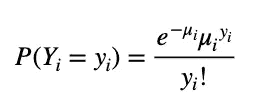
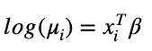
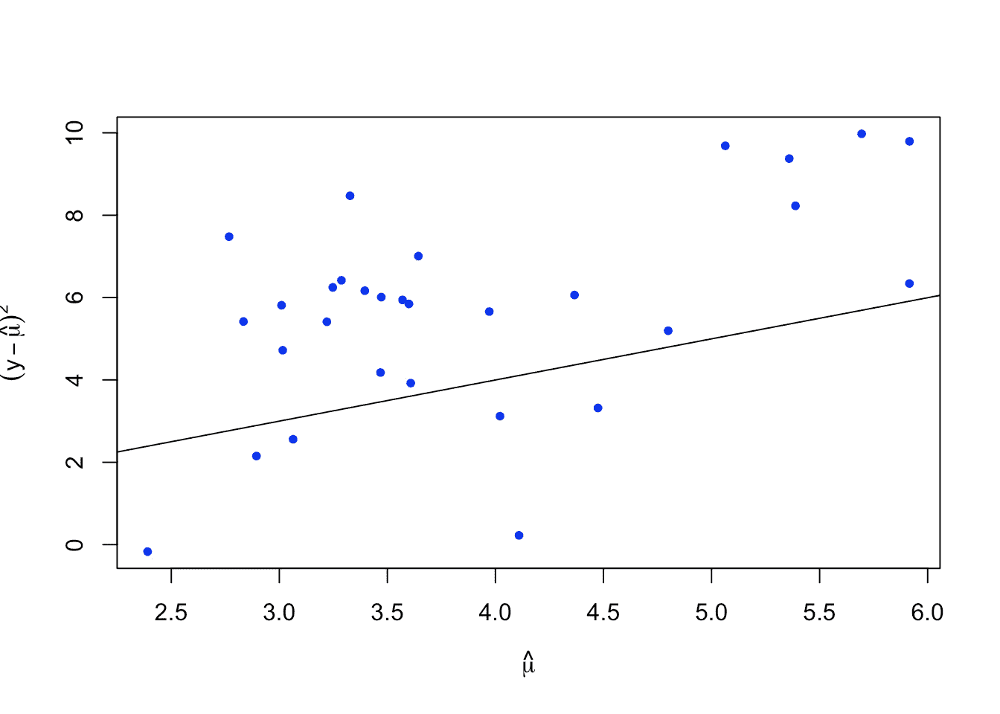
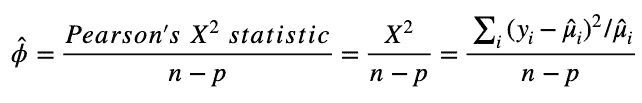

# 针对泊松回归中的过度离散进行调整

> 原文：<https://towardsdatascience.com/adjust-for-overdispersion-in-poisson-regression-4b1f52baa2f1?source=collection_archive---------2----------------------->

## 广义线性模型

## 消除泊松模型中显著系数的假阳性检测及其在 r。


蒂莫·沃尔茨在 [Unsplash](https://unsplash.com?utm_source=medium&utm_medium=referral) 上的照片

T 当我们想要对每单位时间或空间的平均发生次数进行建模时，泊松回归模型自然而然地出现了。比如罕见癌症的发病率，十字路口汽车穿越的次数，或者地震的次数。

[泊松分布](https://en.wikipedia.org/wiki/Poisson_distribution)的一个特征是**均值**等于**方差**。然而，*过度分散*或*欠分散*分别发生在方差大于或小于均值的泊松模型中。实际上，在数据量有限的情况下，过度分散会更频繁地发生。

过度分散问题会影响模型的解释。为了避免对系数的错误估计，有必要解决这个问题。

在这篇文章中，我将讨论一些基本的方法来调整泊松回归模型中的过度分散现象。实现将用 R 代码展示。希望这篇文章有帮助。

假设我们想要使用预测器 *xi 的向量来模拟计数响应*易*。*我们知道，响应变量 Yi 遵循参数为μi 的泊松分布


易服从泊松分布

其中概率函数是



泊松 PMF

对数连接函数用于连接预测值 Xi 和泊松参数μi 的线性组合



泊松回归模型。

让我们用《T21》一书中介绍的例子建立一个简单的模型。

```
## R code
library(faraway)
data(gala)
gala = gala[,-2]
pois_mod = glm(Species ~ .,family=poisson,gala)
summary(pois_mod)
```

这是泊松模型的总结。

```
Call:
glm(formula = Species ~ ., family = poisson, data = gala)

Deviance Residuals: 
    Min       1Q   Median       3Q      Max  
-8.2752  -4.4966  -0.9443   1.9168  10.1849  

Coefficients:
              Estimate Std. Error z value Pr(>|z|)    
(Intercept)  3.155e+00  5.175e-02  60.963  < 2e-16 ***
Area        -5.799e-04  2.627e-05 -22.074  < 2e-16 ***
Elevation    3.541e-03  8.741e-05  40.507  < 2e-16 ***
Nearest      8.826e-03  1.821e-03   4.846 1.26e-06 ***
Scruz       -5.709e-03  6.256e-04  -9.126  < 2e-16 ***
Adjacent    -6.630e-04  2.933e-05 -22.608  < 2e-16 ***
---
Signif. codes:  0 ‘***’ 0.001 ‘**’ 0.01 ‘*’ 0.05 ‘.’ 0.1 ‘ ’ 1

(Dispersion parameter for poisson family taken to be 1)

    Null deviance: 3510.73  on 29  degrees of freedom
Residual deviance:  716.85  on 24  degrees of freedom
AIC: 889.68

Number of Fisher Scoring iterations: 5
```

不要被超级显著的系数所迷惑。那些漂亮的 p 值正是过度分散问题的后果。我们可以从视觉上或数量上检查过度分散。

让我们先画出相对于平均值的估计方差。

```
## R code
plot(log(fitted(pois_mod)),log((gala$Species-fitted(pois_mod))^2),xlab=expression(hat(mu)),ylab=expression((y-hat(mu))^2),pch=20,col="blue")abline(0,1) ## 'varianc = mean' line
```



过度分散诊断

我们可以看到，大多数方差大于平均值，这是过度分散的警告。

定量地，可以使用皮尔逊卡方统计和自由度来估计色散参数 **φ** 。



离差参数的估计

当φ大于 1 时，为过度离散。为了手动计算参数，我们使用下面的代码。

```
## R code
dp = sum(residuals(pois_mod,type ="pearson")^2)/pois_mod$df.residual
dp
```

这给了我们 31.74914，并证实了这个简单的泊松模型有过度分散的问题。

或者，我们可以直接在拟合的模型上应用显著性检验来检查过度分散。

```
## R code
library(AER)
dispersiontest(pois_mod)
```

这产生了，

```
Overdispersion test

data:  pois_mod
z = 3.3759, p-value = 0.0003678
alternative hypothesis: true dispersion is greater than 1
sample estimates:
dispersion 
  25.39503
```

该过度分散测试报告了模型中过度分散问题的重要性。

我们可以检查过度分散对系数估计的影响程度。

```
## R code
summary(pois_mod,dispersion = dp)
```

这产生了，

```
Call:
glm(formula = Species ~ ., family = poisson, data = gala)

Deviance Residuals: 
    Min       1Q   Median       3Q      Max  
-8.2752  -4.4966  -0.9443   1.9168  10.1849  

Coefficients:
              Estimate Std. Error z value Pr(>|z|)    
(Intercept)  3.1548079  0.2915897  10.819  < 2e-16 ***
Area        -0.0005799  0.0001480  -3.918 8.95e-05 ***
Elevation    0.0035406  0.0004925   7.189 6.53e-13 ***
Nearest      0.0088256  0.0102621   0.860    0.390    
Scruz       -0.0057094  0.0035251  -1.620    0.105    
Adjacent    -0.0006630  0.0001653  -4.012 6.01e-05 ***
---
Signif. codes:  0 ‘***’ 0.001 ‘**’ 0.01 ‘*’ 0.05 ‘.’ 0.1 ‘ ’ 1

(Dispersion parameter for poisson family taken to be 31.74914)

    Null deviance: 3510.73  on 29  degrees of freedom
Residual deviance:  716.85  on 24  degrees of freedom
AIC: 889.68

Number of Fisher Scoring iterations: 5
```

现在，大约一半的预测变得无关紧要，这改变了整个模型的解释。

好吧，让我们用下面两种方法来解决这个问题。

## 允许离差估计

调整过度分散的简单方法与估计模型中的分散参数一样简单。这可以通过 r 中的*准族*来完成。

```
qpoi_mod = glm(Species ~ .,family=quasipoisson, gala)
summary(qpoi_mod)
```

这产生了，

```
Call:
glm(formula = Species ~ ., family = quasipoisson, data = gala)

Deviance Residuals: 
    Min       1Q   Median       3Q      Max  
-8.2752  -4.4966  -0.9443   1.9168  10.1849  

Coefficients:
              Estimate Std. Error t value Pr(>|t|)    
(Intercept)  3.1548079  0.2915901  10.819 1.03e-10 ***
Area        -0.0005799  0.0001480  -3.918 0.000649 ***
Elevation    0.0035406  0.0004925   7.189 1.98e-07 ***
Nearest      0.0088256  0.0102622   0.860 0.398292    
Scruz       -0.0057094  0.0035251  -1.620 0.118380    
Adjacent    -0.0006630  0.0001653  -4.012 0.000511 ***
---
Signif. codes:  0 ‘***’ 0.001 ‘**’ 0.01 ‘*’ 0.05 ‘.’ 0.1 ‘ ’ 1

(Dispersion parameter for quasipoisson family taken to be 31.74921)

    Null deviance: 3510.73  on 29  degrees of freedom
Residual deviance:  716.85  on 24  degrees of freedom
AIC: NA

Number of Fisher Scoring iterations: 5
```

我们可以看到，色散参数估计为 31.74921，这与我们前面提到的手动计算非常接近。这个过程告诉我们，只有三个预测系数是有意义的。

## 用负二项式代替泊松

解决模型中过度分散的另一种方法是将我们的分布假设改为[负二项式](https://en.wikipedia.org/wiki/Negative_binomial_distribution)，其中**的方差大于均值**。

让我们在 r 中实现负二项模型。

```
## R code
library(MASS)
nb_mod = glm.nb(Species ~ .,data = gala)
summary(nb_mod)
```

这产生了，

```
Call:
glm.nb(formula = Species ~ ., data = gala, init.theta = 1.674602286, 
    link = log)

Deviance Residuals: 
    Min       1Q   Median       3Q      Max  
-2.1344  -0.8597  -0.1476   0.4576   1.8416  

Coefficients:
              Estimate Std. Error z value Pr(>|z|)    
(Intercept)  2.9065247  0.2510344  11.578  < 2e-16 ***
Area        -0.0006336  0.0002865  -2.211 0.027009 *  
Elevation    0.0038551  0.0006916   5.574 2.49e-08 ***
Nearest      0.0028264  0.0136618   0.207 0.836100    
Scruz       -0.0018976  0.0028096  -0.675 0.499426    
Adjacent    -0.0007605  0.0002278  -3.338 0.000842 ***
---
Signif. codes:  0 ‘***’ 0.001 ‘**’ 0.01 ‘*’ 0.05 ‘.’ 0.1 ‘ ’ 1

(Dispersion parameter for Negative Binomial(1.6746) family taken to be 1)

    Null deviance: 88.431  on 29  degrees of freedom
Residual deviance: 33.196  on 24  degrees of freedom
AIC: 304.22

Number of Fisher Scoring iterations: 1

              Theta:  1.675 
          Std. Err.:  0.442 

 2 x log-likelihood:  -290.223
```

它更符合数据，因为偏离度与自由度之比仅略大于 1。

## 结论

**答:**过度分散会影响泊松模型的解释。

**B.** 为了避免我们模型中的过度分散问题，我们可以使用一个拟族来估计分散参数。

**C.** 我们也可以用负二项式代替泊松模型。

## 参考资料:

[https://biometry . github . io/APES/lecture notes/2016-JAGS/over dispersion/over dispersion jags . pdf](https://biometry.github.io/APES/LectureNotes/2016-JAGS/Overdispersion/OverdispersionJAGS.pdf)

远方，Julian J. *用 R 扩展线性模型:广义线性、混合效应和非参数回归模型*。CRC 出版社，2016。


由 [Peter Scherbatykh](https://unsplash.com/@sm83?utm_source=medium&utm_medium=referral) 在 [Unsplash](https://unsplash.com?utm_source=medium&utm_medium=referral) 上拍摄