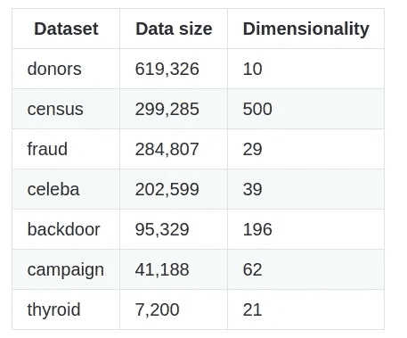
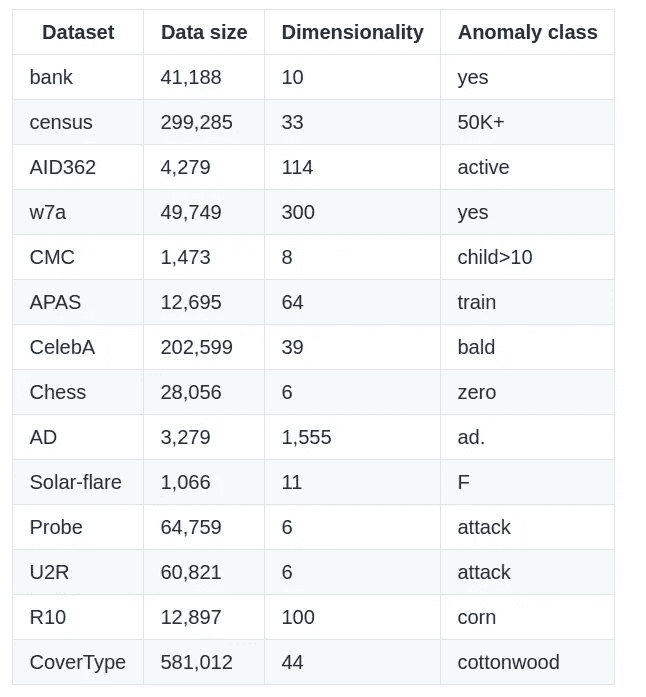

# 仓库:具有真实异常的异常检测数据集

> 原文：<https://towardsdatascience.com/adrepository-anomaly-detection-datasets-with-real-anomalies-2ee218f76292?source=collection_archive---------18----------------------->

## 持续更新的异常数据集集合

我创建了一个 Github 存储库，以提供一个持续更新的流行真实数据集集合，用于文献中的异常检测。请在下面找到指向存储库的链接。

 [## 关松庞/异常检测数据集

### 在这个库中，我们提供了一个不断更新的用于异常的流行真实世界数据集的集合…

github.com](https://github.com/GuansongPang/anomaly-detection-datasets) 

异常检测发展的一个主要障碍是缺乏具有真实异常的真实世界数据集。尽管在 [UCI 机器学习库](https://archive.ics.uci.edu/ml/datasets.php)和/或 [Libsvm 数据集](https://www.csie.ntu.edu.tw/~cjlin/libsvmtools/datasets/)中有许多相关的公开可用数据集，但我们可能经常需要投入大量时间来使公开可用数据集为我们的异常检测模型做好准备。创建这个存储库就是为了解决这些问题。它将专注于现成的数据集，即不需要任何进一步的数据预处理，并不断用我或其他研究人员预处理的数据集更新它。

现在存储库中可用的数据集来自不同的领域，如信用卡欺诈检测、入侵检测、疾病检测等。这些数据集的基本统计数据可以在下面找到。

Pang，g .，Shen，c .，& van den Hengel，A. (2019 年 7 月)使用的数据集。基于偏差网络的深部异常探测。《第 25 届 ACM SIGKDD 知识发现和数据挖掘国际会议论文集》(第 353–362 页)。请参阅本文中对这些数据集的详细介绍以及其中的源链接。

庞，曹，陈(2016 年 1 月)使用的数据集。复杂分类数据中异常值检测的特征值耦合模型。在 IJCAI 国际人工智能联合会议上。和其他几篇论文。请参阅本文中对这些数据集的详细介绍以及其中的源链接。

带有可访问链接的数据集列表也可在以下调查报告中找到:

 [## 用于异常检测的深度学习:综述

### 异常检测，也称为离群点检测，已经成为各种研究中一个持久而活跃的研究领域

arxiv.org](https://arxiv.org/abs/2007.02500)