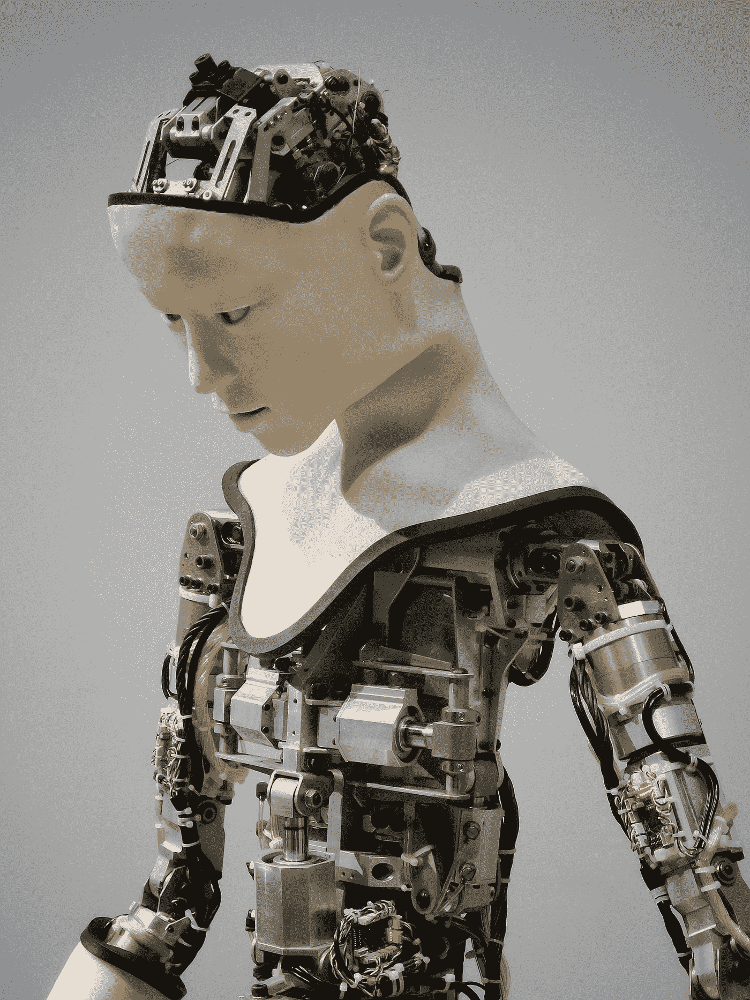

# 高级 AI 快到了，快跑。

> 原文：<https://towardsdatascience.com/advanced-ai-is-almost-here-run-d0d43d483d08?source=collection_archive---------20----------------------->

## 我们应该在多大程度上拥抱有意识机器的发展？

[附身摄影](https://unsplash.com/@possessedphotography?utm_source=medium&utm_medium=referral)在 [Unsplash](https://unsplash.com?utm_source=medium&utm_medium=referral) 上拍照

尽管人工智能已经在全球广泛使用，但它的发展应该得到专业和谨慎的处理，因为我们仍然不知道有意识的机器会对人类产生什么影响。该领域的领先研究人员警告其潜在后果，史蒂芬·霍金教授声称，超级智能机器可能会导致人类的末日。

人工智能是计算机系统的理论和发展，能够执行通常需要人类智能的任务。近年来，由于其快速的发展和广泛的应用，以及公众人物如埃隆·马斯克和比尔·盖茨对该主题的关注，它已经获得了主流媒体的关注。事实证明，这是计算机科学家和哲学家之间争论的话题，其中一些人表示，超级智能人工智能将是我们创造的最后一件东西。

这份报告评估了来自杰出研究人员和学术报告的证据、研究和陈述，并得出结论认为，应该允许开发人工智能，但只能在严格到适度的监督和监管下进行。它致力于讨论研究问题:超级智能人工智能是否对人类构成生存威胁，创造有意识的机器是一个好主意吗，创造有意识的机器是否不道德？

# 创造有意识的机器对人类来说是个好主意吗？

## 人工智能的种类—

人工智能可以分解为三个 categories⁴.人工狭义智能(ANI)是一种低水平的智能，ANI 可以执行复杂的任务，但不能理解它为什么要这样做，它不会在有意识的层面上思考，例如 Siri，Alexa。人工通用智能(AGI)是有意识的，它可以在与人类相同的水平上思考，有自我意识，可以理解它是一台机器。AGI 还不存在。最后，人工超级智能(ASI)是比人类更高级的机器智能，它也尚不存在，但它能够解决超出我们理解的问题。

## 时间框架—

由于 AGI 和阿西还不存在，这是一个猜测的主题，他们是如何迫在眉睫，因此我们需要如何关注。field⁵的一项专家调查发现，受访者的中位数估计，到 2040 年，AGI 将有二分之一的可能性被创造出来，到 2075 年，这一比例将上升至十分之九。他们还预测，不到 30 年后，ASI 也将步其后尘。ASI 对人类来说变成“坏”或“极其坏”的可能性估计为三分之一。

虽然该调查很有见地，并为我们提供了一个工作时间框架，但应谨慎依赖，因为该调查报告并未提及这些专家是谁，以及被归类为专家的标准是什么。

## 好处和威胁—

据了解，有了意识，自主的决定和意见就形成了。这意味着有意识的机器可能有与其创造者不一致的目标。它们的处理时间比人快数百万倍，很难抵御。来自威斯康星大学麦迪逊分校的一份报告指出，创造一个人工智能可能导致人工智能武装 race⁶.AGI 将允许自主武器系统，它可以很快变得非常复杂，当机器从 AGI 转换到 ASI 时，我们可能会失去对它的控制。以及试图获得该技术的敌对国家。这可以被归类为一种生存威胁，因为人类对一台武装的超级智能机器无能为力。在同一篇论文中，进行了一项调查，48%的受访者同意“社会应该优先考虑将人工智能的潜在风险降至最低”。虽然现在的回应有点过时，观点可能也有所改变，但这反映了一个事实，即人们对开发有意识的机器存在担忧。

仅仅因为有意识的机器对人类来说是一大进步，它带来了威胁，这并不意味着它根本不应该被创造出来。AGI 全球协作和政府法规等解决方案可以到位，以确保其得到负责任的发展。让-马克·里克利博士声称，AGI 的好处将是巨大的，它可以在防止欺诈和发现网络攻击以及国防和 anti-terrorism⁷.等活动中发挥重要作用虽然，里克利的想法很容易引起争议，因为 AGI 也可以帮助网络攻击和恐怖主义。

# 创造人工意识对机器公平吗？

当建造有意识的机器时，伦理是一件需要考虑的重要事情，因为它本质上是在创造生命。有太多限制的意识就像关在笼子里的动物。此外，无情地强迫一个意识去执行一个又一个的任务会让人想起我们现在回想起来并不愉快的历史事件，例如奴隶制。

为了防止历史重演，需要就对 AGI 能做什么和不能做什么制定指导方针。博斯特罗姆提出了一个被认为是 ethical⁸的总清单，随着伦理不可避免的转变，这个清单可以更新。AI 也应该遵守这个主列表。虽然这是一个很好的建议，但可能被认为是不现实的。Bostrom 只提出了一个解决方案，但没有说明如何实施。假设每个人都会遵守它是不合理的。

# 最后

“制造一台有意识的机器对人类来说是个好主意吗？”这个问题似乎没有明确的答案，但如果不付诸行动，它还是会继续下去。因此，由于人工意识是如此不朽和改变世界，似乎最好继续创造它，但要有严格的规定来确保它安全和负责任地发展。

AGI 很可能是对人类的生存威胁，赋予机器意识也可能是不道德的，如果不是出于责任感的话。确实有证据表明，AGIs 的发明会给人类带来许多好处，但这并不意味着我们可以忽视威胁，这些威胁可能更重要。

在回答“创造人工意识对机器公平吗？”，就看谁在控制它了。这就是监管如此重要的原因，也是如此大规模的技术进步不能向世界隐瞒的原因。

技术的演变是不可避免的，但这并不意味着人类在这样做的时候不应该是道德的、安全的和前瞻性的，特别是在先进的人工智能的情况下。

[www.linkedin.com/in/joe-drury18](http://www.linkedin.com/in/joe-drury18)

# 参考

[1]塞兰·琼斯博士，2014 年。斯蒂芬·霍金警告人工智能可能会终结人类。英国广播公司新闻，2014 年第 2 版

[2]词典|英语。(2019).人工智能| Lexico 对人工智能的定义。【在线】见:[https://www . lexico . com/en/definition/artificial _ intelligence](https://www.lexico.com/en/definition/artificial_intelligence)【2019 年 10 月 23 日访问】。

[3]n .博斯特罗姆，2003 年。高级人工智能中的伦理问题。科幻小说与哲学:从时间旅行到超级智慧，第 241 页

[4]特威迪，M. (2017)。3 种类型的人工智能:窄，一般，和超级人工智能。[在线]

[5]米勒，V.C .和 n .博斯特罗姆，2016 年。人工智能的未来发展:专家意见调查。《人工智能的基本问题》(第 555-572 页)。斯普林格，查姆。

[6] Ramamoorthy，a .和 Yampolskiy，r .，2018 年。超越疯狂？人工智能竞赛。国际电联 J，1，第 1-8 页。

[7] Rickli，J.M .，3.2 评估人工智能的风险。

[8]n . Bostrom 和 e . Yudkowsky，2014 年。人工智能的伦理。《剑桥人工智能手册》，316，第 334 页

代码机器人。可在:[https://code bots . com/artificial-intelligence/the-3-types-of-ai-is the-third-even-possible](https://codebots.com/artificial-intelligence/the-3-types-of-ai-is-the-third-even-possible)【2019 年 11 月 12 日访问】。

https://unsplash.com/photos/YKW0JjP7rlU