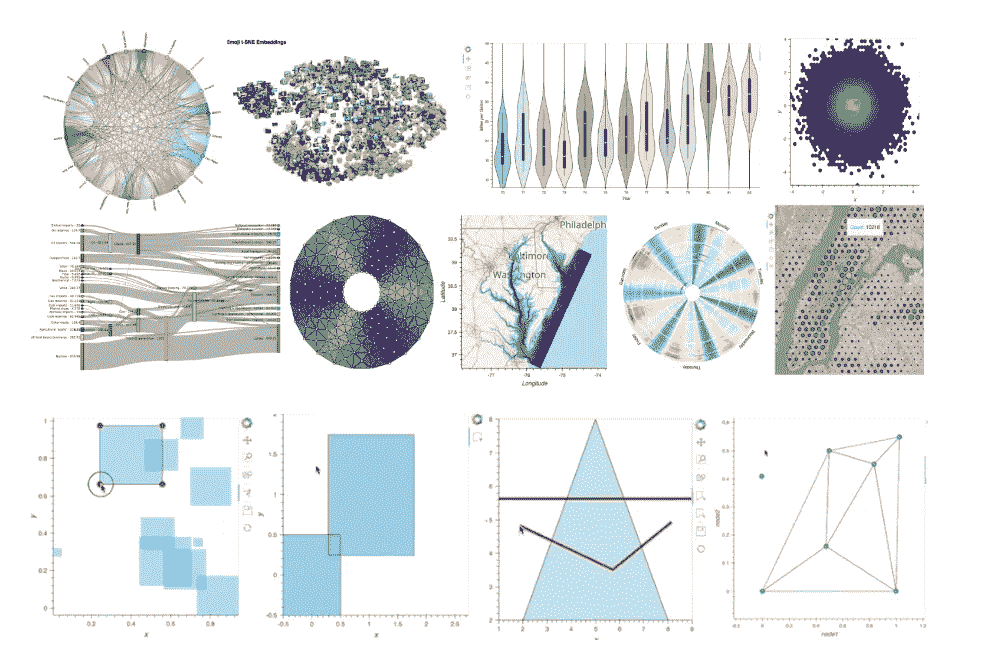
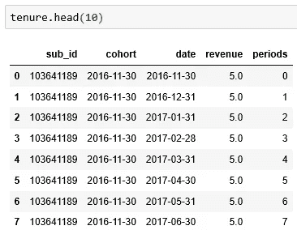
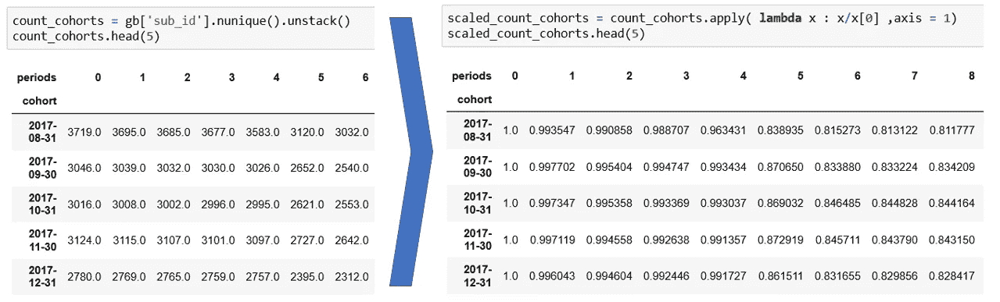
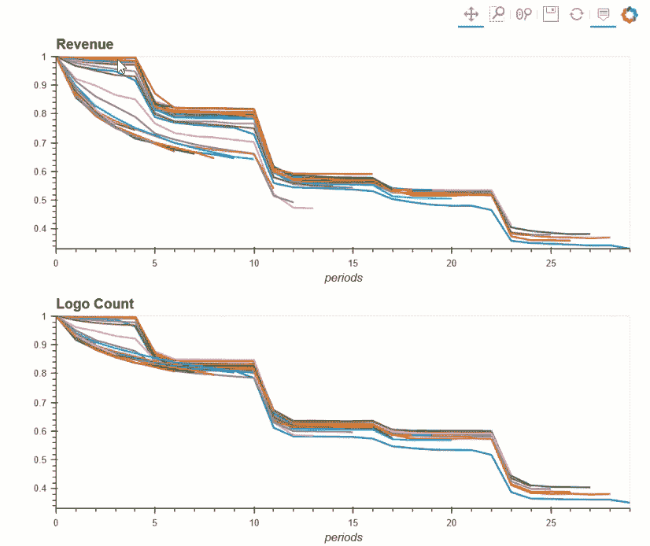
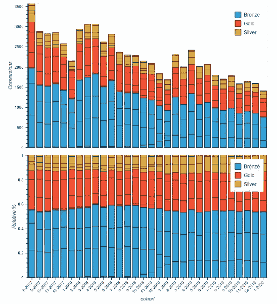
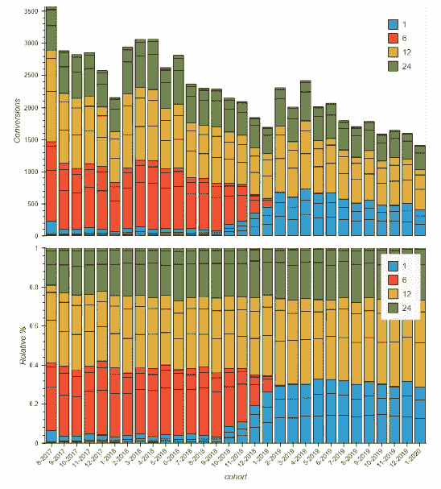
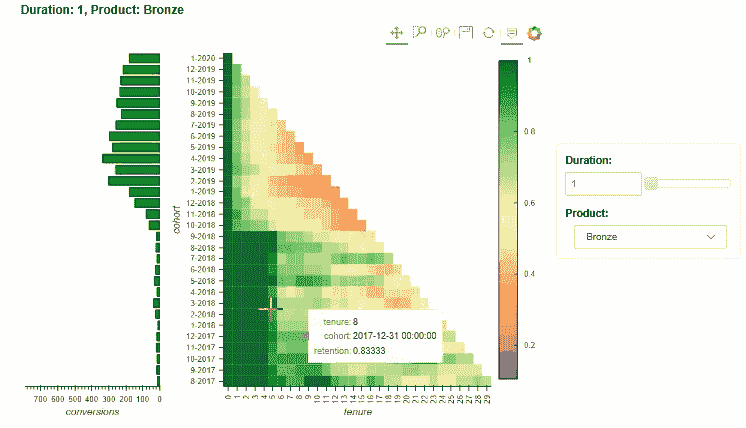

# 使用全息视图在 Python 中实现高级数据可视化

> 原文：<https://towardsdatascience.com/advanced-data-visualization-with-holoviews-e7263ad202e?source=collection_archive---------15----------------------->

## HoloViews 将数据和绘图升级为高质量的注释和可视化。本文通过一个简化的群组分析展示了 Python HoloViews 包，该分析使用了关于公司不断发展的客户群的模拟数据。读者应该对 Python 和 pandas 有一个基本到中级的了解。



来源:http://blog.holoviews.org/release_1.10.html

# 全息视图概述

HoloViews 是一个开源包，它用最少的代码和努力产生高质量的交互式可视化。项目页面可以在这里找到[这里](http://holoviews.org/index.html)以及许多例子来理解软件包的功能。相对于遗留选项(Matplotlib、Seaborn 等)，我对易用性和性能非常满意。

# 断代分析

在解决真实世界的数据分析练习时，探索和学习新的包更有吸引力。本文通过对一个简化的 SaaS 企业的队列分析，来确定在客户群中是否有任何新兴趋势。这种分析在许多情况下是有用的，包括准备和验证顶线预测，以及评估产品供应或定价的最近变化的影响。本例中的群组将被定义为在给定月份首次出现的所有用户。这个练习的目的是检查新业务的组合如何随着时间的推移而变化，以及组合的变化对保留意味着什么。在这种情况下，mix 指的是产品等级和订阅持续时间，在其他情况下，它可以是任何可用的分类字段。

# 数据的描述

分析所依据的数据被模拟以复制在多个公司中观察到的模式。

有两个文件:

*   mrr.csv 包含每个订阅在 2.5 年期间的每月收入。没有左审查。
*   user.csv 包含用户 id、订阅 id、产品等级和订阅期限

一个用户可能有多个订阅，他们可以交换产品等级和订阅期限。为简单起见，保留是基于订阅而不是基于用户来计算的。

# 到代码

分析从进口开始。显示这一点是为了确保读者已经安装了所有的依赖包。请注意 hvplot 包是建立在 HoloViews 上的，它有一个方便的 API 来绘制熊猫图，这需要从 HoloViews 中单独安装。

```
import pandas as pd
import numpy as np
import matplotlib.pyplot as plt
import os
import hvplot.pandas
import holoviews as hv
from holoviews import opts
hv.extension('bokeh')
```

附注:HoloViews 中日期时间格式的默认行为是打印精确到纳秒的日期/时间。对于初学者来说，控制这种行为的文档通常很难找到，也不完全清楚。这个格式化问题可以通过创建一个 DatetimeTickFormatter 对象并根据需要将其传递给图形来解决。

```
from bokeh.models.formatters import DatetimeTickFormatter
dtf = DatetimeTickFormatter( days = '%m-%Y', months = '%m-%Y' , years = '%m-%Y')
```

# **整形数据**

在绘制数据之前，需要将其转换为内容，使图形有意义，并以适当的格式传递给 HoloVeiws。一些基本的熊猫操作被排除在这篇文章之外。完整的文件可以在 [github](https://github.com/Riley243/Holoviews-medium-post) 找到。

创建群组是群组分析的第一步，有许多方法可以进行这种计算。给定输入数据的格式，这里应用以下步骤:

```
### Calculate start period of the subscription## #1 Create cohorts based on the first observation of a month with a positive mrr value
cohort = (mrr > 0).idxmax( axis = 1).rename('cohort')## #2 Add the cohort date to the index
tenure =  mrr.join( cohort ).set_index( 'cohort', append = True).stack()
tenure = tenure.reset_index( ).rename( columns = {'level_2':'date',## #3 Calculate the number of periods (months) from the cohort date to the mrr date
0:'revenue'} )
tenure['periods'] =  np.round( (tenure['date'] - tenure['cohort']) / np.timedelta64(1, 'M') ,0).astype(int)
```

#1 中的代码将数据帧转换为二进制变量的值，当一个月有正收入时，这些值为真。然后应用 idxmax 提取最大值第一次出现的列标题，这将是收入为正数的第一个日期。结果是一个与 mrr 具有相同索引的序列，该序列作为 mrr 的#2 中的二级索引被附加，堆叠(该操作通过将列标题(在本例中为每月日期)转换为值字段来解除数据透视)并保存为一个名为“保有权”的新数据帧。步骤#3 计算群组月份和当前月份之间经过的周期数(在本例中为月数)。



结果数据帧

在群组分析的 EDA 阶段，这两条曲线通常非常有用，可以对客户保持率有一个总体的了解。两者都表示相对于每个客户活跃的第一个周期，在给定时间点剩余的业务的百分比。一个使用客户作为分子和分母，另一个使用收入。这些计算分为两部分，如下所示:

```
## #1 Calculate revenue and subs count by cohort by month
gb =  tenure.groupby( [ pd.Grouper( key ='cohort' , freq = 'M') , 'periods'])
rev_cohorts = gb['revenue'].sum().unstack()
count_cohorts = gb['sub_id'].nunique().unstack()## #2 turn them into a percentage relative to the first month
scaled_revenue_cohorts = rev_cohorts.apply( lambda x : x/x[0] ,axis = 1)
scaled_count_cohorts = count_cohorts.apply( lambda x : x/x[0] ,axis = 1)
```

#1 中的计算为每个有观察值的周期中的每月客户群计算总收入和客户的唯一计数，unstack 命令将周期转换为列标题，这对使用 hvplot 绘图很有用。#2 中的计算利用了新的数据形状，并应用 lambda 函数将每个期间的值(收入或客户数)除以第一个月观察到的值。



# 视觉化

对 HoloViews 的 hvplot 扩展提供了一种非常快速的方式来从 pandas 对象生成交互式可视化，这有助于 EDA。以下代码遵循与 matplotlib 相同的 API 格式，可以快速生成用于探索的线图。

```
### Quick hvplot of both dataframes
p1 = scaled_revenue_cohorts[scaled_revenue_cohorts>0].T.hvplot( figsize = [11,7], legend=False , title = 'Revenue')
p2 = scaled_count_cohorts[scaled_count_cohorts>0].T.hvplot(figsize = [11,7], legend=False , title = 'Logo Count')### Add the graphs together to display as one output
(p1 + p2).cols(1)
```



有两件事在全息视图中比在绘图包中更容易实现。工具提示允许用户以交互方式浏览数据，并且是自动生成的。将图形添加到单个可视化中的语法比从 matplotlib 调用 axes 对象更容易。

这些图表已经提供了大量信息，有助于指导接下来的分析。首先，请注意，这里混合了不同的订阅长度。最好分别分析不同持续时间选项的保留情况，因为显然一年期订阅与一个月期订阅的情况不同。其次，保留曲线的轮廓正在改变。较短的线是最近的线，因为可用的数据很少。这些有更多的曲率比旧的，而且他们似乎有一个较低的保留百分比。稍后，本文将展示一种更好的方法来演示这种模式。在此之前，我们将探索基础订阅基础的变化。

当新业务组合发生变化时，保留模式通常会开始改变。由于新的营销活动、产品供应、期限选择、地区或人口特征等诸多因素，新业务的组合可能会发生变化。在该数据集中，只有持续时间和订阅层可用作分类特征。评估任何分类特征的组合如何随时间变化的一个好方法是将它们绘制成两个堆叠的条形图，显示总量和相对百分比。

为了生成下一组图表，需要对数据进行整形，按层和持续时间划分群组。

```
## #1 Create product duration cohorts
gb = tenure.groupby( ['sub_product','sub_duration','cohort', 'subs_id','periods'])## #2 Divide each periods user count (observations with revenue > 0) by the month 0 count
cohorts_scaled = gb['revenue'].sum().unstack().groupby(level=[0,1,2]).apply( lambda x : (x>0).sum()/(x[0]>0).sum())
```

有了新的群组数据，创建条形图相当容易，但需要几行:

```
## #1 
mix = cohorts[0].rename('count').reset_index()
mix = mix.set_index(['cohort','sub_product','sub_duration'] )
mix = mix.sort_index()## #2
abs_bars = hv.Bars( mix )
abs_bars.opts( stacked = True, xrotation = 45 , width = 700 , height = 400 , xaxis= None , ylabel = 'Conversions')## #3
hund_bars = hv.Bars( mix/mix.groupby( level =0 ).sum() )
hund_bars.opts( stacked = True, xrotation = 45 , width = 700 , height = 400 , xformatter = dtf, ylabel = 'Relative %')layout = (abs_bars + hund_bars).cols(1)
layout.opts(shared_axes=False)
```

#1 下的代码创建了一个多索引序列，可以传递给 HoloViews bars 类。Holoviews 需要平面数据，而 hvplot 可以平稳地处理表格数据。的。HoloViews 中的 opts()方法让开发人员可以非常详细地控制可视化的几乎每个部分。



条形图显示，产品层级没有随着时间的推移而发生任何明显的变化。然而，持续重复这一步骤显示出新业务组合的显著变化。



一个月的订阅完全取代了六个月的订阅。这一结果几乎肯定会导致保留曲线的整体移动。为了证明这一点，我们将按产品和持续时间绘制保留曲线。

# 与全息地图建立互动

之前展示的情节很容易制作，也很吸引人，但是在交互性方面有所限制。HoloViews 的一个很好的特性是能够产生类似仪表盘的可视化效果。此外，它还以 html 格式生成这些可视化效果，以便它们可以嵌入到网页中。这些特性比简单地将数据帧传递给 hvplot 需要更多的代码。这些功能通过两种可视化方式进行了演示，有助于识别保留趋势。

在生成可视化之前，构建一些助手函数将使代码更具可读性。在之前显示的群组曲线图中，很难看出哪条线属于哪个年份。为了使这一点更清楚，人们可以指定一种随着年龄增长而褪色的颜色。下面的代码块将线条涂成蓝色，并且随着时间的推移，蓝色逐渐变成白色/灰色。

```
def gen_cohort_plot( cohort ):
    cohort = cohort[ cohort > 0]
## #1 Create curves with hvplot
    plot = cohort.T.hvplot( width=700, height=350, legend=False ) 
    d_min = 2015 REPLACE
    d_max = 2017 REPLACE
## #2 loop through curves to adjust the formatting 
    for item in plot.items():
        date , curve = item
        year = pd.to_datetime( date ).year 
## #3 interpolate the blue scale bounded between .2 and .8
        c = plt.cm.Blues( .8* (year - d_min ) / ( d_max - d_min ) + .2)
        curve.opts( hv.opts.Curve( color=c ))
    return plot
```

这个函数看起来很吓人，但是逻辑非常简单。在#1 中，hvplot 用于生成与前面所示相同的曲线。这些曲线在#2 中循环，而#3 将相对于最小和最大群组年的群组年线性插值到 matplotlib 的蓝色地图上。

```
## #1 loop through possible pairs of product and duration 
## pd_curve is a helper function that just filters data before 
## being passed to gen_cohort_plot()
curve_dict_2D = {(d,p):pd_curve(p,d, cohorts_scaled) for p in products for d in durations }## #2 create hmap visualizations 
hmap = hv.HoloMap(curve_dict_2D , kdims=['Duration', 'Product'])## generate a plot of the number of conversions
conv_curve_dict_2D = {(d,p):conversion_plot( p , d , cohorts ) for p in products for d in durations }
conv_hmap = hv.HoloMap(conv_curve_dict_2D, kdims=['Duration', 'Product'])## generate a plot of the average price for a cohorts first month
asp_curve_dict_2D =  {(d,p):asp_plot(p,d, cohort_asp) for p in products for d in durations }
asp_hmap = hv.HoloMap(asp_curve_dict_2D, kdims=['Duration', 'Product'])(hmap +conv_hmap + asp_hmap ).cols(1)
```

曲线存储在字典中，可以在不同的布局选项中传递。这里展示的是全息地图。全息地图根据显示的字典键生成下拉选择器:


线条越黑，群组越新。点击不同的组合后，可以清楚地看到一个月订阅的保留情况更差。我们之前已经观察到，一个月订阅在新客户群中所占的比例越来越大。

虽然给线条涂上不同的颜色有助于显示群组的年龄，但热图提供了一种显示信息的替代方法，使某些趋势更容易识别。但是，如果向不熟悉这种格式的各方展示热图，热图确实需要比线图更多的解释。本教程最后将讨论如何生成和解释热图视图。

创建辅助函数是为了格式化图形，并使代码更易于管理。

```
def heatmap_product_duration( product , duration , data = cohorts_scaled):
## #1 filter the data for the product duration pair
    idx = pd.IndexSlice
    data = data.loc[ idx[product, duration, :] , :].reset_index( level = [0,1], drop = True)

    data = data[data>0]

    data = data.stack().rename( 'retention').reset_index()
    data = data[ data['retention'] > 0]
    data.columns = ['cohort','tenure','retention']
## #2 Create a heatmap
    hm = hv.HeatMap(data , kdims=['tenure','cohort']).sort()
## #3 Formatting options note the addition of the hover tool 
    hm.opts( opts.HeatMap( width = 500 , height = 500  ,colorbar = True, yformatter = dtf , xrotation = 90 ,cmap = 'RdYlGn' ,tools=['hover'], toolbar='above'))
    return hmdef left_conv_bar( product , duration, data = cohorts ):
## #1 filter the data for the product duration pair
    idx = pd.IndexSlice
    data = data.loc[ idx[product, duration, :] , :].reset_index( level = [0,1], drop = True)
    data = data.loc[:,0].rename( 'conversions').reset_index() 
## #2 similar to the previous bar charts, note the invert_axes option
    bar = hv.Bars(  data ).opts( invert_axes=True , height = 500 , width = 200 , color = 'Green' , yaxis = None, invert_xaxis=True )
    return bar
```

在构建了 helper 函数之后，以类似于之前的方式，代码循环遍历产品持续时间对，并创建一个字典来存储可视化，然后最终将它们传递给全息地图。

```
heatmap_curve_dict_2D = {(d,p):heatmap_product_duration(p,d) for p in products for d in durations }
heatmap_hmap = hv.HoloMap(heatmap_curve_dict_2D, kdims=['Duration', 'Product'])
left_bar_curve_dict_2D = {(d,p):left_conv_bar(p,d) for p in products for d in durations }
left_bar_hmap = hv.HoloMap(left_bar_curve_dict_2D, kdims=['Duration', 'Product'])
layout = (left_bar_hmap  + heatmap_hmap ).opts( shared_axes = True)
layout
```



此视图通过观察一个月订阅的所有层在 2018 年 10 月后从早期任期的绿色转变为黄色，显示了不同群组的老化情况。注意，这种偏移也对应于转换次数开始增加的时期。这种现象在不断发展的企业中相当普遍。增加营销支出或改变产品/价格将吸引更多的新客户，但增加的新客户不一定与以前的客户群相同。

HoloViews 允许分析师产生高质量的可视化，通过高度定制来加速产生有意义的见解的时间。谢谢你读到这里，我希望你能去图书馆看看。