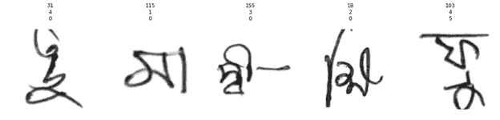
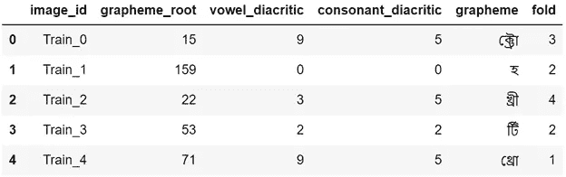

# fastai2 的高级数据加载器

> 原文：<https://towardsdatascience.com/advanced-dataloaders-with-fastai2-ecea62a7d97e?source=collection_archive---------33----------------------->

## 快速介绍

## 优雅的 fastai2 方法创建超出通常的输入-目标对的数据加载器——一个使用 Kaggle Bengali 的例子。人工智能数据

在深度学习项目中，在开始训练任何模型之前，关键的一步是要有一个数据加载器，能够为模型提供批量数据，并执行图像放大等操作。在这个故事中，我将展示一个用于[孟加拉语的数据加载器。AI Kaggle 竞赛](https://www.kaggle.com/c/bengaliai-cv19)可以使用 fastai 创建，只需 12 行干净的代码。贯穿全文，当提到 fastai 时，我指的是库的最新版本( [fastai2](https://github.com/fastai/fastai2) )。

作者照片

## **为什么是 fastai？**

引用他们的学术论文:

> “fastai 是围绕两个主要设计目标组织的:平易近人和快速高效，同时也是高度可黑客化和可配置的。其他库倾向于在简洁性和开发速度，或者灵活性和表达性之间做出选择，但不能两者都选。我们希望获得 [Keras](https://keras.io/) 的清晰度和开发速度，以及 [PyTorch](https://pytorch.org/) 的可定制性。”

fastai 的这一核心特征使它能够为更广泛的受众所使用，同时也是有经验的从业者和研究人员的优秀工具。fastai 高级 API 包括两个组件:**数据块**和**学习器**。这个故事着重于数据块组件，我发现这是一个优雅的解决方案，可以轻松地创建一个具有一个输入和三个目标的数据加载器——这是 Bengali 所需要的。人工智能竞赛。

## 孟加拉语。AI 比赛数据

用孟加拉语。人工智能竞赛给我们一组手写的字素，目标是用对应于字素不同组成部分的三个分类标签对每个字素进行分类。图像名称和各自的标签存储在一个 CSV 文件中，该文件可以加载到 pandas 数据帧:**df = PD . read _ CSV(CSV _ file)**。

五个字素和各自标签的样本。作者使用[竞赛数据](https://www.kaggle.com/c/bengaliai-cv19/data)创建的图像。

dataframe 包括 image_id、三个不同标签的类别号(grapheme_root、元音 _ 音调符号、辅音 _ 音调符号)、字形的表示以及范围从 0 到 4 的折叠号，该折叠号将用于将数据分成训练/验证集。

数据报的前 5 行。作者使用[比赛数据](https://www.kaggle.com/c/bengaliai-cv19/data)和[笔记本](https://www.kaggle.com/yiheng/iterative-stratification)中的数据创建的图像。

## **用 12 行代码创建数据加载器**

要创建数据加载器，包括图像扩充和规范化，只需要下面的 12 行代码(其中 **df** 是数据帧， **train_path** 是存储图像的路径)。

在 fastai 中创建一个带有一个图像输入和三个分类目标的数据加载器。

*   在前两行中，定义了图像标准化和图像放大。Fastai **aug_transforms** 函数返回一个带有默认扩充的列表。由于字形是水平不对称的，翻转图像可能不是一个好主意，因此参数 **do_flip** 被设置为 false。
*   在第 3 到 10 行，创建了数据块。第 4 行的**块**参数接收一个包含四个元素的元组——一个用于图像输入，三个用于分类目标。用于这些类型数据的 fastai 块有:用于图像的**图像块**和用于目标标签的**类别块**。由于该数据集中的图像是灰度而不是 RGB，因此将**cls = piimagebw**赋予 ImageBlock。注意*(3*[CategoryBlock])是写三次 CategoryBlock 的懒惰方式。
*   **getters** 参数接收定义如何获取每个块的数据的类列表。Fastai **ColReader** 类用于从 pandas dataframe 的一列中获取数据。在第 5 行中，第一个 ColReader 获取图像名称(检查上面的 dataframe 示例以供参考)，然后对于每个 CategoryBlock，给出对应于不同标签的 dataframe 的一列。
*   第 9 行中的**拆分器**参数定义了如何将数据集拆分为训练/验证。有几种方法来定义分割。在这种情况下，由于我们在数据框中有折叠数，fastai **IndexSplitter** 函数可用于选择哪些样品将出现在验证集中。
*   在第 10 行中， **batch_tfms** 参数接收一个转换列表，如前两行所定义的。
*   现在数据块已经完成，在第 11 行中，使用以下参数创建了数据加载器:dataframe 和 batch-size。
*   最后，在第 12 行， **n_inp** 被设置为 1，这意味着只有一个输入——其他三个模块应被视为目标。

## **使用数据加载器**

调用 **dls.show_batch()** 将打印出几个样本，类似于本文中第一幅图所示的内容。

不言而喻，数据加载器与 fastai **Learner** 类完美集成。然而，可以在一个循环中调用训练和验证数据加载器 **dls.train** 和 **dls.valid** 来提取批量数据，如下图所示。注意，有四个值要解包，对应于数据块中定义的块。

使用列车数据加载器的循环示例。作者创造的形象。

## **这有什么关系**

fastai 库允许为孟加拉语创建数据加载器。人工智能竞赛仅 12 行干净的代码，包括图像放大和规范化。拥有一个默认情况下提供高效代码的框架，可以让深度学习实践者将更多时间分配给实验，从而增加更好的最终结果的可能性。拥有简洁的代码也减少了小错误的机会，这些小错误可能会悄悄地影响模型的性能。最后，代码在共享时更容易理解。

值得注意的是，fastai **aug_transforms** 增量是在 GPU 中计算的(如果有一个可用的话)。

像这样的细节很重要。

## **结束语**

[这个 Kaggle 内核](https://www.kaggle.com/mnpinto/bengali-ai-fastai2-starter-lb0-9598)为孟加拉语提供了一个完整的工作示例。人工智能竞赛，包括模型定义和使用**学习者**类的训练，这在本故事中没有涉及。

## 进一步阅读

在下面的故事中，我将进一步探索 fastai 数据块:

 [## 使用 3D 数据— fastai2

### 了解 fastai 数据块并创建用于深度学习的图像序列的构建块…

towardsdatascience.com](/working-with-3d-data-fastai2-5e2baa09037e) 

## 关于我

 [## 我的 3 年历程:从零 Python 到深度学习竞赛高手

### 自从 2017 年开始学习 Python 以来，我一直遵循的道路是成为一名独自参加 Kaggle 比赛的大师…

towardsdatascience.com](/my-3-year-journey-from-zero-python-to-deep-learning-competition-master-6605c188eec7) 

感谢阅读！

编辑日志:

2020 年 5 月 10 日:修正了代码中的错误。batch_tfm 参数先前已在 dataloader 中给出。它应该在数据块中给出，而不是如正确的版本所示。

2020–06–07:增加了**进一步阅读**部分。