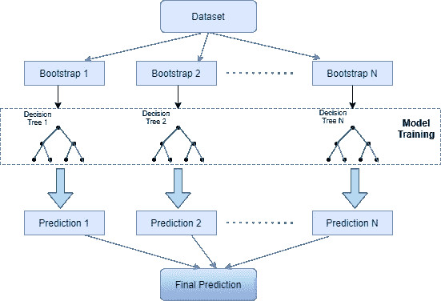
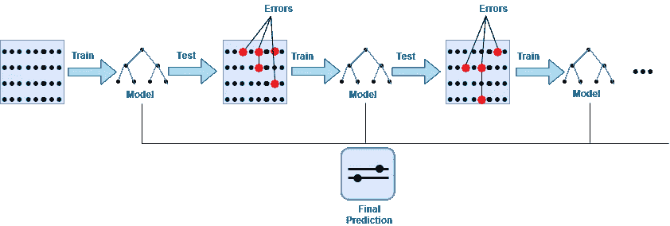
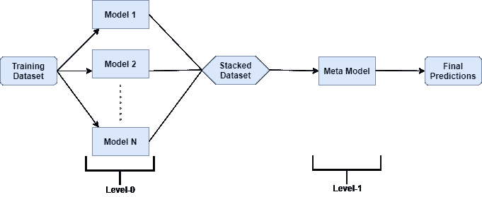
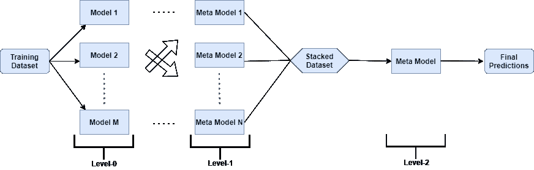

# 高级集成学习技术

> 原文：<https://towardsdatascience.com/advanced-ensemble-learning-techniques-bf755e38cbfb?source=collection_archive---------11----------------------->

## 合奏是一门艺术和科学


杰斯温·托马斯在 [Unsplash](https://unsplash.com/s/photos/ensemble-learning?utm_source=unsplash&utm_medium=referral&utm_content=creditCopyText) 上的照片

在我以前关于集成学习的帖子中，我解释了什么是集成学习，它如何与机器学习中的偏差和方差相关联，以及什么是集成学习的简单技术。如果你没有看过这篇文章，请参考这里的。

在这篇文章中，我将介绍集成学习类型，高级集成学习方法——打包、提升、堆叠和与代码样本混合。最后，我将解释使用集成学习的利与弊。

# 集成学习类型

集成学习方法可以分为两组:

**1。顺序集成方法**

在这种方法中，基础学习者依赖于先前基础学习者的结果。每一个后续的基础模型都会修正它的前任所做的预测，修正其中的错误。因此，可以通过提高先前标签的权重来提高整体性能。

**2。并行集成方法**

在这种方法中，基本学习器之间没有依赖性，所有基本学习器并行执行，并且所有基本模型的结果最终被组合(对回归使用平均，对分类问题使用投票)。

并行集成方法分为两类

**1。同类并行集成方法-** 在这种方法中，单个机器学习算法被用作基本学习器。

**2。异构并行集成方法-** 在该方法中，多个机器学习算法被用作基础学习器。

# 高级集成技术

# 制袋材料

Bagging 或 Bootstrap 聚合是一种并行集成学习技术，用于减少最终预测中的方差。

bagging 过程与平均非常相似，唯一的区别是 Bagging 使用原始数据集的随机子样本来训练相同/多个模型，然后组合预测，而在平均中，使用相同的数据集来训练模型。**因此，该技术被称为自举聚合，因为它结合了自举(或数据采样)和聚合来形成集合模型。**



作者图片

装袋有三个步骤-

2.用每个样本建立模型(分类器或决策树)。

3.所有基本模型的预测被组合(对于回归问题使用平均或加权平均，对于分类问题使用多数投票)以获得最终结果。

所有这三个步骤都可以跨不同的子样本并行化，因此在处理较大的数据集时，训练可以更快地完成。

在 bagging 中，每个基础模型都在不同的数据子集上进行训练，并且所有结果都进行组合，因此最终模型较少过度拟合，并且方差减少。

> 当模型不稳定时，装袋更有用，对于稳定的模型，装袋在提高性能方面没有用处。当模型对训练数据中的小波动不太敏感时，称为稳定模型。

**装袋的一些例子是——随机森林、装袋决策树、额外树。sklearn 库还提供 BaggingClassifier 和 BaggingRegressor 类来创建自己的 bagging 算法。**

让我们看看下面的例子

```
LogisticRegression :::: Mean: 0.7995780505454071 , Std Dev: 0.006888373667690784
Bagging LogisticRegression :::: Mean: 0.8023420359806932 Std Dev: 0.00669463780099821 DecisionTreeClassifier :::: Mean: 0.8119073077604059 , Std Dev: 0.005729415273647502
Bagging DecisionTreeClassifier :::: Mean: 0.849639923635328 Std Dev: 0.0046034229502244905 RandomForestClassifier :::: Mean: 0.8489381115139759 , Std Dev: 0.005116577814042257
Bagging RandomForestClassifier :::: Mean: 0.8567037712754901 Std Dev: 0.004468761007278419 ExtraTreesClassifier :::: Mean: 0.8414792383547726 , Std Dev: 0.0064275238258043816
Bagging ExtraTreesClassifier :::: Mean: 0.8511317483045042 Std Dev: 0.004708539080690846 KNeighborsClassifier :::: Mean: 0.8238853221249702 , Std Dev: 0.006423083088668752
Bagging KNeighborsClassifier :::: Mean: 0.8396364017767104 Std Dev: 0.00599320955270458 VotingClassifier :::: Mean: 0.8462174468641986 Std Dev: 0.006423083088668752
```

正如我们在示例中看到的，Bagging 分类器改善了 ML 模型的方差并减少了偏差。当使用改进 ML 模型的平均方差的 VotingClassifier 时，情况也是如此。

# 助推

Boosting 是一种顺序集成学习技术，用于将弱基础学习者转换为表现更好且偏差更小的强学习者。这里的直觉是，单个模型可能不会在整个数据集上表现得很好，但它们在整个数据集的某个部分上表现得很好。因此，集合中的每个模型实际上都提升了整体性能。

> 提升是一种迭代方法，它根据先前的分类调整观察值的权重。如果一个观察被错误地分类，那么该观察的权重在下一次迭代中增加。以同样的方式，如果一个观察被正确分类，那么该观察的权重在下一次迭代中被减少。



作者图片

提升用于减少偏差误差，但它也会过度拟合训练数据。这就是为什么参数调整是 boosting 算法的一个重要部分，以使它们避免过度拟合数据。

Boosting 最初是为分类问题设计的，但也扩展到了回归问题。

**Boosting 算法的一些例子有— AdaBoost、梯度 Boosting Machine (GBM)、XGBoost、LightGBM、CatBoost。**

让我们来看一个例子

```
AdaBoostClassifier :::: Mean: 0.8604337082284473 Std Dev: 0.0032409094349287403
GradientBoostingClassifier :::: Mean: 0.8644262257222698 Std Dev: 0.0032315430892614675
XGBClassifier :::: Mean: 0.8641189579917322 Std Dev: 0.004561102596800773
VotingClassifier :::: Mean: 0.864645581703271 Std Dev: 0.0032985215353102735
```

# 堆垛

> 堆叠，也称为堆叠泛化，是一种集成学习技术，通过元学习(元分类器或元回归器)结合多种机器学习算法。

基础级算法在整个训练数据集上训练，然后元模型在作为特征的来自所有基础级模型的预测上训练。基础模型称为 0 级模型，结合基础模型预测的元模型称为 1 级模型。



作者图片

1 级模型训练数据是通过基本模型的 k 倍交叉验证准备的，折外预测(用于回归的实数和用于分类的类别标签)用作训练数据集。

0 级模型可以是不同范围的算法，也可以是相同的算法(通常它们是不同的)。第一级元模型通常是一个简单的模型，如回归问题的线性回归和分类问题的逻辑回归。

堆叠方法可以减少基于 0 级算法的偏差或方差。

**用于堆叠的库有很多，像— StackingClassifier，StackingRegressor，make_classification，make_regression，ML Ensemble，H20。**

让我们看一个使用 StackingClassifier 的例子

```
LogisticRegression :::: Mean: 0.799198344149096 Std Dev: 0.004958323931953346
DecisionTreeClassifier :::: Mean: 0.8130779055654346 Std Dev: 0.008467878845801694
KNeighborsClassifier :::: Mean: 0.8251287819886122 Std Dev: 0.00634438876282278
SVC :::: Mean: 0.8004562250294449 Std Dev: 0.005221775246052317
GaussianNB :::: Mean: 0.7964780515718138 Std Dev: 0.004996489474526567
StackingClassifier :::: Mean: 0.8376917712960184 Std Dev: 0.005593816155570199
```

正如我们在本例中看到的，我们在级别 0 中使用了不同的 ML 模型，并在级别 1 中使用 LogisticRegression 将它们与 StackingClassifier 堆叠在一起，这改善了方差。

## **多层堆叠**

多级堆叠是堆叠的扩展，其中堆叠应用于多个层。



作者图片

例如，在 3 级堆叠中，0 级是相同的，其中使用 k-fold 交叉验证来训练不同范围的基础学习者。在级别 1 中，使用 N 个这样的元模型，而不是单个元模型。在级别 2 中，使用从级别 1 的 N 个元模型中获得预测的最终元模型。

**增加多个层次既耗费数据(因为需要训练大量数据)，又耗费时间(因为每一层都要增加多个模型)。**

# **混合**

混合最常与堆叠互换使用。它几乎类似于堆叠，只有一个不同之处，**堆叠使用训练集的非折叠预测，而混合使用保留(验证)集(训练集的 10–20%)来训练下一层。**

尽管混合比堆叠更简单，并且使用的数据更少，但最终模型可能会在维持集上过度拟合。

# 集合方法的优势/好处

1.与单个模型相比，集成方法具有更高的预测精度。

2.当数据集中既有线性数据又有非线性数据时，集成方法非常有用；可以组合不同的模型来处理这种类型的数据。

3.使用集合方法可以减少偏差/方差，并且大多数情况下，模型不会欠拟合/过拟合。

4.模型的集合总是更少噪音并且更稳定。

# 集成学习的缺点

1.集合的可解释性较差，集合模型的输出难以预测和解释。因此，合奏的想法很难推销，也很难获得有用的商业见解。

2.集成的艺术很难学习，任何错误的选择都会导致比单个模型更低的预测准确性。

3.就时间和空间而言，组装是昂贵的。因此，投资回报率可以随着组装而增加。

# 结论

在看了上面的集成学习技术的基础和集成学习的优点/缺点之后，如果使用正确，集成方法对于提高 ML 模型的整体性能是非常好的，这不会是错误的。当很难依赖一个模型时，集合使生活变得更容易，这就是为什么在大多数 ML 比赛中，集合方法是获胜者的选择。

虽然选择正确的合奏方法并使用它们不是一件容易的工作，但这种艺术可以通过经验来学习。本帖中描述的技术通常是集合的可靠来源，但是基于特定的问题/需求，其他变体也是可能的。

要访问高级合奏技术的完整代码，请查看 Github [链接](https://github.com/charumakhijani/Ensemble-Learning/blob/master/EnsembleTechniques1.ipynb)。

谢谢你的阅读。如果你喜欢这个故事，请喜欢，分享和关注更多这样的内容。如往常一样，请联系我们以获得任何问题/评论/反馈。

https://github.com/charumakhijani *LinkedIn:*[https://www.linkedin.com/in/charu-makhijani-23b18318/](https://www.linkedin.com/in/charu-makhijani-23b18318/)