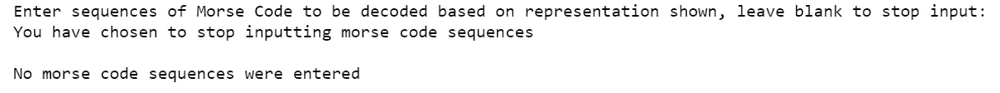

# Python 中的高级莫尔斯码解码器

> 原文：<https://towardsdatascience.com/advanced-morse-code-decoder-in-python-16e93d0af3d8?source=collection_archive---------32----------------------->


作者 Rhey t . Snodgrass&Victor f . Camp，1922 — Image:Intcode.png 和 Image:国际莫尔斯 code.png，公共领域，[https://commons.wikimedia.org/w/index.php?curid=3902977](https://commons.wikimedia.org/w/index.php?curid=3902977)

在我之前的一篇[帖子](/simple-morse-code-decoder-in-python-39f6db635af2)中，我用 Python 设计了一个简单的莫尔斯码解码器，它能够接受用户输入，并以原始的字母数字形式输出。解码器的局限性之一是它不允许用户输入句子。请记住，我们选择用一系列“0”和“1”来表示每个字母或数字，其中**“0”表示一个点**，而**“1”表示一个破折号**。在我们的解码器中，每个字母或数字由一个“*”分隔，如下图所示。


图片作者——简单莫尔斯码解码器的 Python 输出

在本帖中，我们将改进我们简单的莫尔斯电码解码器，使其也能破译句子。此外，我们可以在解码器中执行检查，以通知我们每个字母/数字、单词或句子类型被解码的频率。

# 构建解码器类

这个解码器和前一个解码器的一个主要区别是，我们将使用 Python 类来构建我们的解码器和相应的分析检查。关于 Python 类的一个简单解释是，它定义了一组*实例变量*(要为每个对象表示的数据值)和一组可以应用于对象的*方法*(操作)。

我们将构建一个名为 **Decoder** 的类，它将包含几个方法，第一个是 **__init__(self)** 。这是创建对象的基本方法，它通常初始化每个对象的实例变量的值。请记住，我们选择使用字典结构来存储 Python 中的莫尔斯电码表示，其中每个字母或数字由一系列“0”和“1”表示。由于我们还添加了句子分析检查，我们还添加了三个标点符号“ ***”。*** 、**、、**、**、*？*** ”。

```
class Decoder: def __init__(self):
        self.the_dict = dict(zip(('A','B','C','D','E','F','G','H','I','J','K','L','M','N','O','P','Q','R','S','T','U','V','W','X','Y','Z','0','1','2','3','4','5','6','7','8','9','.',',','?'),('01','1000','1010','100','0','0010','110','0000','00','0111','101','0100','11','10','111','0110','1101','010','000','1','001','0001','011','1001','1011','1100','11111','01111','00111','00011','00001','00000','10000','11000','11100','11110','010101','110011','001100'))) 
```

创建类的下一个基本方法是返回/打印输出。仅仅使用 **__init__** **(self)** 方法，如果我们将一个变量赋给这个类，我们不能显示任何结果。我们将添加一个 **__str__** **(self)** 方法，其工作方式与**print(variable)**相同，但允许我们自定义结果的显示方式。

```
def __str__ (self):
        dict_str = ""
        for key,value in self.the_dict.items():
            dict_str += "Character: " + str(key) + " ->" + " Code: " + str(value) + "\n"
        return dict_str
```

一旦我们定义了上面的两个方法，我们就可以通过给类分配一个变量名并打印结果来尝试显示我们之前定义的字典结构。注意 *my_dict* 现在是类 *Decoder 的一个对象。*


按作者分类的图像-解码器类的 Python 输出

我们将在本课程中定义的最后一种方法是莫尔斯电码本身的解码，称为 **decode (self，morse_code_sequence)** 。注意，在这个方法中，除了定义 **self，**我们增加了另一个 **morse_code_sequence** 。这意味着要调用这个方法，我们必须通过这个方法传递一个变量(即莫尔斯电码序列)，这类似于调用一个函数并通过它传递一个值。我们还将在我们的[简单莫尔斯码解码器](/simple-morse-code-decoder-in-python-39f6db635af2)中加入我们之前实现的错误检查，主要是:

1.  用户只能输入 0、1 和*
2.  用户只能输入预先定义的莫尔斯电码表示法(例如 0000000 不是有效的表示法)
3.  莫尔斯电码序列必须以标点符号结尾(如句号、逗号或问号)

```
def decode (self,morse_code_sequence):
        character = list(self.the_dict.keys())
        code = list(self.the_dict.values())
        reverse_dict = dict(zip(code,character))      
        # Error check 1, checking for invalid characters (i.e. other than 0,1,*)
        i=0
        while i!=len(morse_code_sequence):
            if morse_code_sequence[i]=="0" or morse_code_sequence[i]=="1" or morse_code_sequence[i]=="*":
                i += 1
            else:
                return "Invalid characters in morse code sequence, it should only consists of 0, 1 and *"
                break # Proceed for error check 2 once the morse_code_sequence does not contain invalid characters
        if i == len(morse_code_sequence):
            splitted_morse_code_sequence = morse_code_sequence.split("***") 
            morse_code_word = []
            for j in range(0,len(splitted_morse_code_sequence)):
                morse_code_word.append(splitted_morse_code_sequence[j].split("*")) #[['001','100','110'], ['90','9','9'], ['abc','17']] 
            morse_code_char=[]
            # Initialise a result list as the format of morse_code_word
            result = morse_code_word
            # split into list containing all character's morse code
            for k in range(0,len(morse_code_word)):
                for l in range (0,len(morse_code_word[k])):
                    morse_code_char.append(morse_code_word[k][l])
            # Check 2, terminate with punctuation marks i.e 010101, 110011, 001100
            if morse_code_char[len(morse_code_char)-1]=="010101" or morse_code_char[len(morse_code_char)-1]=="110011" or morse_code_char[len(morse_code_char)-1]=="001100" : # Check 3, check if character's morse code representation is valid as per the dictionary
                for k in range(0,len(morse_code_word)):
                    for l in range (0,len(morse_code_word[k])):
                        if morse_code_word[k][l] in reverse_dict.keys():
                            result[k][l]=reverse_dict[morse_code_word[k][l]]
                        else:
                            return "Invalid morse code representation"
            else:
                return "Invalid morse code sequence input, morse code sequence should end with punctuation characters"

            # Create an empty list to append result in and convert into readable string format output
            printed_result = []
            for i in range(0,len(result)):
                for j in range(0,len(result[i])):
                    printed_result.append(result[i][j]) 
                printed_result.append(" ")

            return ''.join(printed_result)
```


作者图片-输入莫尔斯码的解码器类的 Python 输出

# 构建字符分析器类

我们将构建的下一个类是字符分析器类，它将告诉用户每个字符(如字母或数字)被解码的频率。类似于我们的 Decoder 类，将定义两个基本方法 **__init__(self)** 和 **__str__(self)** 。

将创建第三种方法**analyze _ characters(self，decoded_sequence)** 来分析字符，解码后的序列通过该方法。我们将如何计算字符数，对于解码序列中的每个字符，我们将把它们添加到一个空字典中。循环遍历每个字符，我们将合计该字符的计数，并最终将它们显示为一个字典结构，这是我们在 **__str__(self)** 方法中定义的。

```
class CharacterAnalyser:
    def __init__ (self):
        self.the_dict_char = {}

    def __str__ (self):
        dict_char_str = ""
        for key,value in self.the_dict_char.items():
            dict_char_str += str(key) + " has been decoded " + str(value) + " time(s) " + "\n"
        return dict_char_str

    def analyse_characters (self, decoded_sequence):
        for each in decoded_sequence:
            if each != "?" and each != "." and each != "," and each != " ":
                if each not in self.the_dict_char.keys():
                    self.the_dict_char[each] = 1
                else:
                    self.the_dict_char[each] += 1

        return self.the_dict_char
```


按作者分类的图像-字符分析器类的 Python 输出

# 构建单词分析器类

在我们的下一堂课中，我们将实现单词分析器，它将计算莫尔斯电码序列中某些单词被解码的次数。在定义了两个基本方法 **__init__(self)** 和 **__str__(self)** 之后，我们将定义第三个方法**analyze _ words(self，decoded_sequence)** ，它将分析词频。这个概念类似于字符分析器类，我们将循环通过解码序列中的每个单词，并在字典中汇总计数。

```
class WordAnalyser:
    def __init__ (self):
        self.the_dict_word = {}

    def __str__ (self):
        dict_word_str = ""
        for key,value in self.the_dict_word.items():
            dict_word_str += str(key) + " has been decoded " + str(value) + " time(s) " +"\n"
        return dict_word_str

    def analyse_words (self, decoded_sequence):
        decoded_sequence_word=(decoded_sequence.strip()).split(" ")
        for each in decoded_sequence_word:
            if each != "?" and each != "." and each != ",":
                if each not in self.the_dict_word.keys():
                    self.the_dict_word[each] = 1
                else:
                    self.the_dict_word[each] += 1

        return self.the_dict_word
```


按作者分类的图像-文字分析器类的 Python 输出

# 构建句子分析器类

我们要构建的最后一个分析器类是句子分析器类。由于我们允许用户键入句号、逗号和问号这三个标点符号，因此我们可以按照以下方式分析每种句子类型被解码的次数:

1.以'**结尾的句子？**'——**问题**

2.以' T10 '结尾的句子。 ' — **完成句子**

3.以“**、**”—**从句**结尾的句子

在定义了基本的两个类 **__init__(self)** 和 **__str__(self)** 之后，我们将构建我们的第三个方法**analyze _ sentences(self，decoded_sequence)** 的方式是，我们将序列分割成单独的单词/标点符号，并遍历它们中的每一个。如果发现问号，我们将对“问题”进行计数，以此类推。

```
class SentenceAnalyser:
    def __init__ (self):
        self.the_dict_sentence = dict(zip(("Clauses","Complete Sentences","Questions"),(0,0,0)))

    def __str__ (self):
        dict_sentence_str = ""
        for key,value in self.the_dict_sentence.items():
            dict_sentence_str += str(key) + " has been decoded " + str(value) + " times(s) " + "\n"
        return dict_sentence_str

    def analyse_sentences (self, decoded_sequence):
        decoded_sequence_sentence = decoded_sequence.split(" ")
        for each in decoded_sequence_sentence:
            if each == ",":
                self.the_dict_sentence["Clauses"] += 1
            elif each == ".":
                self.the_dict_sentence["Complete Sentences"] += 1
            elif each == "?":
                self.the_dict_sentence["Questions"] += 1

        return self.the_dict_sentence
```


作者图片-句子分析器类的 Python 输出

# 构建主程序

在最后一节中，我们将把以上 4 个类放在一起，创建一个程序，让用户能够输入莫尔斯码序列，并选择他/她感兴趣的分析类型。我们把所有的类放在一起的方法是使用 **main()** 方法，这是任何程序的起点。下面是完整的代码，我将带你们看一下。

```
# import all the 4 classes
from decoder_29442826 import Decoder
from character_29442826 import CharacterAnalyser
from word_29442826 import WordAnalyser
from sentence_29442826 import SentenceAnalyser

def main():
    # set 4 variables to each of the 4 classes
    my_dict_1 = Decoder()
    my_dict_2 = CharacterAnalyser()
    my_dict_3 = WordAnalyser()
    my_dict_4 = SentenceAnalyser()
    # initialise empty list to store user input
    user_input_list = []
    # print the structure of morse code representation for user's reference
    print(str(my_dict_1))
    # asking user to input morse code sequences for decoding
    while True:
        user_input_morse = input ("Enter sequences of Morse Code to be decoded based on representation shown, leave blank to stop input: ")
        # Proceed for error checking of user input if it's not empty
        if len(user_input_morse)!=0:
            # Error check 1, checking for invalid characters other than 0, 1, *
            if my_dict_1.decode(user_input_morse)=="Invalid characters in morse code sequence, it should only consists of 0, 1 and *":
                print ("Invalid characters in morse code sequence, it should only consists of 0, 1 and *" + "\n")
            # Error check 2, checking for minimum requirement of one set of ***
            elif "***" not in user_input_morse:
                print ("Error input, the Morse Code sequence should have at least one set of ***" + "\n")
            # Error check 3, checking for punctuation at the end of user input, i.e. 010101, 110011, 001100
            elif my_dict_1.decode(user_input_morse)=="Invalid morse code sequence input, morse code sequence should end with punctuation characters":
                print("Invalid morse code sequence input, morse code sequence should end with punctuation characters" + "\n")
            # Error check 4, checking for invalid morse code representation as per the pre-defined morse code dictionary
            elif my_dict_1.decode(user_input_morse)=="Invalid morse code representation":
                print("Invalid morse code representation" + "\n")
            # add user input into list for decoding if no errors found
            else:
                user_input_list.append(user_input_morse)
        # Stop asking for input once user leaved blank
        else:
            print("You have chosen to stop inputting morse code sequences" + "\n")
            break

    # empty string to store decoded sequences
    overall_decoded_sequence=""
    # decoding the morse code sequences in user_input_list
    for each in user_input_list:
        overall_decoded_sequence += my_dict_1.decode(each)
    # character analysis of all the decoded morse code sequence   
    my_dict_2.analyse_characters(overall_decoded_sequence)
    # word analysis of all the decoded morse code sequence  
    my_dict_3.analyse_words(overall_decoded_sequence)
    # sentence analysis of all the decoded morse code sequence  
    my_dict_4.analyse_sentences(overall_decoded_sequence)

    if len(overall_decoded_sequence)!=0:
    # asking user to choose level of analysis from character, word, sentence or all
        while True:
            user_input_level = input ("Please choose the level of analysis from character, word, sentence or all, leave blank to quit:")
            # if character analysis chosen, return result of character analysis only
            if user_input_level == "character":
                print("Decoded Morse Code Sequence(s):")
                for each in user_input_list:
                    print(str(each) + " has been decoded to: " + my_dict_1.decode(each))
                print("\n" + "Characters Analysis:" + "\n" + str(my_dict_2))
            # if word analysis chosen, return result of word analysis only
            elif user_input_level == "word":
                print("Decoded Morse Code Sequence(s):")
                for each in user_input_list:
                    print(str(each) + " has been decoded to: " + my_dict_1.decode(each))
                print("\n" + "Words Analysis:" + "\n" + str(my_dict_3))
            # if sentence analysis chosen, return result of sentence analysis only
            elif user_input_level == "sentence":
                print("Decoded Morse Code Sequence(s):")
                for each in user_input_list:
                    print(str(each) + " has been decoded to: " + my_dict_1.decode(each))
                print("\n" + "Sentence Analysis:" + "\n" + str(my_dict_4))
            # if all has been chose, return result of character, word and sentence analysis
            elif user_input_level == "all":
                print("Decoded Morse Code Sequence(s):")
                for each in user_input_list:
                    print(str(each) + " has been decoded to: " + my_dict_1.decode(each))
                print("\n" + "Characters Analysis:" + "\n" + str(my_dict_2))
                print("Words Analysis:" + "\n" + str(my_dict_3))
                print("Sentence Analysis:" + "\n" + str(my_dict_4))
            # if user leaved blank, terminate the whole program
            elif user_input_level == "":
                print("You have chosen to terminate the whole program")
                break
            # prompt the user for level of analysis again if invalid input has been found
            else:
                print("Invalid input, choose the level of analysis from character, word, sentence or all, leave blank to quit")
    else:
        print("No morse code sequences were entered")if __name__ == "__main__":
    main()
```

这个程序的工作方式是，一旦用户运行这个程序，将首先显示莫尔斯电码表示(使用第一个**解码器**类)。用户将被提示输入莫尔斯电码序列，并可以继续输入解码，直到他们决定留下空白停止输入。


作者提供的图片-提示用户输入的主程序的 Python 输出

如果用户选择退出输入莫尔斯电码序列，并且没有输入任何莫尔斯电码序列，或者输入的所有莫尔斯电码序列都是无效的，程序将终止，并显示消息“没有输入莫尔斯电码序列”。



按作者分类的图像-没有输入的主程序的 Python 输出

一旦用户输入了一个莫尔斯电码序列或一系列序列，并键入一个空格以表示他/她想停止输入，程序将提示用户选择分析的级别(即字符、单词、句子或全部)。


按作者分类的图像-提示用户分析级别的主程序的 Python 输出

字符分析将调用 **character_analyser** 类，并返回在用户输入的序列中找到的字符及其解码频率。


作者图片—主程序选择字符分析的 Python 输出

单词分析将调用 **word_analyser** 类，并返回在用户输入的序列中找到的单词及其解码频率。


作者图片—主程序选择单词分析的 Python 输出

句子分析将调用**句子分析器**，并根据“？”返回*问题、从句&完成句子*的次数计数、'、'和' . '分别是。


图片由作者提供—主程序选择句子分析的 Python 输出

用户也可以选择“ **all** ”，三个分析将同时显示。

一旦用户完成分析，他/她可以通过输入空白输入来终止程序，程序将自行退出。


作者提供的图像-用户终止的主程序的 Python 输出

# 摘要

这篇文章描述了构建一个更先进的莫尔斯码解码器的过程，与之前的[相比，之前的](/simple-morse-code-decoder-in-python-39f6db635af2)只能接受用户输入并以原始的字母数字形式输出。新的解码器允许用户解码句子，并获得被解码的字符/单词/句子的综合分析。我希望你们喜欢这篇文章，因为我们在这个解码器中定义了我们的 Python 类，所以这在编码熟练程度方面是更高级的。尽管如此，有乐趣提高你的莫尔斯电码解码器！

[](https://www.buymeacoffee.com/tankahwang)