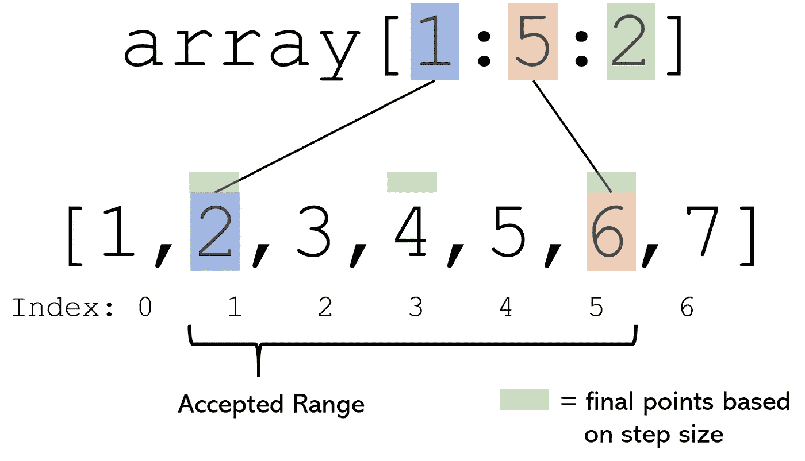

# 高级 NumPy 数组索引，变得简单

> 原文：<https://towardsdatascience.com/advanced-numpy-array-indexing-made-easy-fc49fdaef367?source=collection_archive---------21----------------------->


作者创建的图像。

## 理解[::2，[0，3，4]，…，2:5]是什么意思

NumPy 最大的优势之一是它的索引速度非常快，但是它可以很快变得复杂。例如，给定一个形状为 5×6×3×5 的随机生成的整数数组，下面的操作会执行什么，产生的切片会是什么形状？

```
array[np.round(array)==array].reshape((5,6,3,5))[::2, [0,3,4], ..., 2:5]
```

当然，这种操作在许多方面是任意的，但是在多维数据上使用复杂的操作并不少见。到本文结束时，您将能够分解并编写自己复杂的 NumPy 数组索引操作。

## 一维数组

考虑数组构造`array = np.array([1, 2, 3, 4, 5])`，它创建了一个从 1 到 5 的数字数组。

为了访问第一个**元素**，我们调用`array[0]`。同样，为了访问第二个元素，我们调用`array[1]`。

为了访问**最后一个元素**，我们使用负索引(`array[-1]`)。类似地，倒数第二个元素可以用`array[-2]`访问。

要访问元素的**范围，指定开始索引和停止索引。结果将包括停止索引减 1 之前的所有元素(将此视为`7`不包括在`range(7)`中)。例如，抓取`array`的前三个元素可以用`array[0:3]`来完成，尽管它可以重写为`array[:3]`，忽略 0 但返回相同的结果。**

元素范围也支持**赋值**。例如，`array[2:5] = np.arange(3)`将使第三、第四和第五元素(第二、第三和第四索引)分别等于 0、1 和 2。

另一方面，要访问自定义索引中的**多个值，请将一个列表或数组传入索引括号中。例如，`array[[1, 3]]`返回`array([2, 4])`，因为它请求数组的第二个和第四个值。使用索引数组来索引其他数组有很大的自由度，如果函数或认可的方法不起作用，这通常是实现理想索引的好方法。这些列表中的索引也可以是负数！**

要访问步长为的**元素范围，必须指定开始索引、停止索引和步长。例如，`array[:4:2]`返回`[1, 3]`。首先，`array[:4]`返回前四个元素，为`[1, 2, 3, 4]`。从第一个元素开始，移动步长，得到的数组是`[1, 3]`。**



一维索引的剖析。作者创建的图像。

使用`array[:]`是复制数组的最快和最有效的方法之一。

数组索引可能看起来难以接近，因为使用了速记符号来避免键入零或结尾:例如，`array[::2]`返回`[1, 3, 5]`。索引的三个核心参数——开始索引、结束索引和步长——由它们相对于冒号(`:`)的位置来表示。当键入`[::2]`时，这意味着我们有意忽略起始和结束索引，而只想提供关于所需步长的信息。因此，NumPy 将以我们指定的步长返回整个数组。

NumPy 数组也支持条件索引。考虑一个由随机生成的从-5 到 5(包括-5 和 5)的整数组成的十元素数组:

```
rand = np.random.randint(low=-5, high=5, size=10)array([-2, -1,  2, -2,  4,  3, -1, -5, -2,  2])
```

为了找到所有正值，我们可以调用`rand[rand>0]`，它返回`array([2, 4, 3, 2])`。这是因为`rand>0`或任何其他类似的条件被称为布尔掩码，其值为`array([False, False, True, False, True, True, False, False, False,
True])`。NumPy 只是返回对应掩码值为`True`的值。使用这个逻辑，只要条件返回一个有效的布尔掩码，像`rand[rand**3<=2*rand]`这样的操作就是有效的。

条件语句适用于所有维度的数组。

## 二维数组

考虑下面的二维数组:

```
array = np.array([[1, 2, 3, 4, 5],
                  [6, 7, 8, 9, 10],
                  [11, 12, 13, 14, 15]])
```

对二维数据使用一维索引需要改变对数据的看法，不再把数据看作是表格，而是一系列列表。在这个透视图中，`array`是一个包含三个元素的数组，其中每个元素是另一个包含五个元素的数组。

因此，检索前两个元素的`array[:2]`应该返回:

```
array([[ 1,  2,  3,  4,  5],
       [ 6,  7,  8,  9, 10]])
```

自测一下——`array[:2:2]`应该返回什么？

由于`array`只是一个数组，它的元素恰好是数组，所以我们应该这样对待它。`[:2:2]`概述了前两个元素(起始索引 0 和终止索引 2)，步长为 2。由于初始范围索引(`[:2]`)只返回两个值，并且步长为 2，所以结果只是第一个元素。在我们的二维数组中，这恰好是另一个数组:

```
array([[1, 2, 3, 4, 5]])
```

在二维数组上使用一维索引方法非常有限。为此，二维索引采用`array[a:b:c, d:e:f]`的形式。`a:b:c`和`d:e:f`代表起始索引、结束索引和步进索引的三重值。然而，逗号左边的`a:b:c`应用行方式的转换，而`d:e:f`应用列方式的转换，或者下一个维度。

例如，考虑下面的命令:`array[:2,3:]`。将这个索引分解成几个连续的部分是很有帮助的。

1 | `[:2]`取`array`的前两个元素。由于`array`是二维的，这是前两行:

```
array([[ 1, 2, 3, 4, 5], 
       [ 6, 7, 8, 9, 10]])
```

2 | `[3:]`指定开始索引(3)而不是结束索引，这意味着在五元素数组中，它将从第四个元素(索引 3)开始，一直持续到数组的末尾。因为它是按列应用的，所以结果是:

```
array([[ 4,  5],
       [ 9, 10]])
```

像一维索引一样，二维数组也可以使用列表来访问自定义索引值。但是，二维数组也必须由二维列表或数组进行索引。

## 索引多维数组

多维数组类似于两个低维数组。考虑一个名为`array`的三维数组，形状为(3，2，3):

```
array([[[ 0,  1,  2],
        [ 3,  4,  5]],

       [[ 6,  7,  8],
        [ 9, 10, 11]],

       [[12, 13, 14],
        [15, 16, 17]]])
```

像二维数组一样，维度可以通过三个数字的束进行索引，用逗号分隔维度的单独索引。例如，`array[:3:2,:,1:3]`执行以下操作:

1 | `[:3:2]`表示“以步长 2 索引所有元素，直到第三个索引(第四个元素)”。在包含三个元素的数组列表中，这意味着第一个和第三个元素被保留。

```
array([[[ 0,  1,  2],
        [ 3,  4,  5]],

       [[12, 13, 14],
        [15, 16, 17]]])
```

2 | `[:]`表示‘什么都不做’。由于没有提供任何信息，NumPy 不会改变数组，但它需要在那里指示第二维不会发生任何事情。

3 | `[1:3]`表示索引从第一个索引(第二个元素)开始到第三个索引(第四个元素)结束的所有元素。该切片应用于第三个也是最后一个维度。

```
array([[[ 1,  2],
        [ 4,  5]],

       [[13, 14],
        [16, 17]]])
```

当维数很大时，省略号(`…`)可用于多个冒号和逗号的简写。考虑一个四维阵列`z`:

```
z = np.arange(81).reshape(3,3,3,3)
```

在这种情况下，`z[1, :, :, 0]`和写`z[1, …, 0]`是一样的。此外，我们可以将`z[:, :, :, 0] as z[…, 0]`和`z[1, :, 2, 0]`写成`z[1, …, 2, 0]`(尽管在特定情况下这是不必要的)。每个索引只支持一个省略号。

当使用许多元素来索引数组时，理解列表和元组之间的区别很重要。考虑一个 3 乘 3 阵列`z`:

```
array([[0, 1, 2],
       [3, 4, 5],
       [6, 7, 8]])
```

命令`z[[0,0]]`保留在第一个行维度中，因为主方括号中没有逗号。索引`[0, 0]`的结果是第一行(索引 0)重复两次:

```
array([[0, 1, 2],
       [0, 1, 2]])
```

另一方面，键入`z[(0, 1)]`是键入`z[0, 1]`的另一种方法，因为它将返回第一行(索引 0)和第二列(索引 1)中的值。换句话说，元组可以用于跨维度，但是由于它们的存在相对来说是任意的，所以建议根本不要编写带括号的跨维度索引。

## 解释和编写复杂索引的技巧

NumPy 索引可以很快变得非常复杂，因为它的索引方法可能会发生不可预测的变化，并导致奇怪的结果。

*   用英语写出每个维度中您想要索引的部分，然后逐个维度地翻译(用逗号分隔)。
*   通常，在单个命令中使用的索引数据类型要保持一致。例如，如果不是绝对必要，使用`a:b`和`[a, b, c, d]`符号会导致结果的不可预测性。
*   不要把所有事情都塞进一个命令中。或者，尝试使用同样的一步一步的数据缩减来逐个维度地建立索引，然后一旦确定可以工作，就将命令链重写为单个命令。
*   将所有东西分成`a:b:c`组。

[](/every-dataframe-manipulation-explained-visualized-intuitively-dbeea7a5529e) [## 每一个数据帧操作，直观地解释和可视化

### 熔化、旋转、连接、爆炸等

towardsdatascience.com](/every-dataframe-manipulation-explained-visualized-intuitively-dbeea7a5529e) 

感谢您的阅读，请在回复中告诉我您的想法！

如果你对最新的文章感兴趣，可以考虑订阅。如果你想支持我的写作，通过我的[推荐链接](https://andre-ye.medium.com/membership)加入 Medium 是一个很好的方式。干杯！