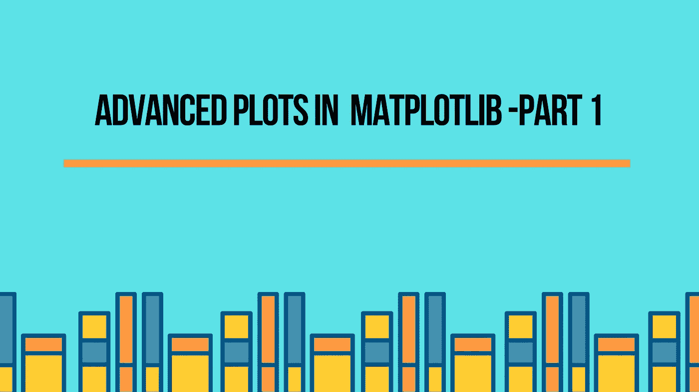
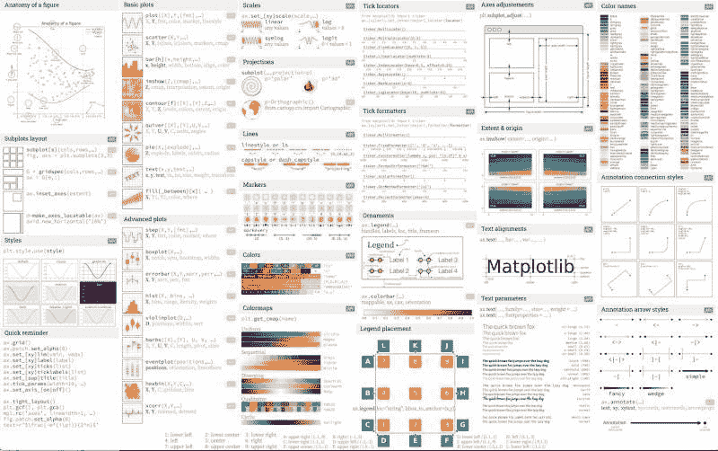
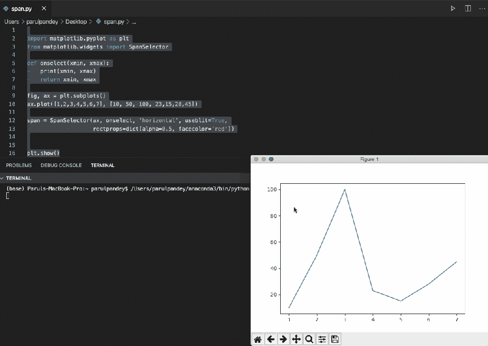
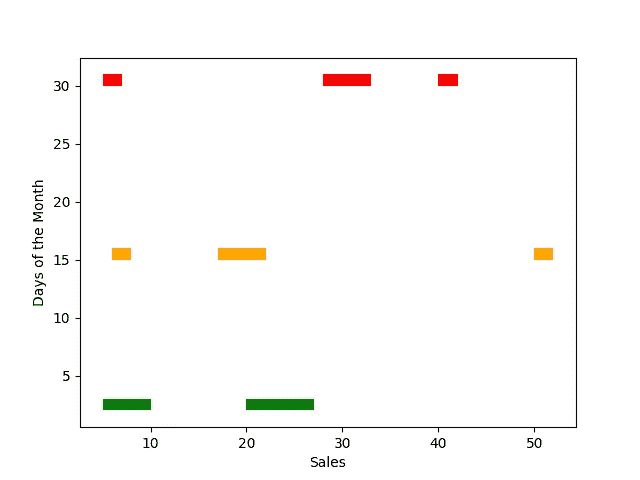
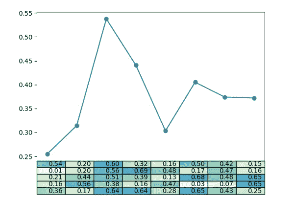
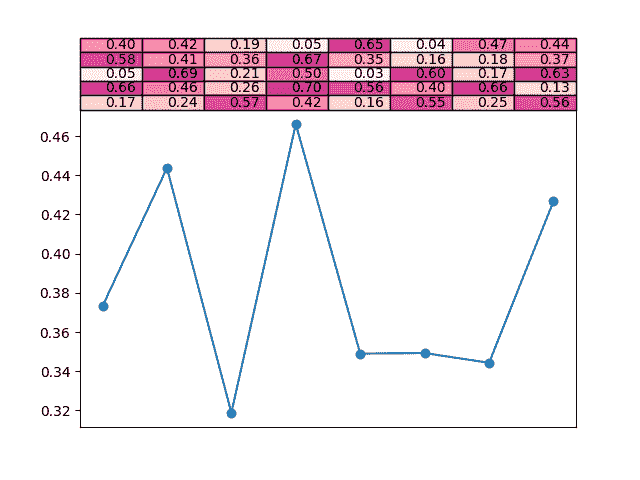
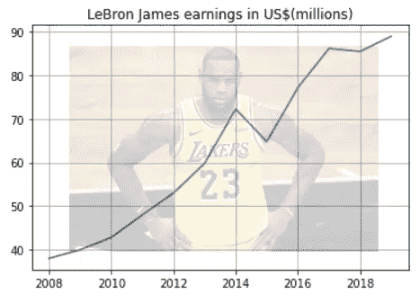
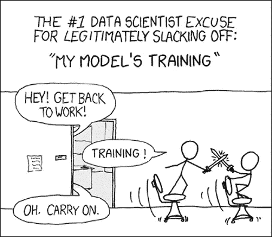
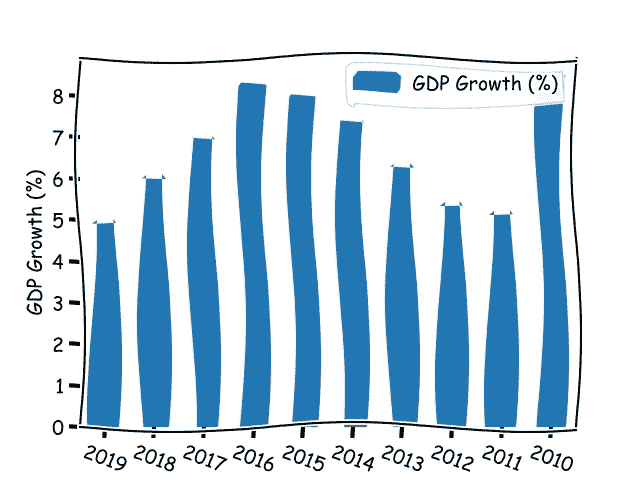

# Matplotlib 中的高级绘图—第 1 部分

> 原文：<https://towardsdatascience.com/advanced-plots-in-matplotlib-part-1-30dbb02b09ae?source=collection_archive---------28----------------------->

## 展示了 matplotlib 中的一些高级图，可以让我们的分析更上一层楼。



作者图片

python 可视化环境由几个有用的 Python 库组成。每个图书馆都以自己独特的方式闪耀。虽然有些库很容易使用，但其他的有更好的功能。Matplotlib 就是这个可视化生态系统中的一个重要组成部分。Matplotlib 提供了多种方式将数字表示成有意义的图形和图表。下面的备忘单很好地展示了 Matplotlib 的各种功能，以及如何使我们的可视化更加有效。



Matplotlib 备忘单。完整图片:[https://lnkd.in/dD5fE8V](https://lnkd.in/dD5fE8V)

matplotlib 的基本功能，包括创建条形图、直方图、饼图等。众所周知。然而，在本文中，我将展示 matplotlib 中的一些高级图，它们可以使我们的分析更上一层楼。

matplotlib 中的动画是另一个有趣的功能，我有一篇完整的文章专门介绍它。文章可以在这里阅读: [***用 Matplotlib 制作的动画。***](/animations-with-matplotlib-d96375c5442c)

[](/animations-with-matplotlib-d96375c5442c) [## Matplotlib 动画

### 动画是展示一种现象的有趣方式。我们人类总是被动画和…

towardsdatascience.com](/animations-with-matplotlib-d96375c5442c) 

# 1.跨度选择器

[跨度选择器](https://matplotlib.org/3.1.1/gallery/widgets/span_selector.html)是 matplotlib 中的一个鼠标小部件。小部件是 python 对象，用于包含一些交互功能。跨度选择器通过鼠标选择返回图形中选定区域的最大值和最小值。

在下面的代码片段中，我们首先创建一个基本的线图。然后我们调用 SpanSelector 方法，首先使用它来选择一个区域，然后打印该区域中的最大值和最小值。下面让我们来看看它的实际应用。

```
**import** matplotlib.pyplot as plt
**from** matplotlib.widgets **import** SpanSelector**def** onselect(xmin, xmax):
    print(xmin, xmax)
    **return** xmin, xmaxfig, ax **=** plt.subplots()
ax.plot([1,2,3,4,5,6,7], [10, 50, 100, 23,15,28,45])
span **=** SpanSelector(ax, onselect, 'horizontal', useblit**=**True, rectprops**=**dict(alpha**=**0.5, facecolor**=**'red'))       
plt.show()
```



Matplotlib 的跨度选择器的作用

# 2.断裂条形图-断裂的水平条形图

“断开的”水平条形图是一个有缺口的图。它用于数据值变化很大的情况，例如，由极端温度范围组成的数据集。在这种情况下，折线图是理想的，因为它们可以完美地绘制最大和最小范围。

python 模块`matplotlib.broken_barh()`用于绘制断裂的水平条形图。

```
import matplotlib.pyplot as plt 
#Defining the x and y ranges 
xranges = [(5,5), (20,5),(20,7)] 
yrange = (2,1) 
#Plotting the broken bar chart 
plt.broken_barh(xranges, yrange, facecolors='green') 
xranges = [(6,2), (17,5),(50,2)] 
yrange = (15,1) 
plt.broken_barh(xranges, yrange, facecolors='orange') 
xranges = [(5,2), (28,5),(40,2)] 
yrange = (30,1) 
plt.broken_barh(xranges, yrange, facecolors='red') plt.xlabel('Sales') 
plt.ylabel('Days of the Month') 
plt.show()
```



断开的水平条形图

# 3.表格演示

Matplotlib 的[表格函数](https://matplotlib.org/3.2.1/gallery/misc/table_demo.html)可以在绘图中显示表格。当您想要以条形图的形式查看表格中的快速可视化值，并将表格放在旁边时，这尤其方便。表格可以放置在图的顶部、底部或侧面。以下是如何轻松创建一个。

> 下面的例子摘自**刚刚发光的 Python(@** 刚刚发光)的[推文](https://twitter.com/JustGlowing/status/1290209800077209600)

```
import pandas as pd 
import numpy as np 
import matplotlib.pyplot as plt 
x = np.random.rand(5, 8)*.7 
plt.plot(x.mean(axis=0), '-o', label='average per column') plt.xticks([]) plt.table(cellText=[['%1.2f' % xxx for xxx in xx] for xx in x],cellColours=plt.cm.GnBu(x),loc='bottom') 
plt.show()
```



matplotlib 中的表格绘图，底部有一个表格



matplotlib 中的表格绘图，顶部有一个表格

# 4.水印图像

有时，将图像作为水印有助于为情节添加独特的味道。例如，如果我们要分析多年来顶级运动员的收入，将他们的照片放在背景中有助于我们轻松地区分不同运动员的情况。让我们分析一个由许多运动员的收入组成的数据集。我们将绘制一张勒布朗·詹姆斯历年收入的图表，单位为美元(百万)。

先导入[数据集](https://github.com/parulnith/Website-articles-datasets/blob/master/Lebron_James_income.csv)，[图片](https://github.com/parulnith/Website-articles-datasets/blob/master/LeBron_James.jpeg)用于水印和必要的库。

```
import numpy as np 
import matplotlib.image as image 
import matplotlib.pyplot as plt 
import pandas as pd 
df = pd.read_csv('income.csv') 
im = image.imread('Lebron_James.jpeg') # Image
```

该数据集由许多运动员的收入组成。让我们筛选出只包含勒布朗的数据。

```
lebron_james = df[df['Name']=='LeBron James']
```

显示带水印的绘图。

```
fig, ax = plt.subplots() 
ax.grid() 
ax.plot('Year','earnings ($ million)',data=lebron_james) ax.set_title("LeBron James earnings in US$(millions)") fig.figimage(im, 60, 40,cmap='ocean', alpha=.2) 
plt.show()
```



# 5.XKCD 图

现在让我们在剧情中加入一些有趣的元素。 [xkcd](https://xkcd.com/) 是由[兰道尔·门罗](https://en.wikipedia.org/wiki/Randall_Munroe)创作的网络漫画，展示了很多幽默的情节。这些图定期出现在许多数据科学演示文稿中，例如，下图所示:



来源:xkcd.com

好吧，如果你想给你的 matplotlib 图添加一些扭曲，你可以简单地调用 pyplot 对象上的`xkcd()`方法，如下所示。在这里，我们正在使用印度的 GDP 数据集，该数据集显示了 2010 年至 2019 年的 GDP 增长率百分比。

```
import pandas as pd 
import matplotlib.pyplot as plt 
df = pd.read_csv('https://raw.githubusercontent.com/parulnith/Website-articles-datasets/master/India%20GDP%20Growth%20Rate%20.csv', parse_dates=['Year']) 
df['Year'] = df['Year'].apply(lambda x: pd.Timestamp(x).strftime('%Y')) #calling xkcd() method 
plt.xkcd(scale=5, length=400) 
df.plot(x='Year',y='GDP Growth (%)',kind='bar') 
plt.ylabel('GDP Growth (%)') 
plt.xticks(rotation=-20) 
plt.figure(figsize=(10,8)) 
plt.show()
```



# 结论

这些是 matplotib 中一些有趣的高级功能。还有一些其他很酷的图表，我已经在文章的第二部分列出了:

[](/advanced-plots-in-matplotlib-part-2-e88f91ce9e31) [## Matplotlib 中的高级绘图—第 2 部分

### Matplotlib 可视化库的一些鲜为人知但功能强大的特性。

towardsdatascience.com](/advanced-plots-in-matplotlib-part-2-e88f91ce9e31) 

因此，抓住一个有趣的数据集，运用你新学到的技能来很好地理解这个主题。

[1]最初发表于[parulpandey.com](https://parulpandey.com/2020/08/04/advanced-plots-in-matplotlib%e2%80%8a-%e2%80%8apart-1/)