# Matplotlib 中的高级绘图—第 2 部分

> 原文：<https://towardsdatascience.com/advanced-plots-in-matplotlib-part-2-e88f91ce9e31?source=collection_archive---------14----------------------->

## Matplotlib 可视化库的一些鲜为人知但功能强大的特性

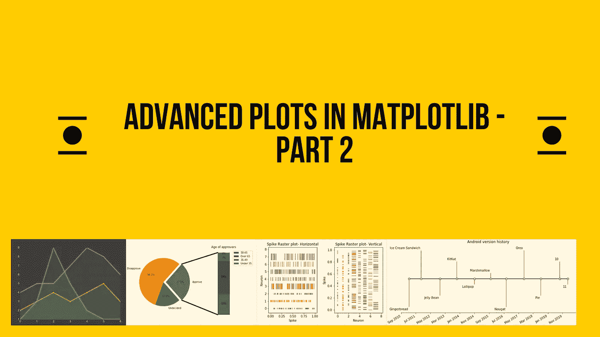

作者图片

本文是 Matplotlib 系列 ***高级图的第二部分。在 [**第 1 部分**](/advanced-plots-in-matplotlib-part-1-30dbb02b09ae) 中，我们学习了如何在我们的可视化工作中使用跨度选择器、断开的水平条图和表格功能。我们还学习了如何使用 XKCD 主题给图像添加水印和给 Matplotlib 中的情节添加扭曲。在第 2 部分中，我们将介绍 Matplotlib 的其他一些有趣的功能，并使用它来丰富我们现有的情节。***

[](/advanced-plots-in-matplotlib-part-1-30dbb02b09ae) [## Matplotlib 中的高级绘图—第 1 部分

### python 可视化环境由几个有用的 Python 库组成。每个图书馆都有自己独特的亮点…

towardsdatascience.com。](/advanced-plots-in-matplotlib-part-1-30dbb02b09ae) 

# 1.事件图

当想要 [*在预定义的位置*](https://matplotlib.org/3.1.1/api/_as_gen/matplotlib.pyplot.eventplot.html?highlight=eventplot#matplotlib.pyplot.eventplot) 绘制相同的平行线时，事件图就派上了用场。这种图通常在神经科学中用于显示神经元随时间的尖峰活动，这里经常被称为**尖峰光栅**或简称为光栅图。然而，这类地块还有其他用途。以下是事件图文档的摘录:

> 在您希望显示多组离散事件的时间或位置的任何情况下，它都是有用的，例如一个月中每天人们到达企业的时间，或者上个世纪每年的飓风日期。

让我们看一个显示具有各种线条属性的事件序列的`eventplot`。该图以水平和垂直方向显示。剧情改编自官方 Matplotlib 的 [Eventplot 文档](https://matplotlib.org/3.1.1/gallery/lines_bars_and_markers/eventplot_demo.html)。

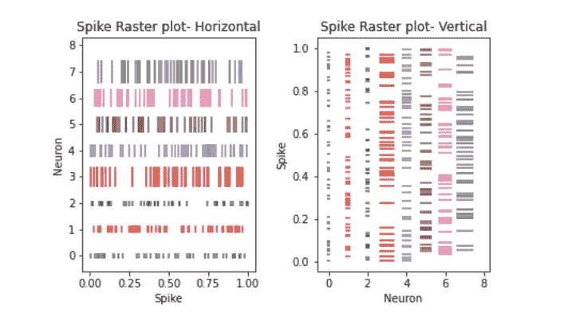

Matplotlib |作者图片中的事件/尖峰光栅图

# 2.时间表

您知道单独使用 Matplotlib 可以创建一个简单的时间线吗？是的。这是因为从技术上讲，时间线只是日期和文本的简单集合，可以通过在[干](https://matplotlib.org/3.1.3/api/_as_gen/matplotlib.axes.Axes.stem.html#matplotlib.axes.Axes.stem)图中进行简单的变化来获得。你可以在这里阅读更多相关信息[。](https://matplotlib.org/3.1.3/gallery/lines_bars_and_markers/timeline.html)

这里是一个时间表，显示了使用官方[文档](https://matplotlib.org/3.1.3/gallery/lines_bars_and_markers/timeline.html)中提供的代码的 [Android 版本历史](https://en.wikipedia.org/wiki/Android_version_history)。

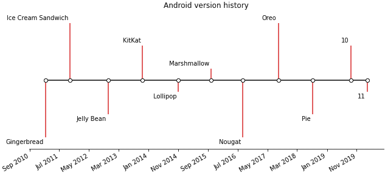

Matplotlib 中 Android 版本历史的时间轴|图片由作者提供

# 3.一块馅饼

你有没有想过进一步深入到一个饼图？也许你想展开它的一个切片，把它“分解”成一个条形图？Matplotlib 通过“饼状图”功能使之成为可能。它使用了一个[连接补丁来连接两个点(可能在不同的轴上)](https://matplotlib.org/api/_as_gen/matplotlib.patches.ConnectionPatch.html#matplotlib-patches-connectionpatch)。

这个想法很简单。创建一个饼图及其相应的条形图作为子情节，然后使用连接补丁在两个子情节之间绘制线条。

这里有一个来自[官方文档](https://matplotlib.org/gallery/pie_and_polar_charts/bar_of_pie.html?highlight=bar%20pie)的例子。

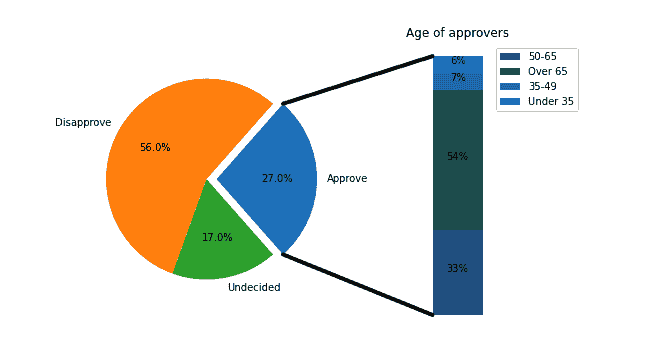

图片来源:[Matplotlib](https://matplotlib.org/gallery/pie_and_polar_charts/bar_of_pie.html?highlight=bar%20pie)的饼状图条

# 4.样式表参考

在 matplotlib 中创建绘图时，很多时候，我们倾向于使用默认样式。然而，Matplotlib 提供了一堆很棒的样式选项，使得即使是平凡的可视化效果也非常突出。要列出所有样式，请输入以下代码行。

在这里我将展示一些流行的。如果你有兴趣，你可以在这里找到完整的列表。让我们创建一个基本的线图，然后应用一些不同的样式。如果没有指定样式，matplotlib 将使用默认样式:

```
import matplotlib.pyplot as pltplt.plot([1, 3, 9, 5, 2, 1, 1], marker='o')
plt.plot([4, 5, 5, 7, 9, 8, 6], marker='v')
plt.plot([2, 3, 4, 3, 4, 5, 3], marker='s')
plt.show()
```

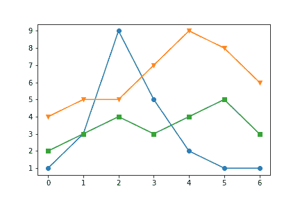

matplotlib 中的默认样式(图片由作者提供)

若要添加您选择的样式，请在代码中插入以下行:

```
plt.style.use('stylename') #Replace 'stylename' with the desired style
```

# 常用样式:

让我们来看看一些常用的风格:

## 经典的

Classic 是 Matplotlib 比较老的风格。

```
import matplotlib.pyplot as plt
plt.style.use(“classic”)plt.plot([1, 3, 9, 5, 2, 1, 1], marker=’o’)
plt.plot([4, 5, 5, 7, 9, 8, 6], marker=’v’)
plt.plot([2, 3, 4, 3, 4, 5, 3], marker=’s’)
plt.show()
```

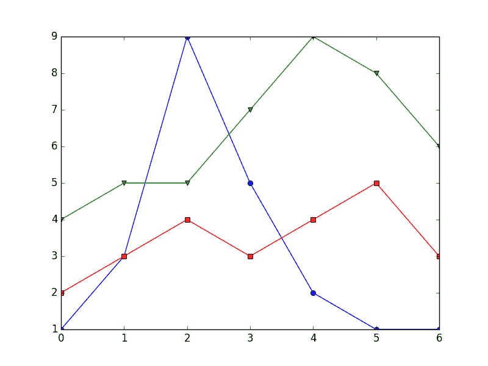

经典风格(图片由作者提供)

## ggplot

这种风格模仿了 [ggplot](https://ggplot2.tidyverse.org/) (一个用于 [R](https://www.r-project.org/) 的流行绘图包)的美学

```
import matplotlib.pyplot as plt
plt.style.use(“ggplot”)plt.plot([1, 3, 9, 5, 2, 1, 1], marker=’o’)
plt.plot([4, 5, 5, 7, 9, 8, 6], marker=’v’)
plt.plot([2, 3, 4, 3, 4, 5, 3], marker=’s’)plt.show()
```

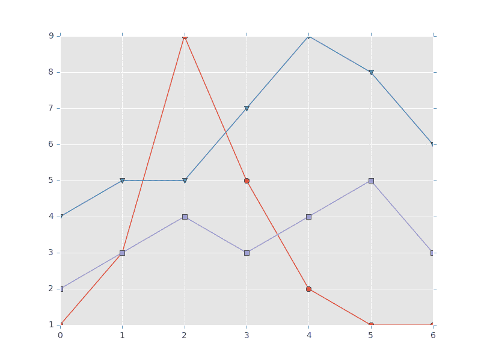

ggplot 样式(图片由作者提供)

## 五三八

这是一个“fivethirtyeight”风格的例子，它试图复制来自[fivethirtyeight.com](https://fivethirtyeight.com/)的风格

```
import matplotlib.pyplot as pltplt.style.use(“fivethirtyeight”)plt.plot([1, 3, 9, 5, 2, 1, 1], marker=’o’)
plt.plot([4, 5, 5, 7, 9, 8, 6], marker=’v’)
plt.plot([2, 3, 4, 3, 4, 5, 3], marker=’s’)plt.show()
```

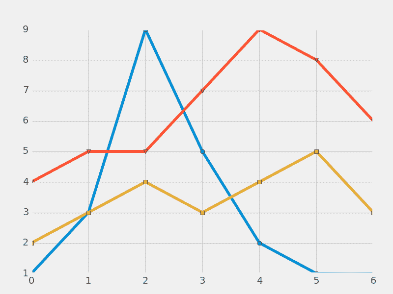

五三八风格(图片作者)

## 黑客的贝叶斯方法— bmh

这个例子展示了黑客在线书籍[贝叶斯方法中使用的风格。](http://camdavidsonpilon.github.io/Probabilistic-Programming-and-Bayesian-Methods-for-Hackers/)

```
import matplotlib.pyplot as pltplt.style.use("bmh")plt.plot([1, 3, 9, 5, 2, 1, 1], marker='o')
plt.plot([4, 5, 5, 7, 9, 8, 6], marker='v')
plt.plot([2, 3, 4, 3, 4, 5, 3], marker='s')plt.show()
```

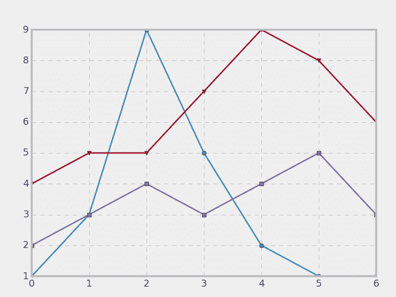

bmh 风格(图片由作者提供)

## 赛博朋克风格

最近，我偶然发现了一个名为[**mplcyberpunk**](https://github.com/dhaitz/mplcyberpunk)**，**的包，它是一个基于`matplotlib`的 Python 包，只用三行额外的代码就创建了“cyberpunk”风格的情节。多酷啊🤘？

使用赛博朋克风格；您需要首先安装并导入该库。

```
!pip install mplcyberpunk

import matplotlib.pyplot as plt
import mplcyberpunkplt.style.use("cyberpunk")plt.plot([1, 3, 9, 5, 2, 1, 1], marker='o')
plt.plot([4, 5, 5, 7, 9, 8, 6], marker='v')
plt.plot([2, 3, 4, 3, 4, 5, 3], marker='s')# Add glow effects-Optional
mplcyberpunk.add_glow_effects()
plt.show()
```

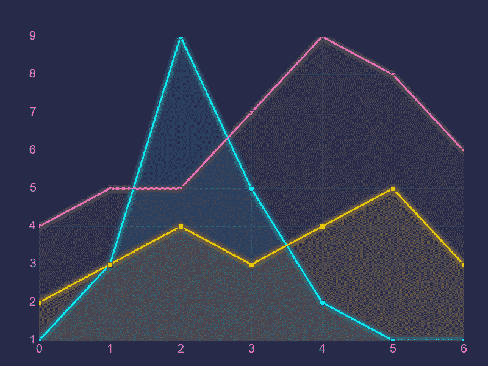

赛博朋克风格(图片由作者提供)

# 5.adjustText —自动放置`matplotlib`的标签

最后，让我们看看 Matplotlib 中一个有用的第三方包[。顾名思义，第三方包构建并扩展了现有的 Matplotlib 功能。需要记住的重要一点是，默认情况下，这些包不包含在 Matplotlib 中，必须单独安装。](https://matplotlib.org/3.3.0/thirdpartypackages/index.html#specialty-plots)

## [调整文本](https://github.com/Phlya/adjustText)

很多时候，我们努力调整图表中的文本位置。当有多个标签，并且这些标签开始重叠时，就会发生这种情况。对于这种情况，adjustText 是一个非常有用的库，因为它可以自动放置标签。

## 装置

如前所述，您需要首先安装库，这可以通过以下三种方式之一完成:

```
pip install adjustText # pip install
or
conda install -c conda-forge adjusttext # conda
or
# For the latest version from GitHub:
pip install [https://github.com/Phlya/adjustText/archive/master.zip](https://github.com/Phlya/adjustText/archive/master.zip)
```

## 使用

让我们来看一个来自 adjustText 的[文档](https://github.com/Phlya/adjustText/blob/master/docs/source/Examples.ipynb)本身的基本示例，以突出 adjustText 的强大功能。左图为重叠标签，右图为调用`adjust_text`功能后自动调整的标签。

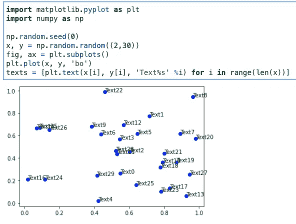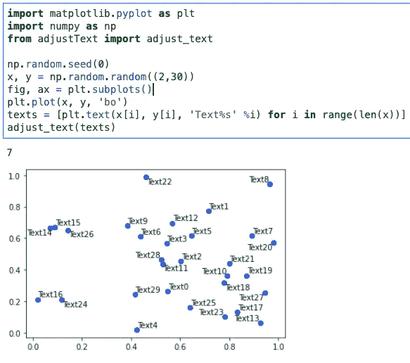

l:之前；r:之后(图片由作者提供)

# 包裹

这是我们关于高级 Matplotlib 图的两部分系列的结尾。在本系列中，我们看到了如何利用 Matplotlib 可视化库来生成一些独特的图表。这对于创造引人入胜的故事情节大有帮助。事件图在绘制离散事件时非常有用，而时间线有助于描绘历史上的特定事件。同样，一条饼图比传统的饼图传达了更多的信息。像“赛博朋克”这样的风格提供了一种优雅风格的元素，可以使一些视觉效果突出。希望你能够在可视化中利用这些文章中分享的一些信息，并与世界分享你的酷项目。

[1]最初发表于[parulpandey.com](https://parulpandey.com/2020/08/17/advanced-plots-in-matplotlib%e2%80%8a-%e2%80%8apart-2/)

[2]这是一个附属链接