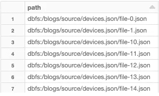
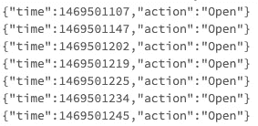
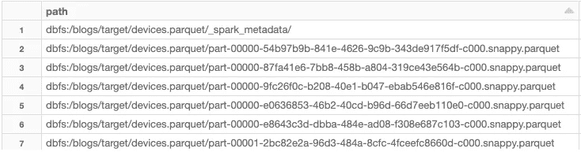
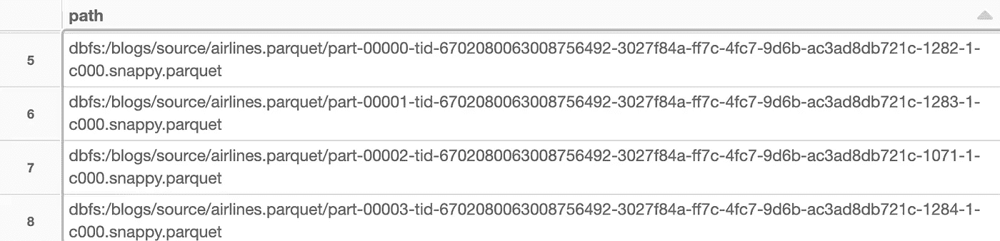
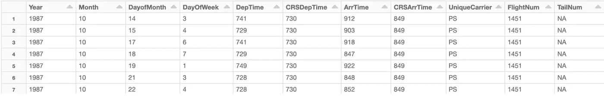
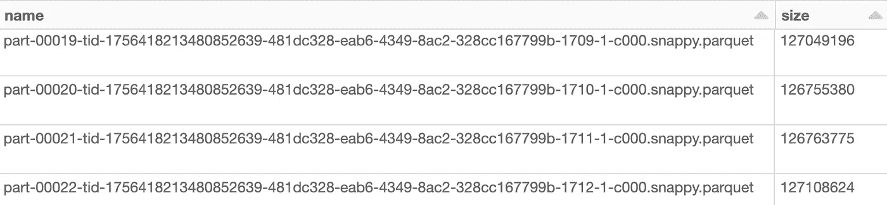

# 先进的火花调谐、优化和性能技术

> 原文：<https://towardsdatascience.com/advanced-spark-tuning-optimization-and-performance-techniques-54f858c92e?source=collection_archive---------16----------------------->

## Apache Spark 调优提示和技巧

由 [Unsplash](https://unsplash.com?utm_source=medium&utm_medium=referral) 上的 [CHUTTERSNAP](https://unsplash.com/@chuttersnap?utm_source=medium&utm_medium=referral) 拍摄

# 介绍

***Apache Spark*** 是一个分布式计算大数据分析框架，旨在跨一个机器集群转换、设计和处理海量数据(想想太字节和太字节)。它有许多用于特定任务的嵌入式组件，包括 Spark SQL 的结构化数据框架和结构化流 API，这两者都将在本博客中讨论。Spark 面临的一个挑战是向数据湖追加新数据，从而在写入时产生*‘小而倾斜的文件’*。完全解决这些挑战可能会很棘手，因此会对用户执行额外的下游 Spark 层、数据科学分析和使用*“小而扭曲的文件”*的 SQL 查询产生负面影响。相当新的框架 ***三角洲湖泊*** 和 ***阿帕奇胡迪*** 有助于解决这些问题。

然而，在这篇博客中，我将使用原生的 *Scala* API 向你展示 1。)如何在 Spark *结构化流*作业中包含一个瞬态计时器，用于自动终止周期性数据处理添加新源数据，以及 2 .)如何控制 Spark 作业产生的输出文件数量和分区大小。问题解决#1 功能避免了总是为长期运行(有时空闲)*、【24/7】、*集群(即在 *Amazon EMR* 中)付费。例如，对于只处理新的可用源数据(即在*亚马逊 S3* )而言，短期流作业是一个可靠的选择，这些数据没有一致的节奏到达；也许每小时都会有小批量的登陆。问题解决#2 功能对于提高下游流程(如下一层 Spark 作业、SQL 查询、数据科学分析和整体数据湖元数据管理)的 I/O 性能非常重要。

***免责声明:本博客中使用的公共数据集包含非常小的数据量，仅用于演示目的。这些 Spark 技术最适用于真实世界的大数据量(即万亿字节&千兆字节)。因此，相应地调整 Spark clusters &应用的规模、配置和调优。***

# 示例 1:火花流瞬态终止定时器

1a。)首先，让我们查看一些示例文件，并为从存储在*dbfs:/data bricks-datasets/structured-streaming/events/*的*data bricks Community Edition*中检索的公共物联网设备事件数据集定义模式。

`ls /blogs/source/devices.json/`

作者图片

`head /blogs/source/devices.json/file-0.json/`

作者图片

1b。)接下来，我们将把数据集作为定义了模式的流数据帧来读取，并包括函数参数:

*   *maxFilesPerTrigger* (每个触发器读取的最大文件数)
*   *基本路径*(数据源位置)

1c。)现在，我们以`parquet`文件接收器格式和`append`模式执行流式查询，以确保仅周期性增量写入新数据，并包括函数参数:

*   *测向*(源数据帧)
*   *重新分区*(每次触发时持续输出分区的数量)
*   *检查点路径*(恢复检查点位置)
*   *触发*(触发间隔处理时间)
*   *目标路径*(数据目标位置)

1d。)Scala sleep 函数(以毫秒为单位)将用于在优雅的瞬态计时器上关闭流作业。

1e。)最后，流式作业 Spark 会话将在定时器到期后执行，从而终止短期应用程序。

1f。)将函数应用于 Scala 值，并根据需要设置额外的 Spark 属性:

*   `spark.sql.session.timeZone`(设置为 *UTC* 以避免时间戳和时区不匹配问题)
*   `spark.sql.shuffle.partitions`(设置在*宽“洗牌”转换*上创建的期望分区数量；价值因以下因素而异:1 .数据量&结构，2。集群硬件&分区大小，3。可用内核，4 个。应用程序的意图)

1g。)查看作业的输出位置

`ls /blogs/target/devices.parquet/`

作者图片

总之，流作业将只从源 json 位置向目标 parquet 位置连续处理、转换和附加微批未处理的数据。定时器超时(例如:5 分钟)后，Spark 应用程序正常关闭。对于 Spark 应用程序部署，最佳实践包括用包含作为命令行参数的`args: Array[String]`的`main()`方法定义 Scala `object`。然后创建一个所需的目录结构，用一个`build.sbt`(库依赖)文件编译`<appName>.scala`(应用程序代码)文件，所有这些都通过 *SBT* 构建工具创建一个 *JAR* 文件，该文件将用于通过`spark-submit`运行应用程序。

下面是官方的 [**Apache Spark 文档**](https://spark.apache.org/docs/latest/quick-start.html#self-contained-applications) 解释步骤。

在 AWS 中，通过 *Amazon EMR* 您可以提交应用程序作为作业步骤，并在所有步骤完成时自动终止集群的基础设施。这可以通过像 *AWS 步骤功能*、 *AWS Lambda* 和 *Amazon CloudWatch* 这样的服务来完全编排、自动化和安排。

有时，流作业的输出文件大小会相当*【倾斜】*，这是由于源数据的到达节奏不规则，以及始终将其与流作业的触发器同步的时间挑战。示例 2 将有助于解决和优化*“小而歪斜的文件”*的困境。

到下一个例子…

# 示例 2: Spark 重新分区文件大小优化

2a。)首先，让我们查看一些样本文件，并读取我们的公共航空公司输入数据集(从存储在*dbfs:/data bricks-datasets/airlines/*的*data bricks Community Edition*中检索，并转换为用于演示目的的小拼花文件)并确定数据帧中的分区数量。

`ls /blogs/source/airlines.parquet/`

作者图片

`display(df)`

作者图片

2b。)为了计算所需的输出分区(文件)大小，您需要通过将输入数据帧保存在内存中来估计其大小(即兆字节)。这可以通过执行`df.cache()`或`df.persist()`预先确定，调用类似`df.count()`或`df.foreach(x => println(x))`的动作来缓存整个数据帧，然后在*存储*选项卡下的 *Spark UI* 中搜索数据帧的 RAM 大小。

2c。)Spark 属性`spark.default.parallelism`可以帮助确定数据帧的初始划分，也可以用于增加 Spark 并行性。通常，建议将该参数设置为集群中可用核心的数量乘以 2 或 3。比如在 *Databricks 社区版*中`spark.default.parallelism`只有 8 个(*本地模式*单机，1 个火花执行器，共 8 个内核)。对于真实的场景，我建议您避免在运行时或在笔记本中设置这个应用程序参数。在 *Amazon EMR* 中，您可以在创建 Spark 集群的基础设施时附加一个配置文件，从而使用这个公式`spark.default.parallelism = spark.executor.instances * spark.executors.cores * 2 (or 3)`实现更多的并行性。回顾一下，`spark.executor.instances`属性是跨工作节点的 JVM 容器的总数。每个执行器都有一个通过`spark.executor.cores`属性设置的通用固定数量的分配内部内核。

*【核心】*也被称为*【插槽】*或*【线程】*，负责并行执行 Spark *【任务】*，这些任务被映射到 Spark *【分区】*，也被称为*【文件中的数据块】*。

这里是官方的 [**Apache Spark 文档**](https://spark.apache.org/docs/latest/configuration.html) 解释了许多属性。

2d。)新数据帧的分区值将取决于哪个整数值更大:*(默认并行度乘以乘数)*或*(大约。数据帧内存大小除以近似值。*所需分区大小。

2e。)为了进行演示，缓存的数据帧大约为 3，000 mb，所需的分区大小为 128 mb。在本例中，计算出的分区大小 *(3，000 除以 128=~23)* 大于默认的并行度乘数 *(8 乘以 2=16)* ，因此选择值 23 作为重新分区的数据帧的新分区计数。

2f。)最后，我们查看一些示例输出分区，可以看到正好有 23 个文件( *part-00000* 到 *part-00022* )，每个文件的大小大约为 127 mb (~127，000，000 字节=~127 mb)，这接近于设置的 128 mb 目标大小，并且在优化的 50 到 200 mb 建议范围内。在所有分区中使用相同的优化文件大小解决了损害数据湖管理、存储成本和分析 I/O 性能的*“小且倾斜的文件”*问题。替代方法还包括按列对数据进行分区。例如，文件夹层级(即*年/月/日)*每天包含 1 个合并分区。具体的最佳实践会有所不同，取决于用例需求、数据量和数据结构。

`ls /blogs/optimized/airlines.parquet/`

作者图片

# 结论

从长远来看，希望您能看到像`spark.sql.shuffle.partitions`和`spark.default.parallelism`这样的 Spark 属性对您的 Spark 应用程序的性能有重大影响。在跨许多 Spark 工作节点处理大型数据集时，对这些 Spark 属性进行相应的调整以优化输出数量和分区大小至关重要。

总之，在构建高可用性和容错数据湖、弹性机器学习管道、经济高效的云计算和存储节省，以及用于生成可重用的精选特征工程库的最佳 I/O 时，这些 Spark 技术在许多场合对我有用。但是，它们可能是也可能不是 Spark 社区中的官方最佳实践。好处可能取决于您的使用案例。此外，探索这些不同类型的调优、优化和性能技术具有巨大的价值，将帮助您更好地理解 Spark 的内部。对于持续学习、解决现实世界的问题和交付解决方案来说，创造力是开源软件和云计算最棒的事情之一。感谢你阅读这篇博客。