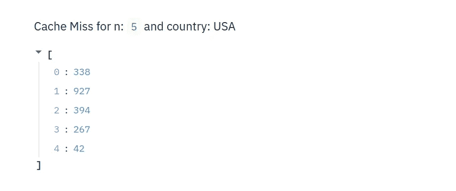

# 高级 Streamlit 缓存

> 原文：<https://towardsdatascience.com/advanced-streamlit-caching-6f528a0f9993?source=collection_archive---------14----------------------->


图片来自 [Sasin Tipchai](https://pixabay.com/users/sasint-3639875/?utm_source=link-attribution&utm_medium=referral&utm_campaign=image&utm_content=1822459) 来自 [Pixabay](https://pixabay.com/?utm_source=link-attribution&utm_medium=referral&utm_campaign=image&utm_content=1822459)

## 缓存=更好的用户体验

现在，如何使用 Streamlit 创建 web 应用程序非常简单，但是它还不允许您做很多事情。我最近面临的一个主要问题是关于缓存的，当时我试图使用一个新闻 API 在 Streamlit 中创建一个分析新闻仪表板。

问题是我经常点击新闻 API，并且已经达到了免费 API 的极限。此外，每次用户刷新应用程序时运行新闻 API 变得相当慢。

解决这个问题的方法是缓存 API 数据。但是当我使用`@st.cache` decorator 时，页面不会刷新，因为 API 调用的参数保持不变。

这也是我开始理解 Streamlit 在缓存方面的局限性的原因。

因此，简而言之，我想要的是一种不会在每次页面刷新时都点击 API 的方法。与此同时，由于我正在获取新闻数据，我还希望每隔 5 分钟访问一次 API。

这是我完成这项工作的简单方法。

**更新:**

在昨天刚刚出来的 [0.57.0](https://discuss.streamlit.io/t/version-0-57-0/2301) 新发行说明中，streamlit 对`st.cache`进行了更新。这个版本的一个显著变化是“能够通过设置`max_entries`和`ttl`参数来设置缓存函数的到期选项”。来自[文档](https://docs.streamlit.io/api.html?highlight=cache#streamlit.cache):

*   **max_entries** ( *int 或 None* ) —保留在**缓存**中的最大条目数，或者对于无界缓存为 None。(当一个新条目被添加到满缓存时，最旧的缓存条目将被删除。)默认为无。
*   **TTL**(*float or None*)—将条目保留在**缓存**中的最大秒数，如果缓存条目不应过期，则为 None。默认值为无。

这可能有所帮助的两个用例是:

*   如果您正在为您的应用程序提供服务，并且不希望缓存永远增长。
*   如果您有一个从 URL 读取实时数据的缓存函数，并且应该每隔几个小时清除一次以获取最新数据

所以现在你需要做的就是:

```
[@st](http://twitter.com/st).cache(ttl=60*5,max_entries=20)
def hit_news_api(country, n):
    # hit_api
```

事情变化之快真是令人难以置信。

在我开始之前，这里有一个关于 streamlit 的教程，如果你不理解这篇文章的话。

[](/how-to-write-web-apps-using-simple-python-for-data-scientists-a227a1a01582) [## 如何为数据科学家使用简单的 Python 编写 Web 应用？

### 无需了解任何 web 框架，即可轻松将您的数据科学项目转换为酷炫的应用程序

towardsdatascience.com](/how-to-write-web-apps-using-simple-python-for-data-scientists-a227a1a01582) 

# 简化缓存基础知识:

当我们用 streamlit 的缓存装饰器`@st.cache`标记一个函数时，无论何时调用该函数，Streamlit 都会检查调用该函数时使用的输入参数。后端发生的事情是，当一个函数用`@st.cache` streamlit 修饰时，它将函数的所有状态保存在内存中。

例如，如果我们有一个简单的 streamlit 应用程序，如下所示:

```
**import** **streamlit** **as** **st**
**import** **time****def** expensive_computation(a, b):
    time.sleep(2)  *# 👈 This makes the function take 2s to run*
    **return** a * ba = 2
b = 21
res = expensive_computation(a, b)
st.write("Result:", res)
```

当我们刷新应用程序时，我们会注意到`expensive_computation(a, b)`在每次应用程序运行时都会被重新执行。这对用户来说不是一个很好的体验。

现在，如果我们添加`[@st.cache](https://docs.streamlit.io/api.html#streamlit.cache)`装饰器:

```
**import** **streamlit** **as** **st**
**import** **time**@st.cache  *# 👈 Added this*
**def** expensive_computation(a, b):
    time.sleep(2)  *# This makes the function take 2s to run*
    **return** a * ba = 2
b = 21
res = expensive_computation(a, b)
st.write("Result:", res)
```

因为参数`a`和`b`的结果已经被缓存，所以`expensive_computation`不会在每次用户刷新页面时再次运行。这将带来更好的用户体验。

# 最小示例


罗马卡夫在 [Unsplash](https://unsplash.com?utm_source=medium&utm_medium=referral) 上拍摄的照片

***那么如果我想执行一个函数，如果页面在设定的时间段后刷新了呢？*** 也就是说，缓存的函数已经有一段时间没有运行了，结果需要更新。

为了理解这一点，让我们创建一个基本的例子。在这个例子中，我们的函数采用一个参数`n`和一个参数 country，并返回该国家的前 n 条新闻。

在这个最小的例子中，它类似于返回一个随机数列表。我们希望在接下来的 5 分钟内继续向我们的用户显示这个列表。如果用户在 5 分钟后刷新页面，我们希望列表被刷新。这非常类似于点击新闻 API。

所以我们的基本应用程序代码看起来像这样:

```
import streamlit as st
import randomdef hit_news_api(country, n):
 st.write("Cache Miss for n:",n)
 return [random.randint(0,1000) for i in range(n)]results = hit_news_api("USA", 5)
st.write(results)
```

这个应用程序看起来像:



现在，每次我刷新页面，函数`hit_news_api`都会被再次调用，这意味着随着用户数量的增加，我们将达到 API 的极限。那么我们如何解决这个问题呢？

我们可以使用缓存。没错。所以让我们看看如果我们缓存`hit_news_api`函数会发生什么。

```
import streamlit as st
import random[@st](http://twitter.com/st).cache
def hit_news_api(country, n):
 st.write("Cache Miss for n:",n)
 return [random.randint(0,1000) for i in range(n)]results = hit_news_api("USA", 5)
st.write(results)
```

现在的问题是，如果 API 参数保持不变，我们的仪表板在点击一次新闻 API 后就再也不会调用它了。我们看到同一组参数的静态结果是永恒的。我们做什么呢

# 想法 1 —虚拟时间变量

我们可以使用这种方法——向每五分钟/十分钟改变一次值的`hit_news_api`函数调用传递一个依赖于时间的伪参数。实现这一点的代码是:

在这里，`truncate_time`函数帮助我们将当前日期时间截断为该分钟最接近的最小除数。例如，给定`dt_time=’2020–03–27 02:32:19.684443'`和`period = 5`，函数返回`‘2020–03–27 02:30:00.0’.`

看看我们现在如何用截断的时间调用`hit_news_api`函数。现在，无论何时从`dt_time=’2020–03–27 02:30:00.0' and dt_time=’2020–03–27 02:34:59.99999'`开始调用`hit_news_api`函数，函数调用的参数都保持不变，因此我们不会一次又一次地调用 API。正是我们想要的！

# 想法 2-刷新/清除缓存


清理缓存。[去飞溅](https://unsplash.com?utm_source=medium&utm_medium=referral)

这一切都很好，但是您能发现这种方法的问题吗？缓存大小将随着时间的推移而增长。这意味着我们需要定期手动清除缓存。我们如何自动化缓存清除过程？

这是一个非常简单的方法。我们可以在代码顶部使用下面的代码，在一天的时间内清除整个缓存。

```
from streamlit import caching
from datetime import datedef cache_clear_dt(dummy):
   clear_dt = date.today()
   return clear_dtif cache_clear_dt("dummy")<date.today():
   caching.clear_cache()
```

# 最终应用代码

这是上面所有功能的整个应用程序的外观。

# 结论

Streamlit 使创建应用程序的整个过程民主化了，我不能再推荐它了。

然而，有些事情我们需要绕道而行。在这个令人敬畏的平台上，我仍然喜欢拥有很多东西。我已经与 Streamlit 团队就他们将要引入的新功能进行了讨论，我将尽力让您了解最新情况。

你可以在我的 Github repo 上找到最终应用的完整代码。

如果你想了解创建可视化的最佳策略，我想从密歇根大学调用一门关于 [**数据可视化和应用绘图**](https://www.coursera.org/specializations/data-science-python?ranMID=40328&ranEAID=lVarvwc5BD0&ranSiteID=lVarvwc5BD0-SAQTYQNKSERwaOgd07RrHg&siteID=lVarvwc5BD0-SAQTYQNKSERwaOgd07RrHg&utm_content=3&utm_medium=partners&utm_source=linkshare&utm_campaign=lVarvwc5BD0) 的优秀课程，它是一个非常好的 [**数据科学专业的一部分，本身带有 Python**](https://www.coursera.org/specializations/data-science-python?ranMID=40328&ranEAID=lVarvwc5BD0&ranSiteID=lVarvwc5BD0-SAQTYQNKSERwaOgd07RrHg&siteID=lVarvwc5BD0-SAQTYQNKSERwaOgd07RrHg&utm_content=3&utm_medium=partners&utm_source=linkshare&utm_campaign=lVarvwc5BD0) 。一定要去看看。

谢谢你的阅读。将来我也会写更多初学者友好的帖子。在 [**媒体**](https://medium.com/@rahul_agarwal) 关注我，或者订阅我的 [**博客**](http://eepurl.com/dbQnuX) 了解他们。一如既往，我欢迎反馈和建设性的批评，可以通过 Twitter [@mlwhiz](https://twitter.com/MLWhiz) 联系。

此外，一个小小的免责声明——这篇文章中可能会有一些相关资源的附属链接，因为分享知识从来都不是一个坏主意。