# 用 ARMA 和 ARIMA 进行高级时间序列分析

> 原文：<https://towardsdatascience.com/advanced-time-series-analysis-with-arma-and-arima-a7d9b589ed6d?source=collection_archive---------1----------------------->

## 理解并在 Python 中实现时间序列预测的 ARMA 和 ARIMA 模型


由 [Djim Loic](https://unsplash.com/@loic?utm_source=medium&utm_medium=referral) 在 [Unsplash](https://unsplash.com?utm_source=medium&utm_medium=referral) 上拍摄的照片

# 介绍

在之前的文章中，我们介绍了[移动平均过程 MA(q)](/how-to-model-time-series-in-python-9983ebbf82cf) 和[自回归过程 AR(p)](/time-series-forecasting-with-autoregressive-processes-ba629717401) 作为时间序列建模的两种方法。现在，我们将结合这两种方法，探索 ARMA(p，q)和 ARIMA(p，d，q)模型如何帮助我们对更复杂的时间序列进行建模和预测。

本文将涵盖以下主题:

*   ARMA 模型
*   ARIMA 模型
*   永盒试验
*   赤池信息标准(AIC)

到本文结束时，您应该能够熟练地用 Python 实现 ARMA 和 ARIMA 模型，并且您将有一个时间序列建模步骤的清单。

笔记本和数据集在这里是。

我们开始吧！

> 通过 Python 中的应用时间序列分析[学习最新的时间序列分析技术。课程涵盖统计和深度学习模型，你将使用 Python 和 TensorFlow！](https://www.datasciencewithmarco.com/offers/tdU2mtVK)

# ARMA 模型

回想一下，阶为 *p* 的自回归过程定义为:

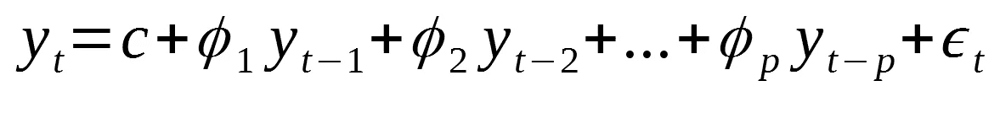

p 阶自回归过程

其中:

*   *p* 是命令
*   *c* 是常数
*   *ε*:噪音

还记得移动平均过程 *q* 被定义为:

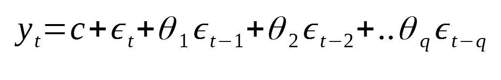

q 阶移动平均过程

其中:

*   *问*是命令
*   *c* 是常数
*   *ε*是噪音

那么，ARMA(p，q)就是将两个模型组合成一个方程:

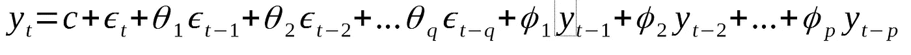

(p，q)阶 ARMA 过程

因此，该模型可以解释随机噪声(移动平均部分)和前一步(自回归部分)的时间序列之间的关系。

让我们通过一些模拟来看看 ARMA(p，q)过程是如何表现的。

## 模拟和 ARMA(1，1)过程

让我们从一个简单的例子开始，一阶 ARMA 过程的移动平均和自回归部分。

首先，让我们导入本教程中需要的所有库:

```
from statsmodels.graphics.tsaplots import plot_pacf
from statsmodels.graphics.tsaplots import plot_acf
from statsmodels.tsa.arima_process import ArmaProcess
from statsmodels.stats.diagnostic import acorr_ljungbox
from statsmodels.tsa.statespace.sarimax import SARIMAX
from statsmodels.tsa.stattools import adfuller
from statsmodels.tsa.stattools import pacf
from statsmodels.tsa.stattools import acf
from tqdm import tqdm_notebook
import matplotlib.pyplot as plt
import numpy as np
import pandas as pdimport warnings
warnings.filterwarnings('ignore')%matplotlib inline
```

然后，我们将模拟以下 ARMA 过程:

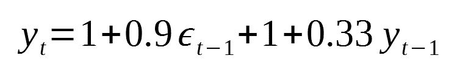

ARMA (1，1)过程

在代码中:

```
ar1 = np.array([1, 0.33])
ma1 = np.array([1, 0.9])simulated_ARMA_data = ArmaProcess(ar1, ma1).generate_sample(nsample=10000)
```

我们现在可以绘制前 200 个点，以可视化我们生成的时间序列:

```
plt.figure(figsize=[15, 7.5]); # Set dimensions for figure
plt.plot(simulated_ARMA_data)
plt.title("Simulated ARMA(1,1) Process")
plt.xlim([0, 200])
plt.show()
```

您应该得到类似于以下内容的内容:

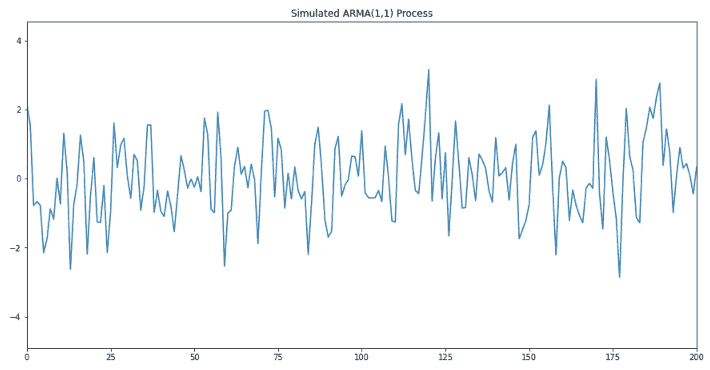

模拟 ARMA(1，1)过程

然后，我们可以看看 ACF 和 PACF 的图:

```
plot_pacf(simulated_ARMA_data);
plot_acf(simulated_ARMA_data);
```

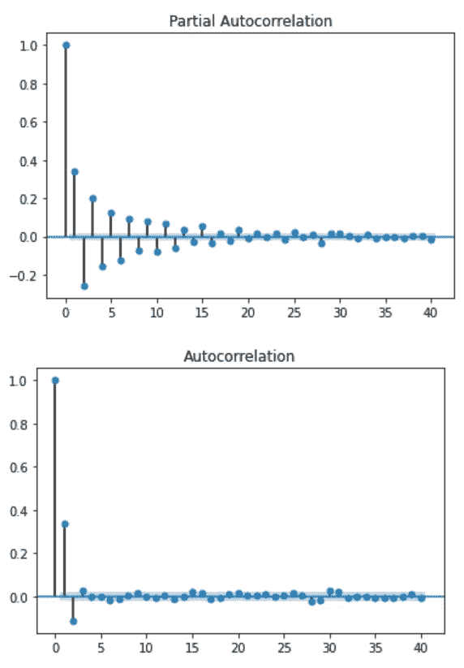

模拟 ARMA(1，1)过程的 PACF anf ACF 图

正如你所看到的，我们不能通过查看这些图来推断 ARMA 过程的顺序。事实上，仔细观察，我们可以在 ACF 和 PACF 函数中看到一些正弦曲线形状。这表明这两个过程都在起作用。

## 模拟 ARMA(2，2)过程

同样，我们可以模拟一个 ARMA(2，2)过程。在本例中，我们将模拟以下等式:

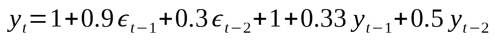

ARMA(2，2)过程

在代码中:

```
ar2 = np.array([1, 0.33, 0.5])
ma2 = np.array([1, 0.9, 0.3])simulated_ARMA2_data = ArmaProcess(ar1, ma1).generate_sample(nsample=10000)
```

然后，我们可以可视化模拟数据:

```
plt.figure(figsize=[15, 7.5]); # Set dimensions for figure
plt.plot(simulated_ARMA2_data)
plt.title("Simulated ARMA(2,2) Process")
plt.xlim([0, 200])
plt.show()
```

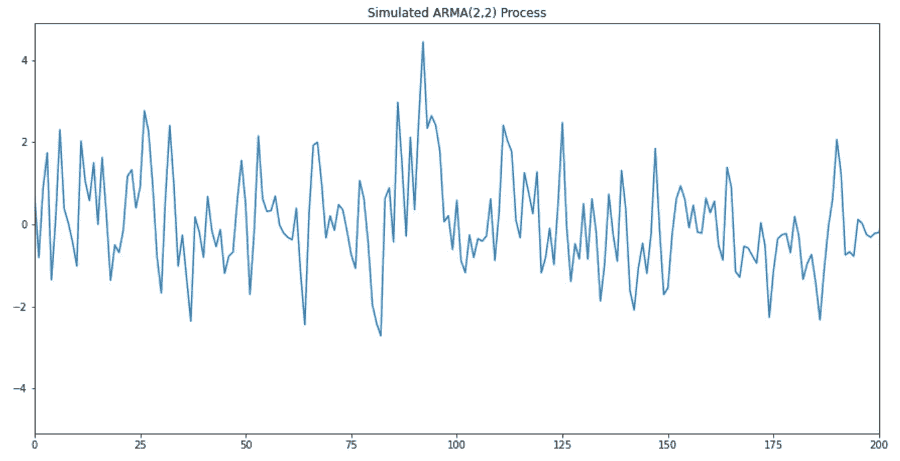

模拟 ARMA(2，2)过程

查看 ACF 和 PACF 图:

```
plot_pacf(simulated_ARMA2_data);
plot_acf(simulated_ARMA2_data);
```

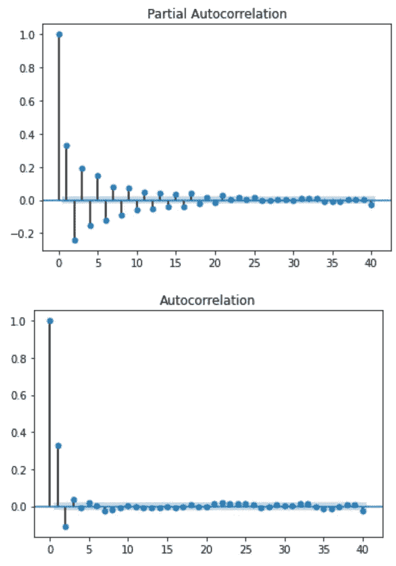

ARMA(2，2)过程的 PACF 和 ACF

正如你所看到的，两条曲线显示了相同的正弦趋势，这进一步支持了 AR(p)过程和 MA(q)过程都在起作用的事实。

# ARIMA 模型

ARIMA 代表一个极端的平均水平。

这个模型是自回归、移动平均模型和**差分**的组合。在这种情况下，整合是差异的反义词。

差分对于去除时间序列中的趋势并使其稳定是有用的。

它只是从时间 *t* 中减去点 a *t-1* 。因此，请意识到，如果应用一次差分，您将丢失时间序列中的第一个数据点。

数学上，ARIMA(p，d，q)现在需要三个参数:

*   p:自回归过程的阶
*   d:差异的程度(差异的次数)
*   问:移动平均线过程的顺序

并且方程表示为:

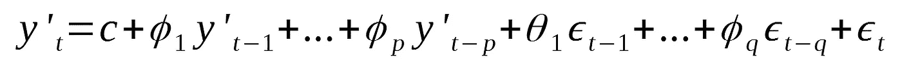

一般 ARIMA 过程

就像 ARMA 模型一样，ACF 和 PACF 不能用于确定 *p* 和 *q* 的可靠值。

然而，在存在 ARIMA(p，d，0)过程的情况下:

*   ACF 呈指数衰减或正弦衰减
*   PACF 在滞后 T21 时有一个显著的峰值，但之后就没有了

类似地，在存在 ARIMA(0，d，q)过程的情况下:

*   PACF 呈指数衰减或正弦衰减
*   ACF 在滞后*q*时有一个显著的尖峰，但在此之后没有

让我们看一个 ARIMA 的建模例子，获得一些实践经验，更好地理解一些建模概念。

# 项目—为强生公司的季度每股收益建模

让我们重温一下之前分析过的数据集。该数据集用于显示 Yule-Walker 方程可以帮助我们估计 AR(p)过程的系数。

现在，我们将使用相同的数据集，但使用 ARIMA(p，d，q)模型对时间序列进行建模。

你可以拿起[笔记本](https://github.com/marcopeix/time-series-analysis/tree/master/Advanced%20modelling)或者下载[数据集](https://github.com/marcopeix/time-series-analysis/tree/master/data)跟随。

首先，我们导入数据集并显示前五行:

```
data = pd.read_csv('jj.csv')
data.head()
```

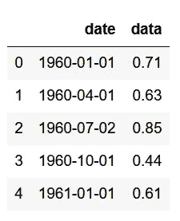

然后，让我们绘制整个数据集:

```
plt.figure(figsize=[15, 7.5]); # Set dimensions for figure
plt.scatter(data['date'], data['data'])
plt.title('Quarterly EPS for Johnson & Johnson')
plt.ylabel('EPS per share ($)')
plt.xlabel('Date')
plt.xticks(rotation=90)
plt.grid(True)
plt.show()
```

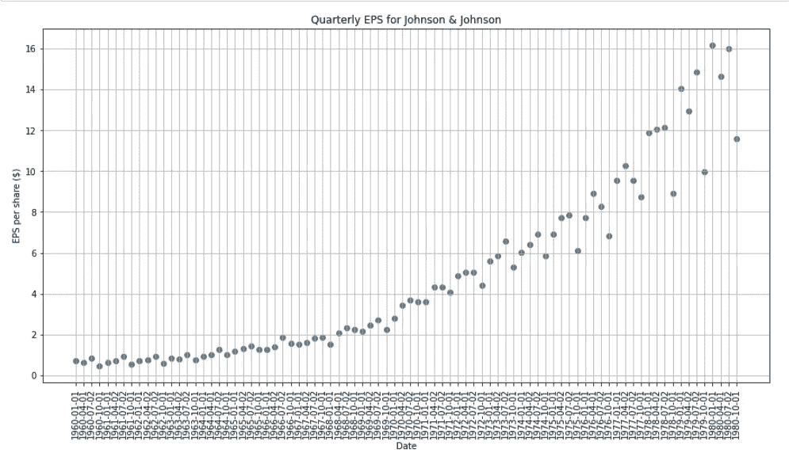

强生公司季度每股收益

正如你所看到的，在这个时间序列中既有趋势也有方差的变化。

让我们画出 ACF 和 PACF 函数:

```
plot_pacf(data['data']);
plot_acf(data['data']);
```

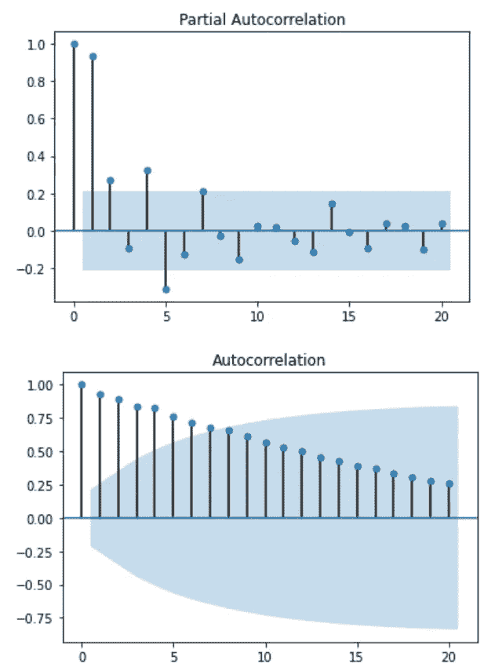

PACF 和 ACF

如您所见，没有办法确定 AR(p)流程或 MA(q)流程的正确顺序。

上面的图也清楚地表明了非平稳性。为了进一步证明这一点，让我们使用扩展的 Dicker-Fuller 测试:

```
# Augmented Dickey-Fuller testad_fuller_result = adfuller(data['data'])
print(f'ADF Statistic: {ad_fuller_result[0]}')
print(f'p-value: {ad_fuller_result[1]}')
```

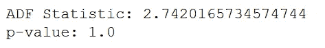

这里，p 值大于 0.05，这意味着我们不能拒绝时间序列是非平稳的零假设。

因此，我们必须应用一些变换和一些差分来消除趋势和方差的变化。

因此我们将取时间序列的对数差。这相当于取每股收益的对数，然后应用一次差分。请注意，因为我们是差分一次，我们将摆脱第一个数据点。

```
# Take the log difference to make data stationarydata['data'] = np.log(data['data'])
data['data'] = data['data'].diff()
data = data.drop(data.index[0])
data.head()
```

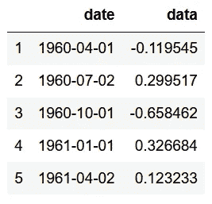

现在，让我们绘制新转换的数据:

```
plt.figure(figsize=[15, 7.5]); # Set dimensions for figure
plt.plot(data['data'])
plt.title("Log Difference of Quarterly EPS for Johnson & Johnson")
plt.show()
```

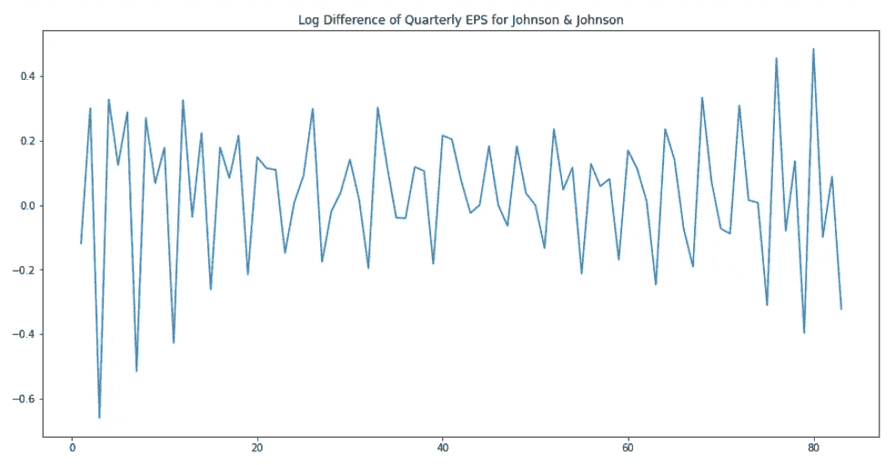

强生公司季度每股收益的对数差异

趋势和方差的变化似乎被去除了，但是我们想确定情况确实如此。因此，我们再次应用扩展的 Dickey-Fuller 检验来检验平稳性。

```
# Augmented Dickey-Fuller testad_fuller_result = adfuller(data['data'])
print(f'ADF Statistic: {ad_fuller_result[0]}')
print(f'p-value: {ad_fuller_result[1]}')
```

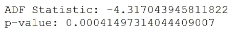

这一次，p 值小于 0.05，我们拒绝零假设，假设时间序列是平稳的。

现在，让我们看看 PACF 和 ACF，看看我们是否可以估计其中一个过程的顺序。

```
plot_pacf(data['data']);
plot_acf(data['data']);
```

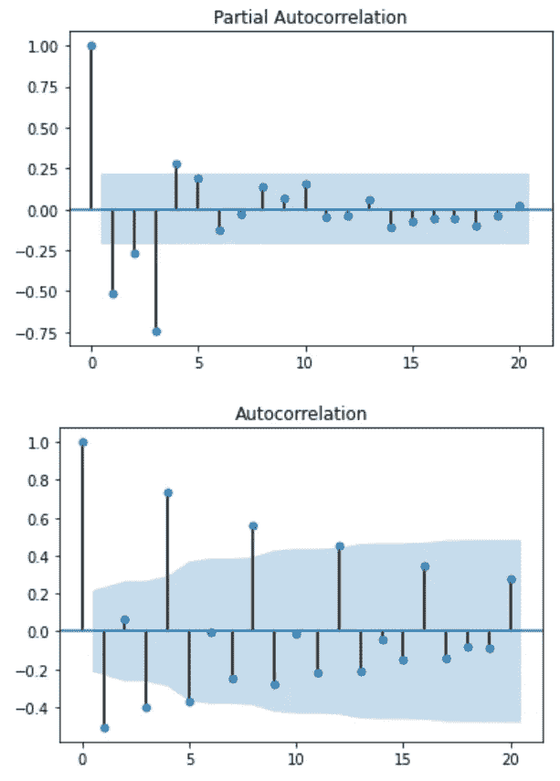

PACF 和 ACF

检查上面的 PACF，似乎有一个 3 阶或 4 阶的 AR 过程在起作用。然而，ACF 不提供信息，我们看到一些正弦曲线形状。

因此，我们如何确保为 AR(p)和 MA(q)过程选择正确的顺序呢？

我们需要尝试不同的订单组合，用这些订单拟合 ARIMA 模型，并使用订单选择标准。

这就把我们带到了 **A** 凯克的**I**information**C**riterion 或者 **AIC** 的话题。

## 赤池的信息标准(AIC)

这个标准对于选择 ARIMA 模型的阶(p，d，q)是有用的。AIC 表示为:

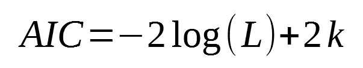

AIC 公式

其中 *L* 是数据的似然性， *k* 是参数的个数。

在实践中，我们选择与其他模型相比 AIC 最低的模型。

重要的是要注意，AIC 不能用于选择差分(d)的阶。差异数据将改变数据的可能性(L)。因此，不同阶差分模型的 AIC 是不可比的。

此外，请注意，由于我们选择了具有最低 AIC 的模型，更多的参数将增加 AIC 得分，从而惩罚该模型。虽然参数越多的模型性能越好，但 AIC 用于查找参数数量最少但仍能提供良好结果的模型。

关于 AIC 的最后一点说明是，它只能相对于其他模型使用。小的 AIC 值并不能保证模型在未加密的数据上有好的表现，也不能保证它的 SSE 很小。

现在我们知道了如何为 ARIMA 模型选择最佳订单，让我们编写一个函数来测试所有订单。

```
def optimize_ARIMA(order_list, exog):
    """
        Return dataframe with parameters and corresponding AIC

        order_list - list with (p, d, q) tuples
        exog - the exogenous variable
    """

    results = []

    for order in tqdm_notebook(order_list):
        try: 
            model = SARIMAX(exog, order=order).fit(disp=-1)
        except:
            continue

        aic = model.aic
        results.append([order, model.aic])

    result_df = pd.DataFrame(results)
    result_df.columns = ['(p, d, q)', 'AIC']
    #Sort in ascending order, lower AIC is better
    result_df = result_df.sort_values(by='AIC', ascending=True).reset_index(drop=True)

    return result_df
```

上面的函数将产生一个数据框架，该框架将列出订单和相应的 AIC，从最上面的最佳型号开始。

我们将尝试阶数(p，q)范围从 0 到 8 的所有组合，但保持差分阶数等于 1。

```
ps = range(0, 8, 1)
d = 1
qs = range(0, 8, 1)# Create a list with all possible combination of parameters
parameters = product(ps, qs)
parameters_list = list(parameters)order_list = []for each in parameters_list:
    each = list(each)
    each.insert(1, 1)
    each = tuple(each)
    order_list.append(each)

result_df = optimize_ARIMA(order_list, exog=data['data'])result_df
```

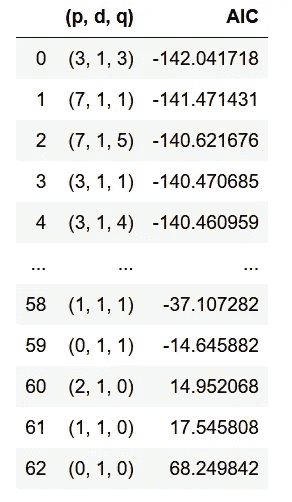

一旦函数运行完毕，您应该会看到与最低 AIC 相关联的顺序是(3，1，3)。因此，这表明 ARIMA 模型具有 AR(3)过程和 MA(3)过程。

现在，我们可以打印出最佳模型的摘要，即 ARIMA (3，1，3)。

```
best_model = SARIMAX(data['data'], order=(3,1,3)).fit()
print(best_model.summary())
```

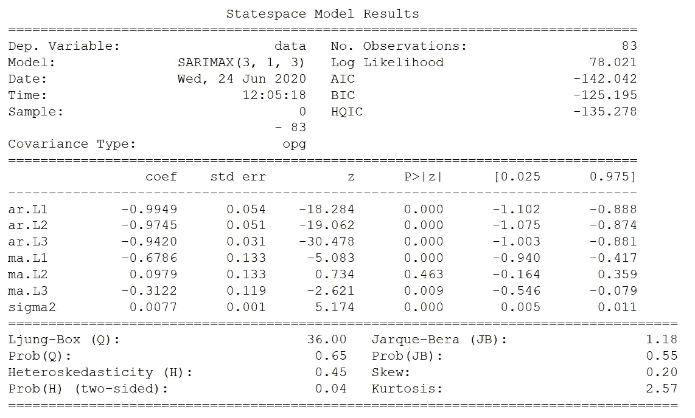

最佳 ARIMA 模式总结

从上面的总结中，我们可以看到所有系数的值及其相关的 p 值。请注意，根据 p 值，滞后 2 时 MA 过程的参数似乎不具有统计显著性。不过，让我们暂时把它保留在模型中。

因此，根据上表，时间序列可以建模为:

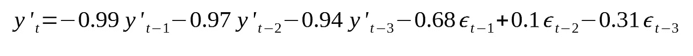

强生公司四季度每股收益的 ARIMA 模型

其中*ε*是方差为 0.0077 的噪声。

时间序列建模的最后一部分是研究残差。

理想情况下，残差将是白噪声，没有自相关。

测试这一点的一个好方法是使用永盒测试。请注意，该测试只能应用于残差。

```
# Ljung-Box test
ljung_box, p_value = acorr_ljungbox(best_model.resid)print(f'Ljung-Box test: {ljung_box[:10]}')
print(f'p-value: {p_value[:10]}')
```

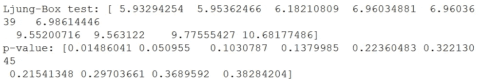

这里，永盒检验的零假设是不存在自相关。看上面的 p 值，可以看到都在 0.05 以上。所以不能拒绝零假设，残差确实不相关。

我们可以通过绘制残差的 ACF 和 PACF 来进一步证明这一点。

```
plot_pacf(best_model.resid);
plot_acf(best_model.resid);
```

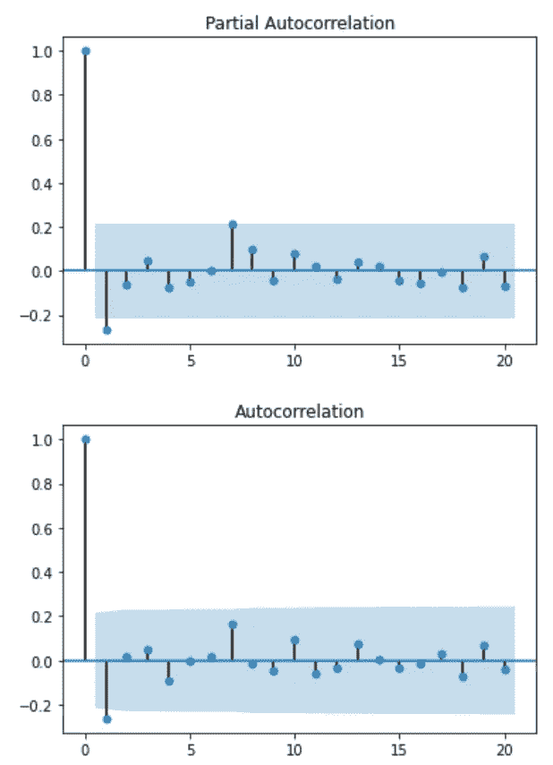

残差的 PACF 和 ACF

正如你所看到的，上面的图类似于白噪声。

因此，该模型可用于预测。

# 一般建模程序

无论何时面对时间序列，您都可以遵循以下一般程序:

1.  绘制数据并识别不合理的观察结果。理解数据的模式。
2.  应用转换或差异来移除趋势并稳定差异
3.  测试平稳性。如果序列不是稳定的，应用另一个变换或差分。
4.  画出 ACF 和 PACF 来估计 MA 或 AR 过程的顺序。
5.  尝试不同的订单组合，选择 AIC 最低的型号。
6.  检查残差，确保它们看起来像白噪声。应用永盒测试来确定。
7.  计算预测。

# 结论

恭喜你！现在，您已经了解了什么是 ARMA 模型，以及如何使用非季节性 ARIMA 模型进行高级时间序列分析。你也有一个时间序列分析的路线图，你可以应用它来确保获得可能的最佳模型。

通过以下课程了解有关时间序列分析的更多信息:

*   [在 Python 中应用时间序列分析](https://www.datasciencewithmarco.com/offers/tdU2mtVK)

干杯🍺