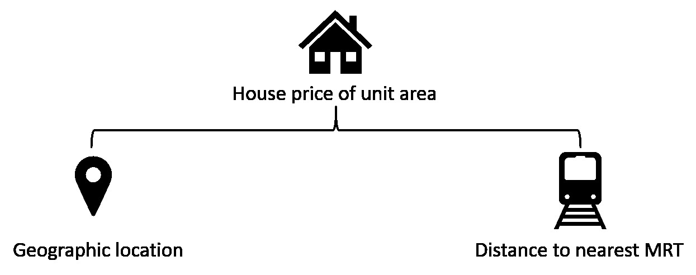
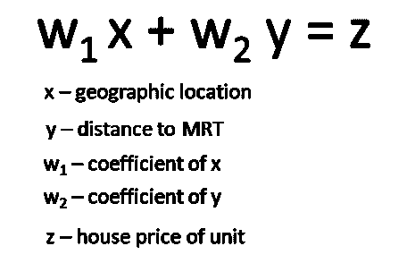
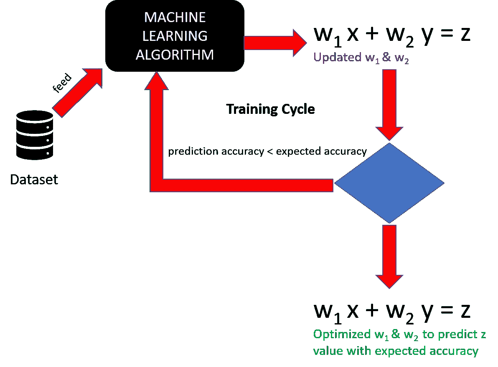
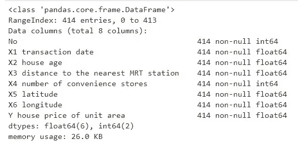
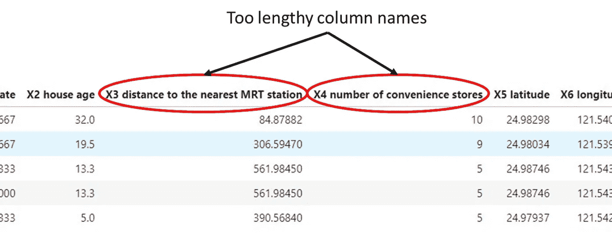
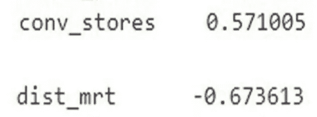
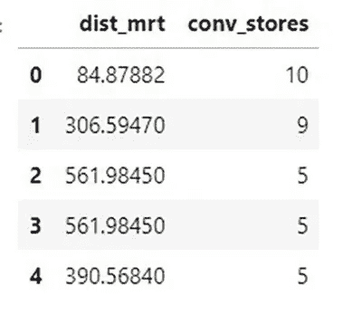
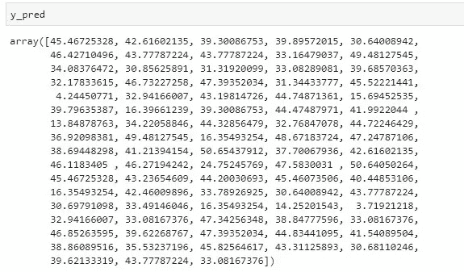
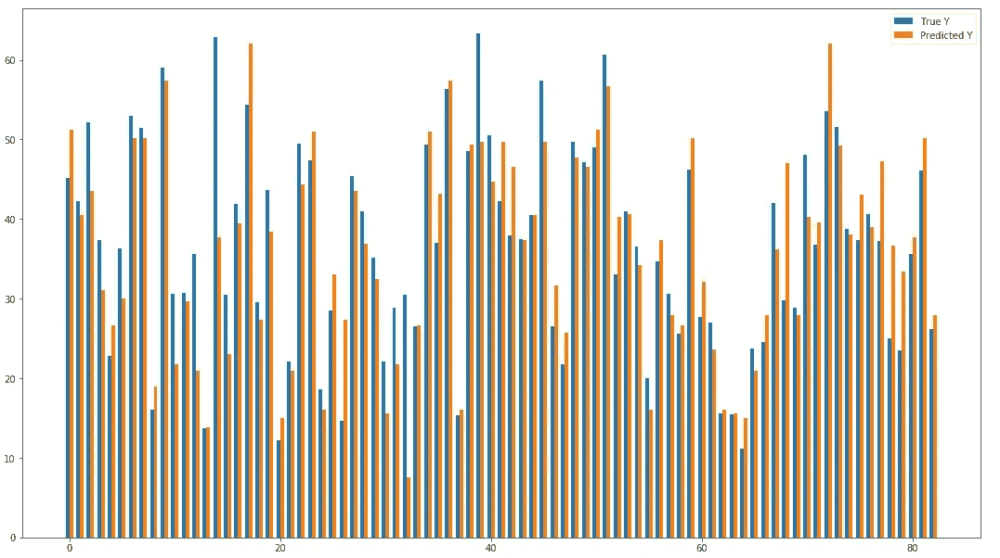

# 使用 Python 探索机器学习

> 原文：<https://towardsdatascience.com/adventure-into-machine-learning-using-python-7a85fce81b7d?source=collection_archive---------32----------------------->

弗兰基·查马基在 [Unsplash](https://unsplash.com/s/photos/machine-learning?utm_source=unsplash&utm_medium=referral&utm_content=creditCopyText) 上拍摄的照片

近年来，机器学习引起了前所未有的关注。机器学习的一个吸引人的方面是它能够从原始数据中释放大量有用的信息，这些信息可以在许多商业和研究环境中驱动决策过程。例如，沃尔玛是使用机器学习来提高销售业绩的零售企业领导者之一。

 [## 沃尔玛:利用大数据、机器学习、人工智能和物联网提升零售业绩

### 沃尔玛可能自 20 世纪 60 年代就已经存在，但在寻找新方法方面，该公司仍处于领先地位…

www.bernardmarr.com](https://www.bernardmarr.com/default.asp?contentID=1276) 

虽然我们可能已经听说了许多关于机器学习应用的成功和令人兴奋的故事，但我们应该如何开始利用这项强大的技术呢？

好消息是，这不需要投入大量成本来开始构建机器学习应用程序。我们可以免费使用许多开源开发工具。我们所需要的只是一台能上网的个人电脑。在这篇文章中，我将分享一个使用开源 Python 库的机器学习的示例工作流。

# 什么是机器学习？

[亚历山大·奈特](https://unsplash.com/@agkdesign?utm_source=unsplash&utm_medium=referral&utm_content=creditCopyText)在 [Unsplash](https://unsplash.com/s/photos/ai-robot?utm_source=unsplash&utm_medium=referral&utm_content=creditCopyText) 上拍照

在我们讨论机器学习的技术方面之前，让我们回顾一下机器学习的概念，以确保我们意识到我们将要做的工作。

首先，机器学习**不一定是**为如上图所示的自主机器人编程的实践。让我们看看人工智能(AI)先驱亚瑟·塞缪尔(创造了“机器学习”这个术语的计算机科学家)给出的定义:

> *“机器学习是一个研究领域，它赋予计算机无需显式编程就能学习的能力”阿瑟·塞缪尔，1959*

在机器环境中解释“学习”可能很棘手。有人可能会问，机器怎么可能“学习”？我们是不是在试图给我们的计算机 CPU 植入某种极其强大的芯片，使它能够像人一样思考？后一个问题的答案是一个简单的“不”。为了回答第一个问题，我将用一个非常简单的例子来说明如下的概念。

假设你是一名数据分析师，你的任务是创建一个模型，仅基于两个因素来预测单位面积的房价:地理位置和到最近的 MRT 的距离。你会得到一个房价数据集，其中还包括地理位置和到最近的捷运站的距离的详细信息。对数据集的第一印象可能会让你想到房价和地理位置+ MRT 距离之间可能存在相关性(见下文)。

显示房价和地理位置+到最近的 MRT 的距离之间的相关性的数据集片段

很明显，如果单位位于市区，离捷运较近，单位面积的房价就越来越高。此外，地理位置的因素比到最近的捷运站的距离具有更高的权重。此时，一个非常简单的模型可以表述如下:

预测房地产价值的简单模型

然而，问题是你如何确定 w1 和 w2 的值？一种方法是使用数据集通过反复调整 w1 和 w2 来训练机器学习模型，直到模型能够以期望的精度预测房地产价值。

简单地说，我们可以将机器学习模型视为黑盒机器，当它被输入数据集时，可以被调整以给出优化的预测输出。这个黑盒机器可以通过训练周期的循环来训练，以保持更新 w1 和 w2。当 w1 & w2 被优化以预期精度预测房地产价值时，黑匣子机器被认为是**已学习的**。

训练机器学习算法的简单说明

训练机器学习模型的一种常见方法是监督学习。在本文中，我将介绍监督学习方法。

# 亲自动手

现在，我们对机器学习有了一些想法，我们准备转向实用方面，开始训练机器学习模型。

## 1.目标

本项目的目标是对新店区的房价进行价值评估。台湾新北市。为了实现目标，我们将训练一个机器学习模型来预测房价。

## **2。数据集的采集**

我们将使用可以从 [UCL 机器学习库](https://archive.ics.uci.edu/ml/datasets/Real+estate+valuation+data+set)获得的**房地产估价数据**。房地产数据存储在 Excel 文件中。

一般来说，机器学习的数据来源主要有两个:1)我们自己的收集，2)公共数据。我们倾向于将公共数据用于学习或实验目的，因为这可以节省我们自己收集数据的大量时间。感谢数据科学社区的慷慨，我们可以很容易地从诸如 [Kaggle](https://www.kaggle.com/datasets) 、 [UCL 机器学习库](https://archive.ics.uci.edu/ml/index.php)、[开放数据](https://www.data.gov/)等网站获得公共数据，仅举几例。

## **3。设置机器学习工作空间**

准备好原始数据后，我们可以开始设置我们的机器学习工作区。

**3.1 硬件要求**

我们不需要一台安装了 NVIDIA GPU 的高成本电脑来运行这个机器学习项目。配备 i5 或 i7 处理器和 8GB 内存的 PC 或 Mac 电脑足以满足这个简单项目的硬件要求。

**3.2 软件要求**

我们将为这个项目使用基于 Python 的机器学习和数据处理库，因此我们的计算机将准备好:

*   python 3([https://www.python.org/](https://www.python.org/))
*   熊猫([https://pandas.pydata.org/](https://pandas.pydata.org/))
*   https://matplotlib.org/
*   努皮([https://numpy.org/](https://numpy.org/)
*   scikit-learn([https://scikit-learn.org/stable/](https://scikit-learn.org/stable/))
*   Jupyter 笔记本/ Jupyter 实验室[https://jupyter.org/](https://jupyter.org/)

获得所有这些 Python 库的最简单的方法是在我们的计算机上安装 [Anaconda 包](https://www.anaconda.com/)。Anaconda 在一个包中提供了大多数基于 Python 的机器学习和数据处理库。

## 4.探索数据

这对于我们在使用数据来训练我们的机器学习模型之前对数据有一个大致的了解是很重要的。为了探索我们的数据，我们将使用 Jupyter Notebook 作为我们的编辑器，并开始编写 Python 代码。

首先，我们可以创建一个笔记本，并使用**熊猫**来读取我们的房地产数据。(*请注意我已经将 Excel 文件重命名为“Real _ estate _ data . xlsx”*)。

从 Excel 文件中读取数据的代码片段

我们使用 Pandas *head()和 info()* 方法来快速浏览我们的数据。

查看前五条记录的代码片段

前五条记录

*head()* 方法显示前五条记录。

获取数据快速描述的代码片段

数据描述

Pandas *info()* 方法给了我们一个快速描述数据的方法。例如:

*   条目总数
*   总列数
*   每列中的数据类型

我们的房地产数据只有 414 个条目。这被认为是基于机器学习标准的非常小的数据集。然而，用它作为样本数据来启动一个简单的项目还是不错的。

这一点也值得强调，数据中的房价是以台币**单位面积价格(新台币** $ **)为基础的。**

每列中的特征都是数字的。然而，并不是所有的特征都对训练机器学习模型有用。例如，第一列“No”只不过是一个记录索引。显然，它并没有显示出与房价有任何强相关性。因此，我们稍后将通过特性选择过程简单地过滤掉这个特性。

此外，我们的数据的许多列名太长，这将给使用 Pandas 提取单个列来分析它们带来一些困难。我们必须将这些列重命名为更简洁的名称，以简化我们的数据处理工作。

有问题的列名

## **5。预处理数据**

在这个阶段，我们将再次使用 Python Pandas 库来过滤和清理我们的数据，然后才能将其用于训练我们的机器学习模型。

**5.1 重命名列**

我们通过重命名房地产数据中除“No”列之外的所有列名来开始我们的数据预处理步骤。为此，我们可以使用 Pandas *rename()* 方法。

重命名列的代码片段

要重命名列，我们只需创建一个列映射器， *new_names* (第 1–7 行)。我们将新的列名映射到原始名称，然后将整个列映射器设置为参数“columns”(第 9 行)。

接下来，我们再次使用 *head()* 方法来可视化前五条记录(第 10 行),我们将看到如下输出:

重命名的列

**5.2 特征选择**

如上所述，并非我们数据中的所有特征都将用于训练机器学习模型。只有那些与房价有良好相关性的特征才会被选择用于机器学习。此外，特征选择对于节省训练机器学习模型的计算成本和提高模型性能也很重要。

Pandas *dataframe* 提供了一种简便的方法， ***corr()*** ，来计算我们数据中存在的每一对特征之间的标准相关系数( *Pearson's r* )。

计算标准相关系数的代码片段

标准系数的结果

为了解释如上所示的结果，我们需要理解几个重要的事实:

*   相关系数的范围总是从-1 到 1
*   如果该值接近 1，则意味着特定的一对要素之间存在**强正**相关性(例如，conv 商店与房屋价格)
*   如果该值接近-1，则意味着在特定的一对要素(例如 dist_mrt vs house_price)之间存在一个**强负**相关性
*   如果该值接近 0，则意味着该特定特征对之间**没有线性相关性**(例如，No vs house_price)。

结果表明，特征***【conv _ 商店】*** 和 ***dist_mrt*** 对房价的影响最大，因为它们分别具有最高的正相关性和负相关性。这个结果是有道理的，因为房价通常取决于周围设施的可用性。其中一个重要的设施是便利店。另一方面，当房地产远离公共交通服务时，房地产价值会大大降低(这就是为什么 *dist_mrt* 与 *house_price* 显示出强烈的负相关性)。

此外，我们不应该低估由特征 ***lat* 和 *lng*** 所代表的地理位置的影响。 *lat* 和 *lng* 的相关性分析表明，东北地区的房价往往更高。根据地理位置可视化房价分布的一种方法是使用 **Python Matplotlib 库**绘制散点图。

根据地理位置绘制房价分布散点图的代码片段

显示房价分布的散点图

散点图中的彩色地图显示，大多数高成本房地产集中在红圈区域。虽然并非所有高成本房地产都位于该地区，但仍显示出一种总体密度模式，即房地产价格往往高于其他地区。

此外，特征 ***房龄*** 也可以是影响房地产价格的一个重要因素，尽管这种影响比不上*的 dist_mrt 和 conv_stores。*

另一方面，特征 ***No*** 和 ***trans_date*** 显示与房价相关性差(接近于零)。

**维度的诅咒**

虽然数据集中至少有五个特征对训练我们的模型来说足够重要，但我们的数据集非常小，只有 414 个条目。根据 [**维数灾难**](https://www.kdnuggets.com/2017/04/must-know-curse-dimensionality.html) ，我们用来训练模型的特征越多，我们需要的数据集往往会呈指数级增长。总的来说，我们需要的数据集

*1 特性= 10，*

*2 个特征= 10 * 10 = 100，*

*3 个特征= 10 * 10 * 10 = 1000 等等…*

给定只有数百个条目的有限数据集，我们只能选择两个最相关的特征来训练我们的模型。于是，让我们挑选正负相关性最高的特征:***conv _ 商店*** 和 ***dist_mrt。***

简而言之，基于相关性分析的结果和对维数灾难的考虑，只选择两个特征作为机器学习的**输入特征**。

我们将使用 *Pandas drop()* 方法从数据集中删除特征 *No、trans_date、lat、lng 和 house _ age**。此外，我们还需要从输入特性列表中排除“house_price”。*

*从原始数据集中删除列的代码段*

**

*用作输入要素的剩余列*

***5.3 数据转换***

*在这个阶段，我们已经完成了特征选择，但是我们还没有准备好使用输入特征来训练我们的模型。在开始训练我们的模型之前，仍然需要完成几个预处理步骤。*

*我们需要将我们的输入特征转换成一个 **Numpy 数组**。此外，我们还需要从原始数据集中提取“house_price”并将其用作**输出特征**或**标签**。输出要素也应该转换为 Numpy 数组。*

*要将输入要素和输出要素转换为 Numpy 数组，我们可以使用 Pandas 数据框**值** **属性**。*

*将输入要素和输出要素转换为 Numpy 数组的代码片段*

*按照惯例，输入特征应存储在名为 **X** 的变量中，输出特征存储在名为 **y** 的变量中。*

***5.4 特征缩放***

*如果我们再次观察我们的输入特征 X，我们会发现它们是不同尺度的数值。*

**dist_mrt(最小值:23.38–最大值:6488)**

**conv 商店(最低:0–最高:10)**

*重新调整输入要素的比例以使它们共享相同的比例非常重要。为了获得优化的输出，特征缩放在许多机器学习算法中是重要的。功能缩放有几种方法，我们将使用的方法是**标准化**。[标准化](https://scikit-learn.org/stable/auto_examples/preprocessing/plot_scaling_importance.html)是一个重新调整要素的过程，因此所有要素都具有均值为 0、标准差为 1 的标准正态分布。*

*Scikit-learn 提供了一个有用的模块，[**standard scaler**](http://scikit-learn.org/stable/modules/generated/sklearn.preprocessing.StandardScaler.html)类对输入特征执行标准化。*

*使用标准化执行数据缩放的代码片段*

***5.5 将数据集拆分为训练集和测试集***

*接下来，我们将把输入特征 X 和输出特征 y 分成两个独立的集合:训练集和测试集。顾名思义，训练集用于训练机器学习模型，而测试集用于在稍后阶段评估已训练的模型。*

*Scikit-learn 提供了另一个有用的模块， **train_test_split** ，它使我们能够用几行代码轻松地将数据分成一个训练集和一个测试集。*

*将数据集分成训练集和测试集的代码片段*

*这里我们使用通用的命名惯例来创建几个名为 *X_train，X_test，y_train，*和 *y_test，*的变量来保存输入特征和输出特征的训练集和测试集的数组。请注意， *train_test_split()* 函数中的 **test_size=0.2、**参数会将 80%的数据作为训练集，另外 20%作为测试集。*

## *6.培训模式*

*最后，我们准备好训练我们的第一个机器学习模型。让我们试一个简单的模型， [**线性回归**](https://en.wikipedia.org/wiki/Linear_regression) **模型**。线性回归是一种建模方法，用于定义因变量和一个或多个自变量之间的线性关系。*

*我们可以使用 Scikit-Learn 的 **LinearRegression** 模块来创建一个线性回归模型，并用它来拟合我们的训练数据。*

*用于定型线性模型的代码片段*

*几秒钟后，一个训练好的线性模型就产生了，我们可以使用 *predict()* 方法用我们的测试集测试这个模型。*

*使用测试集测试已定型模型的代码片段*

*测试集的预测值如下:*

**

*单位面积预测房价*

## *7.评估模型*

*现在，我们已经准备好了第一个模型，并用它来预测测试集的单位面积房价。然而，我们如何知道模型预测的准确性呢？线性模型对房价的预测有多好？*

*让我们来看一个分组条形图，它显示了真实值(y_test)和它们对应的预测值(y_pred)的比较。*

*绘制组条形图以比较真实 y 值和预测 y 值的代码片段*

**

*显示真实 Y 和预测 Y 的组合条形图(蓝色:真实 Y，橙色:预测 Y)*

*上面的分组条形图给了我们一个总的概念，一些预测值非常接近它们对应的真实值，但是一些预测值彼此相差很远。*

*现在，我们将通过**成本函数**使用定量方法来衡量线性模型的性能。成本函数是量化真实值( *y_test* )和预测值( *y_pred* )之间的差异的公式。*

*在预测房价这样的回归问题中，有两个常见的选项我们可以考虑:[**【RMSE】**](https://en.wikipedia.org/wiki/Root-mean-square_deviation)或者 [**平均绝对误差(MAE)**](https://en.wikipedia.org/wiki/Mean_absolute_error) **。***

*上面的两个成本函数计算真实值和预测值之间的差值的平均值。但是，RMSE 对数据集中可能存在的异常值非常敏感，会影响评估结果。因此，我们选择 **MAE** 作为我们的选择。*

*幸运的是，我们可以很容易地再次使用 Scikit-Learn 模块来调用 *mean_absolute_error()* 方法来评估模型。*

*使用 MAE 测量线性模型性能的代码片段*

**

*MAE(线性回归模型)的结果*

*所得到的 MAE 度量约为 6.344。这意味着每单位面积的预测房价与真实价格之间的平均绝对差异约为新台币 6.344 元(这可能表明我们可能会考虑尝试另一种模式以获得更好的结果)。*

## ***8。尝试新模式***

*在本节中，我们将训练和评估一个[决策树](https://en.wikipedia.org/wiki/Decision_tree_learning)模型。我们所需要的只是重复上面第 6 节& 7 中介绍的类似步骤。*

*我们可以使用 Scikit-Learn 中的 DecisionTreeRegressor 模块来创建决策树模型，并用它来拟合我们的训练数据。我们再次使用 MAE 成本函数来衡量模型的性能。*

*用于训练决策树和评估模型的代码片段*

**

*MAE(决策树模型)的结果*

*由此产生的 MAE 度量约为 4.84。这表明，与线性回归模型相比，决策树模型提供了更准确的房价预测。*

*如果我们仍然对当前模型的准确性不满意，我们可以考虑以下几种方法:*

1.  *尝试另一种新的机器学习模型*
2.  *获取更多数据集来为模型提供信息*
3.  *尝试其他输入功能(例如 *house_age* )*

# *结论*

*机器学习工作流本身就是一个决策过程，我们需要做出自己的判断来决定使用哪个模型来解决特定的问题。最耗时的部分不是训练模型，而是清理数据和选择适当的输入特征来训练模型的初步步骤。数据预处理步骤不仅仅是例行工作，因为它们都依赖于我们获得的数据的数量和质量以及我们要解决的问题的性质。*

> *没有终极的工作流程可以适应所有类型的机器学习任务。*

*然而，我们仍然可以学习和遵循一些共同的原则来完成我们的机器学习项目。此外，我们还可以充分利用强大的 Python 或 R 包来启动我们的项目，而不需要任何额外的成本，因为它们是开源的。机器学习对我们来说是一种有益的体验，可以从原始数据中获得令人兴奋和有见地的输出。*

# *源代码*

*为这个房价估值项目开发的 Jupyter 笔记本可以在 [Github](https://github.com/teobeeguan2016/MachineLearning-HousePrice.git) 找到。*

# *参考*

1.  *https://www.bernardmarr.com/default.asp?contentID=1276*
2.  *[https://www . kdnugges . com/2017/04/must-know-curse-dimensionality . html](https://www.kdnuggets.com/2017/04/must-know-curse-dimensionality.html)*
3.  *[https://sci kit-learn . org/stable/auto _ examples/preprocessing/plot _ scaling _ importance . html](https://scikit-learn.org/stable/auto_examples/preprocessing/plot_scaling_importance.html)*
4.  *[http://sci kit-learn . org/stable/modules/generated/sk learn . preprocessing . standard scaler . html](http://scikit-learn.org/stable/modules/generated/sklearn.preprocessing.StandardScaler.html)*
5.  *[https://en.wikipedia.org/wiki/Linear_regression](https://en.wikipedia.org/wiki/Linear_regression)*
6.  *[https://en.wikipedia.org/wiki/Root-mean-square_deviation](https://en.wikipedia.org/wiki/Root-mean-square_deviation)*
7.  *[https://en.wikipedia.org/wiki/Mean_absolute_error](https://en.wikipedia.org/wiki/Mean_absolute_error)*
8.  *[https://en.wikipedia.org/wiki/Decision_tree_learning](https://en.wikipedia.org/wiki/Decision_tree_learning)*