# 神经网络训练背后的数学

> 原文：<https://towardsdatascience.com/adventure-of-the-neurons-theory-behind-the-neural-networks-5d19c594ca16?source=collection_archive---------11----------------------->

## 用一个例子清楚地解释神经网络和训练阶段背后的数学

罗马法师在 [Unsplash](https://unsplash.com/s/photos/math?utm_source=unsplash&utm_medium=referral&utm_content=creditCopyText) 上拍摄的照片

神经网络广泛应用于人工智能领域。由于其可伸缩性和灵活性，它可以成为大多数预测问题的解决方案。可以解决回归、分类、预测、对象识别、语音识别、NLP 等复杂问题。那么，什么是神经网络，是什么使它们能够解决所有这些问题，以及它是如何学习进行预测的？为了理解这些，我们需要了解更多关于神经元及其背后的数学。在这篇文章中，我将解释神经元如何从给定的数据中学习并用于预测。我们将从头到尾考察神经网络和训练过程背后的理论。

*   什么是神经元，它们的职责是什么？
*   神经网络中的神经元是如何连接的？
*   神经网络如何根据给定的数据进行预测？
*   网络中的每次迭代会发生什么？
*   每次迭代后会发生什么？
*   一个神经网络在训练过程中会发生什么变化？
*   培训过程应该在什么时候停止？

# **网络中的神经元**

神经元是神经网络的重要组成部分。更准确地说，神经网络是通过将一个神经元连接到另一个神经元而形成的。与人类神经系统不同，神经网络中的神经元通过层相互连接。如果我们考虑到每个神经元都与其他神经元相连，那么处理时间将会非常长。为了减少处理时间和节省计算机的计算能力，在神经网络中使用了层。由于有了层，一层中的每个神经元都与下一层中的神经元相连。下图显示了具有三层的神经网络的基本结构。

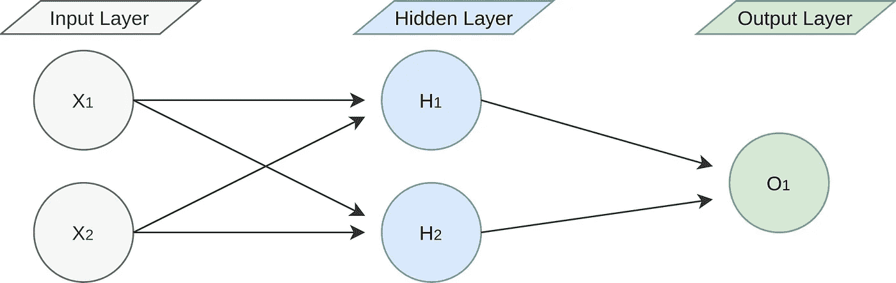

作者图片

从上图可以看出，有 3 层作为输入、隐藏和输出。这三层是神经网络的主要层。输入层中的神经元代表数据集中的每个变量。输出层中的神经元表示输入值传入隐藏层中的每个神经元后的最终预测值。虽然只有一个输入和输出层，但隐藏层的数量可以增加。因此，神经网络的性能取决于层数和每层中神经元的数量。具有 3 个隐藏层且每层中有 3 个神经元的网络和具有一层一个神经元的网络之间的预测性能可能不同。那么，如果我们再增加一个 3 个神经元的隐藏层，网络会是什么样子呢？下图显示了一个有两个隐藏层的网络。

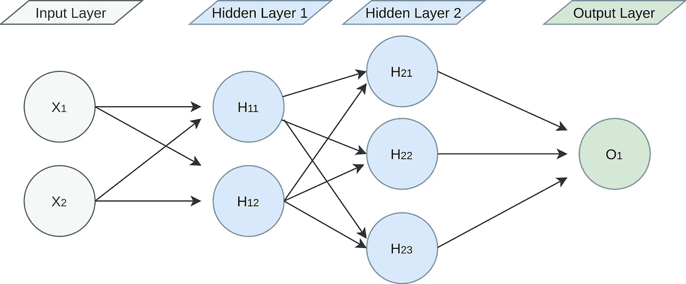

作者图片

我们可以在网络中增加更多的隐藏层和神经元。没有任何限制。但是，我们不应该忘记，增加更多的层和神经元并不意味着我们的网络会预测得更好。但是，当我们增加隐藏层和神经元的数量时，由于每个神经元中的计算，训练时间会增加。我们需要做的是为我们的网络找到最佳的网络结构。

# 喂养神经元

神经网络通过迭代工作，每次迭代训练模型以达到最佳预测。因此，喂养神经元是训练我们网络的主要运动。这种运动在神经网络中被称为“前馈”。它的意思是从先前连接的神经元获取数据，用这些数据进行计算，并将结果发送给下一个连接的神经元。当在输出神经元中完成最后的计算时，从数据集中获取另一个观察值，并再次进行馈送。这个过程一直持续下去，直到我们网络的预测真正接近已经预测的实际值。这里最重要的是在神经元中进行什么样的计算。我们基本上可以称这些计算为加权。我们不应该忘记，我们将利用这个网络进行预测。因此，我们需要对神经元进行加权，以做出最佳预测。

好了，让我们深入考察一下这个喂食过程。假设我们有一个神经网络，1 个输入层有 2 个输入神经元，1 个隐藏层有 2 个神经元，1 个输出层有 1 个神经元。所以，首先我们可以考察隐藏层中一个神经元的进食过程；

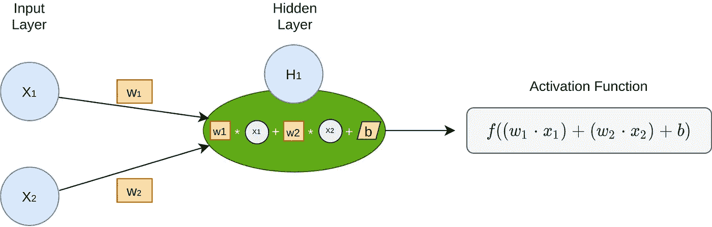

作者图片

在上图中，输入层有两个神经元。这意味着我们的数据集中有两个变量将用于训练。如你所见，输入神经元和隐层神经元之间的每个连接都有“W”值。这些“W”值代表单个神经元为每一个供给自身的神经元保存的值。在第一步，“W”和“b”值可以在 0 和 1 之间随机生成。在迭代(步骤)期间，这些值将被更新，以便达到最佳预测值。我们将在接下来的章节中看到这些迭代。

H1 神经元由 X1 和 X2 神经元馈给，因此它对于 X1 和 X2 具有 W1 和 W2 权重。如果你看到计算部分，来自输入层的每个神经元的值乘以它的权重，然后我们对所有的值求和。然而，还有一个表示为“b”的值。这个值是神经元的截距，我们将这个值与相乘的权重相加。也可以称之为“偏向”。在求和操作之后，结果从激活函数传递过来。激活函数进行一种变换操作。从激活函数获得的值将是该神经元在当前步骤的最终值。

## 激活功能

根据我们想要预测的值，我们可以选择不同的激活函数。让我们假设我们想要预测表示为 0 和 1 的两个类。所以，我们需要一个介于 0 和 1 之间的概率值来决定预测的类别。如果预测值小于 0.5(这意味着它接近 0 类)，我们可以说是预测为 0。如果它大于 0.5，我们可以说它被预测为 1。但是，在没有激活函数的情况下，可以从 0 和 1 中获得预测值。为了理清这个问题，我们可以使用一个使神经元值保持在 0 和 1 之间的激活函数。这个激活函数被称为“Sigmoid”。其他常用的激活功能如下图所示。

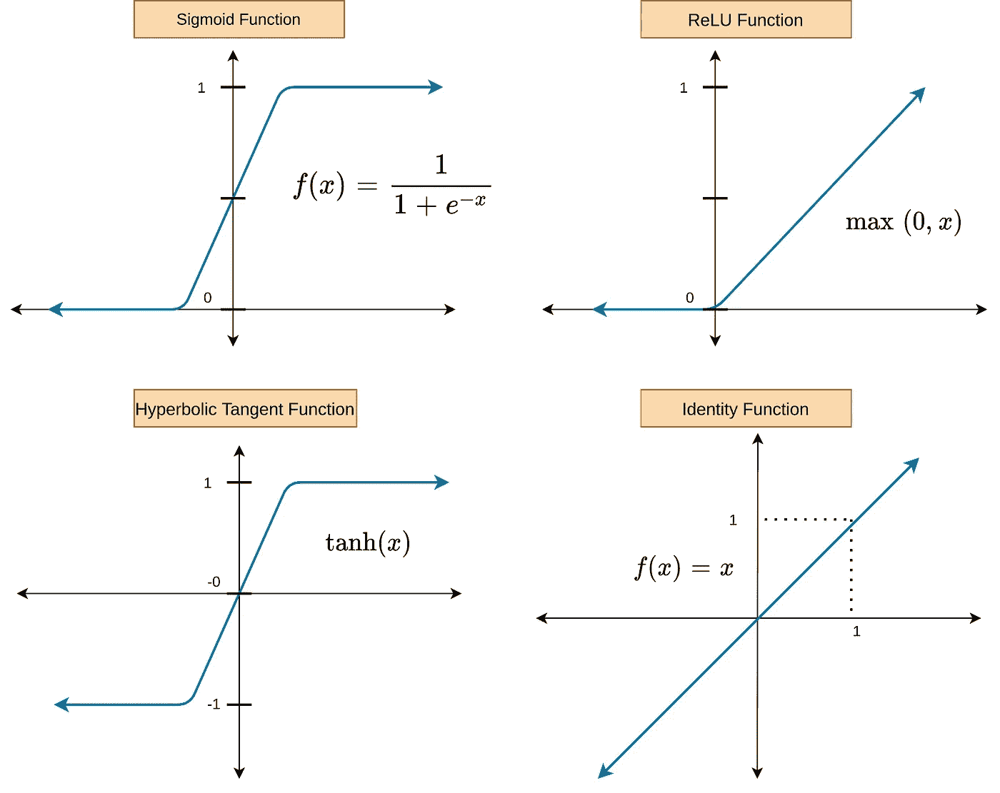

作者图片

我已经解释过什么时候我们应该使用 sigmoid 函数。如果你看上面的图，还有其他的激活功能。比如双曲正切函数，当我们需要-1 到 1 之间的输出时就可以使用。如果输出不应小于 0，可以使用 ReLU 函数，identify 函数将输出原样返回。这意味着在神经元中计算的值将作为其本身。根据将要预测的变量，应该选择这些函数中的一个。

## **训练网络示例案例**

好吧！我们可以用一个实例来设置整个网络。假设我们要训练一个网络，通过使用树的长度和宽度来预测树的年龄。这意味着我们将使用两个变量作为预测值，一个变量作为预测值。将用于培训的数据集如下所示。

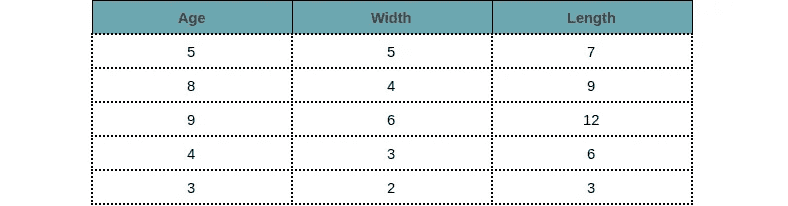

作者图片

正如我们之前提到的，神经网络通过迭代得到训练。因此，在每次迭代(步骤)中，它从数据集中提取样本，并在神经元中进行计算。只能进行一次观察或小批量观察。在本例中，我们将对一个步骤取一个样本(观察值),这将是我们数据集的第一个观察值。

我们还应该决定在网络中使用哪个激活功能。如前所述，这取决于你使用这个网络想要预测什么。如果我们查找我们的数据集，年龄，这是一个因变量，包括数值。所以，我们不会预测树的类型，我们会预测它们的年龄。这一推论使我们得出输出将是线性的激活函数。第一个选项是 ReLU，第二个选项是 Identity。因为，这些函数不会将值转换为 0 到 1 之间的值。它们之间的区别当 Identity 函数按原样返回输入值时，ReLU 函数如果输入为负则返回值 0，如果输入不为负则按原样返回值。但是，年龄不能是负数，所以使用 ReLU 函数是有意义的。但是我想让这个教程尽可能的简单。这就是为什么我要用身份函数作为激活。这种格式更容易理解。这听起来很奇怪，但使用身份功能意味着你不会使用任何激活功能。因此，在下面的图中我没有添加任何激活函数过程(因为，它原样返回计算值)。

下图显示了第一次迭代的神经网络和计算。可以看到，输入层有两个神经元，分别是“宽度”和“长度”。因为是第一次迭代，所以“宽度”和“长度”的值来自第一次观察，为 5 和 7。隐藏层也有 2 个神经元，输出层有 1 个神经元。如果你仔细观察，神经元之间的每个连接都有“w”权重值。正如我们之前提到的，权重可以在 0 和 1 之间随机选择。它可以超出此范围，但最好在第一步设置在 0 和 1 之间。在接下来的迭代中，它们无论如何都会被改变。这些随机分配给连接的权重值也显示在神经元上方。我们可以用这样的说法——这些权重用于每一个连接——有时，但它们存储在神经元中。在实践中，我们不为连接分配权重。这意味着每个神经元为来自矩阵结构中前一层的每个连接存储“w”值。实际上，我们也可以使用 ReLU 激活功能。因为，我们要预测树的年龄，年龄不能是负数。但我只想让这个例子尽可能简单。因此，我决定使用身份激活功能，下图中没有任何激活功能流程。因为单位函数对于在神经元中计算的值没有任何变换。它让它们保持原样。

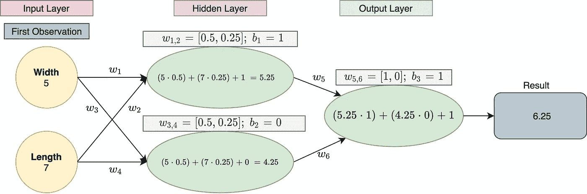

作者图片

在神经元中计算之后，发现 6.25 是第一次迭代的最终结果。从技术上来说，我们可以说这是根据给定的第一次观察的宽度和长度值的第一次预测的“年龄”值。下一步我们应该做的是将这个结果与实际年龄进行比较。第一次观察的树龄为 5 年。这意味着我们离实际值相差 1.5 岁，我们需要根据这个距离更新神经元的权重。这个过程被称为反向传播，我们将在下一节看到它。但在此之前，我想向你们展示一下，如果我们在这个人工神经网络中使用两个隐藏层，每个隐藏层中有两个神经元，会发生什么。因为你可能想知道在这种情况下我们如何计算。

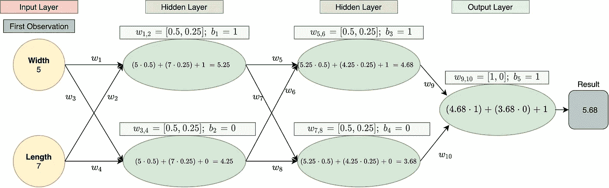

作者图片

在上图中，你可以看到在之前的网络中又增加了一层。所以我们的预测值果然变了 5.68。这只是一个例子，我们将在下面的章节中使用以前的网络结构。

# **将神经元升级到更高级别**

这一部分可能是本文最重要的部分。因为我会解释神经元的权重是如何改变的，以便做出好的预测。我将这一部分命名为“将神经元升级到更高水平”，因为在网络的每次迭代之后，我们都会改变神经元的权重值。因此，我们将它们升级到更高的水平，以做出更好的预测。

如前一节所述，在一次迭代完成后，需要通过考虑预测值和实际值之间的差异来更新神经元的权重和偏差(截距)。这个过程在人工神经网络中被称为反向传播，我们将使用的算法是随机梯度下降。在每次前馈(迭代)之后，反向传播也必须在训练期间完成。借助反向传播网络得到训练。下图显示了反向传播过程。

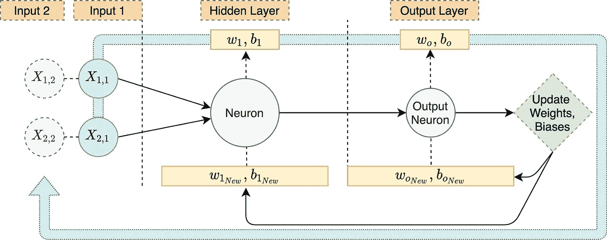

作者图片

为了更新权重和偏差，首先我们应该找出实际值和预测值之间的差异。有两个函数常用于计算实际值和预测值之间的差异。这些被称为均方误差和交叉熵。在某些情况下，也使用误差平方和。这些函数统称为**损失函数**或**成本函数**。虽然对于回归问题可以优选均方误差，但是对于分类问题可以优选交叉熵。在这个例子中，我们试图估计树龄，而不是树的类型。这就是为什么我们可以用均方差。

下图显示了均方误差的函数；

作者图片

现在，我们可以通过使用 MSE 来计算实际值和前面示例中预测值之间的差异。第一次观察的预测年龄为 6.25 岁，实际年龄为 5 岁。因为我们在一次迭代中只取一个样本，所以“n”将等于 1。

作者图片

根据上述数学运算，MSE 为 1.5625。我们可以用术语**损失**来表示这个值。此外，如果我们在每次迭代中取 32 个观测值，我们将不得不从 32 个观测值的预测值和实际值中计算 MSE。

好了，我们有了失败的结果，下一步是什么？现在，我们必须通过考虑权重和偏差对损失的影响，来找出如何改变权重和偏差。所以，我们需要一个能做到的方法。这种方法在数学上叫做**偏导数**。带有权重和偏差的损失函数 ***L*** (MSE)的偏导数可以提供权重和偏差如何影响损失的信息。所以，这就是我们要找的。我们需要做以下偏导数运算；

上图显示了每个权重和偏差的偏导数。当我们有偏导数时，我们应该把它乘以学习率。在那之后，我们应该从它的重量中减去结果。这里的学习率表示权重将如何变化。高学习率下的体重变化将比低学习率下的体重变化大得多。因此，我们需要为我们的网络设置最佳的学习速率。

现在是时候学习如何求偏导数了。这在数学上有点深奥，如果你对偏导数没有任何概念，你可以[看这个视频](https://youtu.be/AXqhWeUEtQU)。我们将对 W1 (dL/dW1)进行导数运算。为了找到这个偏导数，我们可以做一个转换，如下式所示。*代表 H1 神经元加权运算后的值，***y 预测*** 代表 ***O1*** 神经元的结果，w1 为*神经元中用于树宽的权值(输入层的第一个神经元)。**

****

**为了解决上述均衡，我们需要继续使用***y 预测******H1***和 ***L*** 损失的公式。然后我们可以得到所有的偏导数。如果我们看一下一阶偏导数 YPrediction 公式，我们可以看到它是 O1 神经元预测值的最终计算。**

****

**我们发现 H1 神经元的值的公式是:**

****

**我们需要的最后一个公式是损失函数 MSE (L)的公式。我们不应该忘记在每一步中我们只进行一次观察。所以，“n”的值将等于 1；**

**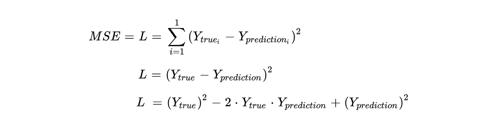**

**好吧！现在，我们可以走了。我们可以开始一个一个地求偏导数。我们可以从一阶偏导数“dL/dYPrediction”开始；**

**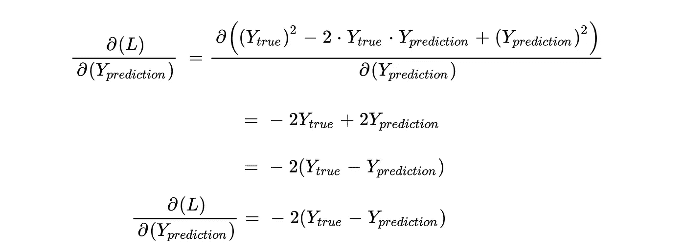**

**上图中已经进行了偏导数运算。这种操作背后的基本思想是发现损失如何受到*预测的影响。如前所述，你可以观看[这个视频](https://youtu.be/AXqhWeUEtQU)来了解这些操作。下一个偏导数是“dYpred/dH1”。通常，H1 是一个返回激活函数的值的函数。在这种情况下，在取偏导数时，我们应该对 H1 求导。但是，在这种情况下，我们使用了恒等函数，恒等函数的导数 f(x) = x 等于 1。因此，我们可以假设 H1 只是 YPrediction 的一个参数值。如果我们使用 Sigmoid 函数，我们应该对它求导(这是另一种情况)。***

******

***最后一个导数是“dH1/dw1”；***

******

***现在，我们有了所有的均衡来寻找损失对“W1”重量的偏导数。我们需要做的就是把这些碎片拼在一起。***

***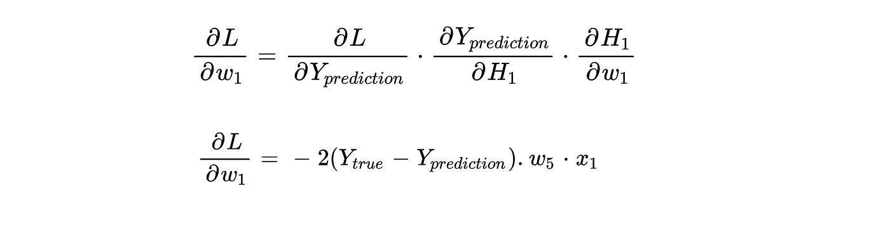***

***接下来我们应该做的是把 YTrue，YPrediction，w5 和 x1 的值放入上面的公式中；***

******

## *****随机梯度下降*****

***耶！我们知道 w1 值如何影响损耗。接下来，我们要做的是决定如何改变“W1”值，以使损失最小化。因此，我们将使用称为随机梯度下降(SGD)的算法。实际上，偏导数运算是我们在上一节中做过的梯度下降的一部分。我们基本上可以说，我们正在通过使用反向传播作为随机梯度计算技术来训练我们的网络。在 SGD 中，我们从数据中提取单个样本，将它们传递到网络中，找出我们将如何改变权重和截距，以最小化损失。这个过程在每次迭代中进行，直到我们达到最小阈值。这意味着如果我们不能在一段时间后得到任何超过阈值的损失，我们可以停止训练。为了理解它，我们可以看到下图；***

***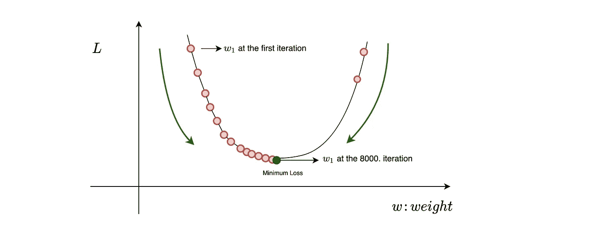***

***作者图片***

***在新币；在我们找到所有权重和截距的偏导数后，我们应该将它们乘以学习率，并从它们的旧权重和截距中减去。我们目前只找到了“w1”的偏导数。因此，我们可以进行以下操作，以找出新的更新“w1”值；***

***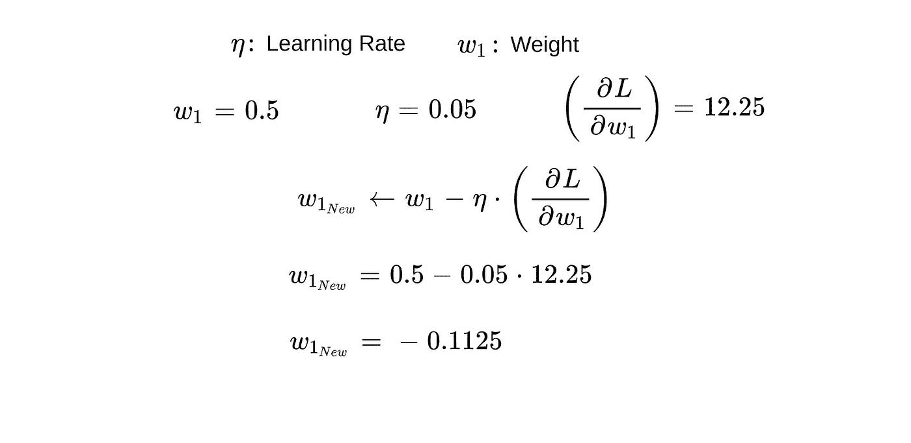***

***从上面的操作中可以看出，我们的新 W1 值为-0.1125。这意味着我们将用-0.1125 替换旧的“W1”值(位于 H1 神经元中)，并且我们将在下一次迭代中使用该值。到目前为止，我们只找到了新的 W1 值。我们还必须找到其他 W 值和截距的新值。在上图中，还有 W 和截距值的其他偏导数；***

***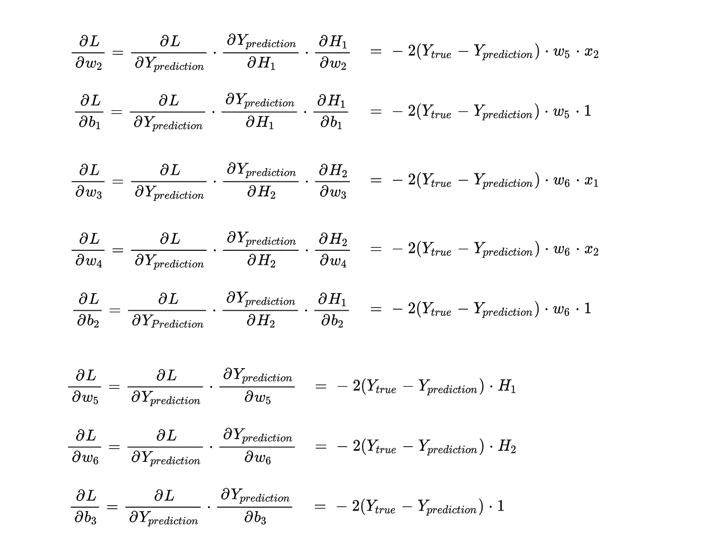***

***现在，我们可以计算新的权重，以便完成第一个反向传播过程；***

***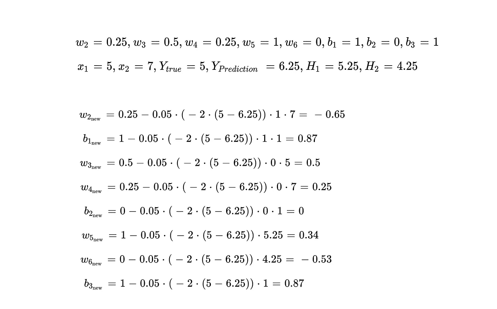***

***在第一次反向传播之后，我们有了所有新的“w”和“b”值。让我们看看我们的网络与新的价值观及其结果后，前馈步骤；***

***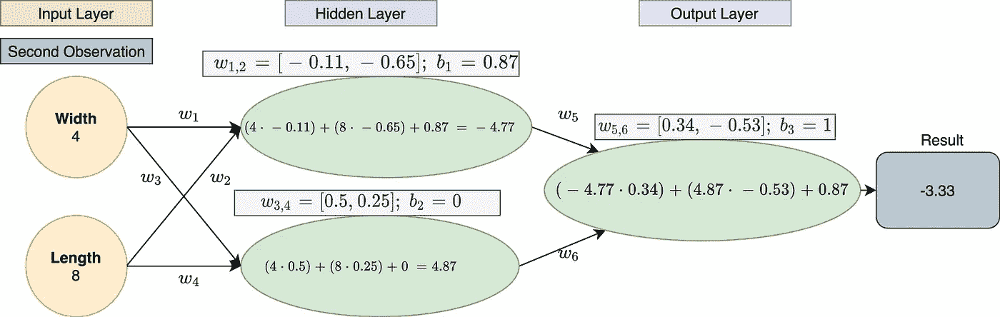***

***作者图片***

***从结果中可以看出，预测值为-3.33，为负值。我们需要担心吗？答案是 nop！我们刚刚用数据集的第一个样本完成了第一次迭代。我们的数据中有更多样本需要网络处理。此外，神经网络需要与其他样本进行更多的迭代才能得到训练。主要问题可能是:需要完成多少次迭代，或者我们的培训过程应该在什么时候停止？答案就藏在 SDG 的背后。***

## *****培训过程应该在什么时候停止？*****

***迭代的目的是达到损失最小减少的阈值。我们应该在网络的训练阶段之前定义这个阈值。假设我们将阈值定义为 0.05，最大迭代次数定义为 10000。这意味着我们计划在最大 10000 次迭代中减少 0.05。在第一次迭代中，损耗的降低会更高。但是过了一段时间，减少将开始改变不太多，并且当网络达到最小阈值时，训练将停止。***

***比如在 8909。迭代我们取样本并传递到网络中，发现损失为 0.3559，在 8910。迭代我们再举一个例子，发现损失 0.3315，在 89111。迭代我们取了另一个样本，发现损失为 0.35080。损失的平均减少在 0.0244 和 0.0026 之间。这些值小于我们的阈值 0.05。所以，我们可以停止训练。然而，我们也可以定义一个最小误差来停止我们网络的训练。网络保持训练以达到给定的最小误差，即损失(当然我们也定义了最大迭代次数)。***

***还有一个我们需要担心的问题。这是一个过拟合问题。当我们的 ML 模型在训练集上表现完美，而在新数据(测试数据)上表现不佳时，就会出现这个问题。这意味着我们的网络可以在数千次迭代后达到最小损失，但它在测试集上表现不佳，为了评估性能，我们将测试集排除在训练集之外。在这种情况下，我们可以从我们的数据中定义一个验证部分，并控制该部分的损失量。如果验证集的损失不断增加，而训练集的损失不断减少，我们也可以停止训练。我们可以从下图了解一下；***

***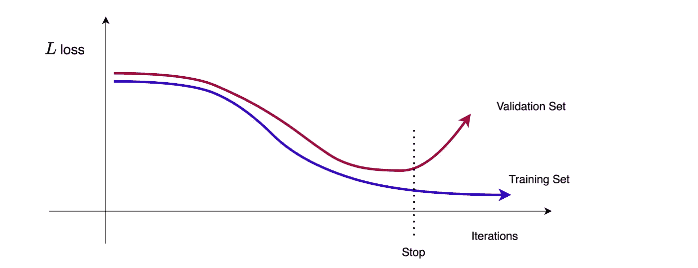***

***作者图片***

# *****结论*****

***在本文中，我们了解了神经网络模型的训练过程。当然，这只是一个具有基本网络结构的基本示例。本文的目的是学习神经网络背后的思想和数学。可以设置更复杂的网络结构。在编程语言的帮助下，数学运算可以在这些结构中轻松完成。但是它们也需要机器有更多的计算能力。如果你有编程语言的知识，你可以应用这些步骤，从头开始创建一个神经网络模型。***

***之后呢？在你完全理解了这篇文章中的操作之后，你可以更进一步。你可以检查其他反向传播和梯度下降方法，不同类型的神经网络，如 CNN，RNN，LSTM 等。为了解决不同的问题，已经开发了每一种其他的算法或方法。***

***我希望它是有帮助的，请不要犹豫问问题…***