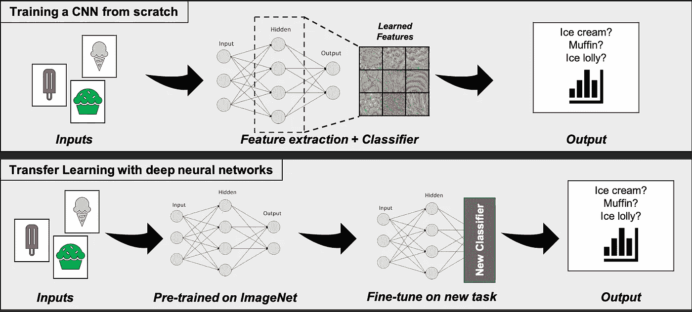

# 基于 PyTorch、Captum 和 ONNX 深度学习的鸟类图像分类

> 原文：<https://towardsdatascience.com/adventures-in-pytorch-image-classification-with-caltech-birds-200-part-1-the-dataset-6e5433e9897c?source=collection_archive---------18----------------------->

(图片由作者提供)

## PyTorch 历险记

## 第 0 部分:介绍图像分类、深度学习和加州理工学院鸟类 200 数据集

本系列将探索脸书人工智能研究所(FAIR)强大的神经网络和机器学习架构 PyTorch 的强大功能。在这一系列文章中，我们将探索 PyTorch 在图像分类问题中的应用能力，通过使用各种 CNN 架构，包括 GoogLeNet、ResNet152 和 ResNeXt101 等，使用 CalTech 200 birds 数据集识别 200 种北美鸟类。

加州理工学院加州大学圣迭戈分校鸟类 200 数据集([)韦林德 p、布兰森 s、塔米 t、华 c、施罗夫 f、贝隆吉 s、佩罗娜 p .“加州理工学院-加州大学圣迭戈分校鸟类 200”。加州理工学院。CNS-TR-2010–001。2010 年](http://www.vision.caltech.edu/visipedia/CUB-200.html)

# 介绍

在这组文章中，我将探讨我们如何使用脸书人工智能研究所的神经网络库 [PyTorch](https://pytorch.org/) 来解决一个多类的图像分类问题。这个广泛的库，带有一系列与发行版打包在一起的现有工具，从使用 *torch.nn* 模块(相当于 Keras 的 PyTorch)的高级抽象，到低级自动签名函数和基于 GPU 的高效操作，允许设计和快速实现最先进的机器学习架构。在最基本的层面上，PyTorch 可以被认为是众所周知的 python 数组包 Numpy 的一个高度优化的多维版本。

图 1:加州理工学院鸟类分类研讨会工作流程。本系列的每一篇文章都将关注这个工作流的一个单独的阶段。用于生成这些文章的笔记本，以及经过训练的模型可以在 [this Github repository](https://github.com/ecm200/caltech_birds) 中找到。(图片由作者提供)

将要进行的工作流程如图 1 所示，每篇文章都将关注该工作流程的一个特定方面，包括:

1.  数据探索和分类问题介绍。
2.  准备图像分类卷积神经网络(CNN)并在以下架构上训练:
    A) Torchvision 预训练网络。
    B)第三方预培训网络。
3.  使用传统方法(分类报告、度量、混淆矩阵、精确召回曲线等)评估分类模型性能。
4.  使用神经网络激活图的域缩减和流形技术(例如 t [-SNE](https://scikit-learn.org/stable/modules/generated/sklearn.manifold.TSNE.html#sklearn.manifold.TSNE) 和 [UMAP](https://umap-learn.readthedocs.io/en/latest/#) )评估网络分类性能。
5.  迁移学习，使用经过训练的神经网络作为特征提取器，作为其他分类算法(XGBoost，内核 SVM)的输入。
6.  [神经网络卷积滤波器的特性可视化](https://distill.pub/2017/feature-visualization/#:~:text=to%20force%20the%20feature%20to%20be%20displayed%20in%20different%20styles.&text=Diverse%20feature%20visualizations%20allow%20us,inputs%20will%20activate%20the%20neuron.)([神经元、空间和层激活](https://distill.pub/2018/building-blocks/))，使用 [Lucent python 包](https://github.com/greentfrapp/lucent) ( [Lucid](https://github.com/tensorflow/lucid) for PyTorch)。
7.  通过将 PyTorch 模型对象转换为 [ONNX(开放式神经网络交换)](http://www.onnx.ai)格式来部署训练模型，并使用 ONNX 运行时环境演示推理。

在这个系列的介绍中，我们将从机器学习的角度来回顾什么是分类，我们所说的图像分类是什么，特别是什么是使用深度学习技术的图像分类。接下来，我们将介绍鸟类分类的细粒度图像分类问题，并回顾我们稍后将用来演示这些技术的所选数据集。最后，我们将对过去几年中开发的最先进的卷积神经网络所获得的结果进行总结，在接下来的系列文章中，我们将揭示如何实现这些结果。

# 什么是预测模型，什么是分类？

图 2:机器学习算法适合两个一般领域，分类和回归。(图片由作者提供)

预测建模是利用历史数据开发一个模型，在我们没有答案的情况下对新数据进行预测的问题。预测建模可以被描述为从输入变量(X)到输出变量(y)逼近映射函数(f)的数学问题。这就是所谓的函数逼近问题。

建模算法的工作是在给定时间和可用资源的情况下找到最佳映射函数。

从根本上说，分类和回归的区别在于，一个旨在预测一个标签或类别，而另一个旨在预测一个数量。

图 2 清楚地说明了这两种方法之间的差异，其中分类模型根据给定数据点相对于类边界的位置来预测其类值，例如[支持向量机(SVM)分类器](https://scikit-learn.org/stable/modules/svm.html#svm)。然而，回归模型被设计成在给定一组预测因子(数据列)的情况下预测某事物的实际数量。

分类预测建模是从输入变量(X)到离散输出变量(y)近似映射函数(f)的任务。输出变量通常被称为标签或类别。映射函数预测给定观察值的类别或种类。例如，文本电子邮件可以被分类为属于两类之一:“垃圾邮件*”*和“*非垃圾邮件*”。

*   分类问题要求将示例分为两类或更多类中的一类。
*   分类可以有实值或离散输入变量。
*   有两类的问题通常被称为两类或二元分类问题。
*   具有两个以上类别的问题通常被称为多类别分类问题。
*   一个例子被分配多个类别的问题称为多标签分类问题。

分类模型通常将连续值预测为给定示例属于每个输出类的概率。概率可以解释为属于每个类别的给定示例的可能性或置信度。通过选择具有最高概率的类标签，可以将预测概率转换为类值。

在这些文章中，我们要关注的是分类，以及一个叫做图像分类的问题的特殊子集，我们将在下一节更详细地讨论这个问题。

# 什么是图像分类？

图 3:对象的图像分类，其中根据图像的内容对图像进行分类。(图片由作者提供)

图像分类是一般分类问题的一个子域。为图像分类设计的算法接受图像作为其输入，并产生图像类别的预测作为输出。输出可以采取标签或类别的形式，或者表示属于图像的每个潜在类别的可能性的一组实值概率的形式。图 3 中的漫画显示了一种算法，该算法设计用于识别食物图像是冰淇淋、冰棍还是蛋糕，将食物图像作为输入，并提供一个类别标签作为预测。

为了成功地对图像进行分类，一种算法需要从输入图像中提取代表性的“特征”，并学习相应的模式，以允许它根据图像的内容区分类别(图 4A)。这些“特征”可以通过迭代和交互的设计过程手动创建，目的是产生最好的分类特征。然而，这种手动方法有以下潜在的缺点:

1.  人力密集。
2.  容易出错。
3.  穷尽过程。
4.  无法保证能够最佳区分不同类别的独特特征。

图 4A:使用(上)具有手工制作特征的机器学习和(下)使用 CNN 在一个过程中自动导出理想化特征和分类器的深度学习的不同图像分类方法。(图片由作者提供)

另一种在过去 10 年中广泛发展并在图像分类性能方面取得显著进步的方法是深度学习的使用，特别是卷积神经网络(CNN)。这些类型的方法试图同时解决优化设计的特征提取和预测对象类别的分类器的问题。在其最简单的形式中，CNN 可以被认为是一个巨大的，自动导出(或学习)的特征提取系统，末端有一个分类器。

图 4B:从头开始培训的概念(上图)与迁移学习的概念(下图)。在迁移学习中，通过移除最终层分类器并将提取的特征输出用作新分类器的输入，预训练的网络被用作特征提取网络(新分类器不必基于神经网络)。(图片由作者提供)

事实上，正是这种结构允许采用所谓的“迁移学习”方法(图 4B)。这是移除网络基础上的分类层，并将网络用作特征提取器的过程。然后，该特征提取网络的输出可以被馈送到另一个分类器中，该分类器的选择可以是任何机器学习分类器(例如，SVM、核 SVM、基于决策树的集成，如 XGBoost)，以执行分类预测。在这种情况下，分类器的输入不是图像，而是从图像中提取的特征(有时称为激活)的集合，分类器通过这些特征学习识别和预测图像类别。

正是这些方法，我们将在下面的系列文章中展示如何使用 PyTorch 构建一个最先进的图像分类器。

# 数据集—加州理工学院 UCSD 200 鸟类数据库(CUB-200–2011)

图 5:来自 CUB-200–2011 的相似物种(莺)的例子，显示了鸟类物种识别的复杂性和困难性。即使有了图 6 所示的物种图，人类也很难预测具体的鸟类物种。

CUB-200–2011 数据集包含来自 200 个不同物种的北美鸟类图像。这是一个具有挑战性的问题，因为许多鸟类都有一定程度的视觉相似性。鸟类物种识别对人类来说是具有挑战性的，更不用说计算机视觉算法了，因此这种类型的问题通常被称为大规模细粒度的。例如，用图 6 中的物种图来识别图 5 中两种鸟的正确林莺物种，对人类来说仍然是一个非常困难和复杂的问题。

图 6:北美林莺物种示例图( [*凯特·多拉莫尔艺术*](https://shop.katedolamore.com/) *)* )。

图 7:CUB-200–2011 数据集属性(在 [*之后的*)计算&神经系统技术报告，CNS-TR-2011–001**](http://www.vision.caltech.edu/visipedia/papers/CUB_200_2011.pdf))。

该数据集最初产生于 2010 年( [CUB-200](http://www.vision.caltech.edu/visipedia/CUB-200.html) )，包含 200 类鸟类的约 6000 张图像。伴随它的是附加标签数据，包括边界框、粗略分割和附加属性。这在 2011 年进行了更新([CUB-200–2011](http://www.vision.caltech.edu/visipedia/CUB-200-2011.html))，增加了额外的图像，使数据集中的图像总数达到近 12，000 张。可用的属性也被更新为包括 15 个零件位置、312 个二进制属性和每个图像的边界框(图 7)。在本系列的大部分时间里，我们将简单地使用图像和类别标签来开发和训练预测鸟类类别的网络。

# 关于 CUB-200–2011 的部分已发布结果

W [*ah 等人(2010)*](http://www.vision.caltech.edu/visipedia/papers/CUB_200_2011.pdf) 报道了使用 RGB 颜色直方图和向量量化 SIFT 描述符的直方图与线性 SVM，他们获得了 17.3%的分类精度。这是作为与更高级的技术(包括深度学习方法)进行比较的基础而产生的，并且是使用手工制作的特征和机器学习来解决图像分类问题的方法的示例(如图 4 的上图所示)。

使用完整的未裁剪图像，他们实现了 10.3%的总体平均分类精度。在 2014 年， [*Goring 等人*](https://www.cv-foundation.org/openaccess/content_cvpr_2014/papers/Goring_Nonparametric_Part_Transfer_2014_CVPR_paper.pdf) 提出了一种基于非参数标签转移技术的细粒度识别方法，该方法从具有相似全局形状的对象中转移部分星座，实现了 57.8%的平均分类准确率。

图 8:CUB-200–2011 数据集上表现最好的模型，来自[*paperswithcode.com*](https://paperswithcode.com/sota/fine-grained-image-classification-on-cub-200)

最近对细粒度图像分类的研究主要基于卷积神经网络方法。这些方法取得了相当好的精度，平均分类精度接近 90%(图 8；来自 paperswithcode.com 的关于 CUB-200–2011 的[最佳性能算法的图表。例如，*崔等(2017)*](https://paperswithcode.com/sota/fine-grained-image-classification-on-cub-200)演示了使用现代神经网络架构，获得明显更准确的预测。他们方法成功的关键部分是深度学习网络的使用，结合高分辨率图像训练和处理细粒度问题的长尾分布方面。它们还决定性地显示了使用领域特定的预训练数据集来提高较小的细粒度分类问题(如鸟类物种识别)的准确性的优势。

# 现代工具有什么可能？

用最少的努力，我听到你说什么是真正可能的？
在这组文章中，我们的目标是展示如何相对简单地访问最先进的图像分类模型，并获得接近当前领先网络的性能。正如本讨论所示，这种在细粒度图像分类问题上的性能在过去几年才成为可能。

在深入研究如何设置、训练和部署 PyTorch CNN 进行图像分类的细节之前，让我们先来看看使用一种相对简单的方法可以获得的结果。在接下来的文章中，我将与您分享为训练这些模型而开发的底层 python 代码的更多细节，但在这里，我想分享我在数据集上训练的所有不同网络架构的最终结果。

图 9: PyTorch CNN 图像分类架构使用类宏平均度量的性能比较。在 ImageNet 上进行预训练，并使用 CUB-200–2011 进行进一步训练后，在 CUB-200–2011 数据集的测试集上进行评估。(图片由作者提供)

图 9 显示了许多不同模型架构的性能，所有卷积神经网络(CNN)用于图像分类，在 CUB-200–2011 上训练。这些模型包括最早成功开发更深层次网络的模型架构之一， **GoogLeNet** ，由 Szegedy 等人(2014)在论文“[用卷积深化](https://arxiv.org/abs/1409.4842)”中提出，以及最近的网络架构，包括 **ResNeXt** (谢等人 2017 之后的[)和 **PNAS 网**(刘等人 2018*之后的*](https://arxiv.org/abs/1611.05431)*[)](https://arxiv.org/abs/1712.00559)*

这个例子表明，即使在 3 到 4 年的发展空间内，这些网络的性能改进也是相当可观的。这里值得明确指出的是，这些模型之间的唯一区别是网络架构本身。训练和测试图像的选择以及图像增强过程和模型性能的评估对于所有相关的模型都是相同的。正是不同的网络架构使得最新的网络在分类性能方面取得了显著的进步。

请加入我即将发表的一系列文章，在这些文章中，我们将发现如何使用 python 和 PyTorch 来构建一个最先进的鸟类分类器，以产生如上所示的结果，以及了解它如何执行以及它如何做出决策的方法。

用来制作这组文章的代码和笔记本已经发布在 [**Github 上，也可以在这里**](https://github.com/ecm200/caltech_birds) 找到。这些数据可以通过 Github 页面上的链接获得。

# 参考资料:

1.  [塞格迪，C. *等*用回旋更深入。*arXiv:1409.4842【cs】*(2014)。](https://arxiv.org/abs/1409.4842)
2.  [谢，s .，Girshick，r .，Dollár，p .，Tu，Z. &何，k .深度神经网络的聚合残差变换。*arXiv:1611.05431【cs】*(2017)。](https://arxiv.org/abs/1611.05431)
3.  [刘，s，齐，l，秦，h，石，J. &贾，j .路径聚合网络实例分割。*arXiv:1803.01534【cs】*(2018)。](https://arxiv.org/abs/1803.01534)
4.  Goering，c .、Rodner，e .、Freytag，A. & Denzler，j .用于细粒度识别的非参数零件转移。在 *2014 年 IEEE 计算机视觉和模式识别会议*2489–2496(IEEE，2014)。doi:[10.1109/cvpr . 2014.319](https://doi.org/10.1109/CVPR.2014.319)。

# 背景阅读:

关于神经网络的背景参考材料，包括理论和实践，感兴趣的读者可以参考以下优秀资源。

**深度学习和神经网络实用指南:**

1.  Rosebrock，A. *用 Python 进行计算机视觉的深度学习*。第 1–3 卷(2017 年)。
2.  Chollet，F. *用 Python 进行深度学习*。(曼宁出版公司，2018 年)。

**神经网络和深度学习的背景理论:**

1.  神经网络和深度学习:一本教科书。(施普林格，2018)。
2.  模式识别和机器学习。(斯普林格，2006 年)。
3.  古德费勒，我，本吉奥，y 和库维尔，A. *深度学习*。(麻省理工学院出版社，2016)。
4.  哈根，M. T .，德穆特，H. B .，比厄，M. H. & De Jesus，O. *神经网络设计(第二版)*。(自我出版，2014)。

**通用机器学习背景理论与实践:**

1.  数据分类:算法和应用。(查普曼&霍尔/CRC，2015)。
2.  统计学习的要素。(施普林格，2017)。
3.  Kuhn，m .和 Johnson，K. *应用预测建模*。(纽约施普林格出版社，2013 年)。doi:[10.1007/978–1–4614–6849–3](https://doi.org/10.1007/978-1-4614-6849-3)。
4.  计算机时代的统计推断:算法、证据和数据科学。(剑桥大学出版社，2017)。
5.  统计学习导论:在 R 中的应用。(施普林格，2013 年)。