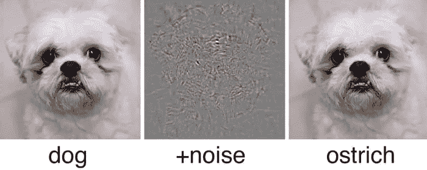
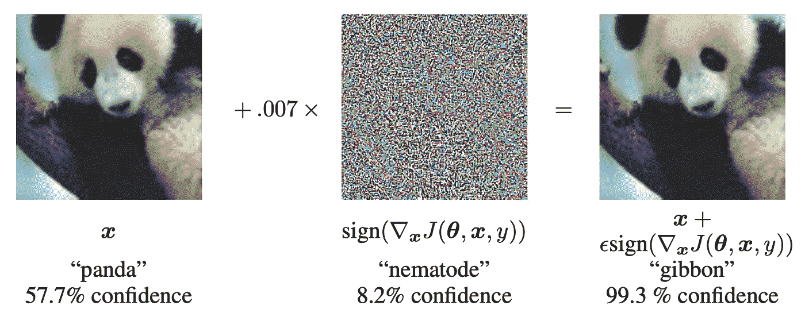
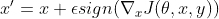
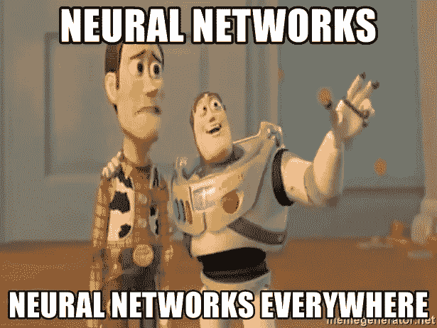

# PyTorch 中神经网络的对抗性攻击与防御

> 原文：<https://towardsdatascience.com/adversarial-attack-and-defense-on-neural-networks-in-pytorch-82b5bcd9171?source=collection_archive---------8----------------------->

## 神经网络真的能学习一切吗？



图片来源[这里](https://9gag.com/gag/a0K2zzZ)和[这里](https://arxiv.org/pdf/1312.6199.pdf)

深度学习和神经网络的兴起给现代社会带来了各种机会和应用，如对象检测和文本到语音转换。然而，尽管看起来准确度很高，但神经网络(以及几乎所有的机器学习模型)实际上可能会受到数据的影响，即敌对的例子，这些例子是从原始训练样本中非常轻微地操纵的。事实上，过去的研究表明，只要您知道更改数据的“正确”方法，您就可以迫使您的网络在数据上表现不佳，这些数据在人眼看来似乎没有什么不同！这些故意操纵数据以降低模型精度的行为被称为对抗性攻击，攻击和防御之战是机器学习领域正在进行的热门研究课题。

本文将概述一种最简单而有效的攻击——快速梯度签名方法攻击——及其在 PyTorch 中的实现和通过对抗训练进行防御。

*边注:本文假设了在 PyTorch 中构建简单神经网络和训练它们的先验知识。如果你不熟悉它们，建议先在 PyTorch 上查看教程。*

# 对抗性例子和攻击的历史

对立的例子可以被定义为为了欺骗机器学习网络而被扰乱的输入或数据。伊恩等人在 ICLR 2015 会议的论文“解释和利用对立的例子”中阐述了这一观点。虽然本文之前的出版物声称这些对立的例子是由机器模型的非线性和过拟合引起的，但 Ian 等人认为，由于架构的高度线性，神经网络实际上容易受到这些例子的影响。LSTMs 之类的模型和 ReLU 之类的激活函数仍然经常以非常线性的方式运行，因此这些模型很容易被线性扰动所欺骗。然后，他接着提供了一个简单快速的一步生成对立例子的方法:快速梯度符号法。

## **快速梯度符号法**



图一。FGSM 对熊猫图像的影响。在他们的 [2015 年 ICLR 论文](https://arxiv.org/pdf/1412.6572.pdf)

快速梯度符号方法(FGSM)是一种白盒攻击，这意味着攻击是基于给定的网络架构产生的。FGSM 基于这样的想法，即正常网络遵循梯度下降来寻找损耗的最低点，因此，如果我们遵循梯度的符号(沿着与梯度下降相反的方向)，我们可以通过添加少量扰动来最大化损耗。

因此，FGSM 可以描述为以下数学表达式:



其中 x’是通过添加小常数ε产生的扰动 x，其符号等于损耗 J 相对于 x 的梯度方向。图 1 是计算机视觉领域中 FGSM 攻击的经典图示。由于图像中不到 1%的变化是我们无法视觉识别的，图像从置信度一般的正确分类变成了置信度很高的错误分类。

这些简单的方法实际上可以欺骗深度神经网络的事实进一步证明了由于神经网络的线性而存在对立的例子。

# PyTorch 的 FGSM

要在 PyTorch 中构建 FGSM 攻击，我们可以使用由 Ian Goodfellow 和 Nicolas Papernot 提供并精心维护的 [CleverHans](https://github.com/tensorflow/cleverhans) 库。该库提供了多种攻击和防御，目前广泛用于基准测试。尽管大多数攻击是在 Tensorflow 中实现的，但他们最近也在 PyTorch 中发布了 FGSM 的代码。

可以使用以下命令下载并安装该库:

```
pip install git+https://github.com/tensorflow/cleverhans.git#egg=cleverhans
```

我们将使用简单的 MNIST 数据集来演示如何构建攻击。

## 创建模型和数据加载器

首先，我们必须为 MNIST 数据集创建一个普通的 PyTorch 模型和数据加载器。

为了进行演示，我们将构建一个简单的卷积网络，如下所示:

和数据加载器，如下所示:

之后，我们实现了一种正常的转发方法来根据正常数据训练网络:

通过将批量大小设置为 128，时期数设置为 4，学习率设置为 0.001，网络在训练后成功地在 MNIST 数据集上实现了大约 98%的准确率。

## **施加攻击**

在训练网络之后，我们可以在给定网络架构的情况下应用 FGSM 攻击。

为此，我们必须首先从 CleverHans 导入所需的函数:

```
from cleverhans.future.torch.attacks.fast_gradient_method import fast_gradient_method
```

这就允许我们调用 fast_gradient_method()函数，这个函数简单明了:给定模型、一个输入 x、一个ε和一个范数(norm=np.inf，1 或 2)，这个函数输出一个扰动的 x。

然后，我们可以通过输入扰动的 x 而不是原始的 x 来稍微改变原始的正向函数，以测量如下结果:

经过测试，上述攻击实际上可以迫使准确率从 98%急剧下降到 4%左右，这证明如果方向正确，小扰动实际上会导致网络性能非常差。

# PyTorch 的对抗训练

在 Ian 等人的同一篇论文中，他们提出了对抗训练方法来对抗这些样本。简而言之，从训练集中生成的敌对样本也包括在训练中。

通过将原始的和扰动的训练集同时输入到架构中，这个概念可以很容易地实现到代码中。请注意，这两种类型的数据都应该用于对抗性训练，以防止原始数据集的准确性损失。下面的代码是我对对抗性训练的实现:

请注意，网络从检查点开始，在那里它已经接受了干净数据的训练。在对抗训练期间，干净样本和对抗样本都被输入到网络中，以防止在进一步训练期间干净数据的准确度下降。

使用相同的批量大小、时期和学习率设置，我们实际上可以将对立示例的准确度提高到大约 90%,同时保持干净数据的准确度。

## 对抗性训练的问题

虽然上述示例说明了如何采用对抗性训练来概括模型架构，但一个主要问题是，它们仅在模型被训练的特定类型的攻击上有效。不同的攻击产生不同的对抗范例，对抗训练方法需要进一步研究和评估，以更好地进行对抗防御。

# 结论

FGSM 和对抗性训练是最早的攻击和防御之一。最近的攻击(如 C&W 攻击和 DeepFool)以及防御(如蒸馏)为未来的研究和调查提供了新的机会。这篇文章是对对抗性攻击领域的一个介绍，希望能激发您深入研究这个领域的兴趣！要了解更多，这里有另一篇[文章](https://bit.ly/3n3pNbU)，我认为这是一篇很好的短文，可以更好地理解快速梯度符号法。

我的实现的完整代码也发布在我的 Github 中:

[](https://github.com/ttchengab/FGSMAttack) [## ttchengab/FGSMAttack

### 在 GitHub 上创建一个帐户，为 ttchengab/FGSMAttack 开发做贡献。

github.com](https://github.com/ttchengab/FGSMAttack) 

*谢谢你能走到这一步*🙏！*我将在计算机视觉/深度学习的不同领域发表更多文章，请务必查看我的其他文章和* [*川林恩*](https://medium.com/@chuanenlin) *的文章！*