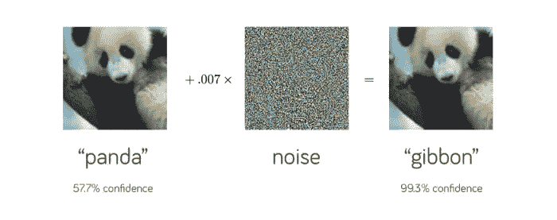
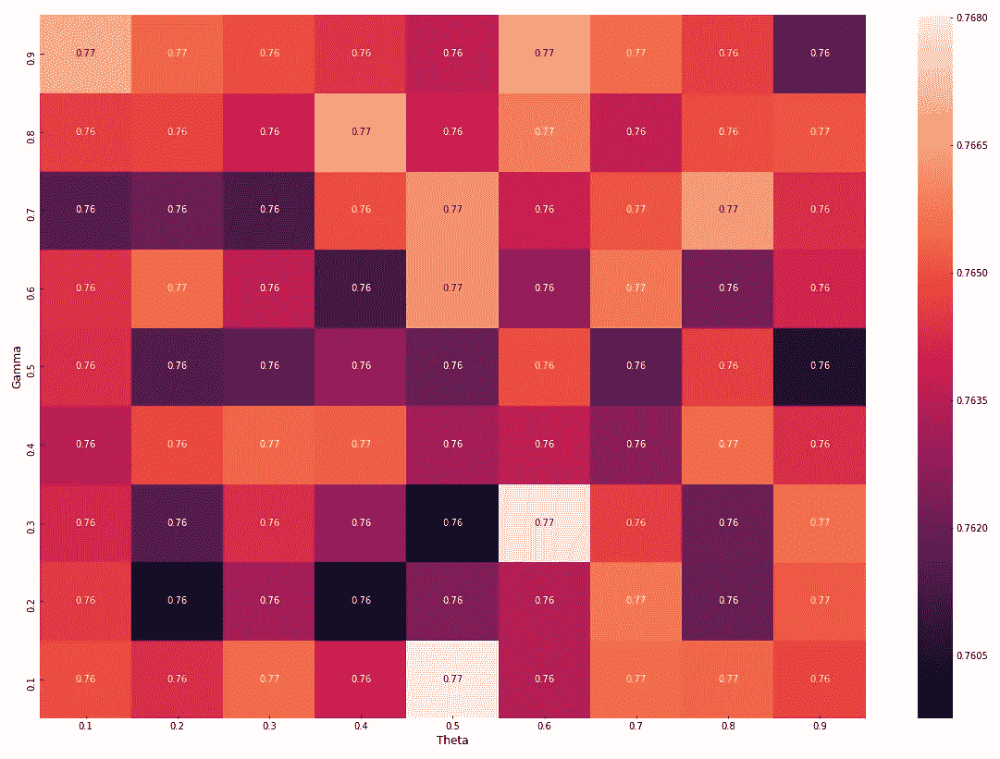

# 对垃圾短信检测器的对抗性攻击

> 原文：<https://towardsdatascience.com/adversarial-attacks-on-sms-spam-detectors-12b16f1e748e?source=collection_archive---------39----------------------->

## 使用基于雅可比的显著图攻击，探索如何使用对抗性学习来定位垃圾短信检测器

***注:*** *本文讨论的方法背后的方法论源于我和*[*Irene Anthi*](https://twitter.com/IreneAnthi)*之间的一个* [*合作出版物*](https://arxiv.org/pdf/2004.05005.pdf) *。*

# 介绍

垃圾短信经常出现在我们的手机屏幕上。这已经够烦人的了，但情况会变得更糟。给你发垃圾短信的人通常是想诈骗你。大多数垃圾短信不是来自另一部手机。它们通常来自计算机，并通过电子邮件地址或即时消息帐户发送到您的手机。

存在几种自动检测电子邮件或 sms 消息是否是垃圾邮件的安全机制。这些方法通常依赖于机器学习。然而，这种系统的引入也可能受到攻击。

向基于机器学习的系统部署攻击的行为被称为对抗性机器学习(AML)。其目的是利用预训练模型的弱点，该模型在训练期间看到的数据点之间可能有“盲点”。更具体地说，通过自动地将轻微的扰动引入到看不见的数据点，模型可以越过决策边界并将数据分类为不同的类别。因此，模型的有效性会大大降低。

在垃圾短信检测中，AML 可用于操纵文本数据，包括干扰，使垃圾数据被归类为非垃圾数据，从而绕过检测器。

# 数据集和数据预处理

[垃圾短信收集](https://www.kaggle.com/uciml/sms-spam-collection-dataset)是为垃圾短信研究收集的一组带短信标签的消息。它包含一组 5，574 条英语 SMS 文本消息，根据它们是垃圾邮件(425 条消息)还是非垃圾邮件(3，375 条消息)进行标记。

在我们深入应用任何类型的机器学习技术之前，让我们首先讨论一下我们需要考虑的预处理技术。我们将执行大多数自然语言处理(NLP)问题的标准预处理技术。其中包括:

*   将文本转换成小写。
*   去掉标点符号。
*   删除额外的空白。
*   删除数字。
*   删除“the”、“a”、“an”、“in”等停用词。
*   引理满足。
*   象征化。

Python 的[自然语言工具包(NLTK)](https://www.nltk.org/) 可以处理这些预处理需求。现在，输出应该如下所示:

# 单词嵌入

单词嵌入是最流行的文本词汇表示方法之一。它能够捕捉文档中某个单词的上下文、其与周围单词的语义和句法相似性以及其与其他单词的关系。

但是如何在上下文中捕捉单词嵌入呢？Word2Vec 是使用两层神经网络学习单词嵌入的最流行的技术之一。神经网络接收文本集，对其进行分析，并为词汇表中的每个单词生成一个数字向量，这些数字向量编码了与单词出现的上下文相关的单词含义的重要信息。

主要有两种模式:连续词袋模式和跳格模式。Word2Vec Skip-gram 模型是一个具有单个隐藏层的浅层神经网络，它接受一个单词作为输入，并试图预测该单词周围单词的上下文作为输出。

在这种情况下，我们将使用 Gensim 的 [Word2Vec](https://radimrehurek.com/gensim/models/word2vec.html) 来创建模型。一些重要的参数如下:

*   size:嵌入的维数。默认值为 100。
*   窗口:目标单词与周围单词之间的最大距离。默认窗口是 5。
*   min_count:训练模型时要考虑的最小字数。出现次数少于此计数的单词将被忽略。默认的最小计数是 5。
*   工人:培训时分区数量。默认工人是 3。
*   sg:训练算法，连续词包(0)或跳格(1)。默认的训练算法是连续单词包。

接下来，我们将看到如何使用 Word2Vec 模型为数据集中的文档生成向量。通过遍历数据集，为训练数据中的每个 SMS 消息生成 Word2Vec 向量。通过简单地对文本消息的每个单词使用该模型，我们检索这些单词的单词嵌入向量。然后，我们通过计算文本中所有单词向量的平均值来表示数据集中的消息。

# 模型训练和分类

让我们首先对目标标签 *spam* 和 *not_spam 进行编码。*这包括将分类值转换成数值。然后，我们将把特征分配给变量`X`，把目标标签分配给变量`y`。最后，我们将把预处理后的数据分成两个数据集。

*   **训练**数据集:用于训练短信文本分类模型。
*   **测试**数据集:用于验证模型的性能。

为了将数据分割成两个这样的数据集，我们将从模型选择功能中使用 [Scikit-learn 的训练测试分割方法。在这种情况下，我们将数据分为 70%的培训和 30%的测试。](https://scikit-learn.org/stable/modules/generated/sklearn.model_selection.train_test_split.html)

为了这篇文章，我们将使用一个`Decision Tree`分类器。实际上，您可能希望使用交叉验证来评估各种分类器，以确定哪一个性能最好。“没有免费的午餐”定理表明，不存在普遍最佳的学习算法。换句话说，选择一个合适的算法应该基于它对于特定问题的性能和表征该问题的数据的属性。

一旦模型被训练，当它试图预测测试集的目标标签时，我们可以评估它的性能。分类报告显示，该模型可以预测具有 0.94 的高加权平均 F1 得分的测试样本。

# 生成对立样本

AML 的一个众所周知的使用案例是在图像分类中。这包括添加人眼可能察觉不到的噪声，这也欺骗了分类器。

[图像分类中的对抗性机器学习](https://arxiv.org/abs/1412.6572)

有各种方法可以产生对立的样本。这些方法在复杂性、生成速度和性能方面各不相同。制作这种样本的简单方法是手动扰动输入数据点。然而，与自动方法相比，人工扰动的产生和评估较慢。

自动生成扰动样本的最流行的技术之一包括基于雅可比的显著图攻击(JSMA)。这些方法依赖于这样一种方法论，即当对原始样本添加小的扰动时，所得到的样本会表现出相反的特征，因为所得到的样本现在被目标模型不同地分类。

JSMA 方法使用显著图生成扰动。显著图标识输入数据的哪些特征与模型决定是一个类别还是另一个类别最相关；这些特征如果被改变，很可能会影响目标值的分类。更具体地，选择初始百分比的特征(γ)以被(θ)量的噪声干扰。然后，该模型确定添加的噪声是否已经导致目标模型的错误分类。如果噪声没有影响模型的性能，则选择另一组特征，并进行新的迭代，直到显著图出现，该显著图可用于生成敌对样本。

预训练的 MLP 被用作生成敌对样本的基础模型。这里，我们探讨 JSMA 参数的不同组合如何影响最初训练的决策树的性能。

# 估价

为了探索 JSMA 参数的不同组合如何影响训练好的决策树的性能，通过使用伽马和西塔的一系列组合，从测试数据中存在的所有垃圾邮件数据点生成敌对样本。然后，对抗性样本与非垃圾邮件测试数据点相结合，并呈现给训练好的模型。热图报告了 JSMA 的 gamma 和 theta 参数的所有敌对组合的总体加权平均 F1 分数。

决策树模型的分类性能实现了所有γ和θ参数的 F1 分数的降低。当γ= 0.3，θ= 0.5 时，模型的分类性能下降了 18 个百分点(F1-score = 0.759)。在这种情况下，基于该数据集，γ= 0.3，θ= 0.5 将是人们用来成功降低基于机器学习的 SMS 垃圾邮件检测器的准确性的最佳参数。

# 结论

那么，我从这个分析中学到了什么？

由于其有效性和灵活性，基于机器学习的检测器现在被认为是检测 SMS 文本消息是否是垃圾邮件的基本工具。然而，这种系统容易受到攻击，可能会严重破坏或误导它们的能力。在这种基础设施中，对抗性攻击可能会产生严重后果，因为 SMS 文本可能会被修改以绕过检测器。

下一步将是探索这些样本如何支持使用对抗训练的监督模型的鲁棒性。这需要将对立样本包括到训练数据集中，重新训练模型，并评估其在 JSMA 的伽马和θ参数的所有对立组合上的性能。

完整的笔记本，查看下面我的 GitHub 回购:[https://GitHub . com/lowri Williams/SMS _ Adversarial _ Machine _ Learning](https://github.com/LowriWilliams/SMS_Adversarial_Machine_Learning)