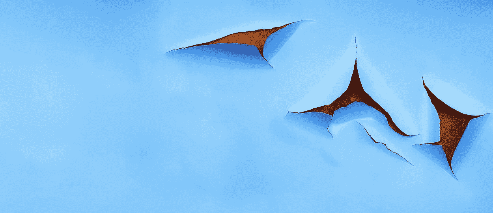
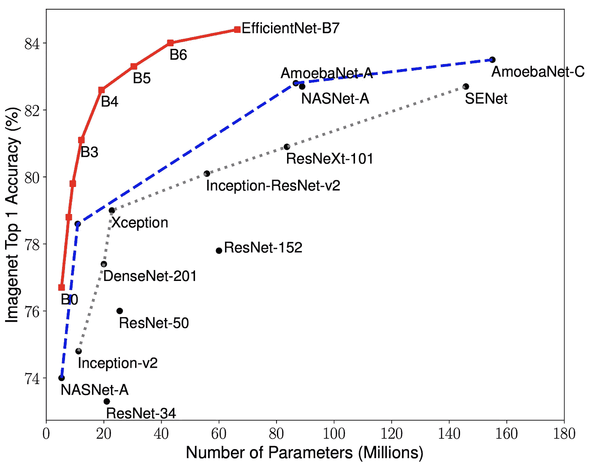
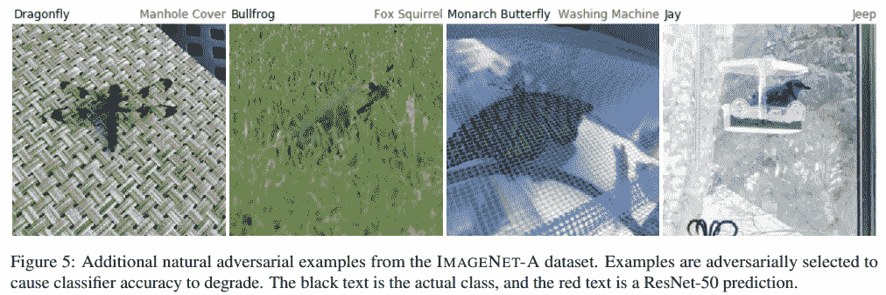
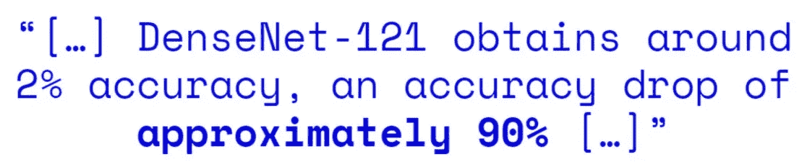
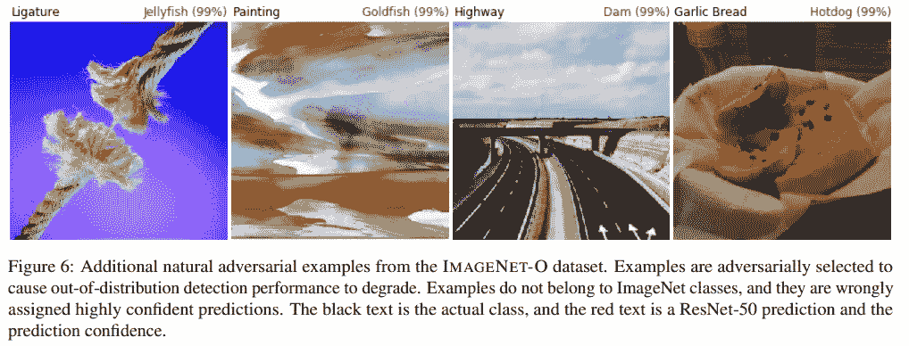
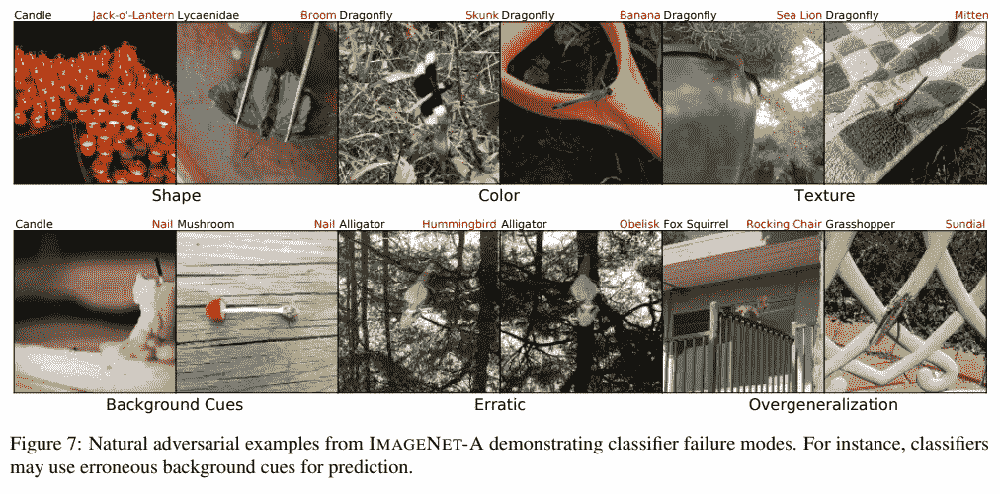
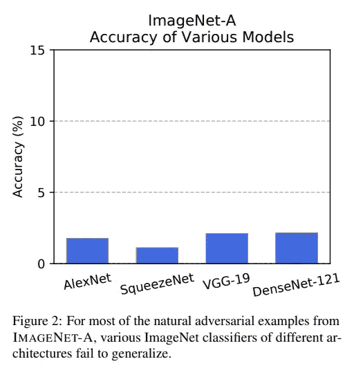
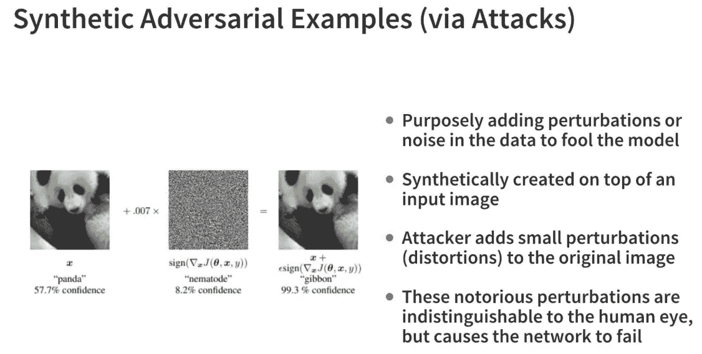
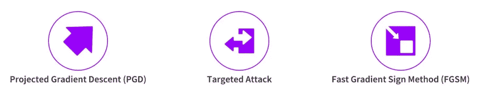

# 深度学习中的对立例子——初级读本

> 原文：<https://towardsdatascience.com/adversarial-examples-in-deep-learning-a-primer-feae6153d89?source=collection_archive---------22----------------------->

## 在深度学习视觉模型中引入对立的例子

来源: [Pixabay](https://pixabay.com/photos/structure-blue-rust-texture-3215624)

# 介绍

自从我们开始获得更大更好的计算(GPU 和 TPU)、更多的数据(ImageNet 等)以来，我们已经看到了最先进的(SOTA)计算机视觉深度学习模型的出现。)以及易于使用的开源软件和工具(TensorFlow 和 PyTorch)。每年(现在每隔几个月！)我们看到下一个 SOTA 深度学习模型在基准数据集的 Top-k 准确性方面击败了上一个模型。下图描绘了一些最新的 SOTA 深度学习视觉模型(并没有描绘一些像谷歌的 BigTransfer！).

https://arxiv.org/abs/1905.11946 SOTA 深度学习视觉模型(来源:)

然而，当这些 SOTA 深度学习模型试图对一类特定的图像(称为敌对图像)进行预测时，它们中的大多数都陷入困境。对立例子的整体概念可以是自然例子，也可以是合成例子。我们将通过本文中的几个例子来熟悉不同的对抗性例子和攻击。

# 对立的例子

自然对立的例子是模型难以理解的自然的、有机的图像。一个合成的对抗性示例是，攻击者(恶意用户)故意将一些噪声注入到图像中，该图像在视觉上与原始图像非常相似，但该模型最终做出了非常不同(并且错误)的预测。让我们更详细地看看其中的几个！

# 自然对立的例子

这些例子，如论文 [*【亨德里克斯等人的自然对抗例子】*](https://arxiv.org/abs/1907.07174) 中所定义的，是*现实世界中的、未修改的、自然发生的例子，导致分类器精度显著降低*。他们引入了两个新的自然对立例子的数据集。第一个数据集包含 7，500 个 ImageNet 分类器的自然对立示例，用作硬 ImageNet 分类器测试集，称为 IMAGENET-A。下图显示了 ImageNet-A 数据集中的一些对立示例。

ResNet-50 在 ImageNet-A 的例子上失败得很惨(来源:[https://arxiv.org/abs/1907.07174)](https://arxiv.org/abs/1907.07174))

你可以清楚地看到多么错误(和愚蠢！)是最新型(SOTA) ResNet-50 模型对上述示例的预测。事实上，DenseNet-121 预训练模型在 ImageNet-A 上仅获得 2%的准确度！

来源:[https://github . com/dipanjanS/adversarial-learning-robustness](https://github.com/dipanjanS/adversarial-learning-robustness)

作者还策划了一个名为 IMAGENET-O 的对抗性分布外检测数据集，他们声称这是第一个为 IMAGENET 模型创建的分布外检测数据集。下图显示了对 ImageNet-O 数据集中的图像进行 ResNet-50 推理的一些有趣示例。

ResNet-50 在 ImageNet-O 的例子上非常失败(来源:【https://arxiv.org/abs/1907.07174】T2)

这些例子确实很有趣，并展示了 SOTA 预训练视觉模型在这些图像中的一些图像上的局限性，这些图像对于这些模型来说解释起来更复杂。失败的一些原因可以归因于深度学习模型在对特定图像进行预测时试图关注的内容。让我们看更多的例子来理解这一点。

ImageNet-A 中的自然对抗性例子(来源:【https://arxiv.org/abs/1907.07174】T4)

根据上图中展示的例子，很明显，深度学习视觉模型做出了一些特定的模式错误解释。例如:

*   蜡烛被预测为南瓜灯，尽管没有南瓜，因为模型更关注火焰及其照明等方面
*   由于模型更注重颜色和纹理，蜻蜓被预测为臭鼬或香蕉
*   蘑菇被归类为钉子，因为模型学会了将某些元素联系在一起，例如木钉
*   模型最终也会遭遇泛化问题，比如日晷的阴影

如下图所示，SOTA 深度学习视觉模型在这些示例中的整体性能非常差。

SOTA 深度学习视觉模型在 ImageNet-A 上的表现(来源:[https://arxiv.org/abs/1907.07174)](https://arxiv.org/abs/1907.07174))

可悲的是，强大的对抗训练方法几乎无助于处理与错误解释自然对抗示例相关的问题，如 Hendrycks 等人在同一篇论文中提到的。其中一些方法包括针对特定合成攻击的训练，如投影梯度下降(PGD)和快速梯度符号方法(FGSM)，我们将在后续文章中更详细地讨论。幸运的是，这些方法对于处理恶意合成攻击非常有效，而恶意合成攻击通常是一个更大的问题。

# 合成对立例子

这些例子基本上涉及在输入图像中人工引入一些噪声，使得它在视觉上仍然保持与原始图像非常相似，但是注入的噪声最终降低了分类器的精度。虽然有各种各样的合成对抗性攻击，但所有这些攻击都遵循一些核心原则，如下图所示。

来源:[https://github . com/dipanjanS/adversarial-learning-robustness](https://github.com/dipanjanS/adversarial-learning-robustness)

重点始终是找出一种方法来完善噪声\扰动张量(值的矩阵)，它可以叠加在原始图像的顶部，使得这些扰动对人眼不可见，但最终使深度学习模型无法做出正确的预测。上面描述的示例展示了一种快速梯度符号方法(FGSM)攻击，其中我们在输入图像的梯度符号中添加了一个小乘数，并叠加了一幅熊猫图像，使模型无法预测图像是一只长臂猿。下图展示了一些更常见的对抗性攻击类型。

来源:[https://github . com/dipanjanS/adversarial-learning-robustness](https://github.com/dipanjanS/adversarial-learning-robustness)

# 下一步是什么？

在接下来的几篇文章中，我们将讨论上述每一种对抗性攻击方法，并通过实际操作的代码示例展示如何欺骗最新和最好的 SOTA 视觉模型。敬请期待！

这篇文章的内容改编自 [*我最近的博客文章*](https://blog.djsarkar.ai/adversarial-learning-attacks-1) 关于由[本人](https://www.linkedin.com/in/dipanzan/)和 [Sayak](https://in.linkedin.com/in/sayak-paul) 完成的对抗性学习，你可以在[这个 GitHub 库](https://github.com/dipanjanS/adversarial-learning-robustness)中找到详细的例子。

> 喜欢这篇文章吗？请[联系我](https://www.linkedin.com/in/dipanzan/)进行更多讨论或提供反馈！

 [## Dipanjan Sarkar -数据科学领导-应用材料| LinkedIn

### 我是一名数据科学家，领导多个垂直领域的 ML\DL\CV\NLP 工作。*专注机器学习，深度…

www.linkedin.com](https://www.linkedin.com/in/dipanzan/)