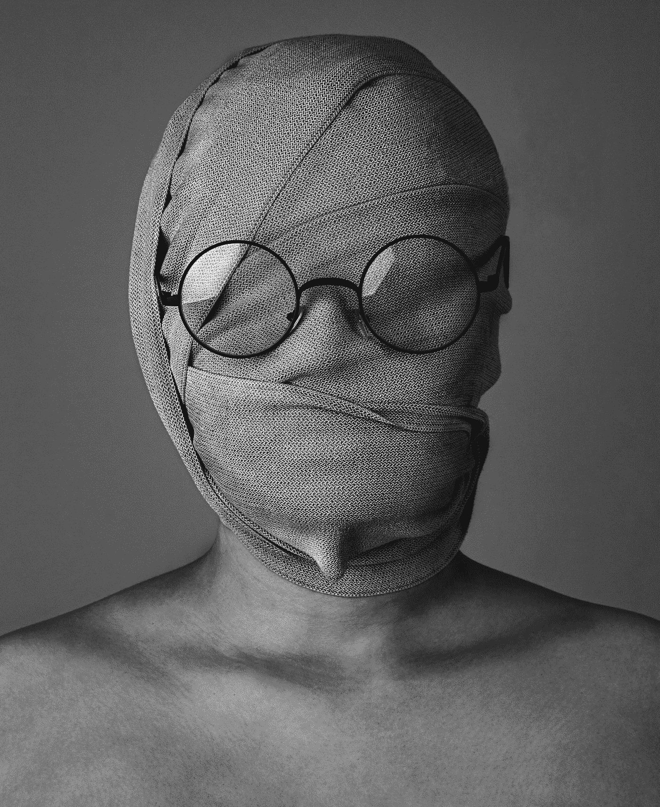
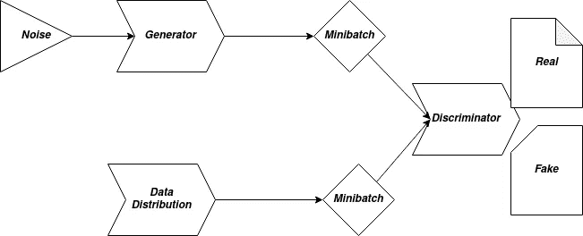
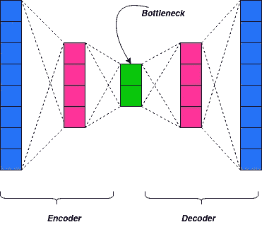
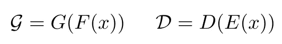
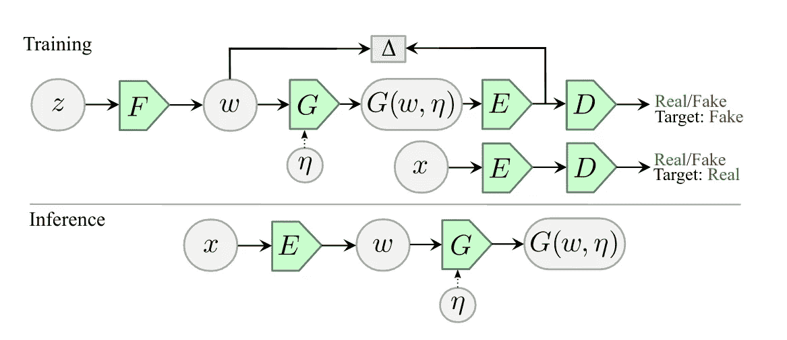
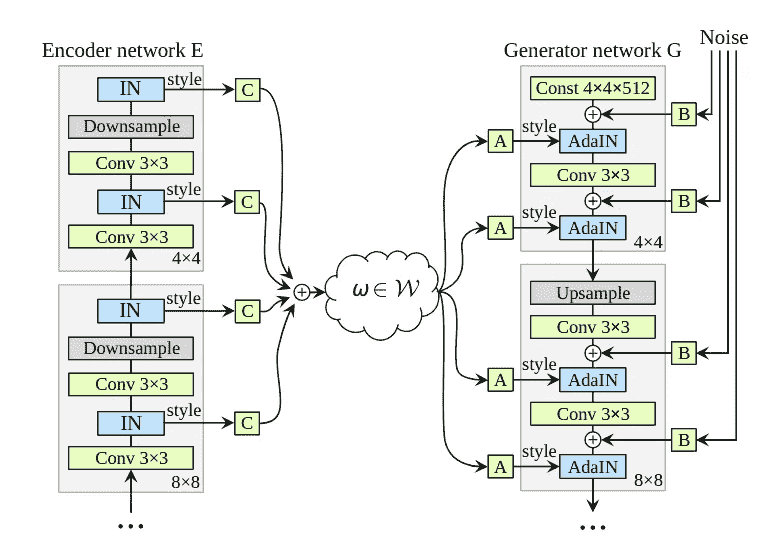
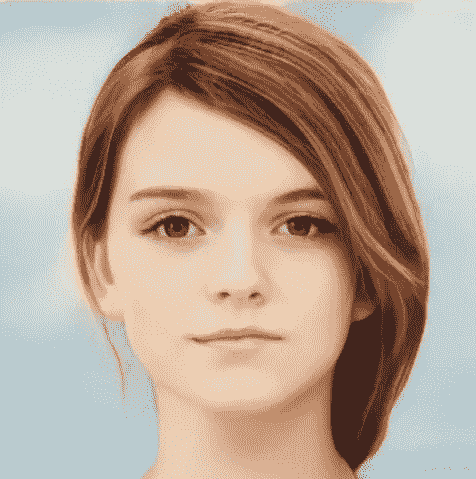

# 敌对的潜在自动编码器

> 原文：<https://towardsdatascience.com/adversarial-latent-autoencoders-4ce12c0abbdd?source=collection_archive---------42----------------------->

## Python-PyTorch

## 仅仅通过代码就能生成人脸和表情

比安卡·伯格在 [Unsplash](https://unsplash.com?utm_source=medium&utm_medium=referral) 上拍摄的照片

几年前，人脸识别模型风靡互联网。人们完全被计算机如何识别一张脸，甚至在某些情况下可以预测年龄而震惊了！人脸识别很快渗透到大众技术中——以至于今天几乎所有的智能手机都有人脸识别功能。人脸识别软件或安全系统的价格昂贵的时代已经一去不复返了！

然而，自从面部检测系统出现以来，技术以前所未有的速度发展。今天的神经网络不仅可以识别或检测人脸，还可以生成人脸——*你我无法从真实人脸中辨别的人脸！*想试试吗？检查一下这个😉。

随着生成对抗网络的出现，人脸生成已经成为计算机视觉领域的一个重要研究领域。在这篇文章中，我将阐述一种特殊类型的自动编码器，它有助于比以往任何时候都更好地生成人脸。)对抗性潜在自动编码器(ALAE)——其 [*预印本*](https://arxiv.org/abs/2004.04467) 已于 2020 年 4 月 9 日在[*Arxiv*](https://arxiv.org/)*公开。*

*为了理解敌对潜在自动编码器(ALAE)背后的概念，让我们先来看看它的灵感模型——生成敌对网络和自动编码器。*

## *生成对抗网络*

*生成性对抗网络是一个双重网络，这两个部分是鉴别器网络和生成器网络。甘氏综合症的有趣之处在于，发生器和鉴别器网络不断地相互竞争，从而迫使对方发挥出自己最好的一面。*

**

*GAN 架构—带 SGD*

*生成器的任务是*创建鉴别器无法从真实数据中鉴别的数据*。换句话说，生成器试图形成对*真实数据分布*的估计。理想的生成器应该能够计算出真实的数据分布，从而能够生成无限的数据。与此同时，鉴别器网络只是一个分类器网络——它试图将传递给它的数据分类为真或假。*

## *自动编码器*

*自动编码器在结构上由编码器、解码器和瓶颈组成。这是一种无监督学习算法，它试图学习恒等函数，并给出尽可能接近输入的输出。*

**

*自动编码器架构*

*更多关于自动编码器的信息请点击。如果你想在评论中发表一篇关于自动编码器的文章，请告诉我！*

*既然我们已经有了自动编码器和生成对立网络的基本概念，让我们从对立的潜在自动编码器开始。*

# *翅*

*ALAE 引入了一种通用的自动编码器架构，在学习更少纠缠的表示时，具有与 GANs 相当的生成能力。为了更好地理解 ALAEs 如何获得这两个世界的优点，让我们来看看模型架构。*

## *体系结构*

*研究工作通过修改原始 GAN 范式引入了一种新的架构。所提出的架构将发生器和鉴别器定义为两个功能的组合*

**

*发生器和鉴别器功能—[从左到右]*

*在定义发生器和鉴别器网络时，已经做了许多重要的假设*

1.  *假设 F 和 G 之间以及 E 和 D 之间的界面处的潜在空间是相同的，用 *W* 表示。*
2.  *假设 f 是确定性映射，而 G 和 E 是随机映射。*
3.  *还假设 G 可选地依赖于具有已知固定分布的独立噪声输入η。这有助于创建一个更通用的随机生成器。*

*一般来说，定义自动编码器的常见做法是为潜在空间设置期望的目标潜在分布——编码器被训练来匹配的分布。另一方面，ALAE 不强加潜在分布来匹配特定的目标分布。潜在分布中的唯一约束是 E 的输出分布必须与 g 的输入分布相同。抓住这一约束，学习过程决定什么对模型最好。*

*让我们来看看这个建筑的图片——*

**

*https://arxiv.org/abs/2004.04467[ALAE 建筑事务所](https://arxiv.org/abs/2004.04467)*

*这是一般的 ALAE 架构。你可能想知道为什么架构是抽象的——为什么它不是用卷积层和激活之类的东西构建的。那是因为这只是 ALAE 架构的一般概念。我们在这里没有定义完整的架构。完整的架构取决于我们在哪里使用 ALAE 作为自动编码器。*

# *花柱翼*

*StyleALAE 使用基于 [*StyleGAN*](https://arxiv.org/abs/1812.04948) 的生成器以及对抗的潜在自动编码器。这个架构可以表达为—*

**

*StyleALAE 建筑—【https://arxiv.org/abs/2004.04467 *

*发生器是从 StyleGAN 架构改编的网络，而编码器是从 ALAE 改编的架构。编码器被设计成与发生器网络对称，以便从图像中捕获风格信息。添加实例标准化层以获得每个通道的平均值和标准偏差，有效地从每个级别中提取样式表示。*

*StyleALAE 在 ALAE 和 StyleGAN 的帮助下，利用人工智能提高了人脸和表情生成的标准。StyleALAE 模型的官方实现可以在这里 找到 [*。*](https://github.com/podgorskiy/ALAE)*

*让我们来看看这个模型能够实现什么——*

**

*StyleALAE 生成的图像—[https://github.com/podgorskiy/ALAE](https://github.com/podgorskiy/ALAE)*

**是的，这是生成的图像！抓到你了，不是吗？😉**

*从 arxiv 的 [*预印本*](https://arxiv.org/abs/2004.04467) 中了解更多关于 ALAE 的信息，并确保也能很好地阅读 StyleGAN 网络。如果你在什么地方卡住了，请告诉我！—乐意帮忙😄。*

*查看我的博客以获得更快的更新，不要忘记订阅:D 优质内容*

* [## 卷积博客

### 克罗伊斯，吕底亚(小亚细亚)的国王，曾经问特尔斐的神谕，他是否应该对波斯开战…

www.theconvolvedblog.vision](https://www.theconvolvedblog.vision) 

*Hmrishav Bandyopadhyay 是印度 Jadavpur 大学电子与电信系的二年级本科生。他的兴趣在于深度学习、计算机视觉和图像处理。他的联系方式是:hmrishavbandyopadhyay@gmail.com | |*[*https://hmrishavbandy . github . io*](https://hmrishavbandy.github.io)*