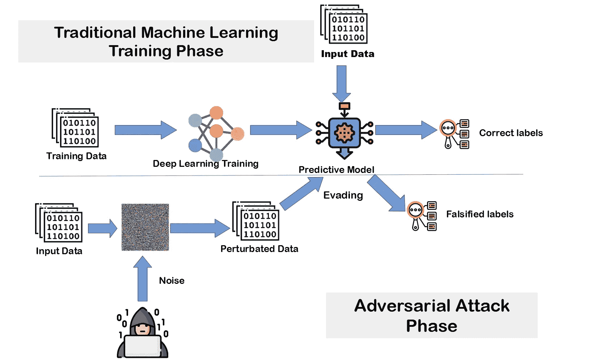
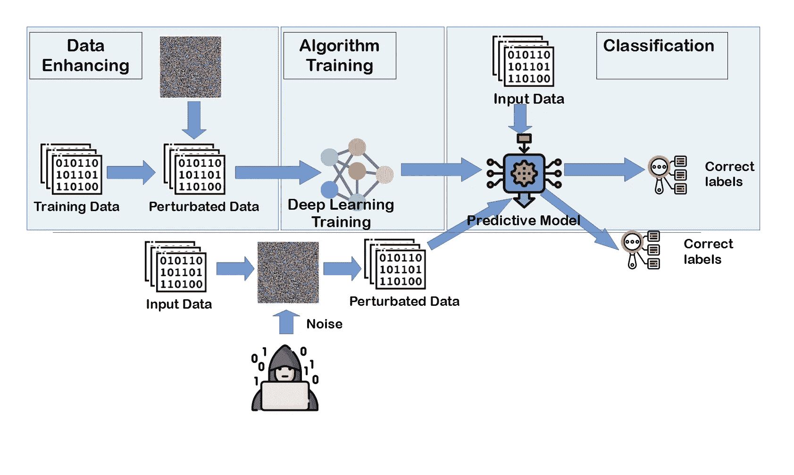

# 对抗性机器学习缓解:对抗性学习

> 原文：<https://towardsdatascience.com/adversarial-machine-learning-mitigation-adversarial-learning-9ae04133c137?source=collection_archive---------30----------------------->

## 一种保护机器学习模型免受恶意攻击的简单方法

文献中有几种针对深度学习模型的攻击，包括**快速梯度符号法**(FGSM)**(BIM)或**动量迭代法** (MIM)攻击。这些攻击是攻击者用来躲避分类模型的最纯粹的基于梯度的躲避技术。**

## **引用代码**

**如果您认为这些结果有用，请引用本文:**

```
@PROCEEDINGS{catak-adv-ml-2020,
    title = {Deep Neural Network based Malicious Network Activity Detection Under Adversarial Machine Learning Attacks},
    booktitle = {Proc.\ 3rd International Conference on Intelligent Technologies and Applications (INTAP 2020)},
    volume = 5805,
    series = {LNCS},author  = {Ferhat Ozgur Catak},
    publisher = {Springer},
    year = {2020}
    }
```

## **介绍**

**在这项工作中，我将提出一种新的方法来保护恶意活动检测模型免受几种敌对的机器学习攻击。因此，我们探索了应用对抗性训练来建立一个对抗 FGSM 攻击的健壮模型的能力。相应地，(1)用对立的例子增强数据集；(2)使用 KDDCUP99 数据集训练基于深度神经网络的检测模型，以学习基于 FGSM 的攻击模式。我们将这个训练模型应用于基准网络安全数据集。**

**对抗性机器学习被用来描述对机器学习模型的攻击，它试图通过恶意输入实例误导模型。图中显示了典型的对抗性机器学习攻击。**

****

**典型的机器学习模型基本上包括两个阶段，即训练时间和决策时间。因此，对抗性机器学习攻击发生在训练时间或决策时间。根据攻击的时间，黑客用于对抗性机器学习的技术可以分为两种:**

*   ****数据中毒**:攻击者改变训练输入实例的一些标签，误导输出模型。**
*   ****模型中毒**:黑客在模型创建后，利用一些被扰动的实例驱动模型产生虚假标签。**

**我们的模型能够应对黑客使用对抗性机器学习方法进行的模型攻击。该图说明了用于保护模型和正确分类的系统架构。**

****

## **让我们编码吧**

**我们导入通常的标准库加上一个 cleverhans 库，对深度学习模型进行对抗性攻击。**

```
from sklearn.datasets import fetch_kddcup99
from sklearn.model_selection import train_test_split
from sklearn.metrics import confusion_matrix
from sklearn import preprocessing
import tensorflow as tf
import pandas as pd
import numpy as np
from keras.utils import np_utils
from cleverhans.future.tf2.attacks import fast_gradient_method, \
    basic_iterative_method, momentum_iterative_method

np.random.seed(10)
```

**在这项工作中，我们将使用标准的 KDDCUP'99 入侵检测数据集来显示结果。我们需要从数据集中提取数字特征。我创建了一个新方法来加载和提取 KDD cup’99 数据集。**

```
COL_NAME = ['duration', 'protocol_type', 'service', 'flag', 'src_bytes',
            'dst_bytes', 'land', 'wrong_fragment', 'urgent', 'hot',
            'num_failed_logins', 'logged_in', 'num_compromised', 'root_shell',
            'su_attempted', 'num_root', 'num_file_creations', 'num_shells',
            'num_access_files', 'num_outbound_cmds', 'is_host_login',
            'is_guest_login', 'count', 'srv_count', 'serror_rate',
            'srv_serror_rate', 'rerror_rate', 'srv_rerror_rate',
            'same_srv_rate', 'diff_srv_rate', 'srv_diff_host_rate',
            'dst_host_count', 'dst_host_srv_count', 'dst_host_same_srv_rate',
            'dst_host_diff_srv_rate', 'dst_host_same_src_port_rate',
            'dst_host_srv_diff_host_rate', 'dst_host_serror_rate',
            'dst_host_srv_serror_rate', 'dst_host_rerror_rate', 'dst_host_srv_rerror_rate']

NUMERIC_COLS = ['duration', 'src_bytes', 'dst_bytes', 'wrong_fragment',
                'urgent', 'hot', 'num_failed_logins', 'num_compromised',
                'root_shell', 'su_attempted', 'num_root', 'num_file_creations',
                'num_shells', 'num_access_files', 'num_outbound_cmds', 'count',
                'srv_count', 'serror_rate', 'srv_serror_rate', 'rerror_rate',
                'srv_rerror_rate', 'same_srv_rate', 'diff_srv_rate',
                'srv_diff_host_rate', 'dst_host_count', 'dst_host_srv_count',
                'dst_host_same_srv_rate', 'dst_host_diff_srv_rate',
                'dst_host_same_src_port_rate', 'dst_host_srv_diff_host_rate',
                'dst_host_serror_rate', 'dst_host_srv_serror_rate',
                'dst_host_rerror_rate', 'dst_host_srv_rerror_rate']

def get_ds():
    """ get_ds: Get the numeric values of the KDDCUP'99 dataset. """
    x_kddcup, y_kddcup = fetch_kddcup99(return_X_y=True, shuffle=False)
    df_kddcup = pd.DataFrame(x_kddcup, columns=COL_NAME)
    df_kddcup['label'] = y_kddcup
    df_kddcup.drop_duplicates(keep='first', inplace=True)
    df_kddcup['label'] = df_kddcup['label'].apply(lambda d: \
                                    str(d).replace('.', '').replace("b'", "").\
                                        replace("'", ""))

    conversion_dict = {'back':'dos', 'buffer_overflow':'u2r', 'ftp_write':'r2l',
                       'guess_passwd':'r2l', 'imap':'r2l', 'ipsweep':'probe',
                       'land':'dos', 'loadmodule':'u2r', 'multihop':'r2l',
                       'neptune':'dos', 'nmap':'probe', 'perl':'u2r', 'phf':'r2l',
                       'pod':'dos', 'portsweep':'probe', 'rootkit':'u2r',
                       'satan':'probe', 'smurf':'dos', 'spy':'r2l', 'teardrop':'dos',
                       'warezclient':'r2l', 'warezmaster':'r2l'}
    df_kddcup['label'] = df_kddcup['label'].replace(conversion_dict)
    df_kddcup = df_kddcup.query("label != 'u2r'")
    df_y = pd.DataFrame(df_kddcup.label, columns=["label"], dtype="category")
    df_kddcup.drop(["label"], inplace=True, axis=1)
    x_kddcup = df_kddcup[NUMERIC_COLS].values
    x_kddcup = preprocessing.scale(x_kddcup)
    y_kddcup = df_y.label.cat.codes.to_numpy()
    return x_kddcup, y_kddcup
```

**基于张量流的分类模型然后作为练习给出如下:**

```
def create_tf_model(input_size, num_of_class):
    """ This method creates the tensorflow classification model """
    model_kddcup = tf.keras.Sequential([
        tf.keras.layers.Dense(200, input_dim=input_size, activation=tf.nn.relu),
        tf.keras.layers.Dense(500, activation=tf.nn.relu),
        tf.keras.layers.Dense(200, activation=tf.nn.relu),
        tf.keras.layers.Dense(num_of_class),
        # We seperate the activation layer to be able to access
        # the logits of the previous layer later
        tf.keras.layers.Activation(tf.nn.softmax)
        ])
    model_kddcup.compile(loss='categorical_crossentropy',
                         optimizer='adam',
                         metrics=['accuracy'])
    return model_kddcup
```

**下一步是使用 CleverHans 库创建对抗性的机器学习攻击。我对 Tensorflow 库使用了**快速梯度符号法**(FGSM)**基本迭代法** (BIM)或**动量迭代法** (MIM)攻击。我为每次攻击创造了 3 种方法。**

```
def gen_tf2_fgsm_attack(org_model, x_test):
    """ This method creates adversarial examples with fgsm """
    logits_model = tf.keras.Model(org_model.input, model.layers[-1].output)

    epsilon = 0.1
    adv_fgsm_x = fast_gradient_method(logits_model,
                                      x_test,
                                      epsilon,
                                      np.inf,
                                      targeted=False)
    return adv_fgsm_x

def gen_tf2_bim(org_model, x_test):
    """ This method creates adversarial examples with bim """
    logits_model = tf.keras.Model(org_model.input, model.layers[-1].output)

    epsilon = 0.1
    adv_bim_x = basic_iterative_method(logits_model,
                                       x_test,
                                       epsilon,
                                       0.1,
                                       nb_iter=10,
                                       norm=np.inf,
                                       targeted=True)
    return adv_bim_x

def gen_tf2_mim(org_model, x_test):
    """ This method creates adversarial examples with mim """
    logits_model = tf.keras.Model(org_model.input, model.layers[-1].output)

    epsilon = 0.1
    adv_mim_x = momentum_iterative_method(logits_model,
                                          x_test,
                                          epsilon,
                                          0.1,
                                          nb_iter=100,
                                          norm=np.inf,
                                          targeted=True)
    return adv_mim_x
```

**让我们继续用正常的(未被操纵的)KDDCUP'99 数据集训练攻击检测模型**

```
EPOCH = 50
TEST_RATE = 0.2
VALIDATION_RATE = 0.2

X, y = get_ds()

num_class = len(np.unique(y))

attack_functions = [gen_tf2_bim,
                    gen_tf2_fgsm_attack,
                    gen_tf2_mim]

model = create_tf_model(X.shape[1], num_class)

X_train, X_test, y_train, y_test = train_test_split(X, y, \
                                                    test_size=TEST_RATE)
y_train_cat = np_utils.to_categorical(y_train)
y_test_cat = np_utils.to_categorical(y_test)

history = model.fit(X_train, y_train_cat, epochs=EPOCH,
                    batch_size=50000, verbose=0,
                    validation_split=VALIDATION_RATE)

y_pred = model.predict_classes(X_test)
cm_org = confusion_matrix(y_test, y_pred)
print("*"*50)
print("Original confusion matrix")
print(cm_org)C:\Users\ferhatoc\AppData\Roaming\Python\Python37\site-packages\pandas\core\frame.py:3997: SettingWithCopyWarning: 
A value is trying to be set on a copy of a slice from a DataFrame

See the caveats in the documentation: https://pandas.pydata.org/pandas-docs/stable/user_guide/indexing.html#returning-a-view-versus-a-copy
  errors=errors,

WARNING:tensorflow:AutoGraph could not transform <function Model.make_train_function.<locals>.train_function at 0x0000025288139948> and will run it as-is.
Please report this to the TensorFlow team. When filing the bug, set the verbosity to 10 (on Linux, `export AUTOGRAPH_VERBOSITY=10`) and attach the full output.
Cause: Bad argument number for Name: 4, expecting 3
To silence this warning, decorate the function with @tf.autograph.experimental.do_not_convert
WARNING: AutoGraph could not transform <function Model.make_train_function.<locals>.train_function at 0x0000025288139948> and will run it as-is.
Please report this to the TensorFlow team. When filing the bug, set the verbosity to 10 (on Linux, `export AUTOGRAPH_VERBOSITY=10`) and attach the full output.
Cause: Bad argument number for Name: 4, expecting 3
To silence this warning, decorate the function with @tf.autograph.experimental.do_not_convert
WARNING:tensorflow:AutoGraph could not transform <function Model.make_test_function.<locals>.test_function at 0x0000025287FF4318> and will run it as-is.
Please report this to the TensorFlow team. When filing the bug, set the verbosity to 10 (on Linux, `export AUTOGRAPH_VERBOSITY=10`) and attach the full output.
Cause: Bad argument number for Name: 4, expecting 3
To silence this warning, decorate the function with @tf.autograph.experimental.do_not_convert
WARNING: AutoGraph could not transform <function Model.make_test_function.<locals>.test_function at 0x0000025287FF4318> and will run it as-is.
Please report this to the TensorFlow team. When filing the bug, set the verbosity to 10 (on Linux, `export AUTOGRAPH_VERBOSITY=10`) and attach the full output.
Cause: Bad argument number for Name: 4, expecting 3
To silence this warning, decorate the function with @tf.autograph.experimental.do_not_convert
WARNING:tensorflow:From <ipython-input-7-6c756bab0648>:24: Sequential.predict_classes (from tensorflow.python.keras.engine.sequential) is deprecated and will be removed after 2021-01-01.
Instructions for updating:
Please use instead:* `np.argmax(model.predict(x), axis=-1)`,   if your model does multi-class classification   (e.g. if it uses a `softmax` last-layer activation).* `(model.predict(x) > 0.5).astype("int32")`,   if your model does binary classification   (e.g. if it uses a `sigmoid` last-layer activation).
WARNING:tensorflow:AutoGraph could not transform <function Model.make_predict_function.<locals>.predict_function at 0x0000025283D0E798> and will run it as-is.
Please report this to the TensorFlow team. When filing the bug, set the verbosity to 10 (on Linux, `export AUTOGRAPH_VERBOSITY=10`) and attach the full output.
Cause: Bad argument number for Name: 4, expecting 3
To silence this warning, decorate the function with @tf.autograph.experimental.do_not_convert
WARNING: AutoGraph could not transform <function Model.make_predict_function.<locals>.predict_function at 0x0000025283D0E798> and will run it as-is.
Please report this to the TensorFlow team. When filing the bug, set the verbosity to 10 (on Linux, `export AUTOGRAPH_VERBOSITY=10`) and attach the full output.
Cause: Bad argument number for Name: 4, expecting 3
To silence this warning, decorate the function with @tf.autograph.experimental.do_not_convert
**************************************************
Original confusion matrix
[[10873    16     0     0]
 [   16 17528     6    18]
 [    7    20   403    11]
 [    3    23     4   179]]
```

## **原始模型的混淆矩阵**

**这里显示了原始模型的混淆矩阵。根据混淆矩阵，该模型的分类性能相当好。**

****

**让我们继续攻击，被攻击模型的混淆矩阵和敌对训练模型的混淆矩阵**

```
for attack_function in attack_functions:
        print("*"*20)
        print("Attack function is ", attack_function)

        model = create_tf_model(X.shape[1], num_class)
        history = model.fit(X_train, y_train_cat, epochs=EPOCH,
                            batch_size=50000, verbose=0,
                            validation_split=VALIDATION_RATE)

        X_adv_list = []
        y_adv_list = []

        adv_x = attack_function(model, X_test)
        y_pred = model.predict_classes(adv_x)
        cm_adv = confusion_matrix(y_test, y_pred)
        print("*"*20)
        print("Attacked confusion matrix")
        print(cm_adv)

        print("Adversarial training")
        # define the checkpoint

        adv_x = attack_function(model, X_train)
        adv_x_test = attack_function(model, X_test)

        concat_adv_x = np.concatenate([X_train, adv_x])
        concat_y_train = np.concatenate([y_train_cat, y_train_cat])

        history = model.fit(concat_adv_x, concat_y_train, epochs=EPOCH,
                            batch_size=50000, verbose=0,
                            validation_data=(adv_x_test, y_test_cat))

        y_pred = model.predict_classes(adv_x_test)
        cm_adv = confusion_matrix(y_test, y_pred)
        print("*"*20)
        print("Attacked confusion matrix - adv training")
        print(cm_adv)********************
Attack function is  <function gen_tf2_bim at 0x00000252FCF84A68>
WARNING:tensorflow:AutoGraph could not transform <function Model.make_train_function.<locals>.train_function at 0x00000252FD05FDC8> and will run it as-is.
Please report this to the TensorFlow team. When filing the bug, set the verbosity to 10 (on Linux, `export AUTOGRAPH_VERBOSITY=10`) and attach the full output.
Cause: Bad argument number for Name: 4, expecting 3
To silence this warning, decorate the function with @tf.autograph.experimental.do_not_convert
WARNING: AutoGraph could not transform <function Model.make_train_function.<locals>.train_function at 0x00000252FD05FDC8> and will run it as-is.
Please report this to the TensorFlow team. When filing the bug, set the verbosity to 10 (on Linux, `export AUTOGRAPH_VERBOSITY=10`) and attach the full output.
Cause: Bad argument number for Name: 4, expecting 3
To silence this warning, decorate the function with @tf.autograph.experimental.do_not_convert
WARNING:tensorflow:AutoGraph could not transform <function Model.make_test_function.<locals>.test_function at 0x00000252877B80D8> and will run it as-is.
Please report this to the TensorFlow team. When filing the bug, set the verbosity to 10 (on Linux, `export AUTOGRAPH_VERBOSITY=10`) and attach the full output.
Cause: Bad argument number for Name: 4, expecting 3
To silence this warning, decorate the function with @tf.autograph.experimental.do_not_convert
WARNING: AutoGraph could not transform <function Model.make_test_function.<locals>.test_function at 0x00000252877B80D8> and will run it as-is.
Please report this to the TensorFlow team. When filing the bug, set the verbosity to 10 (on Linux, `export AUTOGRAPH_VERBOSITY=10`) and attach the full output.
Cause: Bad argument number for Name: 4, expecting 3
To silence this warning, decorate the function with @tf.autograph.experimental.do_not_convert
WARNING:tensorflow:AutoGraph could not transform <function Model.make_predict_function.<locals>.predict_function at 0x0000025281E8B168> and will run it as-is.
Please report this to the TensorFlow team. When filing the bug, set the verbosity to 10 (on Linux, `export AUTOGRAPH_VERBOSITY=10`) and attach the full output.
Cause: Bad argument number for Name: 4, expecting 3
To silence this warning, decorate the function with @tf.autograph.experimental.do_not_convert
WARNING: AutoGraph could not transform <function Model.make_predict_function.<locals>.predict_function at 0x0000025281E8B168> and will run it as-is.
Please report this to the TensorFlow team. When filing the bug, set the verbosity to 10 (on Linux, `export AUTOGRAPH_VERBOSITY=10`) and attach the full output.
Cause: Bad argument number for Name: 4, expecting 3
To silence this warning, decorate the function with @tf.autograph.experimental.do_not_convert
********************
Attacked confusion matrix
[[10874    15     0     0]
 [   14 17532     7    15]
 [    6    19   404    12]
 [    3    23     5   178]]
Adversarial training
********************
Attacked confusion matrix - adv training
[[10877    12     0     0]
 [   12 17535     6    15]
 [    1    13   425     2]
 [    0    22     3   184]]
********************
Attack function is  <function gen_tf2_fgsm_attack at 0x00000252FCF84B88>
WARNING:tensorflow:AutoGraph could not transform <function Model.make_train_function.<locals>.train_function at 0x0000025281E8B438> and will run it as-is.
Please report this to the TensorFlow team. When filing the bug, set the verbosity to 10 (on Linux, `export AUTOGRAPH_VERBOSITY=10`) and attach the full output.
Cause: Bad argument number for Name: 4, expecting 3
To silence this warning, decorate the function with @tf.autograph.experimental.do_not_convert
WARNING: AutoGraph could not transform <function Model.make_train_function.<locals>.train_function at 0x0000025281E8B438> and will run it as-is.
Please report this to the TensorFlow team. When filing the bug, set the verbosity to 10 (on Linux, `export AUTOGRAPH_VERBOSITY=10`) and attach the full output.
Cause: Bad argument number for Name: 4, expecting 3
To silence this warning, decorate the function with @tf.autograph.experimental.do_not_convert
WARNING:tensorflow:AutoGraph could not transform <function Model.make_test_function.<locals>.test_function at 0x0000025288BB38B8> and will run it as-is.
Please report this to the TensorFlow team. When filing the bug, set the verbosity to 10 (on Linux, `export AUTOGRAPH_VERBOSITY=10`) and attach the full output.
Cause: Bad argument number for Name: 4, expecting 3
To silence this warning, decorate the function with @tf.autograph.experimental.do_not_convert
WARNING: AutoGraph could not transform <function Model.make_test_function.<locals>.test_function at 0x0000025288BB38B8> and will run it as-is.
Please report this to the TensorFlow team. When filing the bug, set the verbosity to 10 (on Linux, `export AUTOGRAPH_VERBOSITY=10`) and attach the full output.
Cause: Bad argument number for Name: 4, expecting 3
To silence this warning, decorate the function with @tf.autograph.experimental.do_not_convert
WARNING:tensorflow:AutoGraph could not transform <function Model.make_predict_function.<locals>.predict_function at 0x0000025287EF2558> and will run it as-is.
Please report this to the TensorFlow team. When filing the bug, set the verbosity to 10 (on Linux, `export AUTOGRAPH_VERBOSITY=10`) and attach the full output.
Cause: Bad argument number for Name: 4, expecting 3
To silence this warning, decorate the function with @tf.autograph.experimental.do_not_convert
WARNING: AutoGraph could not transform <function Model.make_predict_function.<locals>.predict_function at 0x0000025287EF2558> and will run it as-is.
Please report this to the TensorFlow team. When filing the bug, set the verbosity to 10 (on Linux, `export AUTOGRAPH_VERBOSITY=10`) and attach the full output.
Cause: Bad argument number for Name: 4, expecting 3
To silence this warning, decorate the function with @tf.autograph.experimental.do_not_convert
********************
Attacked confusion matrix
[[10702   180     6     1]
 [   79 17353    31   105]
 [    9    47   376     9]
 [    3    88     8   110]]
Adversarial training
********************
Attacked confusion matrix - adv training
[[10877    11     0     1]
 [    9 17543     4    12]
 [    1    15   422     3]
 [    2    25     2   180]]
********************
Attack function is  <function gen_tf2_mim at 0x00000252FCF84D38>
WARNING:tensorflow:AutoGraph could not transform <function Model.make_train_function.<locals>.train_function at 0x00000252875459D8> and will run it as-is.
Please report this to the TensorFlow team. When filing the bug, set the verbosity to 10 (on Linux, `export AUTOGRAPH_VERBOSITY=10`) and attach the full output.
Cause: Bad argument number for Name: 4, expecting 3
To silence this warning, decorate the function with @tf.autograph.experimental.do_not_convert
WARNING: AutoGraph could not transform <function Model.make_train_function.<locals>.train_function at 0x00000252875459D8> and will run it as-is.
Please report this to the TensorFlow team. When filing the bug, set the verbosity to 10 (on Linux, `export AUTOGRAPH_VERBOSITY=10`) and attach the full output.
Cause: Bad argument number for Name: 4, expecting 3
To silence this warning, decorate the function with @tf.autograph.experimental.do_not_convert
WARNING:tensorflow:AutoGraph could not transform <function Model.make_test_function.<locals>.test_function at 0x00000252F9990048> and will run it as-is.
Please report this to the TensorFlow team. When filing the bug, set the verbosity to 10 (on Linux, `export AUTOGRAPH_VERBOSITY=10`) and attach the full output.
Cause: Bad argument number for Name: 4, expecting 3
To silence this warning, decorate the function with @tf.autograph.experimental.do_not_convert
WARNING: AutoGraph could not transform <function Model.make_test_function.<locals>.test_function at 0x00000252F9990048> and will run it as-is.
Please report this to the TensorFlow team. When filing the bug, set the verbosity to 10 (on Linux, `export AUTOGRAPH_VERBOSITY=10`) and attach the full output.
Cause: Bad argument number for Name: 4, expecting 3
To silence this warning, decorate the function with @tf.autograph.experimental.do_not_convert
WARNING:tensorflow:5 out of the last 14 calls to <function compute_gradient at 0x00000252FCF6A318> triggered tf.function retracing. Tracing is expensive and the excessive number of tracings is likely due to passing python objects instead of tensors. Also, tf.function has experimental_relax_shapes=True option that relaxes argument shapes that can avoid unnecessary retracing. Please refer to https://www.tensorflow.org/tutorials/customization/performance#python_or_tensor_args and https://www.tensorflow.org/api_docs/python/tf/function for more details.
WARNING:tensorflow:AutoGraph could not transform <function Model.make_predict_function.<locals>.predict_function at 0x0000025280355A68> and will run it as-is.
Please report this to the TensorFlow team. When filing the bug, set the verbosity to 10 (on Linux, `export AUTOGRAPH_VERBOSITY=10`) and attach the full output.
Cause: Bad argument number for Name: 4, expecting 3
To silence this warning, decorate the function with @tf.autograph.experimental.do_not_convert
WARNING: AutoGraph could not transform <function Model.make_predict_function.<locals>.predict_function at 0x0000025280355A68> and will run it as-is.
Please report this to the TensorFlow team. When filing the bug, set the verbosity to 10 (on Linux, `export AUTOGRAPH_VERBOSITY=10`) and attach the full output.
Cause: Bad argument number for Name: 4, expecting 3
To silence this warning, decorate the function with @tf.autograph.experimental.do_not_convert
********************
Attacked confusion matrix
[[10874    15     0     0]
 [   16 17530     5    17]
 [    6    24   400    11]
 [    3    23     5   178]]
Adversarial training
********************
Attacked confusion matrix - adv training
[[10878    11     0     0]
 [   12 17537     4    15]
 [    1    16   420     4]
 [    0    21     2   186]]
```

## **对抗性训练结果**

## **基本迭代法(BIM)**

**被攻击模型的混淆矩阵**

****

**对抗训练模型的混淆矩阵**

****

****快速梯度符号法****

**被攻击模型的混淆矩阵**

****

**对抗训练模型的混淆矩阵**

****

****动量迭代法****

**被攻击模型的混淆矩阵**

****

**对抗训练模型的混淆矩阵**

****